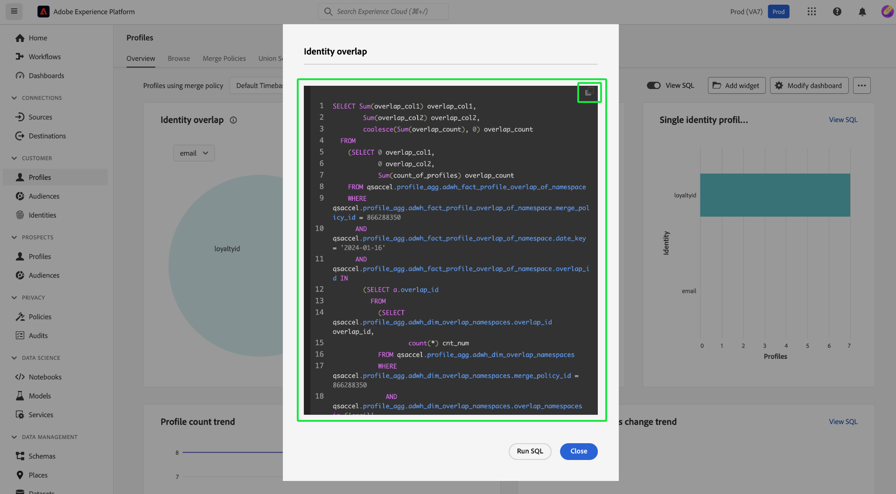
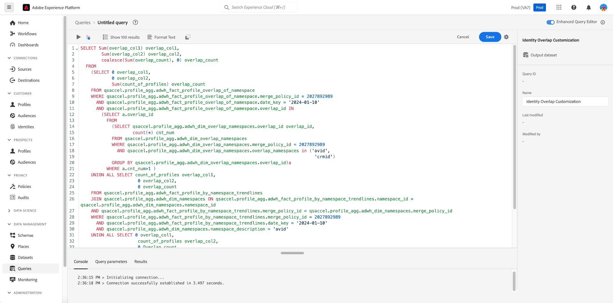

# Afficher insight SQL

Utilisez la fonction [!UICONTROL Afficher SQL] pour afficher le code SQL derrière votre profil, votre audience, votre destination et vos informations personnalisées et exécuter la requête à la demande via Query Editor. Inspirez-vous du SQL de plus de 40 informations existantes pour créer de nouvelles requêtes qui obtiennent des informations uniques à partir des données Experience Platform en fonction des besoins de votre entreprise.

## Accéder à la présentation du tableau de bord {#navigate-to-overview}

Pour ouvrir le tableau de bord de votre choix, sélectionnez **[!UICONTROL Profils]**, **[!UICONTROL Audiences]** ou **[!UICONTROL Destinations]** dans le volet de navigation de gauche. Sélectionnez ensuite **[!UICONTROL Aperçu]** dans les options de l’onglet si l’espace de travail n’apparaît pas automatiquement.

Vous pouvez également sélectionner **[!UICONTROL Tableaux de bord]** dans le volet de navigation de gauche, suivi du nom de votre tableau de bord personnalisé. La présentation de votre tableau de bord défini par l’utilisateur s’affiche.

![L’interface utilisateur d’Experience Platform avec [!UICONTROL Profils], [!UICONTROL Audiences], [!UICONTROL Destinations] et [!UICONTROL Tableaux de bord] en surbrillance.](./images/view-sql/dashboard-navigation.png)

## Bouton bascule Affichage SQL {#toggle}

Un bouton (bascule) est disponible dans la présentation des tableaux de bord de profil, d’audience, de destination et définis par l’utilisateur pour activer ou désactiver la fonctionnalité.

>[!NOTE]
>
>Si vous activez le bouton (bascule) [!UICONTROL Afficher SQL], vous ne pouvez pas modifier les filtres globaux et au niveau du widget tant que vous n’avez pas désactivé la fonctionnalité.

![Bouton bascule [!UICONTROL Afficher SQL] mis en surbrillance.](./images/view-sql/view-sql-toggle.png)

Activez le bouton (bascule) pour afficher le texte [!UICONTROL Afficher le code SQL] sur chaque insight individuelle.

![Une insight avec [!UICONTROL Afficher SQL] mise en surbrillance.](./images/view-sql/insight-view-sql.png)

Sélectionnez **[!UICONTROL Afficher SQL]** pour ouvrir une boîte de dialogue contenant le code SQL du widget.

## Boîte de dialogue SQL {#sql-dialog}

Une boîte de dialogue s’affiche avec le titre de l’insight et le code SQL qui la génère.

>[!TIP]
>
>Vous pouvez copier l’intégralité de l’instruction SQL dans le presse-papiers en sélectionnant l’icône de copie () en haut à droite de la boîte de dialogue.

Sélectionnez **[!UICONTROL Exécuter SQL]** pour ouvrir Query Editor avec la requête qui est prérenseignée.

![Boîte de dialogue insight avec [!UICONTROL Exécuter SQL] mise en surbrillance.](./images/view-sql/run-sql.png)

## Modifier le code SQL existant {#edit-sql}

Le Query Editor s’affiche. Vous pouvez désormais modifier l’instruction et interroger les données de votre plateforme de manière à mieux répondre à vos besoins de création de rapports. Enregistrez votre nouveau modèle de requête avec un nom approprié.

## Étapes suivantes

Vous êtes arrivé au bout de ce document. À présent, vous savez comment accéder au SQL de n’importe quelle insight dans les tableaux de bord standard ou définis par l’utilisateur. Si vous ne l’avez pas déjà fait, nous vous recommandons de lire le document [Modèle de données d’informations &#x200B;](./data-models/cdp-insights-data-model-b2c.md). Ce document contient des informations sur la personnalisation des modèles SQL pour les rapports Real-Time CDP adaptés à vos besoins en matière de marketing et d’indicateurs clés de performance.
