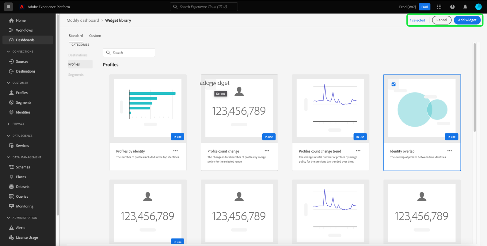

# Bibliothèque de widgets {#widget-library}

Dans l’interface utilisateur de Adobe Experience Platform, vous pouvez afficher et interagir avec les données de votre entreprise à l’aide de plusieurs tableaux de bord. Vous pouvez également mettre à jour certains de ces tableaux de bord en ajoutant de nouveaux widgets à la vue de votre tableau de bord. Outre les widgets standard fournis par Adobe, vous pouvez créer des widgets personnalisés et les partager dans l’ensemble de votre organisation.

Ce guide fournit des instructions détaillées sur l’ajout de widgets standard et la création de widgets personnalisés pour personnaliser les informations affichées dans les tableaux de bord [!UICONTROL Profils], [!UICONTROL Segments] et [!UICONTROL Destinations] dans l’interface utilisateur de Platform.

Pour plus d’informations sur la modification de l’emplacement et de la taille des widgets dans les tableaux de bord [!UICONTROL Profils], [!UICONTROL Destinations] et [!UICONTROL Segments], reportez-vous au [guide de modification des tableaux de bord](modify.md).

>[!NOTE]
>
>Les widgets affichés dans le tableau de bord [!UICONTROL Utilisation de la licence] ne peuvent pas être personnalisés. Pour en savoir plus sur ce tableau de bord unique, consultez la [documentation du tableau de bord d’utilisation des licences](guides/license-usage.md).

## Accès à la bibliothèque de widgets

Depuis n’importe quel tableau de bord (le tableau de bord Profils , par exemple), vous pouvez sélectionner **[!UICONTROL Modifier le tableau de bord]**, puis **[!UICONTROL Bibliothèque de widgets]** pour accéder à la bibliothèque de widgets.

>[!NOTE]
>
>Le bouton [!UICONTROL Bibliothèque de widgets] n’apparaît qu’une fois que [!UICONTROL Modifier le tableau de bord] a été sélectionné.

## Affichage de la bibliothèque de widgets

La [!UICONTROL bibliothèque de widgets] contient deux onglets, [!UICONTROL Standard] et [!UICONTROL Personnalisé].

* L’onglet **[!UICONTROL Standard]** contient des widgets créés par Adobe et vous permet de mettre à jour votre tableau de bord à l’aide de ces mesures standard. Pour en savoir plus sur l’ajout de widgets standard à votre tableau de bord, consultez la section [widgets standard](#standard-widgets) de ce guide.
* L’onglet **[!UICONTROL Personnalisé]** vous permet de créer et de partager des widgets au sein de votre organisation. Pour obtenir des instructions complètes sur la création de vos propres widgets, reportez-vous à la section [widgets personnalisés](#custom-widgets) de ce guide.

## Widgets standard {#standard-widgets}

L’onglet **[!UICONTROL Standard]** contient des widgets créés par Adobe, répartis en catégories selon les tableaux de bord disponibles. La catégorie sélectionnée correspond au tableau de bord à partir duquel vous avez entré la bibliothèque de widgets. En d’autres termes, si vous avez sélectionné la bibliothèque de widgets dans le tableau de bord [!UICONTROL Profils], la catégorie [!UICONTROL Profils] est sélectionnée et les autres catégories apparaissent grisées.

Les widgets disponibles pour la catégorie sélectionnée s’affichent. Chaque widget apparaît sous la forme d’une carte, fournissant le titre, la description et un exemple de visualisation de la mesure.

>[!NOTE]
>
>Les widgets ne peuvent être ajoutés qu&#39;au tableau de bord correspondant à la catégorie sélectionnée. Par exemple, seuls les widgets de la catégorie [!UICONTROL Profils] peuvent être ajoutés au tableau de bord [!UICONTROL Profils].

### Ajout d’un widget standard au tableau de bord

Pour choisir un widget standard à ajouter à votre tableau de bord, mettez en surbrillance le widget et cochez la case correspondant au widget. Avec au moins un widget sélectionné, le bouton **[!UICONTROL Ajouter widget]** est illuminé.

>[!NOTE]
>
>Le compteur dans le coin supérieur droit de la bibliothèque de widgets affiche le nombre total de widgets sélectionnés.

Sélectionnez **[!UICONTROL Ajouter un widget]** pour ajouter les widgets sélectionnés à votre tableau de bord.

## Widgets personnalisés {#custom-widgets}

Pour personnaliser davantage l’aspect des tableaux de bord dans Experience Platform, vous pouvez créer des widgets et les partager avec d’autres utilisateurs de votre entreprise.

>[!IMPORTANT]
>
>Votre entreprise peut créer 20 widgets personnalisés au maximum dans la bibliothèque de widgets.

Dans la bibliothèque de widgets, sélectionnez l’onglet **[!UICONTROL Personnalisé]** pour commencer à créer des widgets personnalisés ou pour afficher les widgets personnalisés déjà créés par votre organisation.

### Edition du schéma

Afin de créer des widgets personnalisés, les attributs Real-time Customer Profile doivent être identifiés pour s’assurer que les données sont incluses dans l’instantané quotidien. Si votre organisation n’a sélectionné aucun attribut de profil, le bouton [!UICONTROL Configurer le schéma] s’affiche dans le coin supérieur droit de la bibliothèque de widgets.

Lorsqu’au moins un attribut personnalisé a été sélectionné, le bouton [!UICONTROL Modifier le schéma] s’affiche dans le coin supérieur droit de la bibliothèque de widgets. Sélectionnez **[!UICONTROL Modifier le schéma]** pour ouvrir la boîte de dialogue **[!UICONTROL Sélectionner le champ de schéma d’union]** afin d’afficher les attributs sélectionnés et d’ajouter d’autres attributs.

>[!IMPORTANT]
>
>Une organisation peut sélectionner 20 attributs au maximum.

Pour sélectionner un attribut, accédez à l’attribut dans le schéma d’union (ou utilisez la recherche) et cochez la case en regard de l’attribut. Si vous cochez la case, l’attribut est également ajouté à la liste **[!UICONTROL Attributs sélectionnés]** située dans la partie droite de la boîte de dialogue.

>[!NOTE]
>
>Pour qu’un attribut soit visible pour la sélection, il doit s’agir de l’un des éléments suivants : Chaîne, Date, Date-Heure, Booléen, Court, Long, Entier ou Octet. Les types de données Carte et Double ne sont pas pris en charge et sont grisés afin qu’ils ne puissent pas être sélectionnés.

Après avoir choisi les attributs que vous souhaitez ajouter, sélectionnez **[!UICONTROL Enregistrer]** pour enregistrer vos attributs et revenir à l’onglet widgets personnalisés.

Les nouveaux attributs sélectionnés sont disponibles après l’instantané quotidien lors de l’actualisation des données.

### Création d’un widget personnalisé

Pour créer un widget personnalisé, sélectionnez **[!UICONTROL Créer]** dans le centre de la bibliothèque de widgets ou, si des widgets personnalisés ont déjà été créés, sélectionnez **[!UICONTROL Créer un widget]** dans le coin supérieur droit de la bibliothèque de widgets.

Dans la boîte de dialogue **[!UICONTROL Créer un widget]**, vous pouvez fournir un titre et une description pour votre nouveau widget et choisir l’attribut que vous souhaitez que le widget affiche. Pour choisir un attribut, cliquez sur le bouton radio en regard de l’attribut que vous souhaitez ajouter.

>[!NOTE]
>
>Un seul attribut peut être sélectionné par widget. En outre, si un widget a déjà été créé pour un attribut, l’attribut apparaît grisé.

Un aperçu du nouveau widget s’affiche dans la boîte de dialogue, affichant un graphique en barres horizontal avec des données de simulation.

>[!NOTE]
>
>La seule mesure actuellement prise en charge pour tous les attributs est le nombre de profils et la seule visualisation actuellement prise en charge pour les widgets personnalisés est un graphique à barres horizontal.
>
>Les données affichées dans l’exemple de widget sont fournies à titre d’illustration uniquement. L’aperçu n’affiche pas les données réelles de votre entreprise.

Pour enregistrer votre nouveau widget et revenir à l’onglet [!UICONTROL Personnalisé], sélectionnez **[!UICONTROL Créer]**. Vous pouvez désormais ajouter votre nouveau widget à un tableau de bord en le sélectionnant dans la bibliothèque et en sélectionnant **[!UICONTROL Ajouter un widget]**.

### Archivage d’un widget personnalisé

Une fois qu’un widget a été ajouté à la bibliothèque, il peut être archivé à l’aide du bouton **[!UICONTROL Archiver]** . Vous pouvez également modifier le widget pour mettre à jour les champs de titre ou de description.

## Étapes suivantes

Après avoir lu ce document, vous pouvez désormais accéder à la [!UICONTROL bibliothèque de widgets] et l’utiliser pour ajouter des widgets à un tableau de bord ou créer des widgets personnalisés pour votre organisation. Pour modifier la taille et l’emplacement des widgets dans le tableau de bord, reportez-vous au [guide de modification des tableaux de bord](modify.md).
