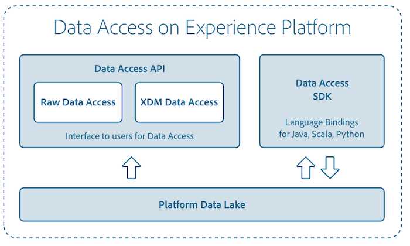

# Présentation d’[!DNL Data Access]

[!DNL Data Access] prend en charge Adobe Experience Platform en fournissant aux utilisateurs des outils axés sur la découverte et lʼaccessibilité des jeux de données ingérés dans [!DNL Experience Platform].

## [!DNL Data Access] API

Retrouvez des informations détaillées sur lʼutilisation de lʼAPI [!DNL Data Access] pour la connexion à [!DNL Experience Platform] dans le [guide de développement de Data Access](api.md).

## Accès aux données dans l’espace de travail de science des données

Vous pouvez lire et écrire dans des jeux de données à lʼaide de [!DNL Python] et de [!DNL Spark] pour le développement de recettes et de modèles dans l’espace de travail de science des données. Pour en savoir plus sur lʼaccès à vos données, consultez la documentation sur lʼ[accès aux données Python](../data-science-workspace/authoring/python.md) ou sur lʼ[accès aux données Spark](../data-science-workspace/authoring/spark.md).

Pour plus dʼinformations sur [!DNL Data Science Workspace], commencez par lire la [présentation de l’espace de travail de science des données](../data-science-workspace/home.md).

## Abonnement aux événements d’ingestion de données

[!DNL Experience Platform] met à disposition des événements ayant une valeur élevée à lʼabonnement par lʼintermédiaire de la [console des développeurs Adobe](https://www.adobe.com/go/devs_console_ui). Par exemple, vous pouvez vous abonner aux événements d’ingestion de données pour être informé des retards et des échecs potentiels. Pour plus d’informations, consultez le tutoriel sur [l’abonnement aux notifications d’événement d’Adobe](../observability/alerts/subscribe.md).
