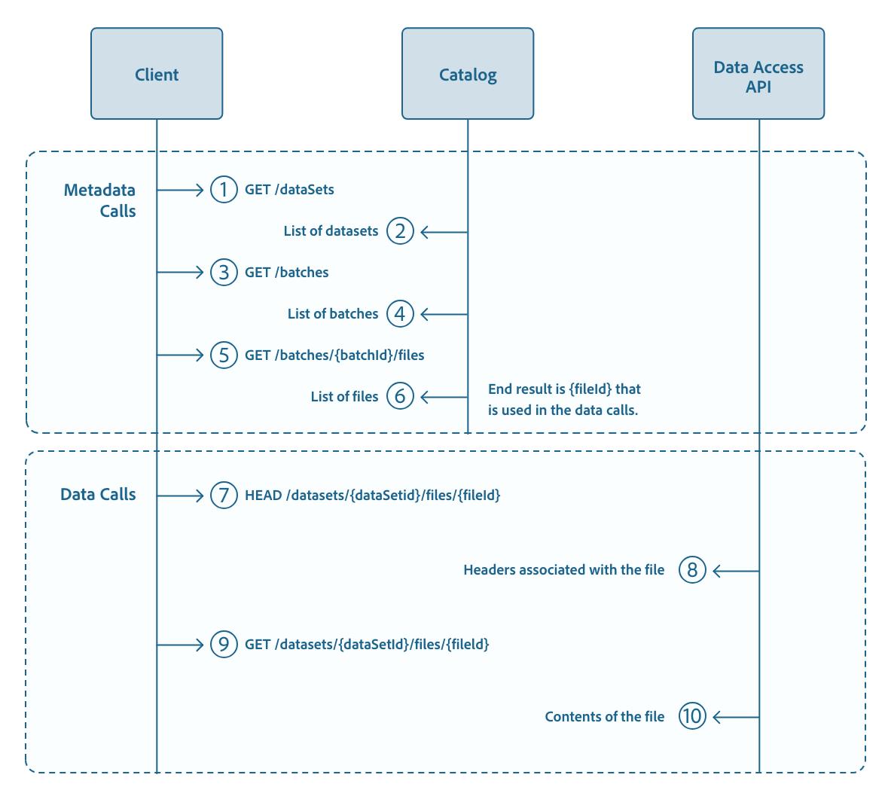

#  de données de jeux de données à l’aide de l’API d’accès aux données

Ce propose un didacticiel détaillé qui explique comment localiser, accéder et télécharger des données stockées dans un jeu de données à l’aide de l’API d’accès aux données d’Adobe Experience Platform. Vous serez également familiarisé avec certaines des fonctionnalités uniques de l’API d’accès aux données, telles que la pagination et les téléchargements partiels.

## Prise en main

Ce didacticiel explique comment créer et renseigner un jeu de données. Pour plus d’informations, consultez le didacticiel [sur la création de](../../catalog/datasets/create.md) jeux de données.

Les sections suivantes fournissent des informations supplémentaires que vous devez connaître pour pouvoir effectuer des appels aux API de plateforme.

### Lecture des exemples d’appels d’API

Ce didacticiel fournit des exemples d’appels d’API pour démontrer comment formater vos requêtes. Il s’agit notamment des chemins d’accès, des en-têtes requis et des charges de requête correctement formatées. L’exemple JSON renvoyé dans les réponses de l’API est également fourni. Pour plus d’informations sur les conventions utilisées dans la documentation pour les exemples d’appels d’API, voir la section sur la [manière de lire des exemples d’appels](../../landing/troubleshooting.md#how-do-i-format-an-api-request) d’API dans le guide de dépannage de la plateforme d’expérience.

### Rassembler les valeurs des en-têtes requis

Pour lancer des appels aux API de plateforme, vous devez d’abord suivre le didacticiel [sur l’](../../tutorials/authentication.md)authentification. Le didacticiel sur l’authentification fournit les valeurs de chacun des en-têtes requis dans tous les appels d’API de plateforme d’expérience, comme illustré ci-dessous :

- Autorisation : Porteur `{ACCESS_TOKEN}`
- x-api-key : `{API_KEY}`
- x-gw-ims-org-id : `{IMS_ORG}`

Toutes les ressources de la plateforme d’expérience sont isolées dans des sandbox virtuels spécifiques. Toutes les requêtes des API de plateforme nécessitent un en-tête spécifiant le nom du sandbox dans lequel l’opération aura lieu :

- x-sandbox-name : `{SANDBOX_NAME}`

>[!NOTE] Pour plus d’informations sur les sandbox dans Platform, voir la documentation [d’aperçu de](../../sandboxes/home.md)sandbox.

Toutes les requêtes qui contiennent une charge utile (POST, PUT, PATCH) nécessitent un en-tête supplémentaire :

- Content-Type : application/json

## Diagramme de séquence

Ce didacticiel suit les étapes décrites dans le diagramme de séquence ci-dessous, mettant en évidence les principales fonctionnalités de l’API d’accès aux données.</br>


L’API de catalogue vous permet de récupérer des informations sur les lots et les fichiers. L’API d’accès aux données vous permet d’accéder à ces fichiers et de les télécharger via HTTP sous forme de téléchargements complets ou partiels, selon la taille du fichier.

## Localisation des données

Avant de pouvoir commencer à utiliser l’API d’accès aux données, vous devez identifier l’emplacement des données auxquelles vous souhaitez accéder. Dans l’API de catalogue, vous pouvez utiliser deux points de fin pour parcourir les métadonnées d’une entreprise et récupérer l’ID d’un lot ou d’un fichier auquel vous souhaitez accéder :

- `GET /batches`: Renvoie un  de lots sous votre organisation
- `GET /dataSetFiles`: Renvoie un  de fichiers sous votre organisation

Pour un complet des points de fin dans l’API de catalogue, reportez-vous au Guide de référence [de l’](https://www.adobe.io/apis/experienceplatform/home/api-reference.html#!acpdr/swagger-specs/catalog.yaml)API.

## Récupérez un  de lots sous votre organisation IMS.

A l’aide de l’API de catalogue, vous pouvez renvoyer un  de lots sous votre entreprise :

**Format API**

```http
GET /batches
```

**Requête**

```shell
curl -X GET 'https://platform.adobe.io/data/foundation/catalog/batches/' \
  -H 'Authorization: Bearer {ACCESS_TOKEN}' \
  -H 'x-api-key: {API_KEY}' \
  -H 'x-gw-ims-org-id: {IMS_ORG}' \
  -H 'x-sandbox-name: {SANDBOX_NAME}'
```

**Réponse**

La réponse comprend un objet qui  de tous les lots liés à l’organisation IMS, chaque valeur globale représentant un lot. Les objets de lot individuels contiennent les détails de ce lot spécifique. La réponse ci-dessous a été réduite au minimum pour l&#39;espace.

```json
{
    "{BATCH_ID_1}": {
        "imsOrg": "{IMS_ORG}",
        "created": 1516640135526,
        "createdClient": "{CREATED_CLIENT}",
        "createdUser": "{CREATED_BY}",
        "updatedUser": "{CREATED_BY}",
        "updated": 1516640135526,
        "status": "processing",
        "version": "1.0.0",
        "availableDates": {}
    },
    "{BATCH_ID_2}": {
    ...
    }
}
```

### Filtrage des  de lots

Les  sont souvent tenus de trouver un lot particulier afin de récupérer les données pertinentes pour un cas d’utilisation particulier. Vous pouvez ajouter des paramètres à une `GET /batches` requête afin de filtrer la réponse renvoyée. La requête ci-dessous renvoie tous les lots créés après un moment donné, dans un jeu de données particulier, triés par date de création.

**Format API**

```http
GET /batches?createdAfter={START_TIMESTAMP}&dataSet={DATASET_ID}&sort={SORT_BY}
```

| Propriété | Description |
| -------- | ----------- |
| `{START_TIMESTAMP}` | L’horodatage  en millisecondes (par exemple, 1514836799000). |
| `{DATASET_ID}` | Identifiant du jeu de données. |
| `{SORT_BY}` | Trie la réponse selon la valeur fournie. Par exemple, `desc:created` trie les objets par date de création dans l’ordre décroissant. |

**Requête**

```shell
curl -X GET 'https://platform.adobe.io/data/foundation/catalog/batches?createdAfter=1521053542579&dataSet=5cd9146b21dae914b71f654f&orderBy=desc:created' \
  -H 'Authorization: Bearer {ACCESS_TOKEN}' \
  -H 'x-api-key: {API_KEY}' \
  -H 'x-gw-ims-org-id: {IMS_ORG}' \
  -H 'x-sandbox-name: {SANDBOX_NAME}'
```

**Réponse**

```json
{   "{BATCH_ID_3}": {
        "imsOrg": "{IMS_ORG}",
        "relatedObjects": [
            {
                "id": "5c01a91863540f14cd3d0439",
                "type": "dataSet"
            },
            {
                "id": "00998255b4a148a2bfd4804c2f327324",
                "type": "batch"
            }
        ],
        "status": "success",
        "metrics": {
            "recordsFailed": 0,
            "recordsWritten": 2,
            "startTime": 1550791835809,
            "endTime": 1550791994636
        },
        "errors": [],
        "created": 1550791457173,
        "createdClient": "{CLIENT_CREATED}",
        "createdUser": "{CREATED_BY}",
        "updatedUser": "{CREATED_BY}",
        "updated": 1550792060301,
        "version": "1.0.116"
    },
    "{BATCH_ID_4}": {
        "imsOrg": "{IMS_ORG}",
        "status": "success",
        "relatedObjects": [
            {
                "type": "batch",
                "id": "00aff31a9ae84a169d69b886cc63c063"
            },
            {
                "type": "dataSet",
                "id": "5bfde8c5905c5a000082857d"
            }
        ],
        "metrics": {
            "startTime": 1544571333876,
            "endTime": 1544571358291,
            "recordsRead": 4,
            "recordsWritten": 4
        },
        "errors": [],
        "created": 1544571077325,
        "createdClient": "{CLIENT_CREATED}",
        "createdUser": "{CREATED_BY}",
        "updatedUser": "{CREATED_BY}",
        "updated": 1544571368776,
        "version": "1.0.3"
    }
}
```

Un complet de paramètres et de  de se trouve dans la référence [API](https://www.adobe.io/apis/experienceplatform/home/api-reference.html#!acpdr/swagger-specs/catalog.yaml)Catalog.

## Récupérer un  de tous les fichiers appartenant à un lot spécifique

Maintenant que vous disposez de l’ID du lot auquel vous souhaitez accéder, vous pouvez utiliser l’API d’accès aux données pour obtenir un de fichiers appartenant à ce lot.

**Format API**

```http
GET /batches/{BATCH_ID}/files
```

| Propriété | Description |
| -------- | ----------- |
| `{BATCH_ID}` | Identifiant du lot du lot auquel vous essayez d&#39;accéder. |

**Requête**

```shell
curl -X GET 'https://platform.adobe.io/data/foundation/export/batches/5c6f332168966814cd81d3d3/files' \
  -H 'Authorization: Bearer {ACCESS_TOKEN}' \
  -H 'x-api-key: {API_KEY}' \
  -H 'x-gw-ims-org-id: {IMS_ORG}' \
  -H 'x-sandbox-name: {SANDBOX_NAME}'
```

**Réponse**

```json
{
    "data": [
        {
            "dataSetFileId": "8dcedb36-1cb2-4496-9a38-7b2041114b56-1",
            "dataSetViewId": "5cc6a9b60d4a5914b7940a7f",
            "version": "1.0.0",
            "created": "1558522305708",
            "updated": "1558522305708",
            "isValid": false,
            "_links": {
                "self": {
                    "href": "https://platform.adobe.io:443/data/foundation/export/files/8dcedb36-1cb2-4496-9a38-7b2041114b56-1"
                }
            }
        }
    ],
    "_page": {
        "limit": 100,
        "count": 1
    }
}
}
```

| Propriété | Description |
| -------- | ----------- |
| `data._links.self.href` | URL d’accès à ce fichier. |

La réponse contient un tableau de données qui  tous les fichiers du lot spécifié. Les fichiers sont référencés par leur ID de fichier, qui se trouve sous le `dataSetFileId` champ.

## Accès à un fichier à l’aide d’un ID de fichier

Une fois que vous disposez d’un ID de fichier unique, vous pouvez utiliser l’API d’accès aux données pour accéder aux détails spécifiques sur le fichier, y compris son nom, sa taille en octets et un lien pour le télécharger.

**Format API**

```http
GET /files/{FILE_ID}
```

| Propriété | Description |
| -------- | ----------- |
| `{FILE_ID}` | Identifiant du fichier auquel vous souhaitez accéder. |

**Requête**

```shell
curl -X GET 'https://platform.adobe.io/data/foundation/export/files/8dcedb36-1cb2-4496-9a38-7b2041114b56-1' \
  -H 'Authorization: Bearer {ACCESS_TOKEN}' \
  -H 'x-api-key: {API_KEY}' \
  -H 'x-gw-ims-org-id: {IMS_ORG}' \
  -H 'x-sandbox-name: {SANDBOX_NAME}'
```

Selon que l’ID de fichier pointe vers un fichier individuel ou un répertoire, le tableau de données renvoyé peut contenir une entrée unique ou un de fichiers appartenant à ce répertoire. Chaque élément de fichier contiendra des détails tels que le nom du fichier, sa taille en octets et un lien permettant de télécharger le fichier.

**Cas 1 : L’ID de fichier pointe vers un seul fichier**

**Réponse**

```json
{
    "data": [
        {
            "name": "{FILE_NAME}.parquet",
            "length": "249058",
            "_links": {
                "self": {
                    "href": "https://platform.adobe.io/data/foundation/export/files/{FILE_ID_1}?path={FILE_NAME_1}.parquet"
                }
            }
        }
    ],
    "_page": {
        "limit": 100,
        "count": 1
    }
}
```

| Propriété | Description |
| -------- | ----------- |
| `{FILE_NAME}.parquet` | Nom du fichier. |
| `_links.self.href` | URL de téléchargement du fichier. |

**Cas 2 : L’ID de fichier pointe vers un répertoire.**

**Réponse**

```json
{
    "data": [
        {
            "dataSetFileId": "{FILE_ID_2}",
            "dataSetViewId": "460590b01ba38afd1",
            "version": "1.0.0",
            "created": "150151267347",
            "updated": "150151267347",
            "isValid": true,
            "_links": {
                "self": {
                    "href": "https://platform.adobe.io/data/foundation/export/files/{FILE_ID_2}"
                }
            }
        },
        {
            "dataSetFileId": "{FILE_ID_3}",
            "dataSetViewId": "460590b01ba38afd1",
            "version": "1.0.0",
            "created": "150151267685",
            "updated": "150151267685",
            "isValid": true,
            "_links": {
                "self": {
                    "href": "https://platform.adobe.io/data/foundation/export/files/{FILE_ID_3}"
                }
            }
        }
    ],
    "_page": {
        "limit": 100,
        "count": 2
    }
}
```

| Propriété | Description |
| -------- | ----------- | 
| `data._links.self.href` | URL de téléchargement du fichier associé. |

Cette réponse renvoie un répertoire contenant deux fichiers distincts, avec des ID `{FILE_ID_2}` et `{FILE_ID_3}`. Dans ce scénario, vous devez suivre l’URL de chaque fichier pour accéder au fichier.

## Récupération des métadonnées d’un fichier

Vous pouvez récupérer les métadonnées d’un fichier en exécutant une requête HEAD. Cette opération renvoie les en-têtes de métadonnées du fichier, y compris sa taille en octets et son format de fichier.

**Format API**

```http
HEAD /files/{FILE_ID}?path={FILE_NAME}
```

| Propriété | Description |
| -------- | ----------- |
| `{FILE_ID}` | Identifiant du fichier. |
| `{FILE_NAME`} | Nom de fichier (par exemple,.parquet) |

**Requête**

```shell
curl -I 'https://platform.adobe.io/data/foundation/export/files/8dcedb36-1cb2-4496-9a38-7b2041114b56-1?path=profiles.parquet' \
  -H 'Authorization: Bearer {ACCESS_TOKEN}' \
  -H 'x-api-key: {API_KEY}' \
  -H 'x-gw-ims-org-id: {IMS_ORG}' \
  -H 'x-sandbox-name: {SANDBOX_NAME}'
```

**Réponse**

Les en-têtes de réponse contiennent les métadonnées du fichier interrogé, notamment :
- `Content-Length`: Indique la taille de la charge utile en octets
- `Content-Type`: Indique le type de fichier.

## Accès au contenu d’un fichier

Vous pouvez également accéder au contenu d’un fichier à l’aide de l’API d’accès aux données.

**Format API**

```shell
GET /files/{FILE_ID}?path={FILE_NAME}
```

| Propriété | Description |
| -------- | ----------- |
| `{FILE_ID}` | Identifiant du fichier. |
| `{FILE_NAME`} | Nom de fichier (par exemple,.parquet). |

**Requête**

```shell
curl -X GET 'https://platform.adobe.io/data/foundation/export/files/8dcedb36-1cb2-4496-9a38-7b2041114b56-1?path=profiles.parquet' \
  -H 'Authorization: Bearer {ACCESS_TOKEN}' \
  -H 'x-api-key: {API_KEY}' \
  -H 'x-gw-ims-org-id: {IMS_ORG}' \
  -H 'x-sandbox-name: {SANDBOX_NAME}'
```

**Réponse**

Une réponse réussie renvoie le contenu du fichier.

## Téléchargement du contenu partiel d’un fichier

L’API d’accès aux données permet de télécharger des fichiers par blocs. Un en-tête de plage peut être spécifié lors d’une `GET /files/{FILE_ID}` demande de téléchargement d’une plage d’octets spécifique à partir d’un fichier. Si la plage n’est pas spécifiée, l’API télécharge l’intégralité du fichier par défaut.

L’exemple HEAD de la section [](#retrieve-the-metadata-of-a-file) précédente donne la taille d’un fichier spécifique en octets.

**Format API**

```http
GET /files/{FILE_ID}?path={FILE_NAME}
```

| Propriété | Description |
| -------- | ----------- |
| `{FILE_ID} ` | Identifiant du fichier. |
| `{FILE_NAME}` | Nom de fichier (par exemple,.parquet) |

**Requête**

```shell
curl -X GET 'https://platform.adobe.io/data/foundation/export/files/8dcedb36-1cb2-4496-9a38-7b2041114b56-1?path=profiles.parquet' \
  -H 'Authorization: Bearer {ACCESS_TOKEN}' \
  -H 'x-api-key: {API_KEY}' \
  -H 'x-gw-ims-org-id: {IMS_ORG}' \
  -H 'x-sandbox-name: {SANDBOX_NAME}' \
  -H 'Range: bytes=0-99'
```

| Propriété | Description |
| -------- | ----------- | 
| `Range: bytes=0-99` | Spécifie la plage d’octets à télécharger. Si ce n’est pas spécifié, l’API télécharge le fichier entier. Dans cet exemple, les 100 premiers octets seront téléchargés. |

**Réponse**

Le corps de la réponse comprend les 100 premiers octets du fichier (comme spécifié par l’en-tête &quot;Plage&quot; dans la requête), ainsi que l’état HTTP 206 (Contenu partiel). La réponse comprend également les en-têtes suivants :

- Content-Length : 100 (nombre d’octets renvoyés)
- Content-type : application/parquet (un dossier en parquet a été demandé, par conséquent le type de contenu de réponse est parquet)
- Content-Range : octets 0-99/249058 (plage demandée (0-99) sur le nombre total d’octets (249058))

## Configuration de la pagination des réponses API

Les réponses dans l’API d’accès aux données sont paginées. Par défaut, le nombre maximal d’entrées par page est 100. Les paramètres de pagination peuvent être utilisés pour modifier le comportement par défaut.

- `limit`: Vous pouvez spécifier le nombre d’entrées par page en fonction de vos besoins à l’aide du paramètre &quot;limit&quot;.
- `start`: Le décalage peut être défini par le paramètre .
- `&`: Vous pouvez utiliser une esperluette pour combiner plusieurs paramètres dans un seul appel.

**Format API**

```http
GET /batches/{BATCH_ID}/files?start={OFFSET}
GET /batches/{BATCH_ID}/files?limit={LIMIT}
GET /batches/{BATCH_ID}/files?start={OFFSET}&limit={LIMIT}
```

| Propriété | Description |
| -------- | ----------- |
| `{BATCH_ID}` | Identifiant du lot du lot auquel vous essayez d&#39;accéder. |
| `{OFFSET}` | Index spécifié pour du tableau de résultats (par exemple, =0) |
| `{LIMIT}` | Contrôle le nombre de résultats renvoyés dans le tableau de résultats (par exemple, limit=1). |

**Requête**

```shell
curl -X GET 'https://platform.adobe.io/data/foundation/export/batches/5c102cac7c7ebc14cd6b098e/files?start=0&limit=1' \
  -H 'Authorization: Bearer {ACCESS_TOKEN}' \
  -H 'x-api-key: {API_KEY}' \
  -H 'x-gw-ims-org-id: {IMS_ORG}' \
  -H 'x-sandbox-name: {SANDBOX_NAME}'
```

**Réponse**:

La réponse contient un `"data"` tableau avec un seul élément, comme spécifié par le paramètre de requête `limit=1`. Cet élément est un objet contenant les détails du premier fichier disponible, comme spécifié par le `start=0` paramètre de la requête (n’oubliez pas que dans la numérotation à base zéro, le premier élément est &quot;0&quot;).

La `_links.next.href` valeur contient le lien vers la page suivante des réponses, où vous pouvez voir que le `start` paramètre a évolué vers `start=1`.

```json
{
    "data": [
        {
            "dataSetFileId": "{FILE_ID_1}",
            "dataSetViewId": "5a9f264c2aa0cf01da4d82fa",
            "version": "1.0.0",
            "created": "1521053793635",
            "updated": "1521053793635",
            "isValid": false,
            "_links": {
                "self": {
                    "href": "https://platform.adobe.io/data/foundation/export/files/{FILE_ID_1}"
                }
            }
        }
    ],
    "_page": {
        "limit": 1,
        "count": 6
    },
    "_links": {
        "next": {
            "href": "https://platform.adobe.io/data/foundation/export/batches/5c102cac7c7ebc14cd6b098e/files?start=1&limit=1"
        },
        "page": {
            "href": "https://platform.adobe.io/data/foundation/export/batches/5c102cac7c7ebc14cd6b098e/files?start=0&limit=1",
            "templated": true
        }
    }
}
```
