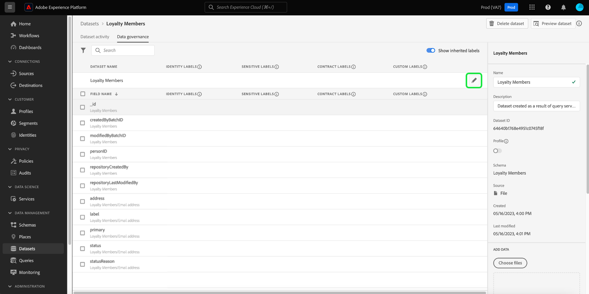
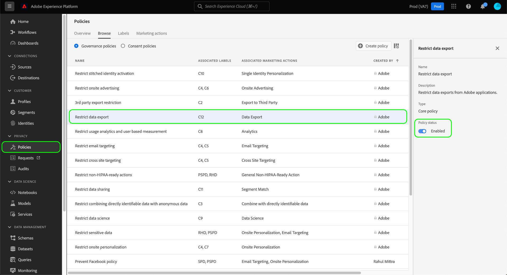

# Guide complet sur la gouvernance des données

Pour déterminer les actions marketing pouvant être effectuées sur certains jeux de données et champs dans Adobe Experience Platform, vous devez au préalable réaliser les opérations suivantes :

1. [Appliquez des libellés](#labels) aux champs de schémas ou à des jeux de données entiers dont vous souhaitez restreindre l’utilisation.
1. [Configurez et activez les politiques de gouvernance des données](#policy) qui déterminent les types de données libellées qui peuvent être utilisés pour certaines actions marketing.
1. [Appliquez des actions marketing à vos destinations](#destinations) pour indiquer les politiques qui s’appliquent aux données envoyées vers ces destinations.

Une fois la configuration des libellés, des politiques de gouvernance et des actions marketing terminée, vous pouvez [tester l’application de votre politique](#test) pour vous assurer qu’elle fonctionne comme prévu.

Ce guide aborde l’ensemble du processus de configuration et d’application d’une politique de gouvernance des données dans l’interface utilisateur de Platform. Pour des informations plus détaillées sur les fonctionnalités présentées dans ce guide, consultez la documentation de présentation pour les rubriques suivantes :

* [Gouvernance des données d’Adobe Experience Platform](./home.md)
* [Libellés d’utilisation des données](./labels/overview.md)
* [Politiques d’utilisation des données](./policies/overview.md)
* [Application des politiques](./enforcement/overview.md)

>[!NOTE]
>
>Ce guide est consacré à la configuration et à l’application des politiques déterminant la manière dont les données sont utilisées ou activées dans Experience Platform. Si vous souhaitez restreindre l’**accès** aux données proprement dites de certains utilisateurs et utilisatrices de Platform au sein de votre organisation, consultez plutôt le guide complet sur le [contrôle d’accès basé sur les attributs](../access-control/abac/end-to-end-guide.md). Le contrôle d’accès basé sur les attributs utilise également des libellés et des politiques, mais pour un cas d’utilisation différent de celui de la gouvernance des données.

## Appliquer des libellés {#labels}

>[!IMPORTANT]
>
>Les libellés ne peuvent plus être appliqués à des champs individuels au niveau du jeu de données. Ce workflow a été abandonné au profit de l’application des libellés au niveau du schéma. Cependant, vous pouvez toujours libeller un jeu de données entier. Les libellés précédemment appliqués à des champs de jeux de données individuels seront toujours pris en charge par le biais de l’interface utilisateur de Platform jusqu’au 31 mai 2024. Pour garantir la cohérence de vos libellés sur tous les schémas, les libellés précédemment attachés aux champs au niveau du jeu de données doivent être migrés au niveau du schéma par vous-même au cours de l’année à venir. Voir la section sur la [migration des libellés précédemment appliqués](#migrate-labels) pour obtenir des instructions sur la manière de procéder.

Vous pouvez [appliquer des libellés à un schéma](#schema-labels) afin que tous les jeux de données basés sur ce schéma héritent des mêmes libellés. Vous pouvez ainsi gérer les libellés pour la gouvernance des données, le consentement et le contrôle d’accès au même endroit. En appliquant des contraintes d’utilisation des données au niveau du schéma, l’effet se propage en aval à tous les jeux de données basés sur ce schéma. Les libellés appliqués au niveau du champ de schéma prennent en charge les cas d’utilisation de la gouvernance des données et sont détectables dans l’onglet de l’espace de travail Jeux de données [!UICONTROL Gouvernance des données] sous la colonne [!UICONTROL Nom du champ] en tant que libellés en lecture seule.

Si vous souhaitez appliquer des contraintes d’utilisation des données à un jeu de données spécifique, vous pouvez [appliquer des libellés directement à ce jeu de données](#dataset-labels) ou à des champs spécifiques de celui-ci.

Vous pouvez également [appliquer des libellés à un schéma](#schema-labels) afin que tous les jeux de données basés sur ce schéma héritent des mêmes libellés.

>[!NOTE]
>
>Pour plus d’informations sur les différents libellés d’utilisation des données et leur utilisation prévue, consultez la [référence des libellés d’utilisation des données](./labels/reference.md). Si les libellés de base disponibles ne couvrent pas tous les cas d’utilisation souhaités, vous pouvez également [définir vos propres libellés personnalisés](./labels/user-guide.md#manage-custom-labels).

### Appliquez des libellés à un jeu de données entier {#dataset-labels}

Sélectionnez **[!UICONTROL Jeux de données]** dans le volet de navigation de gauche, puis cliquez sur le nom du jeu de données auquel appliquer des libellés. Vous pouvez également utiliser le champ de recherche pour réduire la liste des jeux de données affichés.

La vue des détails du jeu de données s’affiche. Sélectionnez l’onglet **[!UICONTROL Gouvernance des données]** pour afficher la liste des champs du jeu de données et des libellés qui y ont déjà été appliqués. Sélectionnez l’icône représentant un crayon pour modifier les libellés des jeux de données.

La boîte de dialogue [!UICONTROL Modifier les libellés de gouvernance] apparaît. Sélectionnez le libellé de gouvernance approprié et sélectionnez **[!UICONTROL Enregistrer]**.

### Appliquer des libellés à un schéma {#schema-labels}

Sélectionnez **[!UICONTROL Schémas]** dans le volet de navigation de gauche, puis choisissez le schéma auquel vous souhaitez ajouter des libellés dans la liste.

>[!TIP]
>
>Si vous ne savez pas quel schéma s’applique à un jeu de données spécifique, sélectionnez **[!UICONTROL Jeux de données]** dans le volet de navigation de gauche, puis cliquez sur le lien situé sous la colonne **[!UICONTROL Schéma]** pour le jeu de données souhaité. Sélectionnez le nom du schéma dans la fenêtre contextuelle qui s’affiche pour ouvrir le schéma dans l’éditeur de schémas.
>
>

La structure du schéma s’affiche dans l’éditeur de schémas. Dans cet écran, sélectionnez l’onglet **[!UICONTROL Libellés]** pour afficher une vue Liste des champs du schéma et des libellés qui y ont déjà été appliqués. Cochez les cases en regard des champs auxquels vous souhaitez ajouter des libellés, puis sélectionnez **[!UICONTROL Appliquez l’accès et les libellés de gouvernance des données]** dans le rail de droite.

>[!NOTE]
>
>Si vous souhaitez ajouter des libellés à tous les champs du schéma, sélectionnez l’icône en forme de crayon sur la ligne supérieure.
>
>

La boîte de dialogue [!UICONTROL Appliquer l’accès et les libellés de gouvernance des données] s’affiche. Sélectionnez les libellés à appliquer au champ de schéma choisi. Lorsque vous avez terminé, sélectionnez **[!UICONTROL Enregistrer]**.

Répétez les étapes ci-dessus pour appliquer des libellés à différents champs (ou à différents schémas) si nécessaire. Lorsque vous avez terminé, vous pouvez passer à l’étape suivante qui consiste à [activer les politiques de gouvernance des données](#policy).

### Migrer les libellés précédemment appliqués au niveau du jeu de données {#migrate-labels}

Sélectionnez **[!UICONTROL Jeu de données]** dans le volet de navigation de gauche, puis cliquez sur le nom du jeu de données depuis lequel vous souhaitez que les libellés migrent. Vous pouvez également utiliser le champ de recherche pour réduire la liste des jeux de données affichés.

La vue des détails du jeu de données s’affiche. Sélectionnez l’onglet **[!UICONTROL Gouvernance des données]** pour afficher la liste des champs du jeu de données et des libellés qui y ont déjà été appliqués. Sélectionnez l’icône Annuler en regard d’un libellé que vous souhaitez supprimer d’un champ. Une boîte de dialogue de confirmation s’affiche. Sélectionnez [!UICONTROL Supprimer le libellé] pour confirmer vos choix.

Après avoir supprimé le libellé de votre champ de jeu de données, accédez à l’éditeur de schémas pour ajouter le libellé au schéma. Vous trouverez des instructions pour ce faire dans la [section relative à l’application de libellés à un schéma](#schema-labels).

>[!TIP]
>
>Vous pouvez sélectionner le nom du schéma dans le rail de droite, suivi du lien dans la boîte de dialogue qui s’affiche pour accéder au schéma approprié.
>

Après avoir migré les libellés nécessaires, assurez-vous que vous avez activé les [politiques de gouvernance des données](#policy) adéquates.

## Activer les politiques de gouvernance des données {#policy}

Une fois l’application des libellés à vos schémas et/ou jeux de données terminée, vous pouvez commencer à créer des politiques de gouvernance des données qui limitent les actions marketing pour lesquelles certains libellés peuvent être utilisés.

Sélectionnez **[!UICONTROL Politiques]** dans le volet de navigation de gauche pour afficher la liste des politiques de base définies par Adobe, ainsi que les politiques personnalisées créées précédemment par votre organisation.

Chaque libellé principal est associé à une politique de base qui, lorsqu’elle est activée, impose les contraintes d’activation appropriées sur toutes données qui contiennent ce libellé. Pour activer une politique de base, sélectionnez-la dans la liste, puis positionnez **[!UICONTROL Statut de la politique]** sur **[!UICONTROL Activé]**.

Si les politiques de base disponibles ne couvrent pas tous vos cas d’utilisation (par exemple lorsque vous utilisez des libellés personnalisés que vous avez définis sous votre organisation), vous pouvez définir une politique personnalisée à la place. Dans l’espace de travail **[!UICONTROL Politiques]**, sélectionnez **[!UICONTROL Créer une politique]**.

![Image montrant le bouton [!UICONTROL Créer une politique] en cours de sélection dans l’interface utilisateur.](./images/e2e/create-policy.png)

Une fenêtre contextuelle s’affiche, vous invitant à sélectionner le type de politique que vous souhaitez créer. Sélectionnez **[!UICONTROL Statégie de gouvernance des données]**, puis sélectionnez **[!UICONTROL Continuer]**.

![Image montrant l’option [!UICONTROL Politique de gouvernance des données] sélectionnée.](./images/e2e/governance-policy.png)

Sur l’écran suivant, fournissez un **[!UICONTROL Nom]** et une **[!UICONTROL Description]** facultative pour la politique. Dans le tableau ci-dessous, sélectionnez les libellés sur lesquels cette politique s’appliquera. En d’autres termes, il s’agit des libellés dont la politique empêchera l’utilisation pour les actions marketing de l’étape suivante.

Si vous sélectionnez plusieurs libellés, vous pouvez utiliser les options du rail de droite pour déterminer si tous les libellés doivent être présents pour que la politique applique les restrictions d’utilisation, ou si un seul d’entre eux doit être présent. Lorsque vous avez terminé, sélectionnez **[!UICONTROL Suivant]**.

Dans l’écran suivant, sélectionnez les actions marketing pour lesquelles cette politique limitera l’utilisation pour les libellés sélectionnés précédemment. Sélectionnez **[!UICONTROL Suivant]** pour continuer.

Le dernier écran affiche un résumé avec les détails de la politique et les actions qu’elle restreint pour chaque libellé. Sélectionnez **[!UICONTROL Terminer]** pour créer la politique.

La politique est créée, mais est définie sur [!UICONTROL Désactivée] par défaut. Sélectionnez la politique dans la liste et définissez le bouton de **[!UICONTROL Statut de la politique]** sur **[!UICONTROL Activé]** pour activer la politique.

Continuez à suivre les étapes ci-dessus pour créer et activer les politiques dont vous avez besoin avant de passer à l’étape suivante.

## Gérer les actions marketing pour les destinations {#destinations}

Pour que vos politiques activées déterminent avec précision les données qui peuvent être activées vers une destination, vous devez affecter des actions marketing spécifiques à cette destination.

Prenons l’exemple d’une politique activée qui empêche toute donnée contenant un libellé `C2` d’être utilisée pour l’action marketing « [!UICONTROL Exporter vers un tiers] ». Lors de l’activation de données vers une destination, la politique identifie quelles actions marketing sont présentes sur la destination. Si l’action « [!UICONTROL Exporter vers un tiers] » est présente, une tentative d’activation de données avec un libellé `C2` se traduit par une violation de la politique. Si l’action « [!UICONTROL Exporter vers un tiers] » n’est pas présente, la politique n’est pas appliquée pour la destination et les données avec les libellés `C2` peuvent être librement activées.

Lorsque vous effectuez la [connexion d’une destination dans l’interface utilisateur](../destinations/ui/connect-destination.md), l’étape **[!UICONTROL Gouvernance]** du workflow vous permet de sélectionner les actions marketing qui s’appliquent à cette destination, ce qui détermine en fait les politiques de gouvernance des données appliquées à la destination.

## Tester l’application des politiques {#test}

Une fois que vous avez libellé vos données, activé les politiques de gouvernance des données et affecté des actions marketing à vos destinations, vous pouvez tester si vos politiques sont appliquées comme prévu.

Si vous configurez les éléments correctement, lorsque vous tentez d’activer des données qui sont restreintes par vos politiques, l’activation est automatiquement refusée et un message de violation de la politique s’affiche, présentant un historique détaillé des données et les causes de la violation.

Consultez le document [application automatique des politiques](./enforcement/auto-enforcement.md) pour savoir en détail comment interpréter les messages de violation de politique.

## Étapes suivantes

Ce guide décrit les étapes nécéssaires pour configurer et appliquer des politiques de gouvernance des données dans vos workflows d’activation. Pour plus d’informations sur les composants de gouvernance des données impliqués dans ce guide, consultez la documentation suivante :

* [Libellés d’utilisation des données](./labels/overview.md)
* [Politiques d’utilisation des données](./policies/overview.md)
* [Application des politiques](./enforcement/overview.md)
