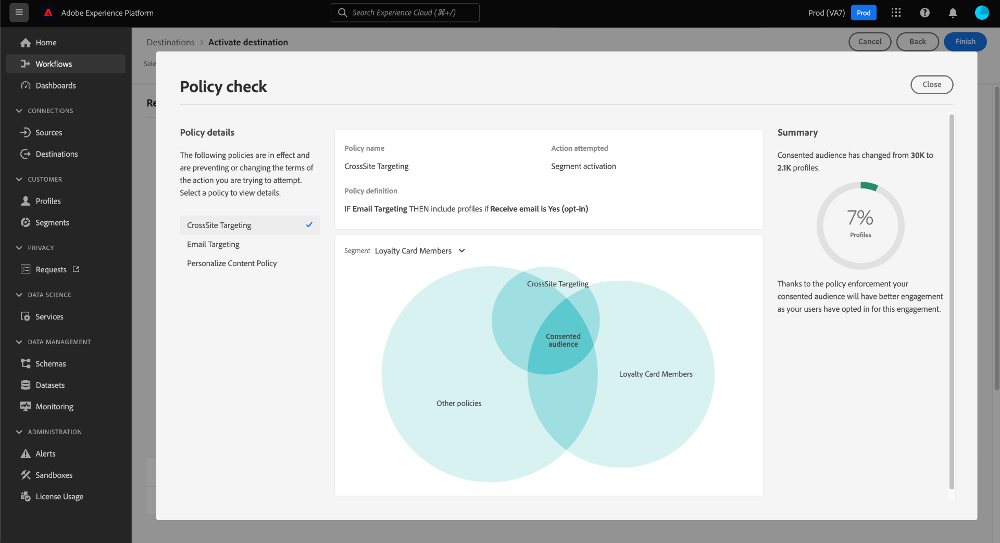
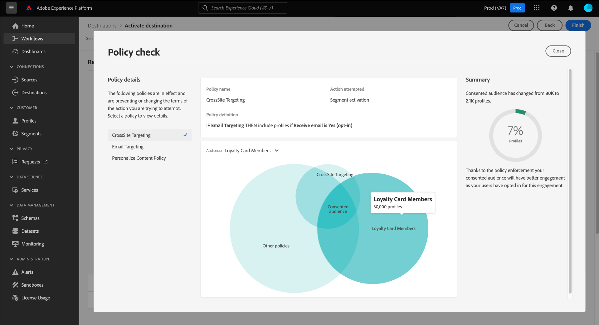

# Application automatique des politiques

>[!IMPORTANT]
>
>L’application automatique des politiques n’est actuellement disponible que pour les organisations qui ont acheté **Adobe Healthcare Shield** ou **Adobe Privacy &amp; Security Shield**.

Une fois que les données sont libellées et que les politiques d’utilisation sont définies, vous pouvez appliquer les politiques d’utilisation des données. Lors de l’activation d’audiences vers des destinations, Adobe Experience Platform applique automatiquement les stratégies d’utilisation en cas de violation.

>[!NOTE]
>
>Ce document se concentre sur l’application des politiques de gouvernance des données et de consentement. Pour plus d’informations sur les politiques de contrôle d’accès, consultez la documentation sur le [contrôle d’accès basé sur les attributs](../../access-control/abac/overview.md).

## Conditions préalables

Ce guide nécessite une compréhension pratique des divers services Platform impliqués dans l’application automatique. Consultez la documentation suivante pour en savoir plus avant de poursuivre avec ce guide :

* [Gouvernance des données d’Adobe Experience Platform](../home.md) : cadre en fonction duquel Platform applique la conformité de l’utilisation des données à l’aide des libellés et des politiques.
* [Profil client en temps réel](../../profile/home.md) : fournit un profil client en temps réel unifié basé sur des données agrégées issues de plusieurs sources.
* [Adobe Experience Platform Segmentation Service](../../segmentation/home.md): Le moteur de segmentation dans [!DNL Platform] utilisé pour créer des audiences à partir de vos profils client en fonction des comportements et des attributs du client.
* [Destinations](../../destinations/home.md) : les destinations sont des intégrations préconfigurées aux applications couramment utilisées. Elles permettent l’activation transparente des données de Platform pour les campagnes marketing cross-canal, les campagnes par e-mail, la publicité ciblée, etc.

## Flux d’application {#flow}

Le diagramme suivant illustre la manière dont l’application des stratégies est intégrée au flux de données de l’activation de l’audience :

Lorsqu’une audience est activée pour la première fois, [!DNL Policy Service] recherche les stratégies applicables en fonction des facteurs suivants :

* Les libellés d’utilisation des données s’appliquent aux champs et aux jeux de données de l’audience à activer.
* Objectif marketing de la destination.
* Profils qui ont consenti à être inclus dans l’activation de l’audience, en fonction des stratégies de consentement configurées.

>[!NOTE]
>
>Si des libellés d’utilisation des données n’ont été appliqués qu’à certains champs d’un jeu de données (plutôt qu’à l’ensemble du jeu), l’application de ces libellés au niveau du champ sur l’activation se fait uniquement dans les conditions suivantes :
>
>* Les champs sont utilisés dans l’audience.
>* Les champs sont configurés en tant qu’attributs prévisionnels pour la destination cible.

## Parenté des données {#lineage}

La parenté des données joue un rôle essentiel dans la façon dont les politiques sont appliquées dans Platform. D’une façon générale, la parenté des données fait référence à l’origine d’un jeu de données ainsi qu’à son évolution (ou à son déplacement) au fil du temps.

Dans le cadre de la gouvernance des données, la parenté permet aux libellés d’utilisation des données de se propager des schémas aux services en aval qui utilisent leurs données, comme le profil client en temps réel et les destinations. Cela permet d’évaluer et d’appliquer les politiques à plusieurs points clés du parcours des données par l’intermédiaire de Platform et fournit un contexte aux consommateurs de données quant aux raisons pour lesquelles une violation de politique a eu lieu.

Dans Experience Platform, l’application des politiques est concernée par la parenté suivante :

1. Les données sont ingérées dans Platform et stockées dans des **jeux de données**.
1. Les profils clients sont identifiés et construits à partir de ces jeux de données grâce à la fusion des fragments de données, conformément à la **politique de fusion**.
1. Les groupes de profils sont divisés en : **audiences** en fonction d’attributs communs.
1. Les audiences sont activées en aval **destinations**.

Chaque étape de la chronologie ci-dessus représente une entité qui peut contribuer à l’application de la politique, comme indiqué dans le tableau ci-dessous :

| Étape relative à la parenté des données | Rôle dans l’application des politiques |
| --- | --- |
| Jeu de données | Les jeux de données contiennent des libellés d’utilisation des données (appliqués au niveau du champ de schéma ou du champ de l’intégralité du jeu de données) qui définissent les cas d’utilisation pour lesquels l’intégralité du jeu de données ou des champs spécifiques peut être utilisée. Des violations de politique se produisent si un jeu de données ou un champ contenant certains libellés est utilisé à des fins limitées par une politique.  Tous les attributs de consentement collectés auprès de vos clients sont également stockés dans des jeux de données. Si vous avez accès aux stratégies de consentement, tous les profils qui ne répondent pas aux exigences d’attribut de consentement de vos stratégies seront exclus des audiences activées vers une destination. |
| Politique de fusion | Les politiques de fusion sont les règles utilisées par Platform pour déterminer le classement par priorité des données lors de la fusion de fragments provenant de plusieurs jeux de données. Des violations de politique se produisent si vos politiques de fusion sont configurées de telle sorte que les jeux de données dotés de libellés limités sont activés pour une destination. Pour plus d’informations, consultez la [présentation des politiques de fusion](../../profile/merge-policies/overview.md). |
| Audience    | Les règles de segmentation définissent les attributs à inclure à partir des profils client. Selon les champs inclus par une définition de segment, l’audience héritera des libellés d’utilisation appliqués pour ces champs. Des violations de stratégie se produiront si vous activez une audience dont les libellés hérités sont limités par les stratégies applicables de la destination cible, en fonction de son cas d’utilisation marketing. |
| Destination | Lors de la configuration d’une destination, une action marketing (parfois appelée cas d’utilisation marketing) peut être définie. Ce cas d’utilisation correspond à une action marketing telle que définie dans une politique. En d’autres termes, l’action marketing que vous définissez comme une destination détermine les politiques d’utilisation des données et de consentement applicables à cette destination.  Des violations de stratégie d’utilisation des données se produisent si vous activez une audience dont les libellés d’utilisation sont limités pour l’action marketing de la destination cible.  (Version bêta) Lorsqu’une audience est activée, les profils qui ne contiennent pas les attributs de consentement requis pour l’action marketing (tels que définis par vos stratégies de consentement) sont exclus de l’audience activée. |

>[!IMPORTANT]
>
>Certaines politiques d’utilisation des données peuvent spécifier plusieurs libellés avec une relation AND. Par exemple, une politique peut limiter une action marketing si les libellés `C1` ET `C2` sont tous deux présents. Toutefois, elle ne limite pas l’action en question si un seul de ces libellés est présent.
>
>En ce qui concerne l’application automatique, la structure de gouvernance des données ne considère pas l’activation d’audiences distinctes vers une destination comme une combinaison de données. Par conséquent, l’exemple `C1 AND C2` la stratégie est **NOT** appliquée si ces étiquettes sont incluses dans des audiences distinctes. Cette stratégie n’est appliquée que si les deux libellés sont présents dans la même audience lors de l’activation.

Lorsque des violations de politique se produisent, les messages qui s’affichent dans l’interface utilisateur fournissent des outils utiles à l’exploration de la parenté des données contribuant à la violation afin de résoudre le problème. Vous trouverez plus de détails dans la section suivante.

## Messages d’application de politique {#enforcement}

Les sections ci-dessous décrivent les différents messages d’application de politique qui apparaissent dans l’interface utilisateur de Platform :

* [Violation de la politique d’utilisation des données](#data-usage-violation)
* [Évaluation des politiques de consentement](#consent-policy-evaluation)

### Violation de la politique d’utilisation des données {#data-usage-violation}

Si une violation de stratégie survient lors d’une tentative d’activation d’une audience (ou [Modification d’une audience déjà activée](#policy-enforcement-for-activated-audiences)) l’action est bloquée et une fenêtre contextuelle s’affiche indiquant qu’une ou plusieurs stratégies ont été violées. Une fois qu’une violation a été déclenchée, le bouton **[!UICONTROL Enregistrer]** est désactivé pour l’entité à modifier jusqu’à ce que les composants appropriés soient mis à jour pour se conformer aux politiques d’utilisation des données.

Sélectionnez une violation de politique dans la colonne de gauche de la fenêtre contextuelle pour afficher les détails de celle-ci.

Le message relatif à la violation présente un résumé de la politique enfreinte, y compris les conditions configurées pour être vérifiées par la politique, l’action spécifique qui a déclenché la violation ainsi qu’une liste de résolutions possibles pour le problème.

Un graphique de lignage de données s’affiche sous le résumé de la violation, ce qui vous permet de visualiser les jeux de données, les stratégies de fusion, les audiences et les destinations impliqués dans la violation de la stratégie. L’entité que vous modifiez actuellement est mise en surbrillance dans le graphique, ce qui indique le point du flux à l’origine de la violation. Vous pouvez sélectionner un nom d’entité dans le graphique pour ouvrir la page de détails de l’entité en question.

Vous pouvez également utiliser l’icône **[!UICONTROL Filtre]** () pour filtrer les entités affichées par catégorie. Au moins deux catégories doivent être sélectionnées pour que les données s’affichent.

Sélectionnez **[!UICONTROL Mode Liste]** pour afficher la parenté des données sous forme de liste. Pour revenir au graphique visuel, sélectionnez **[!UICONTROL Chemin parcouru]**.

### Évaluation des politiques de consentement {#consent-policy-evaluation}

Si vous avez [création de stratégies de consentement](../policies/user-guide.md#consent-policy) et activent une audience vers une destination, vous pouvez voir comment vos stratégies de consentement affectent le pourcentage de profils inclus dans l’activation.

#### Amélioration de la stratégie de consentement pour les médias achetés {#consent-policy-enhancement}

Amélioration de l’application de la politique de consentement sur les destinations par [lots](../../destinations/destination-types.md#file-based) et de [streaming](../../destinations/destination-types.md#streaming-destinations), y compris les activations de médias achetés. Cette amélioration est disponible pour la clientèle de Privacy and Security Shield ou de Healthcare Shield. Elle supprime de manière proactive les profils des destinations par lots et de streaming à mesure que le statut du consentement change. Elle garantit également que les modifications du consentement sont propagées immédiatement afin que la bonne audience soit toujours ciblée.

Ces améliorations permettent une plus grande confiance dans votre stratégie marketing, car elles éliminent la nécessité pour les spécialistes marketing d’ajouter manuellement des attributs de consentement à l’expression de leur segment. Cela permet de s’assurer qu’aucun profil n’est ciblé par inadvertance pour une expérience marketing une fois que le consentement a été retiré ou qu’il n’est plus éligible pour une politique de consentement. Les politiques de consentement marketing qui définissent les règles de gestion des données de consentement ou de préférence dans divers workflows marketing sont désormais automatiquement appliquées dans les workflows d’activation dans les solutions en aval.

>[!NOTE]
>
>Cette amélioration n’a entraîné aucune modification de l’IU.

#### Évaluation préalable à l’activation

Une fois que vous avez atteint l’étape **[!UICONTROL Réviser]** lors de l’[activation d’une destination](../../destinations/ui/activation-overview.md), sélectionnez **[!UICONTROL Affichage des politiques appliquées]**.

Une boîte de dialogue de vérification de stratégie s’affiche, vous montrant un aperçu de la manière dont vos stratégies de consentement affectent l’audience approuvée des audiences activées.

La boîte de dialogue affiche l’audience approuvée pour une audience à la fois. Pour afficher l’évaluation des stratégies pour une audience différente, utilisez le menu déroulant situé au-dessus du diagramme pour en sélectionner une dans la liste.

Utilisez le rail de gauche pour basculer entre les stratégies de consentement applicables pour l’audience sélectionnée. Les politiques qui ne sont pas sélectionnées sont représentées dans la section « [!UICONTROL Autres politiques] » du diagramme.

Le diagramme affiche le chevauchement entre trois groupes de profils :

1. Profils qui remplissent les critères de l’audience sélectionnée
1. Profils qui remplissent les critères de la politique de consentement sélectionnée
1. Profils qui remplissent les critères des autres stratégies de consentement applicables pour l’audience (appelés &quot;[!UICONTROL Autres politiques]&quot; dans le diagramme)

Les profils qui remplissent les critères pour les trois groupes ci-dessus représentent l’audience approuvée, résumée dans le rail de droite.

Passez la souris sur l’une des audiences du diagramme pour afficher le nombre de profils qu’il contient.

L’audience consentante est représentée par le chevauchement central du diagramme et peut être mise en surbrillance comme les autres sections.

#### Application d’exécution de flux

Lorsque les données sont activées vers une destination, les détails de l’exécution du flux indiquent le nombre d’identités qui ont été exclues en raison de politiques de consentement actives.

## Application des stratégies pour les audiences activées {#policy-enforcement-for-activated-audiences}

L’application de la stratégie s’applique toujours aux audiences après leur activation, ce qui limite toute modification apportée à une audience ou à sa destination qui entraînerait une violation de la stratégie. En raison du fonctionnement de la [parenté des données](#lineage) dans l’application des politiques, l’une des actions suivantes peut potentiellement déclencher une violation :

* Mise à jour des libellés d’utilisation des données
* Modification des jeux de données d’une audience
* Modification des prédicats d’audience
* Modification des configurations de destination

Si l’une des actions ci-dessus déclenche une violation, cette action n’est pas enregistrée et un message de violation de stratégie s’affiche, ce qui garantit que vos audiences activées continuent à respecter les politiques d’utilisation des données lors de leur modification.

## Étapes suivantes

Ce document vous a présenté le fonctionnement de l’application automatique des politiques dans Experience Platform. Pour savoir comment intégrer par programmation l’application de politiques dans vos applications à l’aide d’appels d’API, consultez le guide sur l’[application basée sur les API](./api-enforcement.md).
