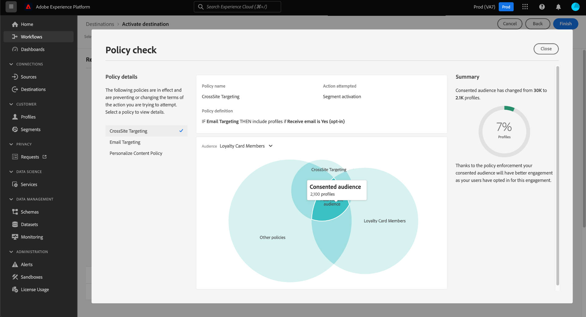

# Application automatique des stratégies

Une fois que les données sont étiquetées et que les stratégies d’utilisation sont définies, vous pouvez appliquer les stratégies d’utilisation des données. Lors de l’activation des segments d’audience vers les destinations, Adobe Experience Platform applique automatiquement les stratégies d’utilisation en cas de violation.

## Conditions préalables

Ce guide nécessite une compréhension pratique des divers services Platform impliqués dans l’application automatique. Consultez la documentation suivante pour en savoir plus avant de poursuivre avec ce guide :

* [Gouvernance des données d’Adobe Experience Platform](../home.md) : cadre en fonction duquel Platform applique la conformité de l’utilisation des données à l’aide des libellés et des stratégies.
* [Real-time Customer Profile](../../profile/home.md) : fournit un profil client en temps réel unifié basé sur des données agrégées issues de plusieurs sources.
* [Service de segmentation Adobe Experience Platform](../../segmentation/home.md) : moteur de segmentation de [!DNL Platform] utilisé pour créer des segments d’audience à partir de vos profils clients en fonction du comportement et des attributs des clients.
* [Destinations](../../destinations/home.md) : les destinations sont des intégrations préconfigurées aux applications couramment utilisées. Elles permettent l’activation transparente des données de Platform pour les campagnes marketing cross-canal, les campagnes par e-mail, la publicité ciblée, etc.

## Flux d’application {#flow}

Le diagramme suivant illustre la procédure d’intégration des politiques dans le flux de données de l’activation des segments :

Lorsqu’un segment est activé pour la première fois, [!DNL Policy Service] recherche les stratégies applicables en fonction des facteurs suivants :

* Les libellés d’utilisation des données ont été appliquées aux champs et aux jeux de données du segment à activer.
* Objectif marketing de la destination.
* Profils qui ont consenti à être inclus dans l’activation du segment, en fonction des stratégies de consentement configurées.

>[!NOTE]
>
>Si des libellés d’utilisation des données n’ont été appliqués qu’à certains champs d’un jeu de données (plutôt qu’à l’ensemble du jeu), l’application de ces libellés au niveau du champ sur l’activation se fait uniquement dans les conditions suivantes :
>
>* Les champs sont utilisés dans la définition de segment.
>* Les champs sont configurés en tant qu’attributs prévisionnels pour la destination cible.

## Parenté des données {#lineage}

La parenté des données joue un rôle essentiel dans la façon dont les stratégies sont appliquées dans Platform. D’une façon générale, la parenté des données fait référence à l’origine d’un jeu de données ainsi qu’à son évolution (ou à son déplacement) au fil du temps.

Dans le cadre de la gouvernance des données, la parenté permet aux libellés d’utilisation des données de se propager des jeux de données aux services en aval qui utilisent leurs données, comme le profil client en temps réel et les destinations. Cela permet d’évaluer et d’appliquer les stratégies à plusieurs points clés du parcours des données par l’intermédiaire de Platform et fournit un contexte aux consommateurs de données quant aux raisons pour lesquelles une violation de stratégie a eu lieu.

Dans Experience Platform, l’application des stratégies est concernée par la parenté suivante :

1. Les données sont ingérées dans Platform et stockées dans des **jeux de données**.
1. Les profils clients sont identifiés et construits à partir de ces jeux de données grâce à la fusion des fragments de données, conformément à la **stratégie de fusion**.
1. Les groupes de profils sont divisés en **segments** en fonction d’attributs communs.
1. Les segments sont activés pour les **destinations** en aval.

Chaque étape de la chronologie ci-dessus représente une entité pouvant contribuer à l’application des stratégies, comme indiqué dans le tableau ci-dessous :

| Étape relative à la parenté des données | Rôle dans l’application des stratégies |
| --- | --- |
| Jeu de données | Les jeux de données contiennent des libellés d’utilisation des données (appliquées au niveau du jeu de données ou du champ) qui définissent les cas d’utilisation pour lesquels l’intégralité du jeu de données ou des champs spécifiques peuvent être utilisés. Des violations de stratégie se produisent si un jeu de données ou un champ contenant certains libellés est utilisé à des fins limitées par une stratégie.  Tous les attributs de consentement collectés auprès de vos clients sont également stockés dans des jeux de données. Si vous avez accès aux stratégies de consentement, tous les profils qui ne répondent pas aux exigences d’attribut de consentement de vos stratégies seront exclus des segments qui sont activés vers une destination. |
| Stratégie de fusion | Les stratégies de fusion sont les règles utilisées par Platform pour déterminer le classement par priorité des données lors de la fusion de fragments provenant de plusieurs jeux de données. Des violations de stratégie se produisent si vos stratégies de fusion sont configurées de telle sorte que les jeux de données dotés de libellés limités sont activés pour une destination. Pour plus d’informations, consultez la [présentation des stratégies de fusion](../../profile/merge-policies/overview.md). |
| Segment | Les règles de segment définissent les attributs à inclure dans les profils clients. En fonction des champs inclus dans une définition de segment, le segment hérite des libellés d’utilisation appliqués pour ces champs. Des violations de stratégie se produisent si vous activez un segment dont les libellés hérités sont limités par les stratégies applicables de la destination cible, en fonction de son cas d’utilisation marketing. |
| Destination | Lors de la configuration d’une destination, une action marketing (parfois appelée cas d’utilisation marketing) peut être définie. Ce cas pratique correspond à une action marketing définie dans une stratégie. En d’autres termes, l’action marketing que vous définissez pour une destination détermine les stratégies d’utilisation des données et de consentement applicables à cette destination.  Des violations de stratégie d’utilisation des données se produisent si vous activez un segment dont les libellés d’utilisation sont limités pour l’action marketing de la destination cible.  (Version bêta) Lorsqu’un segment est activé, tous les profils qui ne contiennent pas les attributs de consentement requis pour l’action marketing (tels que définis par vos stratégies de consentement) sont exclus de l’audience activée. |

>[!IMPORTANT]
>
>Certaines stratégies d’utilisation des données peuvent spécifier plusieurs libellés avec une relation ET. Par exemple, une stratégie peut limiter une action marketing si les libellés `C1` ET `C2` sont tous deux présents. Toutefois, elle ne limite pas l’action en question si un seul de ces libellés est présent.
>
>En ce qui concerne l’application automatique, le cadre de gouvernance des données ne considère pas l’activation de segments distincts vers une destination comme une combinaison de données. Par conséquent, la stratégie `C1 AND C2` d’exemple n’est **PAS** appliquée si ces libellés sont inclus dans des segments distincts. Au lieu de cela, cette stratégie n’est appliquée que lorsque les deux libellés sont présents dans le même segment lors de l’activation.

Lorsque des violations de stratégie se produisent, les messages qui s’affichent dans l’interface utilisateur fournissent des outils utiles à l’exploration de la parenté des données contribuant à la violation afin de résoudre le problème. Vous trouverez plus de détails dans la section suivante.

## Messages d’application de stratégie {#enforcement}

Les sections ci-dessous décrivent les différents messages d’application de la stratégie qui apparaissent dans l’interface utilisateur de Platform :

* [Violation de la politique d’utilisation des données](#data-usage-violation)
* [Évaluation des stratégies de consentement](#consent-policy-evaluation)

### Violation de la politique d’utilisation des données {#data-usage-violation}

Si une violation de politique se produit lors de la tentative d’activation d’un segment (ou de la [modification d’un segment déjà activé](#policy-enforcement-for-activated-segments)), l’action est bloquée et une fenêtre contextuelle s’affiche indiquant qu’une ou plusieurs politiques ont été violées. Une fois qu’une violation a été déclenchée, le bouton **[!UICONTROL Enregistrer]** est désactivé pour l’entité à modifier jusqu’à ce que les composants appropriés soient mis à jour pour se conformer aux stratégies d’utilisation des données.

Sélectionnez une violation de politique dans la colonne de gauche de la fenêtre contextuelle pour afficher les détails de celle-ci.

Le message relatif à la violation présente un résumé de la stratégie enfreinte, y compris les conditions configurées pour être vérifiées par la stratégie, l’action spécifique qui a déclenché la violation ainsi qu’une liste de résolutions possibles pour le problème.

Un graphique relatif à la parenté des données s’affiche sous le résumé de la violation. Cela vous permet de visualiser les jeux de données, les stratégies de fusion, les segments et les destinations impliqués dans la violation de la stratégie. L’entité que vous modifiez actuellement est mise en surbrillance dans le graphique, ce qui indique le point du flux à l’origine de la violation. Vous pouvez sélectionner un nom d’entité dans le graphique pour ouvrir la page de détails de l’entité en question.

Vous pouvez également utiliser l’icône **[!UICONTROL Filtre]** () pour filtrer les entités affichées par catégorie. Au moins deux catégories doivent être sélectionnées pour que les données s’affichent.

Sélectionnez **[!UICONTROL Mode Liste]** pour afficher la parenté des données sous forme de liste. Pour revenir au graphique visuel, sélectionnez **[!UICONTROL Chemin parcouru]**.

### Évaluation des stratégies de consentement {#consent-policy-evaluation}

>[!IMPORTANT]
>
>Actuellement, les politiques de consentement ne sont disponibles que pour les organisations qui ont acheté Adobe Shield pour les soins de santé.

Si vous avez [création de stratégies de consentement](../policies/user-guide.md#consent-policy) et activent un segment vers une destination, vous pouvez voir comment vos stratégies de consentement affectent le pourcentage de profils inclus dans l’activation.

#### Évaluation de la pré-activation

Une fois que vous avez atteint le **[!UICONTROL Réviser]** étape lorsque [activation d’une destination](../../destinations/ui/activation-overview.md), sélectionnez **[!UICONTROL Affichage des stratégies appliquées]**.

Une boîte de dialogue de vérification de stratégie s’affiche, vous montrant un aperçu de la manière dont vos stratégies de consentement affectent l’audience approuvée des segments activés.

La boîte de dialogue affiche l’audience approuvée pour un segment à la fois. Pour afficher l’évaluation des stratégies pour un autre segment, utilisez le menu déroulant situé au-dessus du diagramme pour en sélectionner un dans la liste.

Utilisez le rail de gauche pour basculer entre les stratégies de consentement applicables pour le segment sélectionné. Les stratégies qui ne sont pas sélectionnées sont représentées dans le[!UICONTROL Autres politiques]&quot; du diagramme.

Le diagramme affiche le chevauchement entre trois groupes de profils :

1. Profils qui remplissent les critères du segment sélectionné
1. Profils qui remplissent les critères de la stratégie de consentement sélectionnée
1. Profils qui remplissent les critères des autres stratégies de consentement applicables pour le segment (appelés &quot;[!UICONTROL Autres politiques]&quot; dans le diagramme)

Les profils qui remplissent les critères pour les trois groupes ci-dessus représentent l’audience approuvée pour le segment sélectionné, résumée dans le rail de droite.

Passez la souris sur l’une des audiences du diagramme pour afficher le nombre de profils qu’il contient.

L’audience consentante est représentée par le chevauchement central du diagramme et peut être mise en surbrillance comme les autres sections.

#### Application d’exécution de flux

Lorsque les données sont activées vers une destination, les détails de l’exécution du flux indiquent le nombre d’identités qui ont été exclues en raison de stratégies de consentement principal.

## Application des politiques pour les segments activés {#policy-enforcement-for-activated-segments}

L’application de la politique s’applique toujours aux segments une fois qu’ils ont été activés, ce qui limite toute modification apportée à un segment ou à sa destination qui entraînerait une violation de la politique. En raison du fonctionnement de la [parenté des données](#lineage) dans l’application des stratégies, l’une des actions suivantes peut potentiellement déclencher une violation :

* Mise à jour des libellés d’utilisation des données
* Modification des jeux de données d’un segment
* Modification des prédicats de segment
* Modification des configurations de destination

Si l’une des actions ci-dessus déclenche une violation, l’enregistrement de cette action est bloquée et un message de violation de politique s’affiche, ce qui vous permet de vérifier que les segments que vous avez activés continuent à respecter les politiques d’utilisation des données lors de leur modification.

## Étapes suivantes

Ce document vous a présenté le fonctionnement de l’application automatique des stratégies dans Experience Platform. Pour savoir comment intégrer par programmation l’application de stratégies dans vos applications à l’aide d’appels d’API, consultez le guide sur l’[application basée sur les API](./api-enforcement.md).
