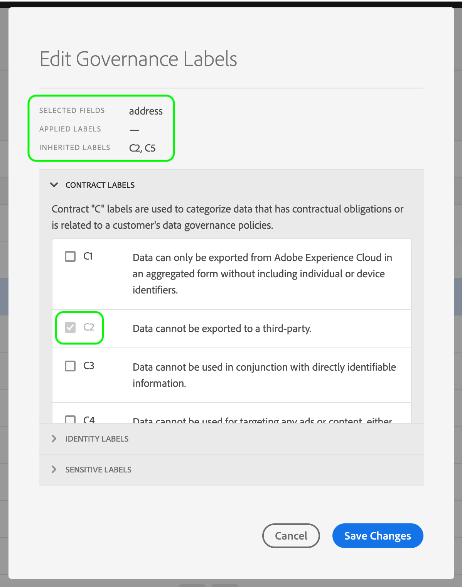

# Guide de l’utilisateur des libellés d’utilisation des données

Ce guide de l’utilisateur décrit les étapes à suivre pour utiliser les libellés d’utilisation des données (également appelés libellés DULE) dans l’interface utilisateur de la plateforme d’expérience. Avant d&#39;utiliser le guide, veuillez consulter l&#39;aperçu [de la gouvernance des](../home.md) données pour une présentation plus robuste du cadre de DULE.

## Gestion des libellés d’utilisation des données au niveau du jeu de données

Pour gérer les libellés d’utilisation des données au niveau du jeu de données, vous devez sélectionner un jeu de données existant ou en créer un nouveau. Après vous être connecté à Adobe Experience Platform, sélectionnez **DataSet** dans le volet de navigation de gauche pour ouvrir l’espace de travail _DataSet_ . Cette page  tous les jeux de données créés appartenant à votre organisation, ainsi que des détails utiles relatifs à chaque jeu de données.

La section suivante décrit la procédure à suivre pour créer un jeu de données auquel appliquer des étiquettes. Si vous souhaitez modifier les libellés d’un jeu de données existant, sélectionnez le jeu de données dans le  du et passez à l’avant pour [ajouter des libellés d’utilisation des données au jeu](#add-labels)de données.

### Création d’un jeu de données

>[!NOTE] Dans cet exemple, un jeu de données est créé à l’aide d’un  de modèle de données d’expérience (XDM) préconfiguré. Pour plus d&#39;informations sur les  XDM, reportez-vous à la présentation [du système](../../xdm/home.md) XDM et aux [principes de base de la composition](../../xdm/schema/composition.md).

Pour créer un jeu de données, cliquez sur **Créer un jeu** de données dans le coin supérieur droit de l’espace de travail _Jeu de données_ .

L’écran _Créer un jeu de données_ s’affiche. A partir de là, cliquez sur **Créer un jeu de données à partir de** de.

L&#39;écran _Sélectionner_ s&#39;affiche, qui  tous les disponibles que vous pouvez utiliser pour créer un jeu de données. Cliquez sur le bouton radio en regard d’un  pour le sélectionner. La _section_ du sur le côté droit affiche des détails supplémentaires sur le  de sélectionné. Once you have selected a schema, click **Next**.

L’écran _Configurer un jeu de données_ s’affiche. Indiquez un **nom** (obligatoire) et une **description** (facultative, mais recommandée) pour votre nouveau jeu de données, puis cliquez sur **Terminer**.

La page  de l&#39;ensemble de _données_ s&#39;affiche, affichant des informations sur le jeu de données nouvellement créé. Dans cet exemple, le jeu de données est nommé &quot;Membres de fidélité&quot;. Par conséquent, la barre de navigation supérieure affiche _Jeux de données > Membres_ de fidélité.

### Ajouter des libellés d’utilisation des données au jeu de données {#add-labels}

Après avoir créé un nouveau jeu de données ou sélectionné un jeu de données existant dans le  de l’espace de travail _Data_ Set **, cliquez sur** Data Governance _pour ouvrir l’espace de travail_ Data Governance. L’espace de travail vous permet de gérer les libellés d’utilisation des données au niveau du jeu de données et du champ.

Pour modifier les libellés d’utilisation des données au niveau du jeu de données,  en cliquant sur l’icône représentant un crayon en regard du nom du jeu de données.

La boîte de dialogue _Modifier les étiquettes_ de gouvernance s’ouvre. Dans la boîte de dialogue, cochez les cases en regard des libellés que vous souhaitez appliquer au jeu de données. N’oubliez pas que ces libellés seront hérités par tous les champs du jeu de données. L’en-tête Libellés __ appliqués se met à jour lorsque vous cochez chaque case, en indiquant les étiquettes que vous avez choisies. Une fois que vous avez sélectionné les étiquettes de votre choix, cliquez sur **Enregistrer les modifications**.

 

L’espace de travail Gouvernance _des_ données réapparaît, affichant les étiquettes que vous avez appliquées au niveau du jeu de données. Vous pouvez également constater que les étiquettes sont héritées jusqu’à chacun des champs du jeu de données.

Un &quot;x&quot; apparaît en regard des libellés au niveau du jeu de données, ce qui vous permet de supprimer les libellés. Les libellés hérités à côté de chaque champ n’ont pas de &quot;x&quot; en regard d’eux et apparaissent &quot;grisés&quot; sans possibilité de suppression ou de modification. En effet, les champs **hérités sont en lecture seule**, ce qui signifie qu’ils ne peuvent pas être supprimés au niveau du champ.

La bascule **Afficher les étiquettes** héritées est activée par défaut, ce qui vous permet de voir les libellés hérités du jeu de données vers ses champs. Si vous désactivez cette option, les libellés hérités du jeu de données sont masqués.

## Gestion des libellés d’utilisation des données au niveau du champ du jeu de données

En poursuivant le processus d’ [ajout et de modification des libellés d’utilisation des données au niveau](#add-labels)du jeu de données, vous pouvez également gérer les libellés au niveau du champ dans l’espace de travail de gouvernance _des_ données pour ce jeu de données.

Pour appliquer des étiquettes d’utilisation de données à un champ individuel, cochez la case en regard du nom du champ, puis cliquez sur **Modifier les étiquettes** de gouvernance.

La boîte de dialogue _Modifier les étiquettes_ de gouvernance s’affiche. La boîte de dialogue affiche les en-têtes qui affichent les champs sélectionnés, les étiquettes appliquées et les étiquettes héritées. Notez que les libellés hérités (C2 et C5) sont grisés dans la boîte de dialogue. Il s’agit de libellés en lecture seule hérités du niveau du jeu de données. Ils ne peuvent donc être modifiés qu’au niveau du jeu de données.

 

Sélectionnez des étiquettes de niveau champ en cochant la case en regard de chaque étiquette que vous souhaitez utiliser. Lorsque vous sélectionnez des libellés, l’en-tête Libellés __ appliqués se met à jour pour afficher les libellés appliqués aux champs affichés dans l’en-tête Champs __ sélectionnés. Une fois que vous avez terminé de sélectionner des libellés au niveau du champ, cliquez sur **Enregistrer les modifications**.

 

L’espace de travail Gouvernance _des_ données réapparaît, qui affiche désormais les étiquettes de niveau champ sélectionnées dans la ligne en regard du nom du champ. Notez que le libellé au niveau du champ comporte un &quot;x&quot; en regard, ce qui vous permet de supprimer le libellé.

Vous pouvez répéter ces étapes pour continuer à ajouter et à modifier des libellés de niveau champ pour d’autres champs, y compris la sélection de plusieurs champs pour appliquer simultanément des libellés de niveau champ.

Il est important de se rappeler que l’héritage se déplace du niveau supérieur vers le bas uniquement (jeu de données → champs), ce qui signifie que les libellés appliqués au niveau du champ ne sont pas propagés à d’autres champs ou jeux de données.

## Étapes suivantes

Maintenant que vous avez ajouté des libellés d’utilisation des données au niveau du jeu de données et du champ, vous pouvez commencer à assimiler des données dans la plateforme d’expérience. Pour en savoir plus,  en lisant la documentation [sur l&#39;ingestion de](../../ingestion/home.md)données.

## Ressources supplémentaires   

La vidéo suivante est destinée à vous aider à comprendre la gouvernance des données et explique comment appliquer des étiquettes à un jeu de données et à des champs individuels.

>[!VIDEO](https://video.tv.adobe.com/v/29709?quality=12&enable10seconds=on&speedcontrol=on)
