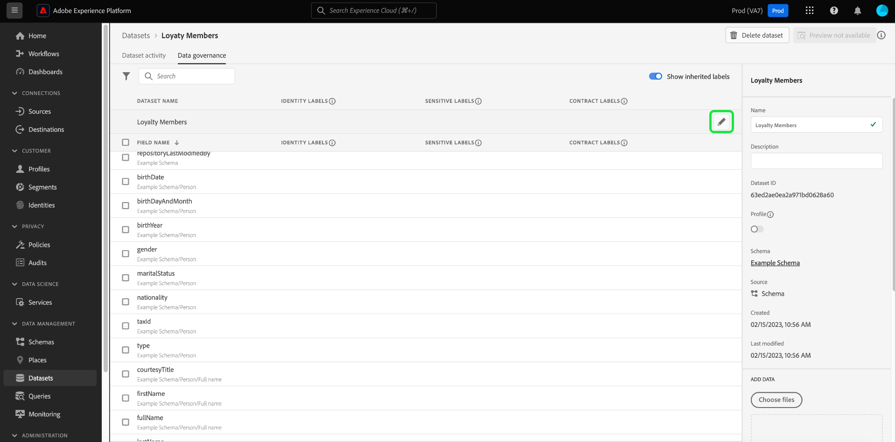

# Gérer les étiquettes d’utilisation des données dans l’interface utilisateur

Ce guide d&#39;utilisation décrit les étapes à suivre pour utiliser les libellés d&#39;utilisation des données dans l&#39;interface utilisateur [!DNL Experience Platform]. Avant d&#39;utiliser le guide, consultez la section [[!DNL Data Governance] présentation](../home.md) pour une présentation plus précise de la structure [!DNL Data Governance].

## Gérer les étiquettes au niveau du jeu de données

Pour gérer les libellés d’utilisation des données au niveau du jeu de données, vous devez sélectionner un jeu de données existant ou en créer un nouveau. Après vous être connecté à Adobe Experience Platform, sélectionnez **[!UICONTROL Jeux de données]** dans le volet de navigation de gauche pour ouvrir l’espace de travail **[!UICONTROL Jeux de données]**. Cette page répertorie tous les jeux de données créés appartenant à votre organisation, ainsi que des détails utiles relatifs à chaque jeu de données.

La section suivante décrit les étapes à suivre pour créer un jeu de données auquel appliquer des libellés. Si vous souhaitez modifier les libellés d’un jeu de données existant, sélectionnez le jeu de données dans la liste et passez à l’étape d’[ajout des libellés d’utilisation des données au jeu de données](#add-labels).

### Création d’un nouveau jeu de données

>[!NOTE]
>
>Dans cet exemple, un jeu de données est créé à l’aide d’un schéma préconfiguré [!DNL Experience Data Model] (XDM). Pour plus d’informations sur les schémas XDM, consultez la [présentation du système XDM](../../xdm/home.md) et les [principes de base de la composition de schémas](../../xdm/schema/composition.md).

Pour créer un nouveau jeu de données, sélectionnez **[!UICONTROL Créer un jeu de données]** dans le coin supérieur droit de l&#39;espace de travail **[!UICONTROL Datasets]**.

L’écran **[!UICONTROL Créer un jeu de données]** s’affiche. À partir de là, sélectionnez **[!UICONTROL Créer un jeu de données à partir du Schéma]**.

L’écran **[!UICONTROL Sélectionner un schéma]** s’affiche, répertoriant tous les schémas disponibles que vous pouvez utiliser pour créer un jeu de données. Sélectionnez le bouton radio en regard d’un schéma pour le sélectionner. La section **[!UICONTROL Schémas]** sur le côté droit affiche des détails supplémentaires sur le schéma sélectionné. Une fois que vous avez sélectionné un schéma, sélectionnez **[!UICONTROL Suivant]**.

L’écran **[!UICONTROL Configurer le jeu de données]** s’affiche. Indiquez un nom (obligatoire) et une description (facultatif, mais recommandé) pour votre nouveau jeu de données, puis sélectionnez **[!UICONTROL Terminer]**.

La page **[!UICONTROL Activité du jeu de données]** apparaît, affichant des informations sur le jeu de données que vous venez de créer. Dans cet exemple, le jeu de données est appelé « Loyalty Members ». Par conséquent, la barre de navigation supérieure affiche **Jeux de données > Loyalty Members**.

### Ajout de libellés d’utilisation des données au jeu de données {#add-labels}

Après avoir créé un nouveau jeu de données ou sélectionné un jeu de données existant dans la liste **[!UICONTROL Datasets]** de l&#39;espace de travail, sélectionnez **[!UICONTROL Data Governance]** pour ouvrir l&#39;espace de travail **[!UICONTROL Data Governance]**. L’espace de travail vous permet de gérer les libellés d’utilisation des données aux niveaux du jeu de données et du champ.

Pour modifier les libellés d’utilisation des données au niveau du jeu de données, début en sélectionnant l’icône représentant un crayon en regard du nom du jeu de données.

La boîte de dialogue **[!UICONTROL Modifier les libellés de gouvernance]** s’ouvre. Dans la boîte de dialogue, cochez les cases en regard des libellés que vous souhaitez appliquer au jeu de données. Souvenez-vous que ces libellés seront hérités par tous les champs du jeu de données. L’en-tête **[!UICONTROL Libellés appliqués]** est mis à jour lorsque vous cochez chaque case, affichant les libellés que vous avez choisis. Une fois que vous avez sélectionné les étiquettes de votre choix, sélectionnez **[!UICONTROL Enregistrer les modifications]**.

L’espace de travail **[!UICONTROL Gouvernance des données]** réapparaît, affichant les libellés que vous avez appliqués au niveau du jeu de données. Vous pouvez également constater que les libellés sont hérités au niveau de chacun des champs du jeu de données.

Un « x » apparaît en regard des libellés au niveau du jeu de données, ce qui vous permet de supprimer les libellés. Les libellés hérités en regard de chaque champ ne comportent pas de « x » et sont « grisés » sans possibilité de suppression ou de modification. En effet, **les champs hérités sont en lecture seule**, ce qui signifie qu’ils ne peuvent pas être supprimés au niveau du champ.

L’option **[!UICONTROL Afficher les libellés hérités]** est activée par défaut, ce qui vous permet de voir les libellés hérités du jeu de données aux champs. Si vous désactivez cette option, les libellés hérités du jeu de données sont masqués.

## Gérer les étiquettes au niveau des champs

En poursuivant le processus d’[ajout et de modification des libellés d’utilisation des données au niveau du jeu de données](#add-labels), vous pouvez également gérer les libellés au niveau du champ dans l’espace de travail **[!UICONTROL Gouvernance des données]** pour ce jeu de données.

Pour appliquer des étiquettes d&#39;utilisation de données à un champ individuel, cochez la case en regard du nom du champ, puis sélectionnez **[!UICONTROL Modifier les étiquettes de gouvernance]**.

La boîte de dialogue **[!UICONTROL Modifier les libellés de gouvernance]** apparaît. La boîte de dialogue affiche les en-têtes présentant les champs sélectionnés, les libellés appliqués et les libellés hérités. Notez que les libellés hérités (C2 et C5) sont grisés dans la boîte de dialogue. Il s’agit de libellés en lecture seule hérités au niveau du jeu de données. Ils ne peuvent donc être modifiés qu’au niveau du jeu de données.

Sélectionnez des étiquettes de niveau champ en cochant la case en regard de chaque étiquette que vous souhaitez utiliser. Lorsque vous sélectionnez des libellés, l’en-tête **[!UICONTROL Libellés appliqués]** est mis à jour pour afficher les libellés appliqués aux champs figurant dans l’en-tête **[!UICONTROL Champs sélectionnés]**. Une fois que vous avez terminé de sélectionner des étiquettes de niveau champ, sélectionnez **[!UICONTROL Enregistrer les modifications]**.

L’espace de travail **[!UICONTROL Gouvernance des données]** réapparaît, affichant désormais le ou les libellés au niveau du champ sélectionnés dans la ligne en regard du nom du champ. Notez que le libellé au niveau du champ comporte un « x », ce qui vous permet de le supprimer.

Vous pouvez répéter ces étapes pour continuer à ajouter et à modifier des libellés au niveau du champ pour des champs supplémentaires, y compris pour sélectionner plusieurs champs afin d’appliquer simultanément des libellés au niveau du champ.

Il est important de se rappeler que l’héritage se déplace uniquement du niveau supérieur vers le niveau inférieur (jeu de données → champs), ce qui signifie que les libellés appliqués au niveau du champ ne sont pas propagés à d’autres champs ou jeux de données.

## Gestion des étiquettes personnalisées

Vous pouvez créer vos propres étiquettes d’utilisation personnalisée dans l’espace de travail **[!UICONTROL Stratégies]** de l’interface utilisateur [!DNL Experience Platform]. Sélectionnez **[!UICONTROL Stratégies]** dans le volet de navigation de gauche, puis **[!UICONTROL Étiquettes]** pour vue une liste d&#39;étiquettes existantes. À partir de là, sélectionnez **[!UICONTROL Créer une étiquette]**.

La boîte de dialogue **[!UICONTROL Créer une étiquette]** s&#39;affiche. À partir de là, fournissez les informations suivantes pour la nouvelle étiquette :

* **[!UICONTROL Identificateur]** : Identificateur unique de l’étiquette. Cette valeur est utilisée à des fins de recherche et doit donc être courte et concise.
* **[!UICONTROL Nom]** : Nom d’affichage convivial de l’étiquette.
* **[!UICONTROL Description]** : (Facultatif) Description de l’étiquette pour fournir un contexte plus poussé.

Lorsque vous avez terminé, sélectionnez **[!UICONTROL Créer]**.

La boîte de dialogue se ferme et le nouveau libellé personnalisé s’affiche dans la liste sous l’onglet **[!UICONTROL Étiquettes]**.

L&#39;étiquette peut désormais être sélectionnée sous **[!UICONTROL Libellés personnalisés]** lors de la modification des libellés d&#39;utilisation des jeux de données et des champs ou lors de la création de stratégies d&#39;utilisation des données.

 

## Étapes suivantes

Maintenant que vous avez ajouté des libellés d’utilisation des données aux niveaux du jeu de données et du champ, vous pouvez commencer à ingérer des données dans [!DNL Experience Platform]. Pour en savoir plus, commencez par lire la [documentation sur l’ingestion de données](../../ingestion/home.md).

Désormais, vous pouvez également définir des stratégies d’utilisation des données en fonction des libellés que vous avez appliqués. Pour plus d’informations, consultez la [présentation des stratégies d’utilisation des données](../policies/overview.md).

## Ressources supplémentaires

La vidéo suivante est destinée à vous aider à comprendre [!DNL Data Governance] et explique comment appliquer des étiquettes à un jeu de données et à des champs individuels.

>[!VIDEO](https://video.tv.adobe.com/v/29709?quality=12&enable10seconds=on&speedcontrol=on)
