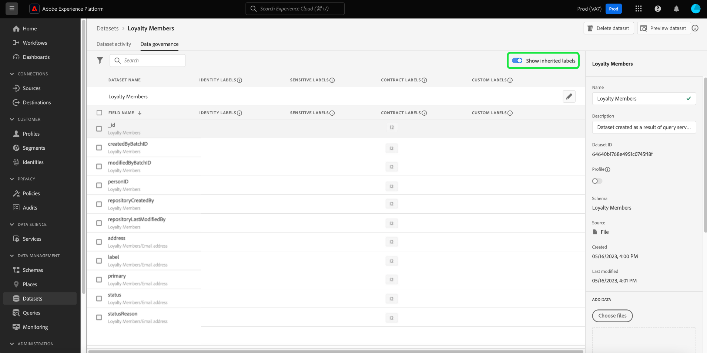
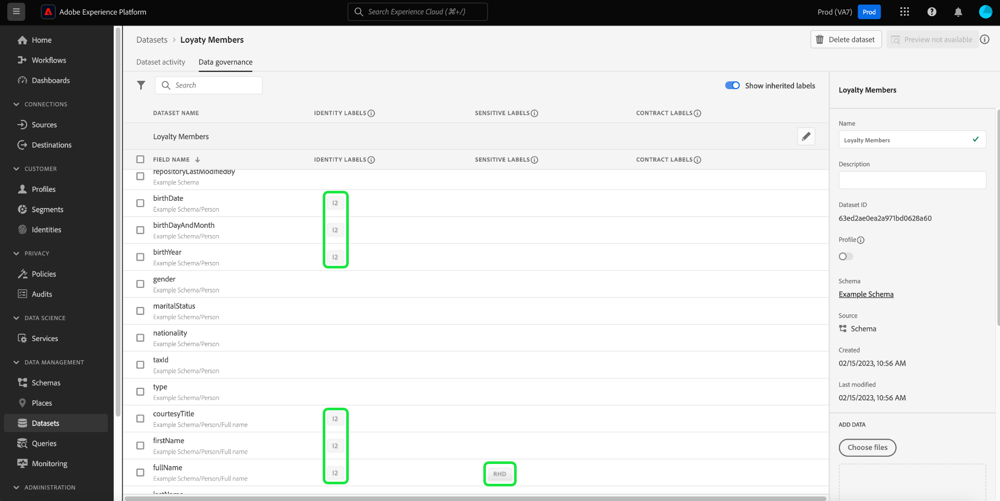

# Gestion des libellés d’utilisation des données dans l’interface utilisateur {#user-guide}

>[!CONTEXTUALHELP]
>id="platform_privacyConsole_dataGovernance_description"
>title="Gouverner l’utilisation des données dans Platform"
>abstract="<h2>Description</h2>
La structure de gouvernance des données dans Experience Platform vous permet d’étiqueter les attributs et les schémas en fonction des restrictions d’utilisation des données et de configurer des stratégies qui identifient et respectent ces restrictions pour des actions marketing spécifiques.
"

Ce guide d’utilisation détaille la procédure d’utilisation des libellés d’utilisation des données dans l’interface utilisateur [!DNL Experience Platform].

## Gestion des étiquettes {#manage-labels}

Pour appliquer des libellés à vos données, vous avez besoin de l’événement **[!UICONTROL Gestion des étiquettes d’utilisation]** autorisation d’utilisation sur l’environnement de test de production par défaut appelé &quot;prod&quot;. Pour créer une étiquette personnalisée, vous devez également disposer de droits d’administration sur le profil de produit. Chaque organisation ne possède qu’une seule liste de libellés applicables. Pour le moment, la suppression des libellés n’est pas prise en charge.

Consultez le guide sur la façon de [configuration des autorisations](https://experienceleague.adobe.com/docs/platform-learn/getting-started-for-data-architects-and-data-engineers/configure-permissions.html) ou le [présentation du contrôle d’accès](../../access-control/home.md) pour plus d’informations sur l’attribution d’une autorisation. Si vous n’avez pas accès au Admin Console de votre entreprise, contactez l’administrateur de votre entreprise.

## Gérer les libellés au niveau du schéma

Vous pouvez ajouter des libellés directement à un schéma ou à des champs de ce schéma. Tous les champs appliqués au niveau du schéma se propagent à tous les jeux de données basés sur ce schéma.

Pour gérer les libellés d’utilisation des données au niveau du schéma, vous devez sélectionner un schéma existant ou en créer un nouveau. Après vous être connecté à Adobe Experience Platform, sélectionnez **[!UICONTROL Schémas]** dans le volet de navigation de gauche pour ouvrir la **[!UICONTROL Schémas]** workspace. Cette page répertorie tous les schémas créés appartenant à votre organisation, ainsi que des détails utiles liés à chaque schéma.

La section suivante décrit les étapes à suivre pour créer un nouveau schéma auquel appliquer des libellés. Si vous souhaitez modifier les libellés d’un schéma existant, sélectionnez le schéma dans la liste et passez la souris sur [Ajout de libellés d’utilisation des données au schéma](#add-labels).

### Création d&#39;un schéma

Pour créer un nouveau schéma, sélectionnez **[!UICONTROL Créer un schéma]** dans le coin supérieur droit du **[!UICONTROL Schémas]** workspace. Consultez le guide sur la [Comment créer un schéma à l’aide de l’éditeur de schémas](../../xdm/tutorials/create-schema-ui.md#create) pour obtenir des instructions complètes. Vous pouvez également [créer un schéma à l’aide de l’API Schema Registry](../../xdm/tutorials/create-schema-api.md) si nécessaire.

### Ajout de libellés d’utilisation des données à un schéma {#add-labels-to-schema}

Après avoir créé un nouveau schéma ou sélectionné un schéma existant dans la liste du [!UICONTROL Parcourir] de l’onglet [!UICONTROL Schémas] espace de travail, sélectionnez un champ de votre schéma dans l’éditeur de schémas. Dans le [!UICONTROL Propriétés du champ] barre latérale, sélectionnez **[!UICONTROL Appliquer les étiquettes d’accès et de gouvernance des données]**.

Une boîte de dialogue s’affiche, vous permettant d’appliquer et de gérer des libellés d’utilisation des données au niveau du schéma et du champ. Consultez le tutoriel XDM pour obtenir des instructions complètes sur [comment ajouter ou modifier des libellés d’utilisation des données pour les schémas XDM](../../xdm/tutorials/labels.md#select-schema-field).

### Ajout de libellés d’utilisation des données à un jeu de données spécifique {#add-labels-to-dataset}

>[!CONTEXTUALHELP]
>id="platform_privacyConsole_dataGovernance_instructions"
>title="Instructions"
>abstract="<ol><li>Sélectionnez <a href="https://experienceleague.adobe.com/docs/experience-platform/data-governance/labels/user-guide.html?lang=fr">Jeux de données</a> dans le volet de navigation de gauche, puis cliquez sur le jeu de données dont vous souhaitez restreindre les données.</li><li>Dans la vue des détails du jeu de données, sélectionnez l’onglet <b>Gouvernance des données</b>.</li><li>Sélectionnez les champs du jeu de données que vous souhaitez restreindre, puis cliquez sur <b>Modifier les libellés de gouvernance</b> pour libeller les données en fonction des restrictions d’utilisation.</li><li>Une fois les données libellées, sélectionnez <a href="https://experienceleague.adobe.com/docs/experience-platform/data-governance/policies/overview.html?lang=fr">Stratégies</a> dans le volet de navigation de gauche et cliquez sur <b>Créer une stratégie</b>.</li><li>Créez une <a href="https://experienceleague.adobe.com/docs/experience-platform/data-governance/policies/user-guide.html?lang=fr#create-governance-policy">Stratégie de gouvernance des données</a>, puis sélectionnez les libellés d’utilisation des données que la stratégie appliquera à la stratégie.</li><li>Sélectionnez la ou les actions marketing que la stratégie refusera pour toutes les données contenant ces libellés. Une fois la stratégie créée, sélectionnez-la dans la liste et activez-la à l’aide du bouton (bascule) du rail de droite.</li><li>En fonction de la stratégie activée, Platform empêche l’utilisation des données contenant les libellés spécifiés pour la ou les actions marketing définies. Cette implémentation a lieu automatiquement lorsque vous tentez d’activer des données libellées vers une destination avec des actions marketing associées (cas d’utilisation).</li></ol>"

>[!IMPORTANT]
>
>Les libellés ne peuvent plus être appliqués aux champs au niveau du jeu de données. Ce workflow a été abandonné au profit de l’application des libellés au niveau du schéma. Les libellés précédemment appliqués au niveau de l’objet du jeu de données seront toujours pris en charge par l’interface utilisateur de Platform jusqu’au 31 mai 2024. Pour garantir la cohérence de vos libellés sur tous les schémas, les libellés précédemment attachés aux champs au niveau du jeu de données doivent être migrés au niveau du schéma par vous au cours de l’année à venir. Consultez la documentation pour obtenir des instructions sur [Comment migrer les libellés précédemment appliqués du jeu de données au niveau du schéma](../e2e.md#migrate-labels).

Les libellés peuvent être appliqués à l’ensemble du jeu de données à partir du **[!UICONTROL Gouvernance des données]** de l’onglet **[!UICONTROL Jeux de données]** workspace. L’espace de travail vous permet de gérer les libellés d’utilisation des données au niveau du jeu de données.

![Le [!UICONTROL Gouvernance des données] de l’onglet [!UICONTROL Jeux de données] espace de travail avec la gouvernance des données mise en surbrillance.](../images/labels/dataset-governance.png)

Pour modifier les libellés d’utilisation des données au niveau du jeu de données, commencez par sélectionner l’icône en forme de crayon () dans la ligne du nom du jeu de données.

![Le [!UICONTROL Gouvernance des données] de l’onglet [!UICONTROL Jeux de données] espace de travail avec l’icône modifier le crayon mise en surbrillance.](../images/labels/dataset-level-edit.png)

La boîte de dialogue **[!UICONTROL Modifier les libellés de gouvernance]** s’ouvre. Dans la boîte de dialogue, cochez les cases en regard des libellés que vous souhaitez appliquer au jeu de données. Souvenez-vous que ces libellés seront hérités par tous les champs du jeu de données. L’en-tête **[!UICONTROL Libellés appliqués]** est mis à jour lorsque vous cochez chaque case, affichant les libellés que vous avez choisis. Une fois que vous avez sélectionné les libellés de votre choix, cliquez sur **[!UICONTROL Enregistrer les modifications]**.

Le **[!UICONTROL Gouvernance des données]** l’espace de travail réapparaît, affichant les libellés que vous avez appliqués au niveau du jeu de données dans la ligne initiale du tableau. Vous pouvez également voir les libellés, indiqués par des cartes individuelles, qui sont hérités jusqu’à chacun des champs du jeu de données.

![Le [!UICONTROL Gouvernance des données] de l’onglet [!UICONTROL Jeux de données] espace de travail avec les libellés appliqués au niveau du jeu de données et les libellés de champ de jeu de données hérités mis en surbrillance.](../images/labels/applied-dataset-labels.png)

### Suppression des étiquettes dʼun jeu de données {#remove-labels-from-a-dataset}

Les libellés ajoutés au niveau du jeu de données comportent un &quot;x&quot; en regard de leur carte. Vous pouvez ainsi supprimer les libellés du jeu de données entier. Les libellés hérités en regard de chaque champ n’ont pas de &quot;x&quot; en regard et apparaissent &quot;grisés&quot;. Ces **les libellés hérités sont en lecture seule**, ce qui signifie qu’elles ne peuvent pas être supprimées ou modifiées au niveau du champ.

<!-- ## View labels at the dataset field level {#view-labels-at-dataset-field-level} -->

<!-- To view labels inherited by the dataset from the schema level, select **[!UICONTROL Datasets]** to navigate to the datasets workspace and select the relevant dataset from the list. 

Next, select the **[!UICONTROL Data Governance]** tab to show the labels that have been applied to the dataset. You can also see that the labels are inherited down to each of the fields within the dataset.

The inherited labels beside each field do not have an "x" next to them and appear "greyed out" with no ability to remove or edit. This is because **inherited fields are read-only**, meaning they cannot be removed at the field level. -->

<!--Beleive can cut above here  -->

Le **[!UICONTROL Afficher les étiquettes héritées]** est activé par défaut, ce qui vous permet de voir les libellés hérités du schéma à ses champs. Si vous désactivez cette option, les libellés hérités du jeu de données sont masqués.

<!-- Labels applied to the dataset appear in read-only form within the **[!UICONTROL Data Governance]** view for that dataset. 

 -->

>[!NOTE]
>
>Les libellés appliqués avant que la fonction d’étiquetage du jeu de données ne soit obsolète peuvent être supprimés du jeu de données en recherchant le jeu de données approprié et en sélectionnant l’icône Annuler sur le libellé.
>
>Consultez la documentation pour obtenir des instructions sur [Comment migrer les libellés précédemment appliqués du jeu de données au niveau du schéma](../e2e.md#migrate-labels).

## Gérer les libellés personnalisés {#manage-custom-labels}

>[!CONTEXTUALHELP]
>id="platform_governance_createlabels"
>title="Créer des libellés"
>abstract="Les libellés vous permettent de classer les jeux de données et les champs en fonction des politiques d’utilisation qui s’appliquent à ces données. Platform fournit un ensemble standard de libellés que vous pouvez utiliser, mais vous pouvez également créer des libellés personnalisés spécifiques à votre organisation."

Vous pouvez créer vos propres libellés d’utilisation personnalisés dans l’espace de travail **[!UICONTROL Politiques]** de l’interface utilisateur [!DNL Experience Platform]. Sélectionnez **[!UICONTROL Politiques]** dans le volet de navigation de gauche, puis cliquez sur **[!UICONTROL Libellés]** pour afficher une liste des libellés existants. À partir de là, cliquez sur **[!UICONTROL Créer un libellé]**.

La boîte de dialogue **[!UICONTROL Créer un libellé]** apparaît. À partir de là, renseignez les informations suivantes pour le nouveau libellé :

* **[!UICONTROL Nom]**: Identifiant unique du libellé. Cette valeur est utilisée à des fins de recherche et doit donc être courte et concise.
* **[!UICONTROL Nom convivial]**: Nom d’affichage convivial du libellé.
* **[!UICONTROL Description]** : une description permettant de fournir davantage de contexte pour ce libellé (facultative).

Lorsque vous avez terminé, cliquez sur **[!UICONTROL Créer]**.

La boîte de dialogue se ferme et le nouveau libellé personnalisé apparaît dans la liste, sous l’onglet **[!UICONTROL Libellés]**.

Le libellé peut désormais être sélectionné sous **[!UICONTROL Libellés personnalisés]** lors de la modification des libellés d’utilisation des jeux de données et des champs ou lors de la création de politiques d’utilisation des données.

## Étapes suivantes

Maintenant que vous avez ajouté des libellés d’utilisation des données aux niveaux du jeu de données et du champ, vous pouvez commencer à ingérer des données dans [!DNL Experience Platform]. Pour en savoir plus, commencez par lire la [documentation sur l’ingestion de données](../../ingestion/home.md).

Désormais, vous pouvez également définir des politiques d’utilisation des données en fonction des libellés que vous avez appliqués. Pour plus d’informations, consultez la [présentation des politiques d’utilisation des données](../policies/overview.md).

<!-- The workflow of this video is now outdated. This can be enabled once the video has been updated

## Additional resources

The following video is intended to support your understanding of Data Governance, and outlines how to apply labels to a dataset and individual fields.

>[!VIDEO](https://video.tv.adobe.com/v/29709?quality=12&enable10seconds=on&speedcontrol=on) -->
