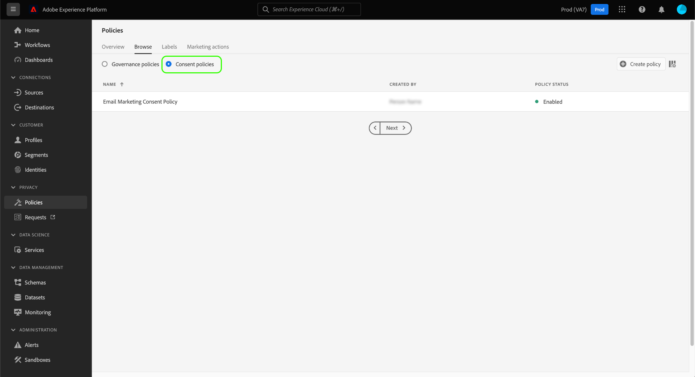

# Gestion des politiques d’utilisation des données dans l’interface utilisateur {#user-guide}

>[!CONTEXTUALHELP]
>id="platform_privacyConsole_dataUsagePolicies_description"
>title="Intégrer et appliquer le consentement client dans vos données de profil"
>abstract="<h2>Description</h2>
Experience Platform vous permet d’intégrer dans leurs profils respectifs les données de consentement que vous avez collectées auprès de vos clients. Vous pouvez ensuite établir des stratégies de consentement pour déterminer si ces données peuvent être incluses dans des segments activés vers certaines destinations.
"

Ce document explique comment utiliser l’espace de travail **[!UICONTROL Politiques]** dans l’interface utilisateur d’Adobe Experience Platform pour créer et gérer des politiques d’utilisation des données.

>[!NOTE]
>
>Pour plus d’informations sur la gestion des politiques de contrôle d’accès dans l’interface utilisateur, reportez-vous au [guide de l’interface utilisateur du contrôle d’accès basé sur les attributs](../../access-control/abac/ui/policies.md).

>[!IMPORTANT]
>
>Toutes les politiques d’utilisation des données (y compris les politiques de base fournies par Adobe) sont désactivées par défaut. Pour qu’une politique individuelle soit prise en compte pour l’application, vous devez l’activer manuellement. Consultez la section relative à l’[activation des politiques](#enable) pour savoir comment procéder dans l’interface utilisateur.

## Conditions préalables

Ce guide nécessite une bonne compréhension des concepts [!DNL Experience Platform] suivants :

* [Gouvernance des données](../home.md)
* [Politiques d’utilisation des données](./overview.md)

## Affichage des politiques existantes {#view-policies}

Dans l’interface utilisateur [!DNL Experience Platform], cliquez sur **[!UICONTROL Politiques]** pour ouvrir l’espace de travail **[!UICONTROL Politiques]**. Dans l’onglet **[!UICONTROL Parcourir]**, vous pouvez voir une liste des politiques disponibles, y compris leurs libellés associés, les actions marketing et les états.

Si vous avez accès aux politiques de consentement, activez le bouton (bascule) **[!UICONTROL Politiques de consentement]** pour les afficher dans l’onglet [!UICONTROL Parcourir].

Cliquez sur une politique répertoriée pour en afficher la description et le type. Si une politique personnalisée est sélectionnée, d’autres contrôles s’affichent pour la modifier, la supprimer ou [activer/désactiver la politique](#enable).

## Création dʼune politique personnalisée {#create-policy}

Pour créer une politique d’utilisation des données personnalisée, cliquez sur **[!UICONTROL Créer une politique]** dans le coin supérieur droit de l’onglet **[!UICONTROL Parcourir]** dans l’espace de travail **[!UICONTROL Politiques]**.

Selon que vous fassiez partie de la version bêta des politiques de consentement, l’un des événements suivants se produit :

* Si vous ne faites pas partie de la version bêta, vous êtes immédiatement redirigé(e) vers le workflow pour [créer une politique de gouvernance des données](#create-governance-policy).
* Si vous faites partie de la version bêta, une boîte de dialogue vous offre une option supplémentaire pour [créer une politique de consentement](#consent-policy).
  

### Utilisation conjointe de la gouvernance des données et des politiques de consentement {#combine-policies}

>[!NOTE]
>
>Actuellement, les politiques de consentement ne sont disponibles que pour les organisations qui ont acheté Adobe Healthcare Shield ou Adobe Privacy &amp; Security Shield.

Les politiques de gouvernance et de consentement peuvent être utilisées conjointement pour créer des règles solides afin de gérer les audiences mappées à une destination. Les politiques de consentement sont de nature inclusive, ce qui signifie qu’elles déterminent les profils pouvant être inclus dans chaque expérience marketing. À l’inverse, les politiques de gouvernance empêchent que les attributs étiquetés spécifiques soient utilisés pour être configurés pour l’activation.

En utilisant ce comportement, vous pouvez configurer une combinaison de politiques et de règles de consentement incluant les profils corrects, mais vous ne pouvez pas inclure des données qui vont à l’encontre de vos règles d’organisation définies. C’est le cas par exemple si vous souhaitez exclure des données sensibles de l’inclusion, mais que vous pouvez toujours cibler les utilisateurs et utilisatrices consentants pour le marketing via les médias sociaux. Les étapes nécessaires à ce scénario sont décrites dans l’infographie ci-dessous.

### Créer une politique de gouvernance des données {#create-governance-policy}

Le workflow de **[!UICONTROL création de politiques]** s’affiche. Commencez par fournir un nom et une description à la nouvelle politique.

Ensuite, sélectionnez les libellés d’utilisation des données sur lesquels la politique sera basée. Lors de la sélection de plusieurs libellés, vous avez la possibilité de choisir si les données doivent contenir tous les libellés ou un seul pour que la politique s’applique. Lorsque vous avez terminé, cliquez sur **[!UICONTROL Suivant]**.

L’étape **[!UICONTROL Sélectionner les actions marketing]** s’affiche. Sélectionnez les actions marketing appropriées dans la liste fournie, puis cliquez sur **[!UICONTROL Suivant]** pour continuer.

>[!NOTE]
>
>Lors de la sélection de plusieurs actions marketing, la politique les interprète comme une règle « OU ». En d’autres termes, la politique s’applique si **l’une** des actions marketing sélectionnées est exécutée.

L’étape **[!UICONTROL Révision]** s’affiche, vous permettant de consulter les détails de la nouvelle politique avant de la créer. Une fois que vous êtes satisfait, cliquez sur **[!UICONTROL Terminer]** pour créer la politique.

L’onglet **[!UICONTROL Parcourir]** réapparaît et affiche désormais la nouvelle politique avec l’état « Version préliminaire ». Pour activer la politique, consultez la section suivante.

### Créer une politique de consentement {#consent-policy}

>[!CONTEXTUALHELP]
>id="platform_privacyConsole_dataUsagePolicies_instructions"
>title="Instructions"
>abstract="<ul><li>Assurez-vous d’ingérer les données relatives aux préférences dans vos schémas d’union via le connecteur source OneTrust ou le schéma XDM standard pour le consentement.</li><li>Sélectionnez <a href="https://experienceleague.adobe.com/docs/experience-platform/data-governance/policies/overview.html?lang=fr">Stratégies</a> dans le volet de navigation de gauche, puis cliquez sur <a href="https://experienceleague.adobe.com/docs/experience-platform/data-governance/policies/user-guide.html?lang=fr#create-governance-policy">Créer une stratégie</a>.</li><li>Dans la section <b>Si</b>, indiquez les conditions ou actions qui déclencheront la vérification de la stratégie.</li><li>Dans la section <b>Alors</b>, indiquez les attributs de consentement devant être présents pour qu’un profil soit inclus dans l’action qui a déclenché la stratégie.</li><li>Sélectionnez <b>Enregistrer</b> pour créer la stratégie. Pour activer immédiatement la stratégie, activez le bouton (bascule) <b>Statut</b> dans le rail de droite.</li><li>Experience Platform applique automatiquement vos stratégies de consentement activées lorsque vous activez des segments vers des destinations et fournit des détails sur la manière dont chaque stratégie affecte la taille de votre audience.</li><li>Pour obtenir de l’aide sur cette fonctionnalité, consultez le guide sur la <a href="https://experienceleague.adobe.com/docs/experience-platform/data-governance/policies/user-guide.html#consent-policy?lang=fr">création de stratégies de consentement</a> sur Experience League.</li></ul>"

>[!IMPORTANT]
>
>Les politiques de consentement ne sont disponibles que pour les organisations qui ont acheté **Adobe Healthcare Shield** ou **Adobe Privacy &amp; Security Shield**.

Si vous choisissez de créer une politique de consentement, un nouvel écran vous permettant de configurer la nouvelle politique s’affiche.

Pour pouvoir utiliser des politiques de consentement, des attributs de consentement doivent être présents dans vos données de profil. Consultez le guide sur le [traitement du consentement dans Experience Platform](../../landing/governance-privacy-security/consent/adobe/overview.md) pour obtenir des instructions détaillées sur la manière d’inclure les attributs obligatoires dans votre schéma d’union.

Les politiques de consentement se composent de deux éléments logiques :

* **[!UICONTROL Si]** : la condition qui déclenchera la vérification de la politique. Elle peut dépendre d’une certaine action marketing en cours, de la présence de certains libellés d’utilisation des données ou d’une combinaison des deux.
* **[!UICONTROL Alors]** : attributs de consentement devant être présents pour qu’un profil soit inclus dans l’action qui a déclenché la politique.

#### Configurer les conditions {#consent-conditions}

>[!CONTEXTUALHELP]
>id="platform_governance_policies_consentif"
>title="Condition Si"
>abstract="Définissez d’abord les conditions qui déclencheront la vérification de la politique. Les conditions peuvent inclure certaines actions marketing entreprises, certaines étiquettes de gouvernance des données présentes ou une combinaison des deux."

Sous la section **[!UICONTROL Si]**, sélectionnez les actions marketing et/ou les libellés d’utilisation des données qui doivent déclencher cette politique. Sélectionnez **[!UICONTROL Afficher tout]** et **[!UICONTROL Sélectionner des libellés]** pour afficher les listes complètes des actions marketing et des libellés disponibles, respectivement.

Une fois que vous avez ajouté au moins une condition, vous pouvez sélectionner **[!UICONTROL Ajouter une condition]** pour continuer à ajouter d’autres conditions si nécessaire, en choisissant le type de condition approprié dans la liste déroulante.

Si vous sélectionnez plusieurs conditions, vous pouvez utiliser l’icône qui s’affiche entre elles pour changer la relation conditionnelle entre « ET » et « OU ».

#### Sélectionner les attributs de consentement {#consent-attributes}

>[!CONTEXTUALHELP]
>id="platform_governance_policies_consentthen"
>title="Condition Alors"
>abstract="Une fois votre condition « Si » définie, utilisez la section « Alors » pour sélectionner au moins un attribut de consentement dans le schéma d’union. Il s’agit de l’attribut qui doit être présent pour que les profils soient inclus dans l’action régie par cette politique."

Sous la section **[!UICONTROL Alors]**, sélectionnez au moins un attribut de consentement dans le schéma d’union. Il s’agit de l’attribut qui doit être présent pour que les profils soient inclus dans l’action régie par cette politique. Vous pouvez choisir l’une des options fournies dans la liste ou sélectionner **[!UICONTROL Afficher tout]** pour sélectionner directement l’attribut dans le schéma d’union.

Lors de la sélection de l’attribut de consentement, sélectionnez les valeurs de l’attribut que vous souhaitez que cette politique vérifie.

Après avoir sélectionné au moins un attribut de consentement, le panneau **[!UICONTROL Propriétés de la politique]** se met à jour pour afficher le nombre estimé de profils qui seraient autorisés par cette politique, y compris le pourcentage du total de la boutique de profils. Cette estimation est automatiquement mise à jour lorsque vous ajustez la configuration de la politique.

Pour ajouter d’autres attributs de consentement à la politique, sélectionnez **[!UICONTROL Ajouter un résultat]**.

Vous pouvez continuer à ajouter et à ajuster des conditions et des attributs de consentement à la politique, si nécessaire. Lorsque vous êtes satisfait(e) de la configuration, indiquez un nom et une description facultative pour la politique avant de sélectionner **[!UICONTROL Enregistrer]**.

La politique de consentement est maintenant créée et son état est défini sur [!UICONTROL Désactivé] par défaut. Pour activer immédiatement la politique, activez le bouton **[!UICONTROL Statut]** dans le rail de droite.

#### Vérifier l’application des politiques

Après avoir créé et activé une politique de consentement, vous pouvez prévisualiser l’impact de cette règle sur vos audiences consentantes lors de l’activation de segments vers les destinations. Voir la section sur l’[évaluation des politiques de consentement](../enforcement/auto-enforcement.md#consent-policy-evaluation) pour plus d’informations.

## Activation ou désactivation d’une politique {#enable}

Toutes les politiques d’utilisation des données (y compris les politiques de base fournies par Adobe) sont désactivées par défaut. Pour qu’une politique individuelle soit prise en compte pour son application, vous devez l’activer manuellement par le biais de l’API ou de l’interface utilisateur.

Vous pouvez activer ou désactiver les politiques à partir de l’onglet **[!UICONTROL Parcourir]** dans l’espace de travail **[!UICONTROL Politiques]**. Sélectionnez une politique personnalisée dans la liste pour afficher ses détails à droite. Sous **[!UICONTROL État]**, sélectionnez le bouton d’activation/désactivation pour activer ou désactiver la politique.

## Affichage des actions marketing {#view-marketing-actions}

Dans l’espace de travail **[!UICONTROL Politiques]**, cliquez sur l’onglet **[!UICONTROL Actions marketing]** pour afficher une liste d’actions marketing mises à votre disposition et définies par Adobe et votre organisation.

## Création d’une action marketing {#create-marketing-action}

Pour créer une action marketing personnalisée, sélectionnez **[!UICONTROL Créer une action marketing]** dans le coin supérieur droit de l’onglet **[!UICONTROL Actions marketing]** dans l’espace de travail **[!UICONTROL Politiques]**.

La boîte de dialogue **[!UICONTROL Créer une action marketing]** apparaît. Saisissez un nom et une description pour l’action marketing, puis sélectionnez **[!UICONTROL Créer]**.

L’action nouvellement créée s’affiche dans l’onglet **[!UICONTROL Actions marketing]**. Vous pouvez désormais utiliser l’action marketing lors de la [création de politiques d’utilisation des données](#create-policy).

## Modification ou suppression d’une action marketing {#edit-delete-marketing-action}

>[!NOTE]
>
>Seules les actions marketing personnalisées définies par votre organisation peuvent être modifiées. Il n’est pas possible de modifier ou supprimer des actions marketing définies par Adobe.

Dans l’espace de travail **[!UICONTROL Politiques]**, cliquez sur l’onglet **[!UICONTROL Actions marketing]** pour afficher une liste d’actions marketing mises à votre disposition et définies par Adobe et votre organisation. Sélectionnez une action marketing personnalisée répertoriée dans la liste, puis utilisez les champs fournis dans la section de droite pour modifier les détails de cette action.

Si l’action marketing n’est utilisée par aucune politique d’utilisation existante, vous pouvez la supprimer en cliquant sur **[!UICONTROL Supprimer l’action marketing]**.

>[!NOTE]
>
>Si vous tentez de supprimer une action marketing utilisée par une politique existante, un message d’erreur s’affiche, indiquant que la tentative de suppression a échoué.

## Étapes suivantes

Ce document offre un aperçu de la gestion des politiques d’utilisation des données dans l’interface utilisateur [!DNL Experience Platform]. Pour savoir comment gérer les politiques à l’aide de l’[!DNL Policy Service API], consultez le [guide du développement](../api/getting-started.md). Pour plus d’informations sur l’application des stratégies d’utilisation des données, voir la [présentation de l’application des politiques](../enforcement/overview.md).

La vidéo qui suit montre comment utiliser les politiques d’utilisation dans l’interface utilisateur [!DNL Experience Platform] :

>[!VIDEO](https://video.tv.adobe.com/v/32977?quality=12&learn=on)
