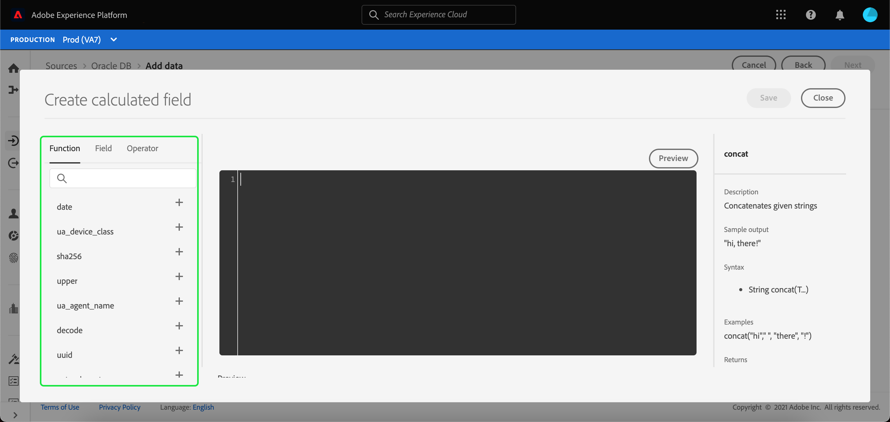

# Champs calculés

Les champs calculés permettent de créer des valeurs en fonction des attributs du schéma d’entrée. Ces valeurs peuvent ensuite être affectées à des attributs dans le schéma cible. Vous pouvez également leur fournir un nom et une description pour en faciliter la référence.

Pour créer un champ calculé, sélectionnez **[!UICONTROL Ajouter un champ calculé]**.

Le panneau **[!UICONTROL Créer un champ calculé]** sʼaffiche. La boîte de dialogue de gauche contient les champs, fonctions et opérateurs pris en charge dans les champs calculés. Sélectionnez lʼun des onglets pour commencer à ajouter des fonctions, des champs ou des opérateurs à lʼéditeur dʼexpression.

| Tabulation | Description |
| --- | ----------- |
| Fonction | Lʼonglet Fonctions répertorie les fonctions disponibles pour transformer les données. Pour en savoir plus sur les fonctions que vous pouvez utiliser dans les champs calculés, consultez le guide dʼ [utilisation des fonctions Data Prep (Mapper)](./functions.md). |
| Champ | Lʼonglet Champs répertorie les champs et attributs disponibles dans le schéma source. |
| Opérateur | Lʼonglet Opérateurs répertorie les opérateurs disponibles pour la transformation des données. |

Vous pouvez ajouter manuellement des champs, des fonctions et des opérateurs à lʼaide de lʼéditeur dʼexpression situé au centre. Sélectionnez lʼéditeur pour commencer à créer une expression.

Sélectionnez **[!UICONTROL Enregistrer]** pour continuer.

Lʼécran des mappings réapparaît avec le champ source que vous venez de créer. Appliquez le champ cible correspondant et sélectionnez **[!UICONTROL Terminer]** pour terminer le mapping.

