# Guide de l’interface utilisateur de la préparation des données

Ce document fournit des instructions sur l’utilisation des fonctions de préparation des données dans l’interface utilisateur d’Adobe Experience Platform pour mapper des fichiers CSV à un schéma XDM.

## Prise en main

Ce tutoriel nécessite une connaissance pratique des composants Platform suivants :

* [[!DNL Experience Data Model (XDM)] Système](../../xdm/home.md) : Le cadre normalisé par lequel Platform organise les données d’expérience client.
   * [Principes de base de la composition des schémas](../../xdm/schema/composition.md) : découvrez les blocs de création de base des schémas XDM, y compris les principes clés et les bonnes pratiques en matière de composition de schémas.
   * [Tutoriel sur l’éditeur de schémas](../../xdm/tutorials/create-schema-ui.md) : découvrez comment créer des schémas personnalisés à l’aide de l’interface utilisateur de l’éditeur de schémas.
* [Service d’identités](../../identity-service/home.md) : obtenez une meilleure compréhension des clients individuels et de leurs comportements en reliant les identités entre les appareils et les systèmes.
* [[!DNL Real-Time Customer Profile]](../../profile/home.md) : fournit un profil de consommateur unifié en temps réel, basé sur des données agrégées provenant de plusieurs sources.
* [Sources](../../sources/home.md) : Experience Platform permet d’ingérer des données provenant de diverses sources tout en vous offrant la possibilité de structurer, d’étiqueter et d’améliorer les données entrantes à l’aide des services de Platform.

## Détails du flux de données

>[!TIP]
>
>Vous pouvez accéder aux détails du flux de données en sélectionnant n’importe quelle source dans le catalogue des sources. Pour plus d’informations, consultez la [présentation des sources](../../sources/home.md).

Avant de pouvoir mapper vos données CSV à un schéma XDM, vous devez d’abord établir les détails de votre flux de données.

La page [!UICONTROL Détails du flux de données] vous permet de choisir si vous souhaitez ingérer vos données CSV dans un jeu de données cible existant ou un nouveau jeu de données cible. Un jeu de données existant est fourni avec un schéma cible préconfiguré pour mapper vos données, tandis qu’un nouveau jeu de données nécessite que vous sélectionniez un schéma existant, ou que vous créiez un nouveau schéma pour mapper vos données.

### Utiliser un jeu de données cible existant

Pour ingérer vos données CSV dans un jeu de données existant, sélectionnez **[!UICONTROL Jeu de données existant]**. Vous pouvez soit récupérer un jeu de données existant à l’aide de l’option de [!UICONTROL Recherche avancée], soit en faisant défiler la liste des jeux de données existants dans le menu déroulant.

Une fois un jeu de données sélectionné, donnez un nom à votre flux de données et une description facultative.

Au cours de ce processus, vous pouvez également activer les [!UICONTROL diagnostics d’erreur] et l’[!UICONTROL ingestion partielle]. Le [!UICONTROL diagnostic d’erreur] permet de générer un message d’erreur détaillé pour tout enregistrement erroné survenant dans votre flux de données, tandis que l’[!UICONTROL ingestion partielle] vous permet d’ingérer des données contenant des erreurs, jusqu’à un certain seuil que vous définissez manuellement. Pour plus d’informations, consultez la [présentation de l’ingestion par lots partiels](../../ingestion/batch-ingestion/partial.md).

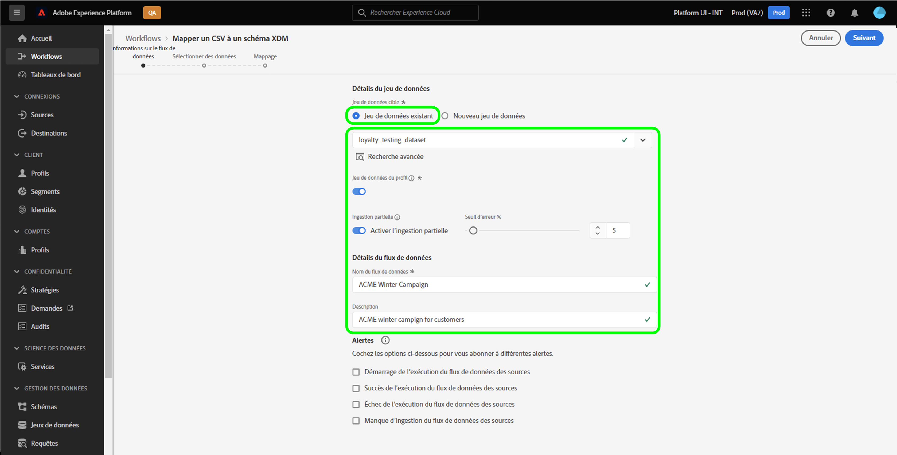

### Utiliser un nouveau jeu de données cible

Pour ingérer vos données CSV dans un nouveau jeu de données, sélectionnez **[!UICONTROL Nouveau jeu de données]** puis fournissez un nom de jeu de données de sortie et une description facultative. Sélectionnez ensuite un schéma à mapper à l’aide de l’option [!UICONTROL Recherche avancée] ou en faisant défiler la liste des schémas existants dans le menu déroulant.

Une fois le schéma sélectionné, donnez un nom à votre flux de données et une description facultative, puis appliquez les [!UICONTROL diagnostics d’erreur] et les paramètres d’[!UICONTROL ingestion partielle] que vous souhaitez pour votre flux de données. Lorsque vous avez terminé, sélectionnez **[!UICONTROL Suivant]**.

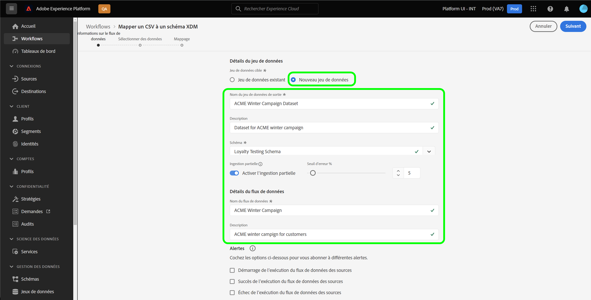

## Sélectionner les données

L’étape [!UICONTROL Sélectionner les données] apparaît, vous offrant une interface pour charger vos fichiers locaux et prévisualiser leur structure et leur contenu. Sélectionnez **[!UICONTROL Choisir les fichiers]** pour charger un fichier CSV à partir de votre système local. Vous pouvez également faire glisser et déposer le fichier CSV que vous souhaitez charger dans le panneau [!UICONTROL Glisser-déposer des fichiers].

>[!TIP]
>
>Seuls les fichiers CSV sont actuellement pris en charge par le chargement de fichiers locaux. La taille maximale de chaque fichier est de 1 Go.

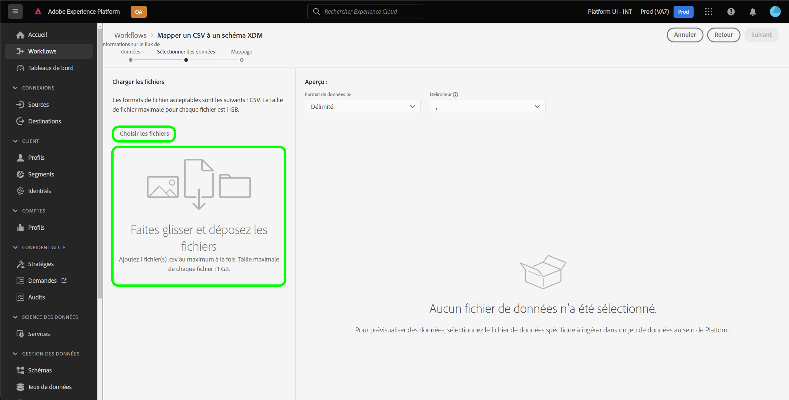

Une fois votre fichier chargé, l’interface de prévisualisation se met à jour pour afficher le contenu et la structure du fichier.

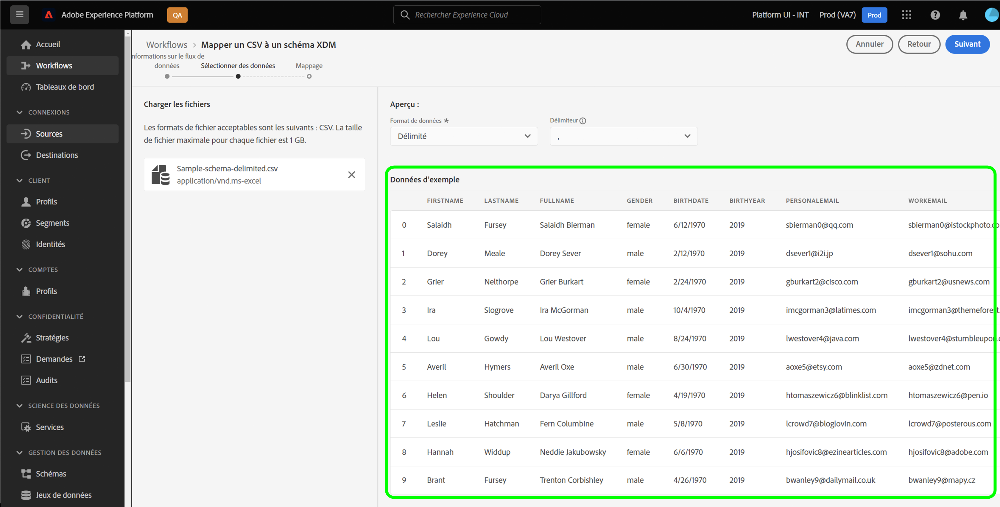

En fonction de votre fichier, vous pouvez sélectionner un délimiteur de colonne tel que des tabulations, des virgules, des barres verticales ou un délimiteur de colonne personnalisé pour vos données source. Sélectionnez la flèche déroulante **[!UICONTROL Délimiteur]**, puis sélectionnez le délimiteur approprié dans le menu.

Lorsque vous avez terminé, sélectionnez **[!UICONTROL Suivant]**.

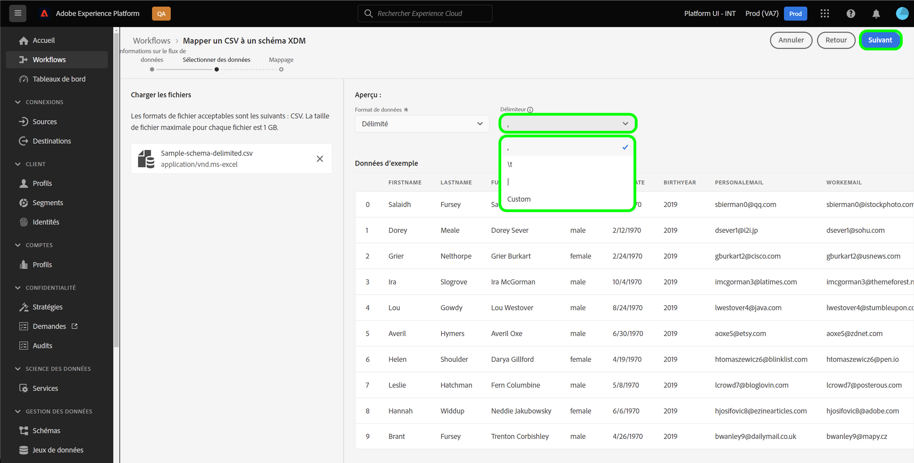

## Mappage

L’interface de **[!UICONTROL mappage]** vous fournit un outil complet pour mapper les champs source de votre schéma source à leurs champs XDM cibles appropriés dans le schéma cible.

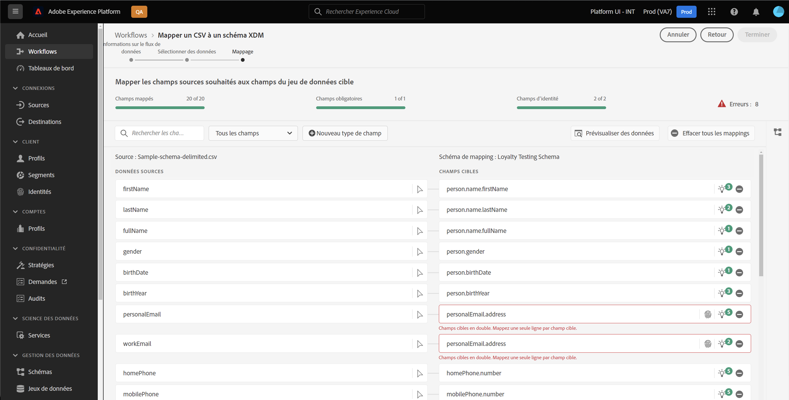

### Comprendre l’interface de mappage {#mapping-interface}

L’interface de mappage comprend un tableau de bord qui fournit des informations sur l’intégrité de vos champs de mappage dans le contexte du workflow d’ingestion. Le tableau de bord affiche les détails suivants concernant vos champs de mappage :

| Propriété | Description |
| --- | --- |
| [!UICONTROL Champs mappés] | Affiche le nombre total de champs sources qui ont été mappés à un champ XDM cible, quelles que soient les erreurs. |
| [!UICONTROL Champs obligatoires] | Affiche le nombre de champs de mappage obligatoires. |
| [!UICONTROL Champs d’identité] | Affiche le nombre total de champs de mappage définis comme identité. Ces champs de mappage sont représentés par une icône d’empreinte. |
| [!UICONTROL Erreurs] | Affiche le nombre de champs de mappage comportant des erreurs. |

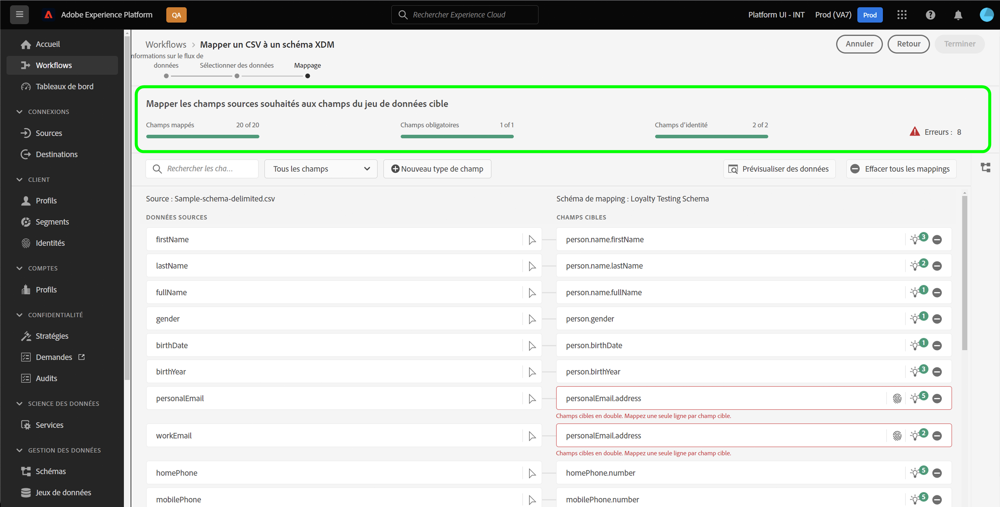

L’interface de mappage propose également un panneau d’options parmi lesquelles vous pouvez choisir afin de mieux interagir ou de filtrer les champs de mappage.

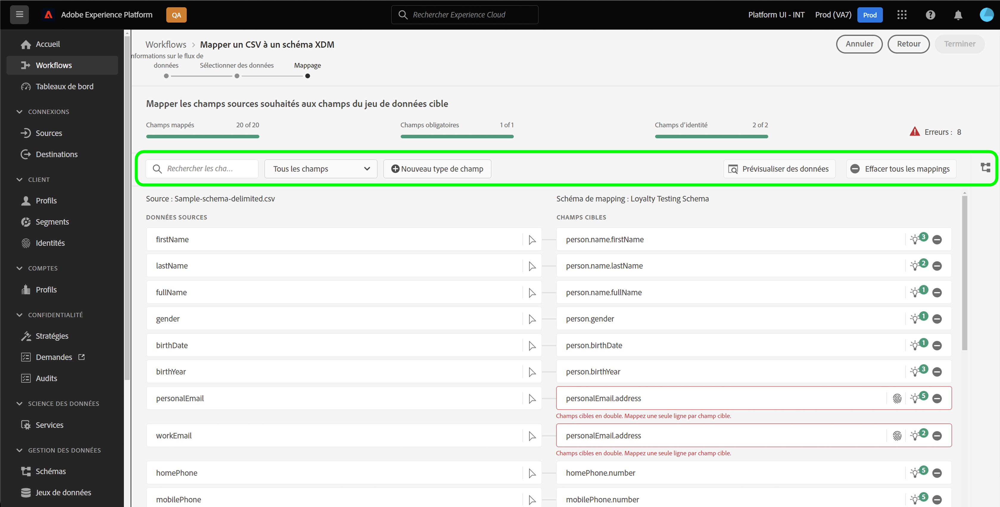

Pour rechercher un jeu de mappages particulier, sélectionnez **[!UICONTROL Rechercher les champs sources]** et saisissez le nom des données sources à isoler.

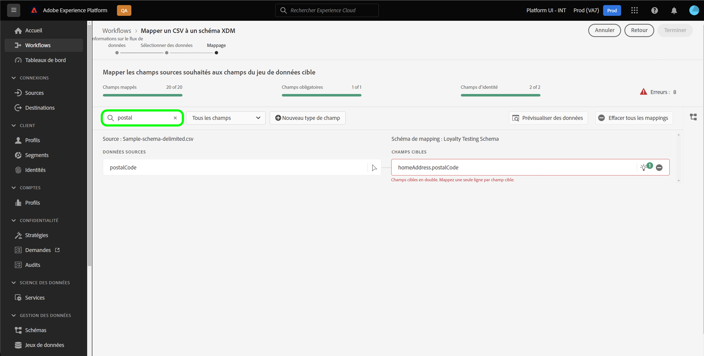

Sélectionnez **[!UICONTROL Tous les champs sources]** pour afficher un menu déroulant des options de filtrage afin de mieux préciser votre vue de l’interface de mappage.

Les options de filtrage sont les suivantes :

| Champs sources | Description |
| --- | --- |
| [!UICONTROL Tous les champs sources] | Cette option affiche tous les champs sources de votre schéma source. Cette option est affichée par défaut. |
| [!UICONTROL Champs obligatoires] | Cette option filtre le schéma source pour n’afficher que les champs nécessaires à la réalisation du mappage. |
| [!UICONTROL Champs d’identité] | Cette option filtre le schéma source pour n’afficher que les champs marqués pour l’identité. |
| [!UICONTROL Champs mappés] | Cette option filtre le schéma source pour n’afficher que les champs déjà mappés. |
| [!UICONTROL Champs non mappés] | Cette option filtre le schéma source pour n’afficher que les champs qui doivent encore être mappés. |
| [!UICONTROL Champs avec recommandation] | Cette option filtre le schéma source pour n’afficher que les champs contenant des recommandations de mappage. |

Sélectionnez **[!UICONTROL Champs comportant des erreurs]** pour afficher tous les champs de mappage contenant des erreurs.

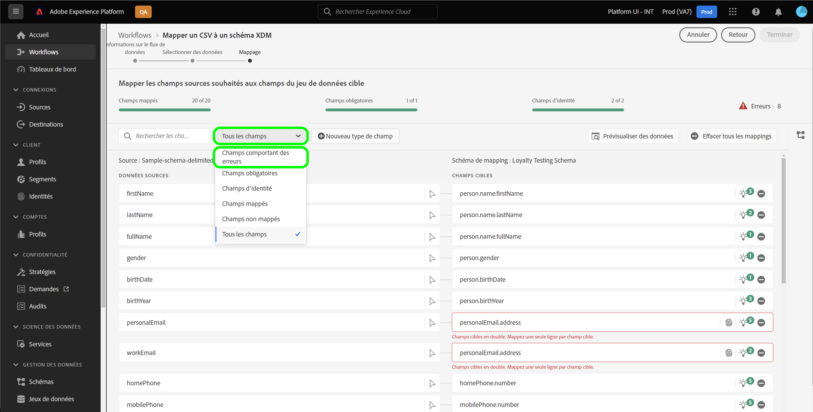

Une vue isolée des champs de mappage comportant des erreurs s’affiche, ce qui vous permet de corriger les erreurs par le biais de recommandations de mappage intelligent ou de l’arborescence de mappage manuel.

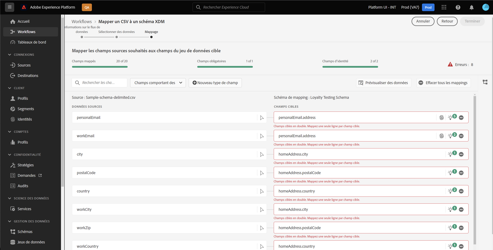

### Ajout d’un nouveau type de champ

Vous pouvez ajouter un nouveau champ de mappage ou un champ calculé en sélectionnant **[!UICONTROL Nouveau type de champ]**.

#### Nouveau champ de mappage

Pour ajouter un nouveau champ de mappage, sélectionnez **[!UICONTROL Nouveau type de champ]**, puis **[!UICONTROL Ajouter un nouveau champ]** dans le menu déroulant qui s’affiche.

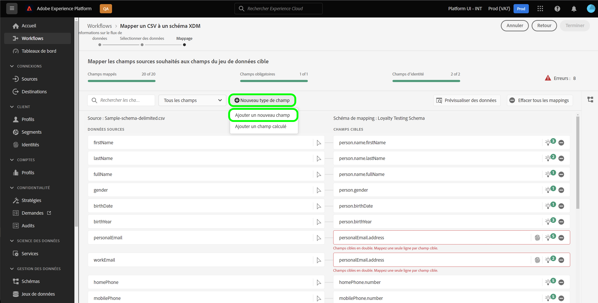

Sélectionnez ensuite le champ source que vous souhaitez ajouter dans l’arborescence du schéma source qui s’affiche, puis sélectionnez **[!UICONTROL Sélectionner]**.

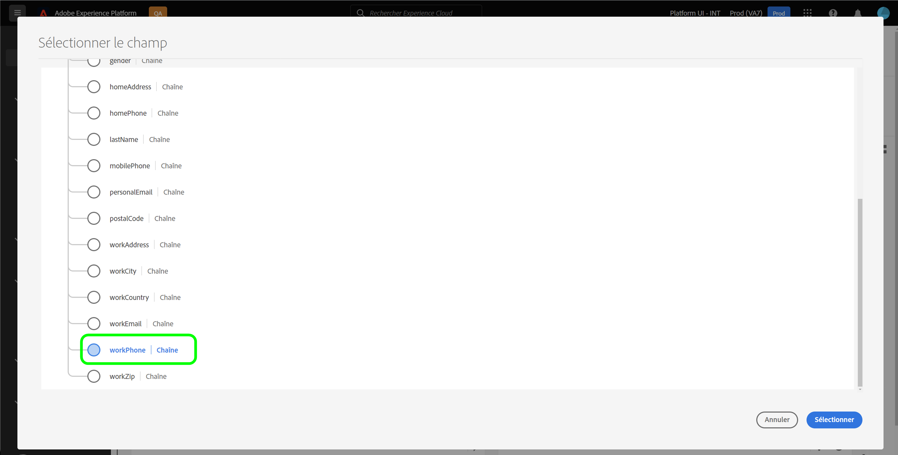

L’interface de mappage est mise à jour avec le champ source que vous avez sélectionné et un champ cible vide. Sélectionnez **[!UICONTROL Mapper le champ cible]** pour commencer à mapper le nouveau champ source à son champ XDM cible approprié.

Une arborescence de schéma cible interactive s’affiche, vous permettant de parcourir manuellement le schéma cible et de trouver le champ XDM cible approprié pour votre champ source.

Lorsque vous avez terminé, sélectionnez l’icône de schéma pour fermer l’interface du schéma cible.

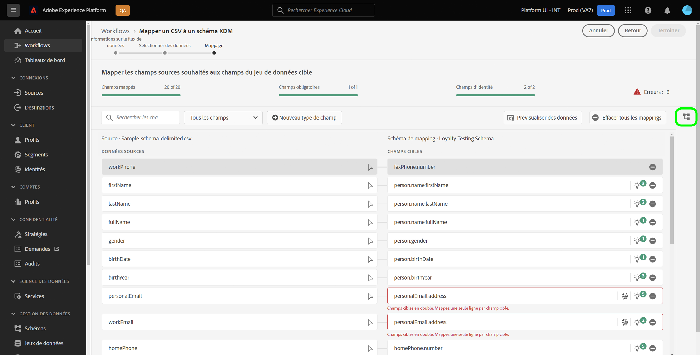

#### Champs calculés {#calculated-fields}

Les champs calculés permettent de créer des valeurs en fonction des attributs du schéma d’entrée. Ces valeurs peuvent ensuite être affectées à des attributs dans le schéma cible. Vous pouvez également leur fournir un nom et une description pour en faciliter la référence. La longueur maximale des champs calculés est de 4 096 caractères.

Pour créer un champ calculé, sélectionnez **[!UICONTROL Nouveau type de champ]**, puis **[!UICONTROL Ajouter un champ calculé]**.

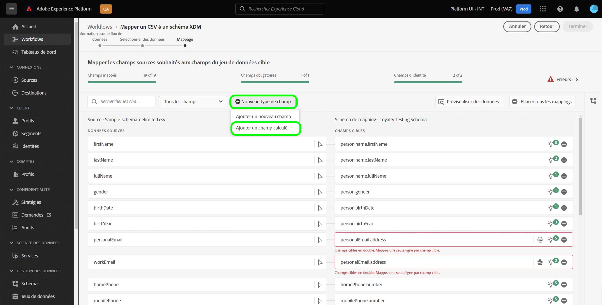

Le panneau **[!UICONTROL Créer un champ calculé]** sʼaffiche. La boîte de dialogue de gauche contient les champs, fonctions et opérateurs pris en charge dans les champs calculés. Sélectionnez lʼun des onglets pour commencer à ajouter des fonctions, des champs ou des opérateurs à lʼéditeur dʼexpression.

| Tabulation | Description |
| --- | ----------- |
| [!UICONTROL Fonction] | Lʼonglet Fonctions répertorie les fonctions disponibles pour transformer les données. Pour en savoir plus sur les fonctions que vous pouvez utiliser dans les champs calculés, consultez le guide dʼ [utilisation des fonctions Data Prep (Mapper)](../functions.md). |
| [!UICONTROL Champ] | Lʼonglet Champs répertorie les champs et attributs disponibles dans le schéma source. |
| [!UICONTROL Opérateur] | Lʼonglet Opérateurs répertorie les opérateurs disponibles pour la transformation des données. |

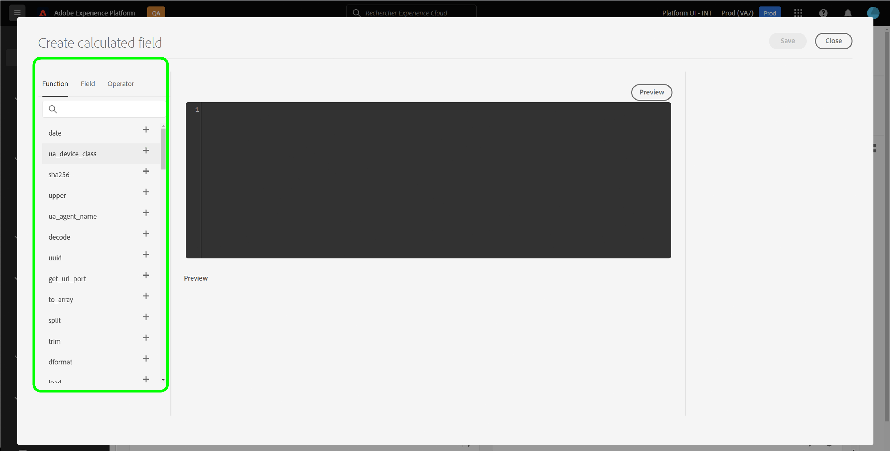

Vous pouvez ajouter manuellement des champs, des fonctions et des opérateurs à lʼaide de lʼéditeur dʼexpression situé au centre. Sélectionnez lʼéditeur pour commencer à créer une expression. Une fois que vous avez terminé, sélectionnez **[!UICONTROL Enregistrer]** pour continuer.

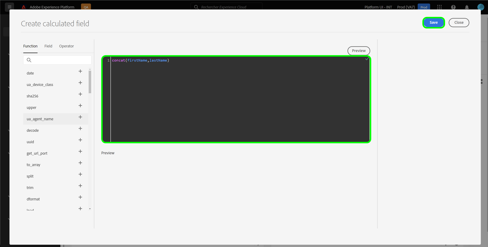

### Importer le mapping {#import}

Vous pouvez réutiliser le mappage d’un flux de données existant afin de réduire la durée de configuration manuelle de votre ingestion de données et de limiter les erreurs. Sélectionnez **[!UICONTROL Import mapping]** pour réutiliser un mapping existant.

La fenêtre [!UICONTROL Mappage d’importation] s’affiche, vous fournissant une liste de flux de données parmi lesquels choisir.

Sélectionnez l’icône d’aperçu pour prévisualiser le mappage du flux de données que vous avez sélectionné.

La fenêtre d’aperçu vous permet d’examiner le mappage existant avant de l’importer dans votre flux de données. Une fois que vous avez vérifié le mappage, vous pouvez sélectionner **[!UICONTROL Précédent]** pour revenir à la liste des flux de données et inspecter un autre ensemble de mappages, ou vous pouvez sélectionner **[!UICONTROL Sélectionner]** pour continuer.

Vous pouvez également sélectionner le mappage à importer dans la fenêtre de liste des flux de données. Sélectionnez le flux de données qui contient le mappage à importer, puis sélectionnez **[!UICONTROL Sélectionner]** pour continuer.

L’interface se met à jour avec le mappage que vous avez importé.

>[!NOTE]
>
>Tous les jeux de mappages existants que vous établissez ou que vous recommandez de mapper sont remplacés par le mappage que vous avez importé à partir d’un flux de données existant.

Sélectionnez **[!UICONTROL Prévisualiser des données]** pour afficher les résultats de mappage de 100 lignes maximum de données d’exemple du jeu de données sélectionné.

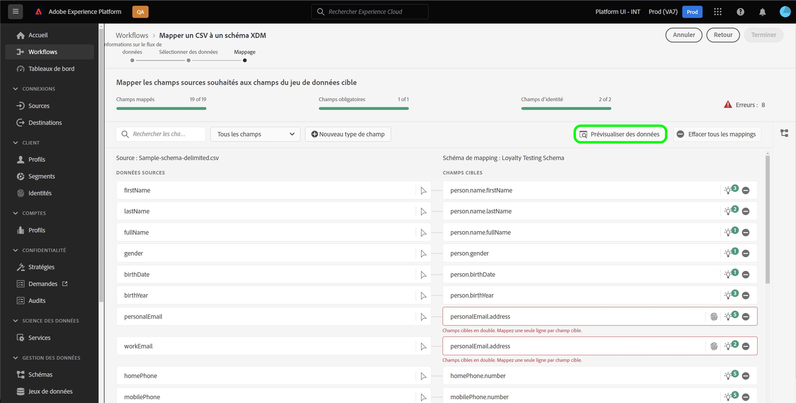

Lors de la prévisualisation, la colonne d’identité est considérée comme le premier champ, car il s’agit des informations clés nécessaires à la validation des résultats du mappage. Lorsque vous avez terminé, sélectionnez **[!UICONTROL Fermer]**.

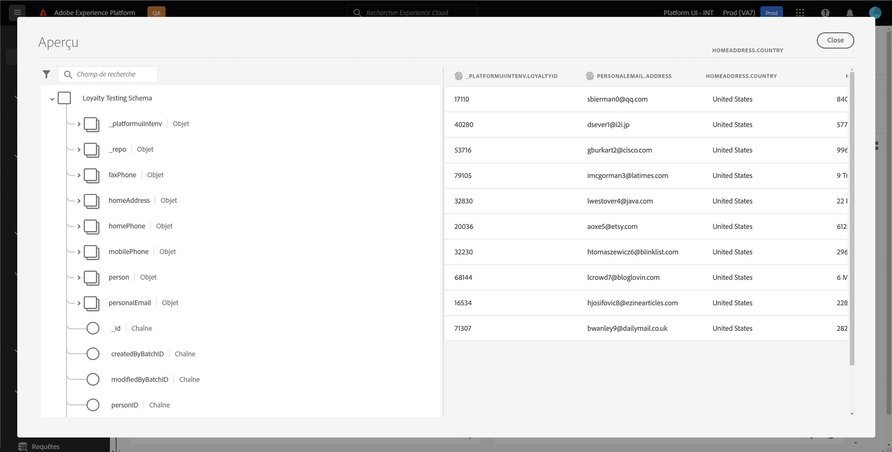

Pour supprimer tous les champs de mappage, sélectionnez **[!UICONTROL Effacer tous les mappages]**.

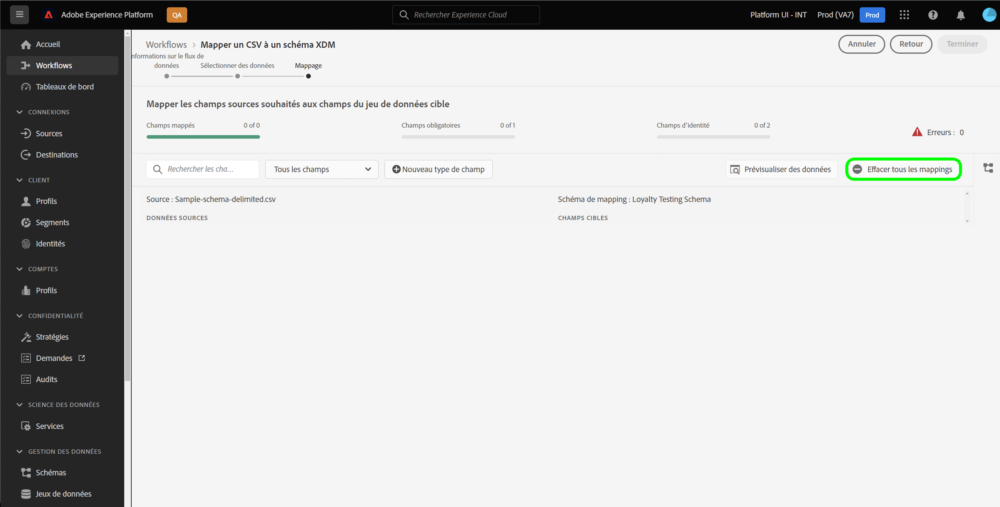

### Utilisation de lʼinterface de mappage

Platform fournit automatiquement des recommandations intelligentes pour les champs mappés automatiquement en fonction du schéma ou du jeu de données cible que vous avez sélectionné. Vous pouvez ajuster manuellement les règles de mappage en fonction de vos cas d’utilisation ou corriger les champs de mappage dupliqués afin d’effacer les erreurs.

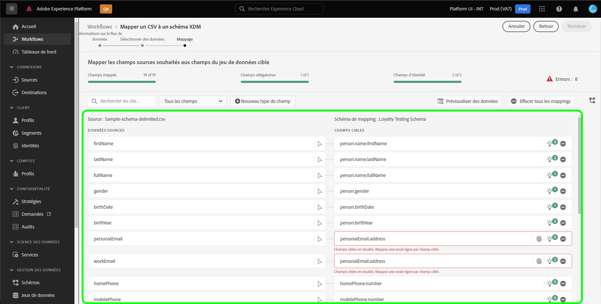

Sélectionnez l’icône en forme d’ampoule dans le champ cible que vous souhaitez ajuster.

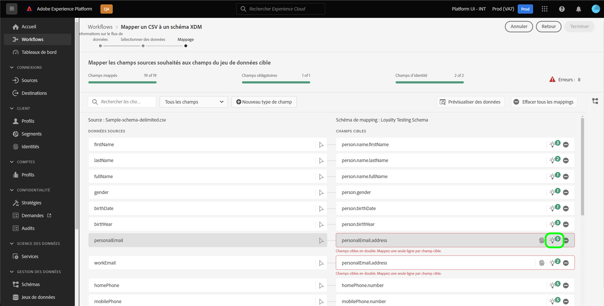

Le panneau contextuel des [!UICONTROL recommandations de mappage] apparaît, affichant une liste des champs cibles recommandés qui peuvent être mappés à un champ source particulier. Par défaut, la première recommandation est automatiquement appliquée.

Parfois, plusieurs recommandations sont disponibles pour le schéma source. Dans ce cas, la vignette de mappage affiche la recommandation dominante, suivie d’une icône contenant le nombre de recommandations supplémentaires disponibles. Si vous sélectionnez l’icône en forme d’ampoule, une liste des recommandations supplémentaires s’affiche. Vous pouvez choisir l’une des autres recommandations en cochant la case en regard de la recommandation que vous souhaitez mapper à la place.

À partir de là, vous pouvez modifier le champ cible sélectionné pour corriger une erreur ou répondre à votre cas d’utilisation.

Vous pouvez également sélectionner **[!UICONTROL Sélectionner manuellement]** pour utiliser manuellement l’arborescence interactive de mappage de schéma cible.

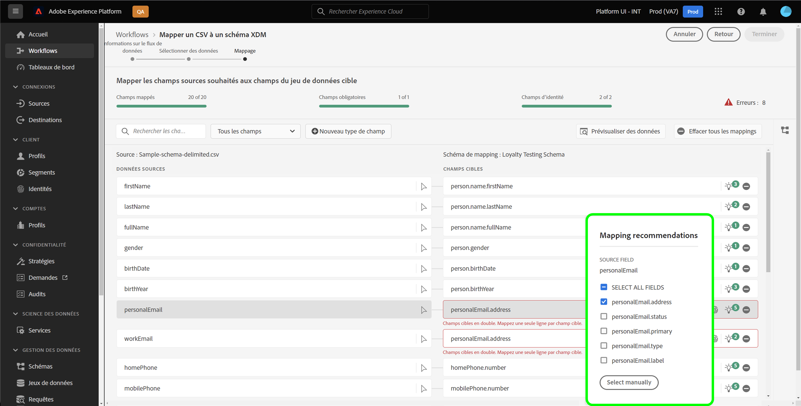

L’interface de mappage de schéma cible apparaît dans la même vue que vos champs de mappage, ce qui vous permet de modifier les paires de mappage dans le même écran. Sélectionnez le champ cible qui correspond à votre cas d’utilisation ou qui corrige vos erreurs.

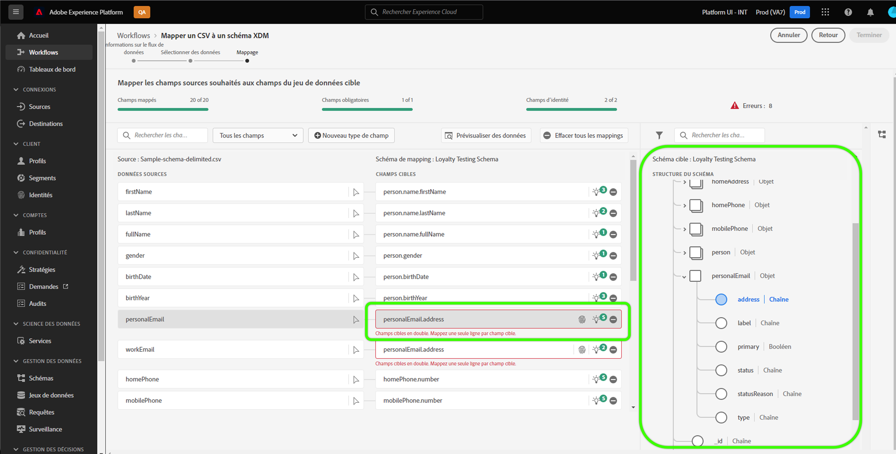

Lorsque vous avez terminé, sélectionnez **[!UICONTROL Terminer]** pour continuer.

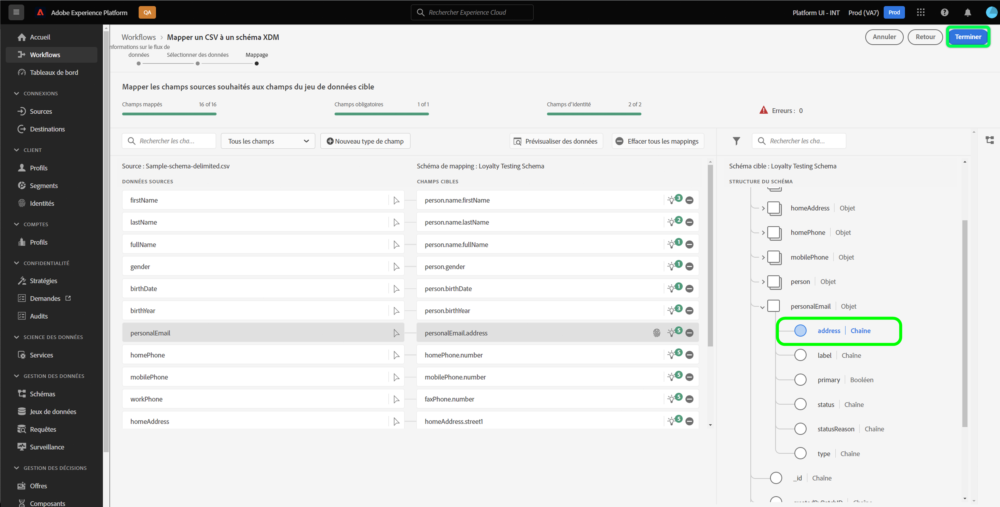

## Étapes suivantes

Grâce à la lecture de ce document, vous avez réussi à mapper un fichier CSV à un schéma XDM cible en utilisant l’interface de mappage dans l’interface utilisateur de Platform. Pour plus d’informations, consultez les documents suivants :

* [Présentation de la préparation des données](../home.md)
* [Présentation des sources](../../sources/home.md)
* [Surveillance des flux de données des sources dans l’interface utilisateur](../../dataflows/ui/monitor-sources.md)
