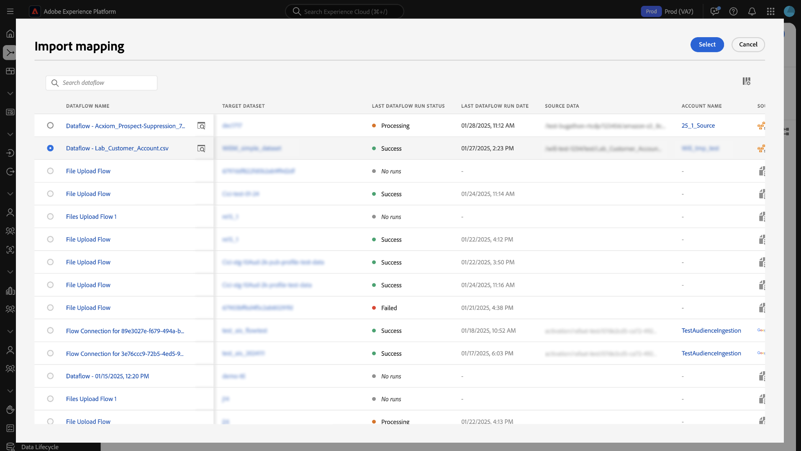
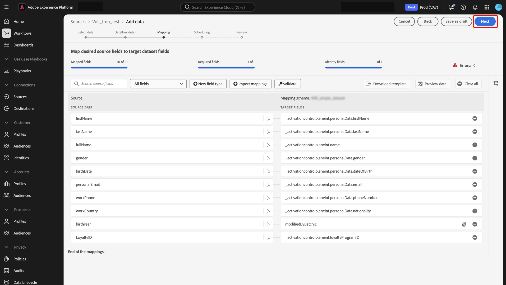

# Guide de l’interface utilisateur de la préparation des données {#data-prep-ui-guide}

>[!CONTEXTUALHELP]
>id="platform_data_prep_import_mapping"
>title="Télécharger le modèle"
>abstract="Téléchargez le modèle csv pour effectuer le mappage hors ligne."

Lisez ce guide pour savoir comment utiliser les fonctions de mappage [préparation des données](../home.md) dans l’interface utilisateur de Adobe Experience Platform pour mapper des fichiers CSV à un schéma [modèle de données d’expérience (XDM)](../../xdm/home.md).

## Commencer

Ce tutoriel nécessite une connaissance pratique des composants Experience Platform suivants :

* [[!DNL Experience Data Model (XDM)] Système](../../xdm/home.md) : Cadre normalisé selon lequel Experience Platform organise les données d’expérience client. 
   * [Principes de base de la composition des schémas](../../xdm/schema/composition.md) : découvrez les blocs de création de base des schémas XDM, y compris les principes clés et les bonnes pratiques en matière de composition de schémas.
   * [Tutoriel sur l’éditeur de schémas](../../xdm/tutorials/create-schema-ui.md) : découvrez comment créer des schémas personnalisés à l’aide de l’interface utilisateur de l’éditeur de schémas.
* [Service d’identités](../../identity-service/home.md) : obtenez une meilleure compréhension des clients individuels et de leurs comportements en reliant les identités entre les appareils et les systèmes.
* [[!DNL Real-Time Customer Profile]](../../profile/home.md) : fournit un profil de consommateur unifié en temps réel, basé sur des données agrégées provenant de plusieurs sources.
* [Sources](../../sources/home.md) : Experience Platform permet d’ingérer des données provenant de diverses sources tout en vous offrant la possibilité de structurer, d’étiqueter et d’améliorer les données entrantes à l’aide des services d’Experience Platform.

## Accès à l’interface de mappage dans l’interface utilisateur

Vous pouvez accéder à l’interface de mappage dans l’interface utilisateur par le biais de deux chemins différents.

1. Dans l’interface utilisateur d’Experience Platform, sélectionnez **[!UICONTROL Workflows]** dans le volet de navigation de gauche, puis sélectionnez **[!UICONTROL Map CSV to XDM schema]**. Indiquez ensuite les détails de votre flux de données et sélectionnez les données à ingérer. Lorsque vous avez terminé, vous accédez à l’interface de mappage dans laquelle vous pouvez configurer le mappage entre vos données source et un schéma XDM.
2. Vous pouvez également accéder à l’interface de mappage via l’espace de travail des sources.

## Mappage de fichiers CSV dans un schéma XDM

Utilisez l’interface de mappage et l’ensemble d’outils complet qu’elle fournit pour mapper les champs de données de votre schéma source à leurs champs XDM cibles appropriés dans le schéma cible.

### Comprendre l’interface de mappage {#mapping-interface}

Reportez-vous au tableau de bord en haut de l’interface pour plus d’informations sur l’intégrité de vos champs de mappage dans le contexte du workflow d’ingestion. Le tableau de bord affiche les détails suivants concernant vos champs de mappage :

| Propriété | Description |
| --- | --- |
| [!UICONTROL Mapped fields] | Affiche le nombre total de champs sources qui ont été mappés à un champ XDM cible, quelles que soient les erreurs. |
| [!UICONTROL Required fields] | Affiche le nombre de champs de mappage obligatoires. |
| [!UICONTROL Identity fields] | Affiche le nombre total de champs de mappage définis comme identité. Ces champs de mappage sont représentés par une icône d’empreinte. |
| [!UICONTROL Errors] | Affiche le nombre de champs de mappage comportant des erreurs. |

{style="table-layout:auto"}

Vous pouvez ensuite utiliser les options répertoriées dans l’en-tête pour mieux interagir ou filtrer les champs de mappage.

| Option | Description |
| --- | --- |
| [!UICONTROL Search source fields] | Utilisez la barre de recherche pour accéder à un champ source spécifique. |
| [!UICONTROL All fields] | Sélectionnez **[!UICONTROL All fields]** pour afficher un menu déroulant d’options pour filtrer vos mappages en fonction de . Les options de filtrage disponibles sont les suivantes :<ul><li>**[!UICONTROL Required fields]** : filtre l’interface pour n’afficher que les champs requis pour terminer le workflow.</li><li> **[!UICONTROL Identity fields]** : filtre l’interface pour n’afficher que les champs marqués comme identités.</li><li>**[!UICONTROL Mapped fields]** : filtre l’interface pour n’afficher que les champs déjà mappés.</li><li>**[!UICONTROL Unmapped fields]** : filtre l’interface pour n’afficher que les champs qui doivent encore être mappés.</li><li>**[!UICONTROL Fields with errors]** : filtre l’interface pour n’afficher que les champs comportant des erreurs.</li></ul> |
| [!UICONTROL New field type] | Sélectionnez **[!UICONTROL New field type]** pour ajouter un nouveau champ ou un champ calculé. Pour plus d’informations, consultez la section sur [l’ajout d’un nouveau type de champ](#add-a-new-field-type). |
| [!UICONTROL Import mappings] | Sélectionnez **[!UICONTROL Import mappings]** pour importer des mappages à partir d’un fichier ou d’un flux de données existant. Pour plus d’informations, consultez la section sur l’[importation de mappages](#import-mapping). |
| [!UICONTROL Validate] | Sélectionnez **[!UICONTROL Validate]** pour vérifier les erreurs dans vos mappages. |
| [!UICONTROL Download template] | Sélectionnez **[!UICONTROL Download template]** exporter et télécharger un fichier CSV de vos mappages. |
| [!UICONTROL Preview data] | Sélectionnez **[!UICONTROL Preview data]** pour utiliser le panneau d’aperçu et inspecter la structure et le contenu de votre jeu de données source. |
| [!UICONTROL Clear all] | Sélectionnez **[!UICONTROL Clear all]** pour supprimer tous les mappages de l’interface. |

{style="table-layout:auto"}

### Ajout d’un nouveau type de champ {#add-a-new-field-type}

Vous pouvez ajouter un nouveau champ de mappage ou un champ calculé en sélectionnant **[!UICONTROL New field type]**.

#### Nouveau champ de mappage

Pour ajouter un nouveau champ de mappage, sélectionnez **[!UICONTROL New field type]** , puis **[!UICONTROL Add new field]** dans le menu déroulant qui s’affiche.

Sélectionnez ensuite le champ source que vous souhaitez ajouter dans l’arborescence du schéma source qui s’affiche, puis sélectionnez **[!UICONTROL Select]**.

L’interface de mappage est mise à jour avec le champ source que vous avez sélectionné et un champ cible vide. Sélectionnez **[!UICONTROL Map target field]** pour commencer à mapper le nouveau champ source à son champ XDM cible approprié.

Une arborescence de schéma cible interactive s’affiche, vous permettant de parcourir manuellement le schéma cible et de trouver le champ XDM cible approprié pour votre champ source.

#### Champs calculés {#calculated-fields}

Les champs calculés permettent de créer des valeurs en fonction des attributs du schéma d’entrée. Ces valeurs peuvent ensuite être affectées à des attributs dans le schéma cible. Vous pouvez également leur fournir un nom et une description pour en faciliter la référence. La longueur maximale des champs calculés est de 4 096 caractères.

Pour créer un champ calculé, sélectionnez **[!UICONTROL New field type]** puis **[!UICONTROL Add calculated field]**

La fenêtre **[!UICONTROL Create calculated field]** s’affiche. Utilisez l’interface pour saisir vos champs calculés et reportez-vous à la boîte de dialogue à gauche pour les champs, fonctions et opérateurs pris en charge.

| Tabulation | Description |
| --- | ----------- |
| [!UICONTROL Function] | Lʼonglet Fonctions répertorie les fonctions disponibles pour transformer les données. Pour en savoir plus sur les fonctions que vous pouvez utiliser dans les champs calculés, consultez le guide dʼ [utilisation des fonctions Data Prep (Mapper)](../functions.md). |
| [!UICONTROL Field] | Lʼonglet Champs répertorie les champs et attributs disponibles dans le schéma source. |
| [!UICONTROL Operator] | Lʼonglet Opérateurs répertorie les opérateurs disponibles pour la transformation des données. |

Vous pouvez ajouter manuellement des champs, des fonctions et des opérateurs à lʼaide de lʼéditeur dʼexpression situé au centre. Sélectionnez lʼéditeur pour commencer à créer une expression. Une fois que vous avez terminé, sélectionnez **[!UICONTROL Save]** pour continuer.

### Importer le mapping {#import-mapping}

Vous pouvez réduire le temps de configuration manuelle de votre processus d’ingestion de données et limiter les erreurs à l’aide de la fonctionnalité de mappage d’importation de la préparation des données. Vous pouvez importer des mappages à partir d’un flux existant ou d’un fichier exporté.

>[!BEGINTABS]

>[!TAB Importer le mappage à partir du flux]

Si vous disposez de plusieurs flux de données basés sur des fichiers sources et des schémas cibles similaires, vous pouvez importer des mappages existants et les réutiliser pour de nouveaux flux de données.

Pour importer le mappage d’un flux de données existant, sélectionnez **[!UICONTROL Import mappings]** puis **[!UICONTROL Import mapping from flow]**.

Ensuite, utilisez la fenêtre pop-up pour localiser le flux de données dont vous souhaitez importer le mappage. Au cours de cette étape, vous pouvez également utiliser la fonction de recherche pour isoler un flux de données spécifique et récupérer ses mappages. Lorsque vous avez terminé, sélectionnez **[!UICONTROL Select]**.

>[!TAB Importer le mappage depuis un fichier]

Dans certains cas, vous devrez peut-être mettre en œuvre un grand nombre de mappages pour vos données. Vous pouvez le faire manuellement avec l’interface de mappage, mais vous pouvez également exporter votre modèle de mappage et configurer vos mappages dans une feuille de calcul hors ligne pour gagner du temps et éviter les délais d’expiration des utilisateurs sur Experience Platform.

Pour importer le mappage d’un fichier exporté, sélectionnez **[!UICONTROL Import mappings]** puis **[!UICONTROL Import mapping from file]**.

Ensuite, utilisez [!UICONTROL Upload template] fenêtre pour télécharger une copie CSV de vos mappages. Vous pouvez ensuite configurer vos mappages localement sur votre appareil, à l’aide de n’importe quel logiciel prenant en charge la modification des types de fichiers CSV. Au cours de cette étape, vous devez vous assurer que vous utilisez uniquement les champs fournis dans votre fichier source et votre schéma cible.

+++Sélectionner pour afficher un exemple de fichier de mappage exporté

+++

Lorsque vous avez terminé, sélectionnez **[!UICONTROL Upload file]** et sélectionnez le fichier csv mis à jour de vos mappages. Patientez quelques instants le temps que le système traite, puis sélectionnez **[!UICONTROL Done]**.

>[!ENDTABS]

Une fois vos mappages terminés, vous pouvez sélectionner **[!UICONTROL Finish]** et passer à l’étape suivante pour terminer votre flux de données.

>[!TIP]
>
>Une fois la création de vos mappages terminée, patientez jusqu’à 10 minutes avant de commencer l’ingestion des données. Cette période d’attente garantit que vos nouveaux mappages sont entièrement enregistrés et disponibles dans le système.

## Étapes suivantes

Vous pouvez désormais mapper un fichier CSV à un schéma XDM cible à l’aide de l’interface de mappage dans l’interface utilisateur d’Experience Platform. Pour plus d’informations, consultez les documents suivants :

* [Présentation de la préparation des données](../home.md)
* [Présentation des sources](../../sources/home.md)
* [Surveillance des flux de données des sources dans l’interface utilisateur](../../dataflows/ui/monitor-sources.md)
