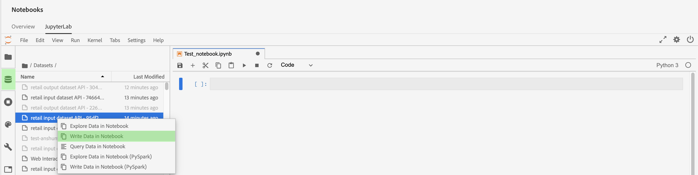

# Accès aux données dans les notebooks [!DNL Jupyterlab]

>[!NOTE]
>
>Le Workspace de science des données ne peut plus être acheté.
>
>Cette documentation est destinée aux clients existants disposant de droits antérieurs sur Data Science Workspace.

Chaque noyau pris en charge fournit des fonctionnalités intégrées qui vous permettent de lire les données d’Experience Platform à partir d’un jeu de données dans un notebook . Actuellement, JupyterLab dans Adobe Experience Platform Data Science Workspace prend en charge les notebooks pour [!DNL Python], R, PySpark et Scala. Toutefois, la prise en charge de la pagination des données se limite aux notebooks [!DNL Python] et R. Ce guide explique comment utiliser les notebooks JupyterLab pour accéder à vos données.

## Commencer

Avant de lire ce guide, veuillez consulter le [[!DNL JupyterLab] guide de l’utilisateur](./overview.md) pour une présentation détaillée du [!DNL JupyterLab] et de son rôle dans le Workspace de science des données.

## Limites de données des notebooks {#notebook-data-limits}

>[!IMPORTANT]
>
>Pour les notebooks PySpark et Scala si vous recevez une erreur avec la raison « Client RPC distant dissocié ». Cela signifie généralement que la mémoire du pilote ou de l’exécuteur est insuffisante. Essayez de passer [ mode « lot »](#mode) pour résoudre cette erreur.

Les informations suivantes définissent la quantité maximale de données pouvant être lues, le type de données utilisées et le délai estimé de lecture des données.

Pour [!DNL Python] et R, un serveur pour ordinateurs portables configuré à 40 Go de RAM a été utilisé pour les références. Pour PySpark et Scala, un cluster de briques de données configuré à 64 Go de RAM, 8 cœurs, 2 DBU avec un maximum de 4 travailleurs a été utilisé pour les références décrites ci-dessous.

La taille des données de schéma ExperienceEvent utilisées varie de mille (1K) lignes à un milliard (1B) de lignes. Notez que pour les mesures PySpark et [!DNL Spark], une période de 10 jours a été utilisée pour les données XDM.

Les données de schéma ad hoc ont été prétraitées à l’aide de [!DNL Query Service] Create Table as Select (CTAS). Ces données variaient également en taille à partir de mille (1K) lignes allant jusqu&#39;à un milliard (1B) lignes.

### Quand utiliser le mode batch ou interactif ? {#mode}

Lors de la lecture de jeux de données avec des notebooks PySpark et Scala, vous avez la possibilité d’utiliser le mode interactif ou le mode batch pour lire le jeu de données. L’interactif est conçu pour des résultats rapides, tandis que le mode batch est conçu pour les jeux de données volumineux.

- Pour les notebooks PySpark et Scala, le mode batch doit être utilisé lorsque 5 millions de lignes de données ou plus sont lues. Pour plus d’informations sur l’efficacité de chaque mode, consultez les tableaux des limites de données [PySpark](#pyspark-data-limits) ou [Scala](#scala-data-limits) ci-dessous.

### [!DNL Python] des limites de données des notebooks

**Schéma XDM ExperienceEvent :** vous devriez être en mesure de lire un maximum de 2 millions de lignes (environ 6,1 Go de données sur le disque) de données XDM en moins de 22 minutes. L’ajout de lignes supplémentaires peut entraîner des erreurs.

| Nombre de lignes | 1 000 | 10 000 | 100 000 | 1M | 2 M |
| ----------------------- | ------ | ------ | ----- | ----- | ----- |
| Taille sur le disque (Mo) | 18,73 | 187,5 | 308 | 3000 | 6050 |
| SDK (en secondes) | 20,3 | 86,8 | 63 | 659 | 1315 |

**schéma ad hoc :** vous devriez être en mesure de lire un maximum de 5 millions de lignes (~5,6 Go de données sur le disque) de données non XDM (ad hoc) en moins de 14 minutes. L’ajout de lignes supplémentaires peut entraîner des erreurs.

| Nombre de lignes | 1 000 | 10 000 | 100 000 | 1M | 2 M | 3 MOIS | 5M |
| ----------------------- | ------- | ------- | ----- | ----- | ----- | ----- | ------ |
| Taille sur le disque (en Mo) | 1,21 | 11,72 | 115 | 1120 | 2250 | 3380 | 5630 |
| SDK (en secondes) | 7,27 | 9,04 | 27,3 | 180 | 346 | 487 | 819 |

### Limites de données des notebooks R

**Schéma XDM ExperienceEvent :** vous devriez être en mesure de lire un maximum de 1 million de lignes de données XDM (3 Go de données sur le disque) en moins de 13 minutes.

| Nombre de lignes | 1 000 | 10 000 | 100 000 | 1M |
| ----------------------- | ------ | ------ | ----- | ----- |
| Taille sur le disque (Mo) | 18,73 | 187,5 | 308 | 3000 |
| Noyau R (en secondes) | 14,03 | 69,6 | 86,8 | 775 |

**schéma ad hoc :** vous devriez être en mesure de lire un maximum de 3 millions de lignes de données ad hoc (données 293MB sur le disque) en 10 minutes environ.

| Nombre de lignes | 1 000 | 10 000 | 100 000 | 1M | 2 M | 3 MOIS |
| ----------------------- | ------- | ------- | ----- | ----- | ----- | ----- |
| Taille sur le disque (en Mo) | 0,082 | 0,612 | 9.0 | 91 | 188 | 293 |
| R SDK (en sec) | 7,7 | 4,58 | 35,9 | 233 | 470,5 | 603 |

### Limites de données des notebooks PySpark (noyau [!DNL Python]) : {#pyspark-data-limits}

**Schéma XDM ExperienceEvent :** en mode interactif, vous devriez être en mesure de lire un maximum de 5 millions de lignes (environ 13,42 Go de données sur le disque) de données XDM en 20 minutes environ. Le mode interactif ne prend en charge que 5 millions de lignes au maximum. Si vous souhaitez lire des jeux de données plus volumineux, il est suggéré de passer en mode batch. En mode batch, vous devriez être en mesure de lire un maximum de 500 millions de lignes (environ 1,31 To de données sur le disque) de données XDM en environ 14 heures.

| Nombre de lignes | 1 000 | 10 000 | 100 000 | 1M | 2 M | 3 MOIS | 5M | 10M | 50M | 100 M | 500 M |
|-------------------------|--------|--------|-------|-------|-------|-------|---------|---------|----------|--------|--------|
| Taille sur le disque | 2,93 MO | 4,38 MO | 29,02 | 2,69 GO | 5,39 Go | 8,09 Go | 13,42 Go | 26,82 Go | 134,24 Go | 268,39 Go | 1,31 To |
| SDK (mode interactif) | 33 s | 32,4 s | 55.1s | 253,5 s | 489,2 s | 729.6s | 1206.8s | - | - | - | - |
| SDK (mode batch) | 815.8s | 492.8s | 379.1s | 637,4s | 624,5 s | 869,2s | 1104.1s | 1786 s | 5387.2s | 10624.6s | 50547 |

**schéma ad hoc :** en mode interactif, vous devriez être en mesure de lire un maximum de 5 millions de lignes (environ 5,36 Go de données sur le disque) de données non XDM en moins de 3 minutes. En mode Lot, vous devriez être en mesure de lire un maximum de 1 milliard de lignes (environ 1,05 To de données sur le disque) de données non XDM en environ 18 minutes.

| Nombre de lignes | 1 000 | 10 000 | 100 000 | 1M | 2 M | 3 MOIS | 5M | 10M | 50M | 100 M | 500 M | 1B |
|--------------|--------|---------|---------|-------|-------|-------|--------|--------|---------|--------|---------|-------|
| Taille Sur Le Disque | 1,12 MO | 11,24 Mo | 109,48 Mo | 2,69 GO | 2,14 GO | 3,21 GO | 5,36 GO | 10,71 Go | 53,58 Go | 107,52 Go | 535,88 Go | 1,05 To |
| Mode interactif de SDK (en secondes) | 28,2 s | 18,6 s | 20.8s | 20.9s | 23,8 s | 21,7 s | 24,7 s | - | - | - | - | - |
| Mode batch SDK (en secondes) | 428.8s | 578.8s | 641,4 s | 538,5 s | 630.9s | 467.3s | 411s | 675 s | 702 s | 719,2 s | 1022.1s | 1122.3s |

### Limites de données des notebooks [!DNL Spark] (noyau Scala) : {#scala-data-limits}

**Schéma XDM ExperienceEvent :** en mode interactif, vous devriez être en mesure de lire un maximum de 5 millions de lignes (environ 13,42 Go de données sur le disque) de données XDM en 18 minutes environ. Le mode interactif ne prend en charge que 5 millions de lignes au maximum. Si vous souhaitez lire des jeux de données plus volumineux, il est suggéré de passer en mode batch. En mode batch, vous devriez être en mesure de lire un maximum de 500 millions de lignes (environ 1,31 To de données sur le disque) de données XDM en environ 14 heures.

| Nombre de lignes | 1 000 | 10 000 | 100 000 | 1M | 2 M | 3 MOIS | 5M | 10M | 50M | 100 M | 500 M |
|---------------|--------|--------|-------|-------|-------|-------|---------|---------|----------|--------|--------|
| Taille Sur Le Disque | 2,93 MO | 4,38 MO | 29,02 | 2,69 GO | 5,39 Go | 8,09 Go | 13,42 Go | 26,82 Go | 134,24 Go | 268,39 Go | 1,31 To |
| Mode interactif de SDK (en secondes) | 37,9 s | 22,7 s | 45,6 s | 231,7 s | 444,7 s | 660.6s | 1100s | - | - | - | - |
| Mode batch SDK (en secondes) | 374,4 s | 398,5 s | 527 s | 487,9 s | 588.9s | 829 s | 939.1s | 1441s | 5473.2s | 10118,8 | 49207,6 |

**schéma ad hoc :** en mode interactif, vous devriez être en mesure de lire un maximum de 5 millions de lignes (environ 5,36 Go de données sur le disque) de données non XDM en moins de 3 minutes. En mode batch, vous devriez être en mesure de lire un maximum de 1 milliard de lignes (environ 1,05 To de données sur le disque) de données non XDM en environ 16 minutes.

| Nombre de lignes | 1 000 | 10 000 | 100 000 | 1M | 2 M | 3 MOIS | 5M | 10M | 50M | 100 M | 500 M | 1B |
|--------------|--------|---------|---------|-------|-------|-------|---------|---------|---------|--------|---------|-------|
| Taille Sur Le Disque | 1,12 MO | 11,24 Mo | 109,48 Mo | 2,69 GO | 2,14 GO | 3,21 GO | 5,36 GO | 10,71 Go | 53,58 Go | 107,52 Go | 535,88 Go | 1,05 To |
| Mode interactif de SDK (en secondes) | 35,7 s | 31 s | 19,5 s | 25.3s | 23 s | 33,2 s | 25,5 s | - | - | - | - | - |
| Mode batch SDK (en secondes) | 448.8s | 459,7 s | 519s | 475.8s | 599.9s | 347,6 s | 407.8s | 397 s | 518.8s | 487,9 s | 760,2 s | 975,4 s |

## Notebooks Python {#python-notebook}

[!DNL Python] notebooks vous permettent de paginer les données lors de l’accès aux jeux de données. L’exemple de code pour lire les données avec et sans pagination est illustré ci-dessous. Pour plus d’informations sur les notebooks Python de démarrage disponibles, consultez la section [[!DNL JupyterLab] Launcher](./overview.md#launcher) dans le guide d’utilisation de JupyterLab.

La documentation Python ci-dessous décrit les concepts suivants :

- [Lecture à partir d’un jeu de données](#python-read-dataset)
- [Écrire dans un jeu de données](#write-python)
- [Données de requête](#query-data-python)
- [Filtrage des données ExperienceEvent](#python-filter)

### Lecture à partir d&#39;un jeu de données en Python {#python-read-dataset}

**Sans pagination :**

L’exécution du code suivant lit le jeu de données complet. Si l’exécution est réussie, les données sont enregistrées sous la forme d’un cadre de données pandas référencé par la variable `df`.

```python
# Python

from platform_sdk.dataset_reader import DatasetReader
dataset_reader = DatasetReader(get_platform_sdk_client_context(), dataset_id="{DATASET_ID}")
df = dataset_reader.read()
df.head()
```

**Avec pagination :**

L’exécution du code suivant lit les données du jeu de données spécifié. La pagination est obtenue en limitant et en décalant les données à l’aide des fonctions `limit()` et `offset()` respectivement. La limitation des données fait référence au nombre maximal de points de données à lire, tandis que le décalage fait référence au nombre de points de données à ignorer avant la lecture des données. Si l’opération de lecture s’exécute correctement, les données sont enregistrées sous la forme d’un cadre de données pandas référencé par la variable `df`.

```python
# Python

from platform_sdk.dataset_reader import DatasetReader

dataset_reader = DatasetReader(get_platform_sdk_client_context(), dataset_id="{DATASET_ID}")
df = dataset_reader.limit(100).offset(10).read()
```

### Écrire dans un jeu de données en Python {#write-python}

Pour écrire dans un jeu de données dans votre notebook JupyterLab, sélectionnez l’onglet Icône de données (mis en surbrillance ci-dessous) dans le volet de navigation de gauche de JupyterLab. Les répertoires **[!UICONTROL Datasets]** et **[!UICONTROL Schemas]** s’affichent. Sélectionnez **[!UICONTROL Datasets]** puis cliquez avec le bouton droit de la souris. Sélectionnez ensuite l’option **[!UICONTROL Write Data in Notebook]** dans le menu déroulant du jeu de données que vous souhaitez utiliser. Une entrée de code exécutable s’affiche au bas de votre notebook.



- Utilisez **[!UICONTROL Write Data in Notebook]** pour générer une cellule d’écriture avec le jeu de données sélectionné.
- Utilisez **[!UICONTROL Explore Data in Notebook]** pour générer une cellule de lecture avec le jeu de données sélectionné.
- Utilisez **[!UICONTROL Query Data in Notebook]** pour générer une cellule de requête de base avec le jeu de données sélectionné.

Vous pouvez également copier et coller la cellule de code suivante. Remplacez les `{DATASET_ID}` et les `{PANDA_DATAFRAME}`.

```python
from platform_sdk.models import Dataset
from platform_sdk.dataset_writer import DatasetWriter

dataset = Dataset(get_platform_sdk_client_context()).get_by_id(dataset_id="{DATASET_ID}")
dataset_writer = DatasetWriter(get_platform_sdk_client_context(), dataset)
write_tracker = dataset_writer.write({PANDA_DATAFRAME}, file_format='json')
```

### Interroger des données à l’aide de [!DNL Query Service] dans [!DNL Python] {#query-data-python}

[!DNL JupyterLab] sur [!DNL Experience Platform] vous permet d’utiliser SQL dans un notebook [!DNL Python] pour accéder aux données via [Adobe Experience Platform Query Service](https://experienceleague.adobe.com/docs/experience-platform/query/home.html?lang=fr). L’accès aux données par le biais de [!DNL Query Service] peut s’avérer utile pour la gestion de jeux de données volumineux grâce à ses temps d’exécution plus performants. Notez que l’interrogation de données à l’aide de [!DNL Query Service] est limitée à dix minutes de traitement.

Avant d’utiliser [!DNL Query Service] dans [!DNL JupyterLab], assurez-vous de bien comprendre le fonctionnement de la syntaxe SQL de [[!DNL Query Service] ](https://experienceleague.adobe.com/docs/experience-platform/query/sql/syntax.html?lang=fr).

L’interrogation de données à l’aide de [!DNL Query Service] nécessite que vous fournissiez le nom du jeu de données cible. Vous pouvez générer les cellules de code nécessaires en recherchant le jeu de données souhaité à l’aide de l’**[!UICONTROL Data explorer]** . Cliquez avec le bouton droit sur la liste des jeux de données et cliquez sur **[!UICONTROL Query Data in Notebook]** pour générer deux cellules de code dans votre notebook. Ces deux cellules sont décrites plus en détail ci-dessous.


Pour utiliser [!DNL Query Service] dans [!DNL JupyterLab], vous devez d’abord créer une connexion entre votre notebook [!DNL Python] de travail et [!DNL Query Service]. Pour ce faire, exécutez la première cellule générée.

```python
qs_connect()
```

Dans la seconde cellule générée, la première ligne doit être définie avant la requête SQL. Par défaut, la cellule générée définit une variable facultative (`df0`) qui enregistre les résultats des requêtes sous la forme d’un cadre de données pandas. <br>L’argument `-c QS_CONNECTION` est obligatoire et indique au noyau d’exécuter la requête SQL sur [!DNL Query Service]. Consultez l’[annexe](#optional-sql-flags-for-query-service) pour obtenir une liste d’arguments supplémentaires.

```python
%%read_sql df0 -c QS_CONNECTION
SELECT *
FROM name_of_the_dataset
LIMIT 10
/* Querying table "name_of_the_dataset" (datasetId: {DATASET_ID})*/
```

Vous pouvez référencer les variables Python directement dans une requête SQL en utilisant une syntaxe au format chaîne et en mettant les variables entre accolades (`{}`), comme indiqué dans l’exemple suivant :

```python
table_name = 'name_of_the_dataset'
table_columns = ','.join(['col_1','col_2','col_3'])
```

```python
%%read_sql demo -c QS_CONNECTION
SELECT {table_columns}
FROM {table_name}
```

### Filtrer [!DNL ExperienceEvent] données {#python-filter}

Pour accéder à un jeu de données [!DNL ExperienceEvent] et le filtrer dans un notebook [!DNL Python], vous devez fournir l’identifiant du jeu de données (`{DATASET_ID}`) ainsi que les règles de filtrage qui définissent une période spécifique à l’aide d’opérateurs logiques. Lorsqu’un intervalle de temps est défini, toute pagination spécifiée est ignorée et le jeu de données complet est pris en compte.

Une liste d’opérateurs de filtrage est décrite ci-dessous :

- `eq()` : égal à
- `gt()` : supérieur à
- `ge()` : supérieur ou égal à
- `lt()` : inférieur à
- `le()` : inférieur ou égal à
- `And()` : opérateur ET logique
- `Or()` : opérateur OU logique

La cellule suivante filtre un jeu de données [!DNL ExperienceEvent] sur les données existant exclusivement entre le 1er janvier 2019 et la fin du 31 décembre 2019.

```python
# Python

from platform_sdk.dataset_reader import DatasetReader

dataset_reader = DatasetReader(get_platform_sdk_client_context(), dataset_id="{DATASET_ID}")
df = dataset_reader.\
    where(dataset_reader["timestamp"].gt("2019-01-01 00:00:00").\
    And(dataset_reader["timestamp"].lt("2019-12-31 23:59:59"))\
).read()
```

## Notebooks R {#r-notebooks}

Les notebooks R vous permettent de paginer les données lors de l’accès aux jeux de données. L’exemple de code pour lire les données avec et sans pagination est illustré ci-dessous. Pour plus d’informations sur les notebooks starter R disponibles, consultez la section [[!DNL JupyterLab] Launcher](./overview.md#launcher) dans le guide d’utilisation de JupyterLab.

La documentation en R ci-dessous présente les concepts suivants :

- [Lecture à partir d’un jeu de données](#r-read-dataset)
- [Écrire dans un jeu de données](#write-r)
- [Filtrage des données ExperienceEvent](#r-filter)

### Lecture à partir d’un jeu de données dans R {#r-read-dataset}

**Sans pagination :**

L’exécution du code suivant lit le jeu de données complet. Si l’exécution est réussie, les données sont enregistrées sous la forme d’un cadre de données pandas référencé par la variable `df0`.

```R
# R

library(reticulate)
use_python("/usr/local/bin/ipython")
psdk <- import("platform_sdk")
datetime <- import("datetime", convert = FALSE)
py_run_file("~/.ipython/profile_default/startup/platform_sdk_context.py")
DatasetReader <- psdk$dataset_reader$DatasetReader
dataset_reader <- DatasetReader(py$get_platform_sdk_client_context(), dataset_id="{DATASET_ID}")
df0 <- dataset_reader$read()
head(df0)
```

**Avec pagination :**

L’exécution du code suivant lit les données du jeu de données spécifié. La pagination est obtenue en limitant et en décalant les données à l’aide des fonctions `limit()` et `offset()` respectivement. La limitation des données fait référence au nombre maximal de points de données à lire, tandis que le décalage fait référence au nombre de points de données à ignorer avant la lecture des données. Si l’opération de lecture s’exécute correctement, les données sont enregistrées sous la forme d’un cadre de données pandas référencé par la variable `df0`.

```R
# R

library(reticulate)
use_python("/usr/local/bin/ipython")
psdk <- import("platform_sdk")
datetime <- import("datetime", convert = FALSE)
py_run_file("~/.ipython/profile_default/startup/platform_sdk_context.py")

DatasetReader <- psdk$dataset_reader$DatasetReader
dataset_reader <- DatasetReader(py$get_platform_sdk_client_context(), dataset_id="{DATASET_ID}") 
df0 <- dataset_reader$limit(100L)$offset(10L)$read()
```

### Écrire dans un jeu de données dans R {#write-r}

Pour écrire dans un jeu de données dans votre notebook JupyterLab, sélectionnez l’onglet Icône de données (mis en surbrillance ci-dessous) dans le volet de navigation de gauche de JupyterLab. Les répertoires **[!UICONTROL Datasets]** et **[!UICONTROL Schemas]** s’affichent. Sélectionnez **[!UICONTROL Datasets]** puis cliquez avec le bouton droit de la souris. Sélectionnez ensuite l’option **[!UICONTROL Write Data in Notebook]** dans le menu déroulant du jeu de données que vous souhaitez utiliser. Une entrée de code exécutable s’affiche au bas de votre notebook.


- Utilisez **[!UICONTROL Write Data in Notebook]** pour générer une cellule d’écriture avec le jeu de données sélectionné.
- Utilisez **[!UICONTROL Explore Data in Notebook]** pour générer une cellule de lecture avec le jeu de données sélectionné.

Vous pouvez également copier et coller la cellule de code suivante :

```R
psdk <- import("platform_sdk")
dataset <- psdk$models$Dataset(py$get_platform_sdk_client_context())$get_by_id(dataset_id="{DATASET_ID}")
dataset_writer <- psdk$dataset_writer$DatasetWriter(py$get_platform_sdk_client_context(), dataset)
write_tracker <- dataset_writer$write(df, file_format='json')
```

### Filtrer [!DNL ExperienceEvent] données {#r-filter}

Pour accéder à un jeu de données [!DNL ExperienceEvent] et le filtrer dans un notebook R, vous devez fournir l’identifiant du jeu de données (`{DATASET_ID}`) ainsi que les règles de filtrage qui définissent une période spécifique à l’aide d’opérateurs logiques. Lorsqu’un intervalle de temps est défini, toute pagination spécifiée est ignorée et le jeu de données complet est pris en compte.

Une liste d’opérateurs de filtrage est décrite ci-dessous :

- `eq()` : égal à
- `gt()` : supérieur à
- `ge()` : supérieur ou égal à
- `lt()` : inférieur à
- `le()` : inférieur ou égal à
- `And()` : opérateur ET logique
- `Or()` : opérateur OU logique

La cellule suivante filtre un jeu de données [!DNL ExperienceEvent] sur les données existant exclusivement entre le 1er janvier 2019 et la fin du 31 décembre 2019.

```R
# R

library(reticulate)
use_python("/usr/local/bin/ipython")
psdk <- import("platform_sdk")
datetime <- import("datetime", convert = FALSE)
py_run_file("~/.ipython/profile_default/startup/platform_sdk_context.py")

client_context <- py$PLATFORM_SDK_CLIENT_CONTEXT
DatasetReader <- psdk$dataset_reader$DatasetReader
dataset_reader <- DatasetReader(py$get_platform_sdk_client_context(), dataset_id="{DATASET_ID}") 

df0 <- dataset_reader$
    where(dataset_reader["timestamp"]$gt("2019-01-01 00:00:00")$
    And(dataset_reader["timestamp"]$lt("2019-12-31 23:59:59"))
)$read()
```

## PySpark 3 notebooks {#pyspark-notebook}

La documentation de PySpark ci-dessous décrit les concepts suivants :

- [Initialiser sparkSession](#spark-initialize)
- [Lecture et écriture de données](#magic)
- [Créer un Dataframe local](#pyspark-create-dataframe)
- [Filtrage des données ExperienceEvent](#pyspark-filter-experienceevent)

### Initialisation de sparkSession {#spark-initialize}

Tous les notebooks [!DNL Spark] 2.4 nécessitent que vous initialisiez la session avec le code standard suivant.

```scala
from pyspark.sql import SparkSession
spark = SparkSession.builder.getOrCreate()
```

### Utilisation de %dataset pour lire et écrire avec un notebook PySpark 3 {#magic}

Avec l’introduction d’[!DNL Spark] 2.4, `%dataset` magie personnalisée est disponible pour une utilisation dans les notebooks PySpark 3 ([!DNL Spark] 2.4). Pour plus d&#39;informations sur les commandes magiques disponibles dans le noyau IPython, consultez la [documentation magique IPython](https://ipython.readthedocs.io/en/stable/interactive/magics.html).


**Utilisation**

```scala
%dataset {action} --datasetId {id} --dataFrame {df} --mode batch
```

**Description**

Commande magique [!DNL Data Science Workspace] personnalisée pour lire ou écrire un jeu de données à partir d’un notebook [!DNL PySpark] (noyau [!DNL Python] 3).

| Nom | Description | Obligatoire |
| --- | --- | --- |
| `{action}` | Type d’action à effectuer sur le jeu de données. Deux actions sont disponibles : « lecture » ou « écriture ». | Oui |
| `--datasetId {id}` | Utilisé pour fournir l’identifiant du jeu de données à lire ou à écrire. | Oui |
| `--dataFrame {df}` | Le Dataframe Pandas. <ul><li> Lorsque l’action est « read », {df} est la variable dans laquelle les résultats de l’opération de lecture du jeu de données sont disponibles (comme un Dataframe). </li><li> Lorsque l’action est « write », ce {df} de cadre de données est écrit dans le jeu de données. </li></ul> | Oui |
| `--mode` | Un paramètre supplémentaire qui modifie la façon dont les données sont lues. Les paramètres autorisés sont « batch » et « interactive ». Par défaut, le mode est défini sur « batch ».<br> Il est recommandé d’utiliser le mode « interactif » pour améliorer les performances des requêtes sur des jeux de données plus petits. | Oui |

>[!TIP]
>
>Examinez les tableaux PySpark de la section [limites de données des notebooks](#notebook-data-limits) pour déterminer si `mode` doit être défini sur `interactive` ou `batch`.

**Exemples**

- **Lire l&#39;exemple** : `%dataset read --datasetId 5e68141134492718af974841 --dataFrame pd0 --mode batch`
- **Exemple d’écriture** : `%dataset write --datasetId 5e68141134492718af974842 --dataFrame pd0 --mode batch`

>[!IMPORTANT]
>
> La mise en cache des données à l’aide de `df.cache()` avant l’écriture des données peut améliorer considérablement les performances des notebooks. Cela peut s’avérer utile si vous recevez l’une des erreurs suivantes :
> 
> - Tâche abandonnée en raison d’un échec de test ... Peut uniquement compresser les RDD avec le même nombre d’éléments dans chaque partition.
> - Client RPC distant dissocié et autres erreurs de mémoire.
> - Mauvaises performances lors de la lecture et de l’écriture de jeux de données.
> 
> Pour plus d’informations[ consultez le ](../troubleshooting-guide.md) guide de dépannage .

Vous pouvez générer automatiquement les exemples ci-dessus dans JupyterLab, mais en utilisant la méthode suivante :

Sélectionnez l’onglet Icône de données (mis en surbrillance ci-dessous) dans le volet de navigation de gauche de JupyterLab. Les répertoires **[!UICONTROL Datasets]** et **[!UICONTROL Schemas]** s’affichent. Sélectionnez **[!UICONTROL Datasets]** puis cliquez avec le bouton droit de la souris. Sélectionnez ensuite l’option **[!UICONTROL Write Data in Notebook]** dans le menu déroulant du jeu de données que vous souhaitez utiliser. Une entrée de code exécutable s’affiche au bas de votre notebook.

- Utilisez **[!UICONTROL Explore Data in Notebook]** pour générer une cellule de lecture.
- Utilisez **[!UICONTROL Write Data in Notebook]** pour générer une cellule d’écriture.


### Créer un Dataframe local {#pyspark-create-dataframe}

Pour créer un Dataframe local à l’aide de PySpark 3, utilisez des requêtes SQL. Par exemple :

```scala
date_aggregation.createOrReplaceTempView("temp_df")

df = spark.sql('''
  SELECT *
  FROM sparkdf
''')

local_df
```

```scala
df = spark.sql('''
  SELECT *
  FROM sparkdf
  LIMIT limit
''')
```

```scala
sample_df = df.sample(fraction)
```

>[!TIP]
>
>Vous pouvez également spécifier un échantillon d’origine facultatif, tel qu’une valeur booléenne avec remplacement, une fraction double ou une origine longue.

### Filtrer [!DNL ExperienceEvent] données {#pyspark-filter-experienceevent}

Pour accéder à un jeu de données [!DNL ExperienceEvent] et le filtrer dans un notebook PySpark, vous devez fournir l’identité du jeu de données (`{DATASET_ID}`), l’identité IMS de votre organisation et les règles de filtrage définissant une période spécifique. Une période de filtrage est définie à l’aide de la fonction `spark.sql()`, où le paramètre de fonction est une chaîne de requête SQL.

Les cellules suivantes filtrent un jeu de données [!DNL ExperienceEvent] sur les données existant exclusivement entre le 1er janvier 2019 et la fin du 31 décembre 2019.

```python
# PySpark 3 (Spark 2.4)

from pyspark.sql import SparkSession
spark = SparkSession.builder.getOrCreate()

%dataset read --datasetId {DATASET_ID} --dataFrame df --mode batch

df.createOrReplaceTempView("event")
timepd = spark.sql("""
    SELECT *
    FROM event
    WHERE timestamp > CAST('2019-01-01 00:00:00.0' AS TIMESTAMP)
    AND timestamp < CAST('2019-12-31 23:59:59.9' AS TIMESTAMP)
""")
timepd.show()
```

## Notebooks Scala {#scala-notebook}

La documentation ci-dessous contient des exemples pour les concepts suivants :

- [Initialiser sparkSession](#scala-initialize)
- [Lire un jeu de données](#read-scala-dataset)
- [Écrire dans un jeu de données](#scala-write-dataset)
- [Créer un Dataframe local](#scala-create-dataframe)
- [Filtrage des données ExperienceEvent](#scala-experienceevent)

### Initialisation de SparkSession {#scala-initialize}

Tous les notebooks Scala nécessitent d’initialiser la session avec le code standard suivant :

```scala
import org.apache.spark.sql.{ SparkSession }
val spark = SparkSession
  .builder()
  .master("local")
  .getOrCreate()
```

### Lire un jeu de données {#read-scala-dataset}

Dans Scala, vous pouvez importer des `clientContext` pour obtenir et renvoyer des valeurs Experience Platform, ce qui élimine la nécessité de définir des variables telles que `var userToken`. Dans l’exemple Scala ci-dessous, `clientContext` est utilisé pour obtenir et renvoyer toutes les valeurs requises nécessaires à la lecture d’un jeu de données.

>[!IMPORTANT]
>
> La mise en cache des données à l’aide de `df.cache()` avant l’écriture des données peut améliorer considérablement les performances des notebooks. Cela peut s’avérer utile si vous recevez l’une des erreurs suivantes :
> 
> - Tâche abandonnée en raison d’un échec de test ... Peut uniquement compresser les RDD avec le même nombre d’éléments dans chaque partition.
> - Client RPC distant dissocié et autres erreurs de mémoire.
> - Mauvaises performances lors de la lecture et de l’écriture de jeux de données.
> 
> Pour plus d’informations[ consultez le ](../troubleshooting-guide.md) guide de dépannage .

```scala
import org.apache.spark.sql.{Dataset, SparkSession}
import com.adobe.platform.token.ClientContext
val spark = SparkSession.builder().master("local").config("spark.sql.warehouse.dir", "/").getOrCreate()

val clientContext = ClientContext.getClientContext()
val df1 = spark.read.format("com.adobe.platform.query")
  .option("user-token", clientContext.getUserToken())
  .option("ims-org", clientContext.getOrgId())
  .option("api-key", clientContext.getApiKey())
  .option("service-token", clientContext.getServiceToken())
  .option("sandbox-name", clientContext.getSandboxName())
  .option("mode", "batch")
  .option("dataset-id", "5e68141134492718af974844")
  .load()

df1.printSchema()
df1.show(10)
```

| Élément | Description |
| ------- | ----------- |
| df1 | Variable qui représente le Dataframe Pandas utilisé pour lire et écrire des données. |
| user-token | Votre jeton d’utilisateur qui est automatiquement récupéré à l’aide de `clientContext.getUserToken()`. |
| jeton de service | Votre jeton de service qui est automatiquement récupéré à l’aide de `clientContext.getServiceToken()`. |
| ims-org | L’identifiant de votre organisation qui est automatiquement récupéré à l’aide de `clientContext.getOrgId()`. |
| api-key | Votre clé API récupérée automatiquement à l’aide de `clientContext.getApiKey()`. |

>[!TIP]
>
>Consultez les tableaux Scala de la section [limites de données des notebooks](#notebook-data-limits) pour déterminer si `mode` doit être défini sur `interactive` ou `batch`.

Vous pouvez générer automatiquement l’exemple ci-dessus dans JupyterLab à l’aide de la méthode suivante :

Sélectionnez l’onglet Icône de données (mis en surbrillance ci-dessous) dans le volet de navigation de gauche de JupyterLab. Les répertoires **[!UICONTROL Datasets]** et **[!UICONTROL Schemas]** s’affichent. Sélectionnez **[!UICONTROL Datasets]** puis cliquez avec le bouton droit de la souris. Sélectionnez ensuite l’option **[!UICONTROL Explore Data in Notebook]** dans le menu déroulant du jeu de données que vous souhaitez utiliser. Une entrée de code exécutable s’affiche au bas de votre notebook.

Et

- Utilisez **[!UICONTROL Explore Data in Notebook]** pour générer une cellule de lecture.
- Utilisez **[!UICONTROL Write Data in Notebook]** pour générer une cellule d’écriture.


### Écrire dans un jeu de données {#scala-write-dataset}

Dans Scala, vous pouvez importer des `clientContext` pour obtenir et renvoyer des valeurs Experience Platform, ce qui élimine la nécessité de définir des variables telles que `var userToken`. Dans l’exemple Scala ci-dessous, `clientContext` est utilisé pour définir et renvoyer toutes les valeurs requises nécessaires pour écrire dans un jeu de données.

>[!IMPORTANT]
>
> La mise en cache des données à l’aide de `df.cache()` avant l’écriture des données peut améliorer considérablement les performances des notebooks. Cela peut s’avérer utile si vous recevez l’une des erreurs suivantes :
> 
> - Tâche abandonnée en raison d’un échec de test ... Peut uniquement compresser les RDD avec le même nombre d’éléments dans chaque partition.
> - Client RPC distant dissocié et autres erreurs de mémoire.
> - Mauvaises performances lors de la lecture et de l’écriture de jeux de données.
> 
> Pour plus d’informations[ consultez le ](../troubleshooting-guide.md) guide de dépannage .

```scala
import org.apache.spark.sql.{Dataset, SparkSession}
import com.adobe.platform.token.ClientContext
val spark = SparkSession.builder().master("local").config("spark.sql.warehouse.dir", "/").getOrCreate()

val clientContext = ClientContext.getClientContext()
df1.write.format("com.adobe.platform.query")
  .option("user-token", clientContext.getUserToken())
  .option("service-token", clientContext.getServiceToken())
  .option("ims-org", clientContext.getOrgId())
  .option("api-key", clientContext.getApiKey())
  .option("sandbox-name", clientContext.getSandboxName())
  .option("mode", "batch")
  .option("dataset-id", "5e68141134492718af974844")
  .save()
```

| élément | description |
| ------- | ----------- |
| df1 | Variable qui représente le Dataframe Pandas utilisé pour lire et écrire des données. |
| user-token | Votre jeton d’utilisateur qui est automatiquement récupéré à l’aide de `clientContext.getUserToken()`. |
| jeton de service | Votre jeton de service qui est automatiquement récupéré à l’aide de `clientContext.getServiceToken()`. |
| ims-org | L’identifiant de votre organisation qui est automatiquement récupéré à l’aide de `clientContext.getOrgId()`. |
| api-key | Votre clé API récupérée automatiquement à l’aide de `clientContext.getApiKey()`. |

>[!TIP]
>
>Consultez les tableaux Scala de la section [limites de données des notebooks](#notebook-data-limits) pour déterminer si `mode` doit être défini sur `interactive` ou `batch`.

### créer un Dataframe local {#scala-create-dataframe}

Pour créer un cadre de données local à l’aide de Scala, des requêtes SQL sont requises. Par exemple :

```scala
sparkdf.createOrReplaceTempView("sparkdf")

val localdf = spark.sql("SELECT * FROM sparkdf LIMIT 1)
```

### Filtrer [!DNL ExperienceEvent] données {#scala-experienceevent}

Pour accéder à un jeu de données [!DNL ExperienceEvent] et le filtrer dans un notebook Scala, vous devez fournir l’identité du jeu de données (`{DATASET_ID}`), l’identité IMS de votre organisation et les règles de filtrage définissant une période spécifique. Un intervalle de temps de filtrage est défini à l’aide de la fonction `spark.sql()`, où le paramètre de fonction est une chaîne de requête SQL.

Les cellules suivantes filtrent un jeu de données [!DNL ExperienceEvent] sur les données existant exclusivement entre le 1er janvier 2019 et la fin du 31 décembre 2019.

```scala
// Spark (Spark 2.4)

// Turn off extra logging
import org.apache.log4j.{Level, Logger}
Logger.getLogger("org").setLevel(Level.OFF)
Logger.getLogger("com").setLevel(Level.OFF)

import org.apache.spark.sql.{Dataset, SparkSession}
val spark = org.apache.spark.sql.SparkSession.builder().appName("Notebook")
  .master("local")
  .getOrCreate()

// Stage Exploratory
val dataSetId: String = "{DATASET_ID}"
val orgId: String = sys.env("IMS_ORG_ID")
val clientId: String = sys.env("PYDASDK_IMS_CLIENT_ID")
val userToken: String = sys.env("PYDASDK_IMS_USER_TOKEN")
val serviceToken: String = sys.env("PYDASDK_IMS_SERVICE_TOKEN")
val mode: String = "batch"

var df = spark.read.format("com.adobe.platform.query")
  .option("user-token", userToken)
  .option("ims-org", orgId)
  .option("api-key", clientId)
  .option("mode", mode)
  .option("dataset-id", dataSetId)
  .option("service-token", serviceToken)
  .load()
df.createOrReplaceTempView("event")
val timedf = spark.sql("""
    SELECT * 
    FROM event 
    WHERE timestamp > CAST('2019-01-01 00:00:00.0' AS TIMESTAMP)
    AND timestamp < CAST('2019-12-31 23:59:59.9' AS TIMESTAMP)
""")
timedf.show()
```

## Étapes suivantes

Ce document couvrait les directives générales pour l’accès aux jeux de données à l’aide des notebooks JupyterLab. Pour obtenir des exemples plus détaillés sur l’interrogation de jeux de données, consultez la documentation de [Query Service dans les notebooks JupyterLab](./query-service.md). Pour plus d’informations sur l’exploration et la visualisation de vos jeux de données, consultez le document sur [l’analyse de vos données à l’aide de notebooks](./analyze-your-data.md).

## Indicateurs SQL facultatifs pour [!DNL Query Service] {#optional-sql-flags-for-query-service}

Ce tableau décrit les indicateurs SQL facultatifs qui peuvent être utilisés pour [!DNL Query Service].

| **Indicateur** | **Description** |
| --- | --- |
| `-h`, `--help` | Affichez le message d’aide et fermez-le. |
| `-n`, `--notify` | Option d’activation et de désactivation pour la notification des résultats de la requête. |
| `-a`, `--async` | L’utilisation de cet indicateur permet d’exécuter la requête de manière asynchrone et de libérer le noyau pendant l’exécution de la requête. Soyez prudent lorsque vous attribuez les résultats de la requête à des variables, car il se peut qu’ils ne soient pas définis si la requête n’est pas terminée. |
| `-d`, `--display` | L’utilisation de cet indicateur empêche l’affichage des résultats. |
