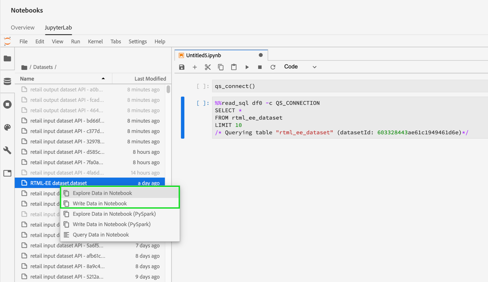

# Accès aux données dans les blocs-notes [!DNL Jupyterlab]

Chaque noyau pris en charge fournit des fonctionnalités intégrées qui vous permettent de lire les données de Platform à partir d’un jeu de données dans un notebook. Actuellement, JupyterLab dans Adobe Experience Platform Data Science Workspace prend en charge les blocs-notes pour [!DNL Python], R, PySpark et Scala. Cependant, la prise en charge de la pagination des données est limitée aux blocs-notes [!DNL Python] et R. Ce guide se concentre sur l&#39;utilisation des portables JupyterLab pour accéder à vos données.

## Prise en main

Avant de lire ce guide, consultez le [[!DNL JupyterLab] guide d&#39;utilisateur](./overview.md) pour une présentation de haut niveau de [!DNL JupyterLab] et de son rôle dans Data Science Workspace.

## Limites de données des ordinateurs portables {#notebook-data-limits}

>[!IMPORTANT]
>
>Pour les ordinateurs portables PySpark et Scala si vous recevez une erreur indiquant la raison pour laquelle le client RPC distant a été dissocié. Cela signifie généralement que le conducteur ou un exécuteur manque de mémoire. Essayez de passer en mode [&quot;batch&quot;](#mode) pour résoudre cette erreur.

Les informations suivantes définissent la quantité maximale de données pouvant être lues, le type de données utilisé et la période estimée de lecture des données.

Pour [!DNL Python] et R, un serveur de bloc-notes configuré à 40 Go de RAM a été utilisé pour les tests. Pour PySpark et Scala, une grappe de serveurs de données configurée à 64 Go de RAM, 8 coeurs, 2 DBU avec un maximum de 4 travailleurs a été utilisée pour les bancs d’essai décrits ci-dessous.

Les données du schéma ExperienceEvent utilisées variaient en taille en commençant par un millier de lignes (1K) allant jusqu’à un milliard de lignes (1B). Notez que pour les mesures PySpark et [!DNL Spark], une période de 10 jours a été utilisée pour les données XDM.

Les données de schéma ad hoc ont été prétraitées à l’aide de [!DNL Query Service] Create Table as Select (CTAS). Ces données varient également en taille en commençant par un millier (1K) de lignes allant jusqu&#39;à un milliard (1B) de lignes.

### Quand utiliser le mode par lot par rapport au mode interactif {#mode}

Lors de la lecture de jeux de données avec des ordinateurs portables PySpark et Scala, vous avez la possibilité d&#39;utiliser le mode interactif ou le mode batch pour lire le jeu de données. Interactive est effectué pour des résultats rapides alors que le mode batch est utilisé pour des jeux de données volumineux.

- Pour les ordinateurs portables PySpark et Scala, le mode batch doit être utilisé lorsque 5 millions de lignes de données ou plus sont lues. Pour plus d’informations sur l’efficacité de chaque mode, voir les tableaux de limite de données [PySpark](#pyspark-data-limits) ou [Scala](#scala-data-limits) ci-dessous.

### [!DNL Python] limites de données des ordinateurs portables

**Schéma XDM ExperienceEvent :** vous devez être en mesure de lire un maximum de 2 millions de lignes (environ 6,1 Go de données sur le disque) de données XDM en moins de 22 minutes. L’Ajoute de lignes supplémentaires peut entraîner des erreurs.

| Nombre de lignes | 1 000 | 10 000 | 100 000 | 1 M | 2M |
| ----------------------- | ------ | ------ | ----- | ----- | ----- |
| Taille sur le disque (Mo) | 18,73 | 187,5 | 308 | 3 000 | 6050 |
| SDK (en secondes) | 20,3 | 86,8 | 63 | 659 | 1315 |

**schéma ad hoc :** vous devez être en mesure de lire un maximum de 5 millions de lignes (environ 5,6 Go de données sur le disque) de données non XDM (ad hoc) en moins de 14 minutes. L’Ajoute de lignes supplémentaires peut entraîner des erreurs.

| Nombre de lignes | 1 000 | 10 000 | 100 000 | 1 M | 2M | 3M | 5M |
| ----------------------- | ------- | ------- | ----- | ----- | ----- | ----- | ------ |
| Taille sur le disque (en Mo) | 1,21 | 11,72 | 115 | 1120 | 2250 | 3 380 | 5630 |
| SDK (en secondes) | 7,27 | 9,04 | 27,3 | 180 | 346 | 487 | 819 |

### Limites de données des ordinateurs portables R

**Schéma XDM ExperienceEvent :** vous devriez être en mesure de lire un maximum de 1 million de lignes de données XDM (données de 3 Go sur le disque) en moins de 13 minutes.

| Nombre de lignes | 1 000 | 10 000 | 100 000 | 1 M |
| ----------------------- | ------ | ------ | ----- | ----- |
| Taille sur le disque (Mo) | 18,73 | 187,5 | 308 | 3 000 |
| Noyau R (en secondes) | 14,03 | 69,6 | 86,8 | 775 |

**schéma ad hoc :** vous devriez être en mesure de lire un maximum de 3 millions de lignes de données ad hoc (293 Mo de données sur le disque) en 10 minutes environ.

| Nombre de lignes | 1 000 | 10 000 | 100 000 | 1 M | 2M | 3M |
| ----------------------- | ------- | ------- | ----- | ----- | ----- | ----- |
| Taille sur le disque (en Mo) | 0,082 | 0,612 | 9.0 | 91 | 188 | 293 |
| SDK R (en s) | 7,7 | 4,58 | 35,9 | 233 | 470,5 | 603 |

### Limites des données du bloc-notes PySpark ([!DNL Python] kernel) : {#pyspark-data-limits}

**Schéma XDM ExperienceEvent :** en mode interactif, vous devriez être en mesure de lire un maximum de 5 millions de lignes (environ 13,42 Go de données sur disque) de données XDM en 20 minutes environ. Le mode interactif ne prend en charge que jusqu’à 5 millions de lignes. Si vous souhaitez lire des jeux de données plus volumineux, il est conseillé de passer en mode batch. En mode batch, vous devriez pouvoir lire un maximum de 500 millions de lignes (environ 1,31 To de données sur disque) de données XDM en 14 heures environ.

| Nombre de lignes | 1 000 | 10 000 | 100 000 | 1 M | 2M | 3M | 5M | 10 millions | 50 M | 100 millions | 500 millions |
|-------------------------|--------|--------|-------|-------|-------|-------|---------|---------|----------|--------|--------|
| Taille du disque | 2,93 Mo | 4,38 Mo | 29,02 | 2.69 Go | 5.39 Go | 8.09 Go | 13.42 Go | 26.82 Go | 134.24 Go | 268.39 Go | 1,31 To |
| SDK (mode interactif) | 33 s | 32,4 s | 55,1 s | 253,5 s | 489,2 s | 729,6 s | 1 206,8 s | - | - | - | - |
| SDK (mode Batch) | 815,8 s | 492,8 s | 379,1 s | 637,4 s | 624,5 s | 869,2 s | 1104,1 s | 1786 s | 5 387,2 s | 1 0624,6 s | 50547s |

**schéma ad hoc :** en mode interactif, vous devriez être en mesure de lire un maximum de 5 millions de lignes (environ 5,36 Go de données sur le disque) de données non XDM en moins de 3 minutes. En mode Batch, vous devriez être en mesure de lire un maximum de 1 milliard de lignes (environ 1,05 To de données sur disque) de données non-XDM en 18 minutes environ.

| Nombre de lignes | 1 000 | 10 000 | 100 000 | 1 M | 2M | 3M | 5M | 10 millions | 50 M | 100 millions | 500 millions | 1B |
|--------------|--------|---------|---------|-------|-------|-------|--------|--------|---------|--------|---------|-------|
| Taille du disque | 1,12 Mo | 11,24 Mo | 109,48 Mo | 2.69 Go | 2.14 Go | 3.21 Go | 5.36 Go | 10.71 Go | 53.58 Go | 107.52 Go | 535.88 Go | 1,05 To |
| Mode interactif SDK (en secondes) | 28,2 s | 18,6 s | 20,8 s | 20,9 s | 23,8 s | 21,7 s | 24,7 s | - | - | - | - | - |
| Mode de traitement par lots du SDK (en secondes) | 428,8 s | 578,8 s | 641,4 s | 538,5 s | 630,9 s | 467,3 s | 411 s | 675 s | 702 s | 719,2 s | 1022,1 s | 1122,3 s |

### [!DNL Spark] Limites des données des blocs-notes (noyau Scala) :  {#scala-data-limits}

**Schéma XDM ExperienceEvent :** en mode interactif, vous devriez être en mesure de lire un maximum de 5 millions de lignes (environ 13,42 Go de données sur disque) de données XDM en 18 minutes environ. Le mode interactif ne prend en charge que jusqu’à 5 millions de lignes. Si vous souhaitez lire des jeux de données plus volumineux, il est conseillé de passer en mode batch. En mode batch, vous devriez pouvoir lire un maximum de 500 millions de lignes (environ 1,31 To de données sur disque) de données XDM en 14 heures environ.

| Nombre de lignes | 1 000 | 10 000 | 100 000 | 1 M | 2M | 3M | 5M | 10 millions | 50 M | 100 millions | 500 millions |
|---------------|--------|--------|-------|-------|-------|-------|---------|---------|----------|--------|--------|
| Taille du disque | 2,93 Mo | 4,38 Mo | 29,02 | 2.69 Go | 5.39 Go | 8.09 Go | 13.42 Go | 26.82 Go | 134.24 Go | 268.39 Go | 1,31 To |
| Mode interactif SDK (en secondes) | 37,9 s | 22,7 s | 45,6 s | 231,7 s | 444,7 s | 660,6 s | 1100 s | - | - | - | - |
| Mode de traitement par lots du SDK (en secondes) | 374,4 s | 398,5 s | 527 s | 487,9 s | 588,9 s | 829 s | 939,1 s | 1 441 s | 5 473,2 s | 10 118,8 | 49 207,6 |

**schéma ad hoc :** en mode interactif, vous devriez être en mesure de lire un maximum de 5 millions de lignes (environ 5,36 Go de données sur le disque) de données non XDM en moins de 3 minutes. En mode batch, vous devriez être en mesure de lire un maximum de 1 milliard de lignes (~1,05 To de données sur disque) de données non-XDM en 16 minutes environ.

| Nombre de lignes | 1 000 | 10 000 | 100 000 | 1 M | 2M | 3M | 5M | 10 millions | 50 M | 100 millions | 500 millions | 1B |
|--------------|--------|---------|---------|-------|-------|-------|---------|---------|---------|--------|---------|-------|
| Taille du disque | 1,12 Mo | 11,24 Mo | 109,48 Mo | 2.69 Go | 2.14 Go | 3.21 Go | 5.36 Go | 10.71 Go | 53.58 Go | 107.52 Go | 535.88 Go | 1,05 To |
| Mode interactif SDK (en secondes) | 35,7 s | 31 s | 19,5 s | 25,3 s | 23 s | 33,2 s | 25,5 s | - | - | - | - | - |
| Mode de traitement par lots du SDK (en secondes) | 448,8 s | 459,7 s | 519 s | 475,8 s | 599,9 s | 347,6 s | 407,8 s | 397 s | 518,8 s | 487,9 s | 760,2 s | 975,4 s |

## Ordinateurs portables Python {#python-notebook}

[!DNL Python] les portables vous permettent de paginer les données lors de l&#39;accès aux jeux de données. Vous trouverez ci-dessous un exemple de code pour lire des données avec et sans pagination. Pour plus d&#39;informations sur les blocs-notes Python de démarrage disponibles, consultez la section [[!DNL JupyterLab] Lanceur](./overview.md#launcher) du guide d&#39;utilisation de JupyterLab.

La documentation Python ci-dessous décrit les concepts suivants :

- [Lecture à partir d’un jeu de données](#python-read-dataset)
- [Écrire dans un jeu de données](#write-python)
- [Données de requête](#query-data-python)
- [Filtrage des données ExperienceEvent](#python-filter)

### Lecture à partir d’un jeu de données en Python {#python-read-dataset}

**Sans pagination :**

L’exécution du code suivant lit le jeu de données complet. Si l’exécution est réussie, les données sont enregistrées sous la forme d’un cadre de données pandas référencé par la variable `df`.

```python
# Python

from platform_sdk.dataset_reader import DatasetReader
dataset_reader = DatasetReader(get_platform_sdk_client_context(), dataset_id="{DATASET_ID}")
df = dataset_reader.read()
df.head()
```

**Avec pagination :**

L’exécution du code suivant lit les données du jeu de données spécifié. La pagination est obtenue en limitant et en décalant les données à l’aide des fonctions `limit()` et `offset()` respectivement. La limitation des données fait référence au nombre maximal de points de données à lire, tandis que le décalage fait référence au nombre de points de données à ignorer avant la lecture des données. Si l’opération de lecture s’exécute correctement, les données sont enregistrées sous la forme d’un cadre de données pandas référencé par la variable `df`.

```python
# Python

from platform_sdk.dataset_reader import DatasetReader

dataset_reader = DatasetReader(get_platform_sdk_client_context(), dataset_id="{DATASET_ID}")
df = dataset_reader.limit(100).offset(10).read()
```

### Écrire dans un jeu de données en Python {#write-python}

Pour écrire dans un jeu de données de votre bloc-notes JupyterLab, sélectionnez l&#39;onglet Icône de données (en surbrillance ci-dessous) dans le volet de navigation de gauche de JupyterLab. Les répertoires **[!UICONTROL Datasets]** et **[!UICONTROL Schémas]** s&#39;affichent. Sélectionnez **[!UICONTROL Datasets]** et cliquez avec le bouton droit, puis sélectionnez l&#39;option **[!UICONTROL Écrire les données dans le bloc-notes]** dans le menu déroulant du jeu de données que vous souhaitez utiliser. Une entrée de code exécutable s&#39;affiche au bas de votre bloc-notes.



- Utilisez **[!UICONTROL Write Data in Notebook]** pour générer une cellule d&#39;écriture avec votre jeu de données sélectionné.
- Utilisez **[!UICONTROL Explorer les données dans le bloc-notes]** pour générer une cellule lue avec votre jeu de données sélectionné.
- Utilisez **[!UICONTROL Données de Requête dans le bloc-notes]** pour générer une cellule de requête de base avec votre jeu de données sélectionné.

Vous pouvez également copier et coller la cellule de code suivante. Remplacez à la fois `{DATASET_ID}` et `{PANDA_DATAFRAME}`.

```python
from platform_sdk.models import Dataset
from platform_sdk.dataset_writer import DatasetWriter

dataset = Dataset(get_platform_sdk_client_context()).get_by_id(dataset_id="{DATASET_ID}")
dataset_writer = DatasetWriter(get_platform_sdk_client_context(), dataset)
write_tracker = dataset_writer.write({PANDA_DATAFRAME}, file_format='json')
```

### Données de requête utilisant [!DNL Query Service] dans [!DNL Python] {#query-data-python}

[!DNL JupyterLab][!DNL Platform][!DNL Python] sur vous permet d’utiliser SQL dans un notebook pour accéder aux données via [Adobe Experience Platform Query Service](https://docs.adobe.com/content/help/fr-FR/experience-platform/query/home.html). L&#39;accès aux données via [!DNL Query Service] peut s&#39;avérer utile pour traiter des jeux de données volumineux en raison de ses délais d&#39;exécution supérieurs. Notez que l&#39;interrogation de données à l&#39;aide de [!DNL Query Service] a une durée de traitement limitée à dix minutes.

Avant d&#39;utiliser [!DNL Query Service] dans [!DNL JupyterLab], assurez-vous de bien comprendre la syntaxe [[!DNL Query Service] SQL](https://docs.adobe.com/content/help/fr-FR/experience-platform/query/home.html#!api-specification/markdown/narrative/technical_overview/query-service/sql/syntax.md).

Pour interroger des données à l&#39;aide de [!DNL Query Service], vous devez indiquer le nom du jeu de données de cible. Vous pouvez générer les cellules de code nécessaires en recherchant le jeu de données souhaité à l’aide de l’**[!UICONTROL explorateur de données]**. Cliquez avec le bouton droit sur la liste des jeux de données et cliquez sur **[!UICONTROL Données de Requête dans le bloc-notes]** pour générer deux cellules de code dans votre bloc-notes. Ces deux cellules sont décrites plus en détail ci-dessous.


Pour utiliser [!DNL Query Service] dans [!DNL JupyterLab], vous devez d&#39;abord créer une connexion entre votre bloc-notes [!DNL Python] fonctionnel et [!DNL Query Service]. Pour ce faire, exécutez la première cellule générée.

```python
qs_connect()
```

Dans la seconde cellule générée, la première ligne doit être définie avant la requête SQL. Par défaut, la cellule générée définit une variable facultative (`df0`) qui enregistre les résultats des requêtes sous la forme d’un cadre de données pandas. <br>L’argument `-c QS_CONNECTION` est obligatoire et indique au noyau d’exécuter la requête SQL sur [!DNL Query Service]. Consultez l’[annexe](#optional-sql-flags-for-query-service) pour obtenir une liste d’arguments supplémentaires.

```python
%%read_sql df0 -c QS_CONNECTION
SELECT *
FROM name_of_the_dataset
LIMIT 10
/* Querying table "name_of_the_dataset" (datasetId: {DATASET_ID})*/
```

Vous pouvez référencer les variables Python directement dans une requête SQL en utilisant une syntaxe au format chaîne et en mettant les variables entre accolades (`{}`), comme indiqué dans l’exemple suivant :

```python
table_name = 'name_of_the_dataset'
table_columns = ','.join(['col_1','col_2','col_3'])
```

```python
%%read_sql demo -c QS_CONNECTION
SELECT {table_columns}
FROM {table_name}
```

### Filtrer [!DNL ExperienceEvent] données {#python-filter}

Pour accéder à un jeu de données [!DNL ExperienceEvent] et le filtrer dans un bloc-notes [!DNL Python], vous devez indiquer l&#39;identifiant du jeu de données (`{DATASET_ID}`) ainsi que les règles de filtrage qui définissent une plage de temps spécifique à l&#39;aide d&#39;opérateurs logiques. Lorsqu’un intervalle de temps est défini, toute pagination spécifiée est ignorée et le jeu de données complet est pris en compte.

Une liste d’opérateurs de filtrage est décrite ci-dessous :

- `eq()` : égal à
- `gt()` : supérieur à
- `ge()` : supérieur ou égal à
- `lt()` : inférieur à
- `le()` : inférieur ou égal à
- `And()` : opérateur ET logique
- `Or()` : opérateur OU logique

La cellule suivante filtres un jeu de données [!DNL ExperienceEvent] aux données qui existent exclusivement entre le 1er janvier 2019 et la fin du 31 décembre 2019.

```python
# Python

from platform_sdk.dataset_reader import DatasetReader

dataset_reader = DatasetReader(get_platform_sdk_client_context(), dataset_id="{DATASET_ID}")
df = dataset_reader.\
    where(dataset_reader["timestamp"].gt("2019-01-01 00:00:00").\
    And(dataset_reader["timestamp"].lt("2019-12-31 23:59:59"))\
).read()
```

## Ordinateurs portables R {#r-notebooks}

Les portables R vous permettent de paginer les données lors de l&#39;accès aux jeux de données. Vous trouverez ci-dessous un exemple de code pour lire des données avec et sans pagination. Pour plus d&#39;informations sur les blocs-notes de démarrage R disponibles, consultez la section [[!DNL JupyterLab] Lanceur](./overview.md#launcher) du guide d&#39;utilisation de JupyterLab.

La documentation R ci-dessous décrit les concepts suivants :

- [Lecture à partir d’un jeu de données](#r-read-dataset)
- [Écrire dans un jeu de données](#write-r)
- [Filtrage des données ExperienceEvent](#r-filter)

### Lu à partir d&#39;un jeu de données dans R {#r-read-dataset}

**Sans pagination :**

L’exécution du code suivant lit le jeu de données complet. Si l’exécution est réussie, les données sont enregistrées sous la forme d’un cadre de données pandas référencé par la variable `df0`.

```R
# R

library(reticulate)
use_python("/usr/local/bin/ipython")
psdk <- import("platform_sdk")
datetime <- import("datetime", convert = FALSE)
py_run_file("~/.ipython/profile_default/startup/platform_sdk_context.py")
DatasetReader <- psdk$dataset_reader$DatasetReader
dataset_reader <- DatasetReader(py$get_platform_sdk_client_context(), dataset_id="{DATASET_ID}")
df0 <- dataset_reader$read()
head(df0)
```

**Avec pagination :**

L’exécution du code suivant lit les données du jeu de données spécifié. La pagination est obtenue en limitant et en décalant les données à l’aide des fonctions `limit()` et `offset()` respectivement. La limitation des données fait référence au nombre maximal de points de données à lire, tandis que le décalage fait référence au nombre de points de données à ignorer avant la lecture des données. Si l’opération de lecture s’exécute correctement, les données sont enregistrées sous la forme d’un cadre de données pandas référencé par la variable `df0`.

```R
# R

library(reticulate)
use_python("/usr/local/bin/ipython")
psdk <- import("platform_sdk")
datetime <- import("datetime", convert = FALSE)
py_run_file("~/.ipython/profile_default/startup/platform_sdk_context.py")

DatasetReader <- psdk$dataset_reader$DatasetReader
dataset_reader <- DatasetReader(py$get_platform_sdk_client_context(), dataset_id="{DATASET_ID}") 
df0 <- dataset_reader$limit(100L)$offset(10L)$read()
```

### Écrire dans un jeu de données dans R {#write-r}

Pour écrire dans un jeu de données de votre bloc-notes JupyterLab, sélectionnez l&#39;onglet Icône de données (en surbrillance ci-dessous) dans le volet de navigation de gauche de JupyterLab. Les répertoires **[!UICONTROL Datasets]** et **[!UICONTROL Schémas]** s&#39;affichent. Sélectionnez **[!UICONTROL Datasets]** et cliquez avec le bouton droit, puis sélectionnez l&#39;option **[!UICONTROL Écrire les données dans le bloc-notes]** dans le menu déroulant du jeu de données que vous souhaitez utiliser. Une entrée de code exécutable s&#39;affiche au bas de votre bloc-notes.


- Utilisez **[!UICONTROL Write Data in Notebook]** pour générer une cellule d&#39;écriture avec votre jeu de données sélectionné.
- Utilisez **[!UICONTROL Explorer les données dans le bloc-notes]** pour générer une cellule lue avec votre jeu de données sélectionné.

Vous pouvez également copier et coller la cellule de code suivante :

```R
psdk <- import("platform_sdk")
dataset <- psdk$models$Dataset(py$get_platform_sdk_client_context())$get_by_id(dataset_id="{DATASET_ID}")
dataset_writer <- psdk$dataset_writer$DatasetWriter(py$get_platform_sdk_client_context(), dataset)
write_tracker <- dataset_writer$write(df, file_format='json')
```

### Filtrer [!DNL ExperienceEvent] données {#r-filter}

Pour accéder à un jeu de données [!DNL ExperienceEvent] et le filtrer dans un bloc-notes R, vous devez indiquer l&#39;identifiant du jeu de données (`{DATASET_ID}`) ainsi que les règles de filtrage qui définissent une plage de temps spécifique à l&#39;aide d&#39;opérateurs logiques. Lorsqu’un intervalle de temps est défini, toute pagination spécifiée est ignorée et le jeu de données complet est pris en compte.

Une liste d’opérateurs de filtrage est décrite ci-dessous :

- `eq()` : égal à
- `gt()` : supérieur à
- `ge()` : supérieur ou égal à
- `lt()` : inférieur à
- `le()` : inférieur ou égal à
- `And()` : opérateur ET logique
- `Or()` : opérateur OU logique

La cellule suivante filtres un jeu de données [!DNL ExperienceEvent] aux données qui existent exclusivement entre le 1er janvier 2019 et la fin du 31 décembre 2019.

```R
# R

library(reticulate)
use_python("/usr/local/bin/ipython")
psdk <- import("platform_sdk")
datetime <- import("datetime", convert = FALSE)
py_run_file("~/.ipython/profile_default/startup/platform_sdk_context.py")

client_context <- py$PLATFORM_SDK_CLIENT_CONTEXT
DatasetReader <- psdk$dataset_reader$DatasetReader
dataset_reader <- DatasetReader(py$get_platform_sdk_client_context(), dataset_id="{DATASET_ID}") 

df0 <- dataset_reader$
    where(dataset_reader["timestamp"]$gt("2019-01-01 00:00:00")$
    And(dataset_reader["timestamp"]$lt("2019-12-31 23:59:59"))
)$read()
```

## Ordinateurs portables PySpark 3 {#pyspark-notebook}

La documentation de PySpark ci-dessous décrit les concepts suivants :

- [Initialiser sparkSession](#spark-initialize)
- [Lecture et écriture de données](#magic)
- [Création d’un cadre de données local](#pyspark-create-dataframe)
- [Filtrage des données ExperienceEvent](#pyspark-filter-experienceevent)

### Initialisation de sparkSession {#spark-initialize}

Tous les blocs-notes [!DNL Spark] 2.4 exigent que vous initialisiez la session avec le code standard suivant.

```scala
from pyspark.sql import SparkSession
spark = SparkSession.builder.getOrCreate()
```

### Utilisation de %dataset pour lire et écrire avec un bloc-notes PySpark 3 {#magic}

Avec l&#39;introduction de [!DNL Spark] 2.4, `%dataset` magie personnalisée est fournie pour être utilisée dans les portables PySpark 3 ([!DNL Spark] 2.4). Pour plus de détails sur les commandes magiques disponibles dans le noyau IPython, consultez la [documentation magique IPython](https://ipython.readthedocs.io/en/stable/interactive/magics.html).


**Utilisation**

```scala
%dataset {action} --datasetId {id} --dataFrame {df}`
```

**Description**

Commande magique [!DNL Data Science Workspace] personnalisée pour lire ou écrire un jeu de données à partir d&#39;un bloc-notes [!DNL PySpark] ([!DNL Python] 3).

| Nom | Description | Obligatoire |
| --- | --- | --- |
| `{action}` | Type d’action à exécuter sur le jeu de données. Deux actions sont disponibles &quot;read&quot; ou &quot;write&quot;. | Oui |
| `--datasetId {id}` | Utilisé pour fournir l&#39;ID du jeu de données à lire ou à écrire. | Oui |
| `--dataFrame {df}` | La base de données des pandas. <ul><li> Lorsque l&#39;action est &quot;read&quot;, {df} est la variable où les résultats de l&#39;opération de lecture du jeu de données sont disponibles. </li><li> Lorsque l&#39;action est &quot;write&quot;, ce dataframe {df} est écrit dans le dataset. </li></ul> | Oui |
| `--mode` | Paramètre supplémentaire qui modifie le mode de lecture des données. Les paramètres autorisés sont &quot;batch&quot; et &quot;interactive&quot;. Par défaut, le mode est défini sur &quot;interactif&quot;. Il est recommandé d’utiliser le mode &quot;batch&quot; lors de la lecture de grandes quantités de données. | Non |

>[!TIP]
>
>Consultez les tables PySpark dans la section [limites de données du bloc-notes](#notebook-data-limits) pour déterminer si `mode` doit être défini sur `interactive` ou `batch`.

**Exemples**

- **Exemple** de lecture :  `%dataset read --datasetId 5e68141134492718af974841 --dataFrame pd0`
- **Exemple** d&#39;écriture :  `%dataset write --datasetId 5e68141134492718af974842 --dataFrame pd0`

Vous pouvez générer automatiquement les exemples ci-dessus dans JupyterLab buy à l’aide de la méthode suivante :

Sélectionnez l&#39;onglet Icône Données (en surbrillance ci-dessous) dans le volet de navigation de gauche de JupyterLab. Les répertoires **[!UICONTROL Datasets]** et **[!UICONTROL Schémas]** s&#39;affichent. Sélectionnez **[!UICONTROL Datasets]** et cliquez avec le bouton droit, puis sélectionnez l&#39;option **[!UICONTROL Écrire les données dans le bloc-notes]** dans le menu déroulant du jeu de données que vous souhaitez utiliser. Une entrée de code exécutable s&#39;affiche au bas de votre bloc-notes.

- Utilisez **[!UICONTROL Explorer les données dans le bloc-notes]** pour générer une cellule lue.
- Utilisez **[!UICONTROL Write Data in Notebook]** pour générer une cellule d’écriture.


### Créer une base de données locale {#pyspark-create-dataframe}

Pour créer une base de données locale à l&#39;aide de PySpark 3, utilisez des requêtes SQL. Par exemple :

```scala
date_aggregation.createOrReplaceTempView("temp_df")

df = spark.sql('''
  SELECT *
  FROM sparkdf
''')

local_df
```

```scala
df = spark.sql('''
  SELECT *
  FROM sparkdf
  LIMIT limit
''')
```

```scala
sample_df = df.sample(fraction)
```

>[!TIP]
>
>Vous pouvez également spécifier un échantillon de semences facultatif, tel qu’un booléen avec remplacement, une fraction de doublon ou une graine longue.

### Filtrer [!DNL ExperienceEvent] données {#pyspark-filter-experienceevent}

L&#39;accès et le filtrage d&#39;un jeu de données [!DNL ExperienceEvent] dans un bloc-notes PySpark nécessitent que vous fournissiez l&#39;identité du jeu de données (`{DATASET_ID}`), l&#39;identité IMS de votre entreprise et les règles de filtrage définissant une plage de temps spécifique. Une plage de temps de filtrage est définie à l&#39;aide de la fonction `spark.sql()`, où le paramètre de la fonction est une chaîne de requête SQL.

Les cellules suivantes filtrent un jeu de données [!DNL ExperienceEvent] sur les données qui existent exclusivement entre le 1er janvier 2019 et la fin du 31 décembre 2019.

```python
# PySpark 3 (Spark 2.4)

from pyspark.sql import SparkSession
spark = SparkSession.builder.getOrCreate()

%dataset read --datasetId {DATASET_ID} --dataFrame df

df.createOrReplaceTempView("event")
timepd = spark.sql("""
    SELECT *
    FROM event
    WHERE timestamp > CAST('2019-01-01 00:00:00.0' AS TIMESTAMP)
    AND timestamp < CAST('2019-12-31 23:59:59.9' AS TIMESTAMP)
""")
timepd.show()
```

## Ordinateurs portables Scala {#scala-notebook}

La documentation ci-dessous contient des exemples des concepts suivants :

- [Initialiser sparkSession](#scala-initialize)
- [Lecture d’un jeu de données](#read-scala-dataset)
- [Écrire dans un jeu de données](#scala-write-dataset)
- [Création d’un cadre de données local](#scala-create-dataframe)
- [Filtrage des données ExperienceEvent](#scala-experienceevent)

### Initialisation de SparkSession {#scala-initialize}

Tous les ordinateurs portables Scala nécessitent que vous initialisiez la session avec le code standard suivant :

```scala
import org.apache.spark.sql.{ SparkSession }
val spark = SparkSession
  .builder()
  .master("local")
  .getOrCreate()
```

### Lire un jeu de données {#read-scala-dataset}

Dans Scala, vous pouvez importer `clientContext` pour obtenir et renvoyer des valeurs de plate-forme, ce qui évite de définir des variables telles que `var userToken`. Dans l&#39;exemple Scala ci-dessous, `clientContext` est utilisé pour obtenir et renvoyer toutes les valeurs requises pour lire un jeu de données.

```scala
import org.apache.spark.sql.{Dataset, SparkSession}
import com.adobe.platform.token.ClientContext
val spark = SparkSession.builder().master("local").config("spark.sql.warehouse.dir", "/").getOrCreate()

val clientContext = ClientContext.getClientContext()
val df1 = spark.read.format("com.adobe.platform.query")
  .option("user-token", clientContext.getUserToken())
  .option("ims-org", clientContext.getOrgId())
  .option("api-key", clientContext.getApiKey())
  .option("service-token", clientContext.getServiceToken())
  .option("sandbox-name", clientContext.getSandboxName())
  .option("mode", "interactive")
  .option("dataset-id", "5e68141134492718af974844")
  .load()

df1.printSchema()
df1.show(10)
```

| Élément | Description |
| ------- | ----------- |
| df1 | Variable qui représente la base de données Pandas utilisée pour lire et écrire des données. |
| user-token | Votre jeton utilisateur qui est automatiquement récupéré à l’aide de `clientContext.getUserToken()`. |
| service-token | Votre jeton de service automatiquement récupéré à l’aide de `clientContext.getServiceToken()`. |
| ims-org | Votre ID d&#39;organisation IMS automatiquement récupéré à l&#39;aide de `clientContext.getOrgId()`. |
| api-key | Votre clé d&#39;API automatiquement récupérée à l&#39;aide de `clientContext.getApiKey()`. |

>[!TIP]
>
>Consultez les tables Scala dans la section [limites de données du bloc-notes](#notebook-data-limits) pour déterminer si `mode` doit être défini sur `interactive` ou `batch`.

Vous pouvez générer automatiquement l’exemple ci-dessus dans JupyterLab buy à l’aide de la méthode suivante :

Sélectionnez l&#39;onglet Icône Données (en surbrillance ci-dessous) dans le volet de navigation de gauche de JupyterLab. Les répertoires **[!UICONTROL Datasets]** et **[!UICONTROL Schémas]** s&#39;affichent. Sélectionnez **[!UICONTROL Datasets]** et cliquez avec le bouton droit de la souris, puis sélectionnez l&#39;option **[!UICONTROL Explorer les données dans le bloc-notes]** dans le menu déroulant du jeu de données que vous souhaitez utiliser. Une entrée de code exécutable s&#39;affiche au bas de votre bloc-notes.
And
- Utilisez **[!UICONTROL Explorer les données dans le bloc-notes]** pour générer une cellule lue.
- Utilisez **[!UICONTROL Write Data in Notebook]** pour générer une cellule d’écriture.


### Écrire dans un jeu de données {#scala-write-dataset}

Dans Scala, vous pouvez importer `clientContext` pour obtenir et renvoyer des valeurs de plate-forme, ce qui évite de définir des variables telles que `var userToken`. Dans l&#39;exemple Scala ci-dessous, `clientContext` est utilisé pour définir et renvoyer toutes les valeurs requises pour l&#39;écriture dans un jeu de données.

```scala
import org.apache.spark.sql.{Dataset, SparkSession}
import com.adobe.platform.token.ClientContext
val spark = SparkSession.builder().master("local").config("spark.sql.warehouse.dir", "/").getOrCreate()

val clientContext = ClientContext.getClientContext()
df1.write.format("com.adobe.platform.query")
  .option("user-token", clientContext.getUserToken())
  .option("service-token", clientContext.getServiceToken())
  .option("ims-org", clientContext.getOrgId())
  .option("api-key", clientContext.getApiKey())
  .option("sandbox-name", clientContext.getSandboxName())
  .option("mode", "interactive")
  .option("dataset-id", "5e68141134492718af974844")
  .save()
```

| element   | description |
| ------- | ----------- |
| df1 | Variable qui représente la base de données Pandas utilisée pour lire et écrire des données. |
| user-token | Votre jeton utilisateur qui est automatiquement récupéré à l’aide de `clientContext.getUserToken()`. |
| service-token | Votre jeton de service automatiquement récupéré à l’aide de `clientContext.getServiceToken()`. |
| ims-org | Votre ID d&#39;organisation IMS automatiquement récupéré à l&#39;aide de `clientContext.getOrgId()`. |
| api-key | Votre clé d&#39;API automatiquement récupérée à l&#39;aide de `clientContext.getApiKey()`. |

>[!TIP]
>
>Consultez les tables Scala dans la section [limites de données du bloc-notes](#notebook-data-limits) pour déterminer si `mode` doit être défini sur `interactive` ou `batch`.

### créer une base de données locale {#scala-create-dataframe}

Pour créer une base de données locale à l&#39;aide de Scala, des requêtes SQL sont requises. Par exemple :

```scala
sparkdf.createOrReplaceTempView("sparkdf")

val localdf = spark.sql("SELECT * FROM sparkdf LIMIT 1)
```

### Filtrer [!DNL ExperienceEvent] données {#scala-experienceevent}

L&#39;accès et le filtrage d&#39;un jeu de données [!DNL ExperienceEvent] dans un bloc-notes Scala nécessitent que vous fournissiez l&#39;identité du jeu de données (`{DATASET_ID}`), l&#39;identité IMS de votre organisation et les règles de filtrage définissant une plage de temps spécifique. Un intervalle de temps de filtrage est défini à l’aide de la fonction `spark.sql()`, où le paramètre de fonction est une chaîne de requête SQL.

Les cellules suivantes filtrent un jeu de données [!DNL ExperienceEvent] sur les données qui existent exclusivement entre le 1er janvier 2019 et la fin du 31 décembre 2019.

```scala
// Spark (Spark 2.4)

// Turn off extra logging
import org.apache.log4j.{Level, Logger}
Logger.getLogger("org").setLevel(Level.OFF)
Logger.getLogger("com").setLevel(Level.OFF)

import org.apache.spark.sql.{Dataset, SparkSession}
val spark = org.apache.spark.sql.SparkSession.builder().appName("Notebook")
  .master("local")
  .getOrCreate()

// Stage Exploratory
val dataSetId: String = "{DATASET_ID}"
val orgId: String = sys.env("IMS_ORG_ID")
val clientId: String = sys.env("PYDASDK_IMS_CLIENT_ID")
val userToken: String = sys.env("PYDASDK_IMS_USER_TOKEN")
val serviceToken: String = sys.env("PYDASDK_IMS_SERVICE_TOKEN")
val mode: String = "batch"

var df = spark.read.format("com.adobe.platform.query")
  .option("user-token", userToken)
  .option("ims-org", orgId)
  .option("api-key", clientId)
  .option("mode", mode)
  .option("dataset-id", dataSetId)
  .option("service-token", serviceToken)
  .load()
df.createOrReplaceTempView("event")
val timedf = spark.sql("""
    SELECT * 
    FROM event 
    WHERE timestamp > CAST('2019-01-01 00:00:00.0' AS TIMESTAMP)
    AND timestamp < CAST('2019-12-31 23:59:59.9' AS TIMESTAMP)
""")
timedf.show()
```

## Étapes suivantes

Ce document portait sur les directives générales pour l&#39;accès aux jeux de données à l&#39;aide de portables JupyterLab. Pour obtenir des exemples plus détaillés sur l’interrogation de jeux de données, consultez la documentation de [Requête Service dans les cahiers de travail JupyterLab](./query-service.md). Pour plus d&#39;informations sur la façon d&#39;explorer et de visualiser vos jeux de données, consultez le document [sur l&#39;analyse de vos données à l&#39;aide de carnets](./analyze-your-data.md).

## Indicateurs SQL facultatifs pour [!DNL Query Service] {#optional-sql-flags-for-query-service}

Ce tableau décrit les indicateurs SQL facultatifs qui peuvent être utilisés pour [!DNL Query Service].

| **Indicateur** | **Description** |
| --- | --- |
| `-h`, `--help` | Affichez le message d’aide et fermez-le. |
| `-n`,  `--notify` | Option d’activation et de désactivation pour la notification des résultats de la requête. |
| `-a`,  `--async` | L’utilisation de cet indicateur permet d’exécuter la requête de manière asynchrone et de libérer le noyau pendant l’exécution de la requête. Soyez prudent lorsque vous attribuez les résultats de la requête à des variables, car il se peut qu’ils ne soient pas définis si la requête n’est pas terminée. |
| `-d`,  `--display` | L’utilisation de cet indicateur empêche l’affichage des résultats. |
