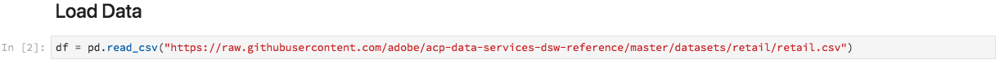

# Analyse de vos données à l&#39;aide de portables

Ce didacticiel se concentre sur l’utilisation de blocs-notes Jupyter, construits dans Data Science Workspace, pour accéder à vos données, les explorer et les visualiser. D&#39;ici la fin de ce tutoriel, vous devriez avoir une bonne connaissance de certaines des fonctionnalités de l&#39;offre des portables Jupyter pour mieux comprendre vos données.

Les concepts suivants sont introduits :

- **JupyterLab :** [JupyterLab](https://blog.jupyter.org/jupyterlab-is-ready-for-users-5a6f039b8906) est l’interface Web de nouvelle génération pour Project Jupyter et est étroitement intégrée à Adobe Experience Platform.
- **Lots :** Les jeux de données sont composés de lots. Un lot est un ensemble de données collectées sur une période donnée et traitées ensemble en une seule unité. De nouveaux lots sont créés lorsque des données sont ajoutées à un jeu de données.
- **SDK d’accès aux données (obsolète) :** Le SDK d’accès aux données est désormais obsolète. Veuillez utiliser le guide [Platform SDK](../authoring/platform-sdk.md) .

## Explorez des blocs-notes dans Data Science Workspace.

Dans cette section, nous étudions les données qui étaient précédemment incorporées au schéma de vente au détail.

Data Science Workspace permet aux utilisateurs de créer des portables Jupyter via la plate-forme JupyterLab, où ils peuvent créer et modifier des workflows d&#39;apprentissage automatique. JupyterLab est un outil de collaboration serveur-client qui permet aux utilisateurs de modifier des documents d&#39;ordinateurs portables via un navigateur Web. Ces blocs-notes peuvent contenir du code exécutable et des éléments de texte enrichi. Pour nos besoins, nous utiliserons Markdown pour la description de l&#39;analyse et le code Python exécutable pour effectuer l&#39;exploration et l&#39;analyse des données.

### Choisir votre espace de travail

Lors du lancement de JupyterLab, une interface web pour les portables Jupyter est présentée. Selon le type de bloc-notes que nous choisissons, un noyau correspondant sera lancé.

Lorsque nous comparons l&#39;environnement à utiliser, nous devons tenir compte des limites de chaque service. Par exemple, si nous utilisons la bibliothèque [pandas](https://pandas.pydata.org/) avec Python, en tant qu&#39;utilisateur régulier, la limite de RAM est de 2 Go. Même en tant qu&#39;utilisateur, nous serions limités à 20 Go de RAM. S&#39;il s&#39;agit de calculs plus volumineux, il serait logique d&#39;utiliser Spark qui offre 1,5 To et qui est partagé avec toutes les instances d&#39;un ordinateur portable.

Par défaut, la recette Tensorflow fonctionne dans un cluster GPU et Python s&#39;exécute dans un cluster CPU.

### Créer un bloc-notes

Dans l’interface utilisateur d’Adobe Experience Platform, cliquez sur l’onglet Data Science du menu supérieur pour accéder à Data Science Workspace. A partir de cette page, cliquez sur l&#39;onglet JupyterLab qui ouvre le lanceur JupyterLab. Vous devriez voir une page similaire à celle-ci.


Dans notre tutoriel, nous utiliserons Python 3 dans le Jupyter Notebook pour montrer comment accéder aux données et les explorer. Dans la page Lanceur, des exemples de cahiers de travail sont fournis. Nous utiliserons la recette Ventes au détail pour Python 3.


La recette Ventes au détail est un exemple autonome qui utilise le même jeu de données Ventes au détail pour montrer comment explorer et visualiser les données dans Jupyter Notebook. En outre, le carnet de notes approfondit la formation et la vérification. Vous trouverez plus d&#39;informations sur ce bloc-notes spécifique dans cette [présentation](../walkthrough.md).

### Données d’accès

>[!NOTE] La variable `data_access_sdk_python` est obsolète et n’est plus recommandée. Pour convertir votre code, consultez le didacticiel [de conversion du SDK d’accès aux données en SDK](../authoring/platform-sdk.md) de plate-forme. Les mêmes étapes ci-dessous s’appliquent toujours à ce didacticiel.

Nous allons passer en revue l’accès aux données en interne à partir d’Adobe Experience Platform et aux données en externe. Nous utiliserons la `data_access_sdk_python` bibliothèque pour accéder aux données internes telles que les jeux de données et les schémas XDM. Pour les données externes, nous utiliserons la bibliothèque de pandas Python.

#### Données externes

A l&#39;ouverture du bloc-notes Ventes au détail, recherchez l&#39;en-tête &quot;Charger les données&quot;. Le code Python suivant utilise la structure `DataFrame` de données des pandas et la fonction [read_csv()](https://pandas.pydata.org/pandas-docs/stable/generated/pandas.read_csv.html#pandas.read_csv) pour lire le fichier CSV hébergé sur Github dans le DataFrame :



La structure de données DataFrame de Pandas est une structure de données étiquetées en deux dimensions. Pour voir rapidement les dimensions de nos données, nous pouvons utiliser le `df.shape`. Ceci renvoie un tuple qui représente la dimension du DataFrame :


Enfin, nous pouvons jeter un oeil à ce à quoi ressemblent nos données. Nous pouvons utiliser `df.head(n)` pour vue les premières `n` lignes du DataFrame :


#### Données de la plate-forme d’expérience

Nous allons maintenant passer en revue l’accès aux données de la plateforme d’expérience.

##### Par ID de jeu de données

Pour cette section, nous utilisons le jeu de données Ventes au détail qui est le même jeu de données que celui utilisé dans l&#39;exemple de carnet de ventes au détail.

Dans notre portable Jupyter, nous pouvons accéder à nos données à partir de l&#39;onglet **Data** sur la gauche. Lorsque vous cliquez sur l&#39;onglet, vous pouvez voir une liste de jeux de données.


Maintenant, dans le répertoire Datasets, nous pourrons voir tous les jeux de données assimilés. Notez que le chargement de toutes les entrées peut prendre une minute si votre répertoire est fortement rempli de jeux de données.

Puisque le jeu de données est le même, nous voulons remplacer les données de charge de la section précédente qui utilise des données externes. Sélectionnez le bloc de code sous **Charger les données** et appuyez deux fois sur la **touche d&#39;** entrée de votre clavier. Assurez-vous que l’accent est mis sur le bloc et non sur le texte. Vous pouvez appuyer sur **&#39;esc&#39;** pour échapper à la cible d&#39;action du texte avant **&#39;d&#39;** double.

Désormais, nous pouvons cliquer avec le bouton droit sur le `Retail-Training-<your-alias>` jeu de données et sélectionner l&#39;option &quot;Explorer les données dans le bloc-notes&quot; dans la liste déroulante. Une entrée de code exécutable apparaît dans votre bloc-notes.

>[!TIP] reportez-vous au guide du SDK [de la](../authoring/platform-sdk.md) plate-forme pour convertir votre code.

```PYTHON
from data_access_sdk_python.reader import DataSetReader
from datetime import date
reader = DataSetReader()
df = reader.load(data_set_id="xxxxxxxx", ims_org="xxxxxxxx@AdobeOrg")
df.head()
```

Si vous travaillez sur d’autres noyaux autres que Python, reportez-vous à [cette page](https://github.com/adobe/acp-data-services-dsw-reference/wiki/Accessing-Data-on-the-Platform) pour accéder aux données sur Adobe Experience Platform.

La sélection de la cellule exécutable, puis l&#39;activation du bouton de lecture dans la barre d&#39;outils, exécutera le code exécutable. La sortie pour `head()` sera un tableau avec les clés de votre jeu de données sous forme de colonnes et les n premières lignes du jeu de données. `head()` accepte un argument entier pour spécifier le nombre de lignes à générer. Par défaut, il s’agit de 5.


Si vous redémarrez votre noyau et réexécutez toutes les cellules, vous devriez obtenir les mêmes sorties qu&#39;auparavant.


### Explorez vos données

Maintenant que nous pouvons accéder à vos données, concentrons-nous sur les données elles-mêmes en utilisant les statistiques et la visualisation. Le jeu de données que nous utilisons est un jeu de données de vente au détail qui fournit des informations diverses sur 45 magasins différents un jour donné. Certaines caractéristiques d&#39;un produit donné `date` et `store` comprennent :
- `storeType`
- `weeklySales`
- `storeSize`
- `temperature`
- `regionalFuelPrice`
- `markDown`
- `cpi`
- `unemployment`
- `isHoliday`

#### Résumé statistique

Nous pouvons exploiter la bibliothèque de pandas de Python pour obtenir le type de données de chaque attribut. La sortie de l&#39;appel suivant nous donnera des informations sur le nombre d&#39;entrées et le type de données pour chacune des colonnes :

```PYTHON
df.info()
```


Ces informations sont utiles car connaître le type de données de chaque colonne nous permettra de savoir comment traiter les données.

Maintenant regardons le résumé statistique. Seuls les types de données numériques s’affichent. Par conséquent, `date``storeType`et `isHoliday` ne sont pas générés :

```PYTHON
df.describe()
```


Avec cela, nous pouvons voir qu&#39;il y a 6435 instances pour chaque caractéristique. En outre, des informations statistiques telles que moyenne, écart type (std), min, max et interquartiles sont fournies. Ceci nous donne des informations sur l&#39;écart pour les données. Dans la section suivante, nous allons passer en revue la visualisation qui fonctionne avec ces informations pour nous donner une bonne compréhension de nos données.

En examinant les valeurs minimale et maximale pour `store`, nous voyons qu&#39;il existe 45 magasins uniques que les données représentent. Il y a aussi `storeTypes` qui différencient ce qu&#39;est un magasin. Nous pouvons voir la distribution de `storeTypes` en procédant comme suit :


Cela veut dire que 22 magasins sont de `storeType``A`, 17 `storeType``B`, et 6 `storeType``C`.

#### Visualisation des données

Maintenant que nous connaissons les valeurs de nos blocs de données, nous voulons compléter cela par des visualisations pour rendre les choses plus claires et plus faciles à identifier les schémas. Les graphiques sont également utiles pour transmettre des résultats à une audience. Voici quelques bibliothèques Python utiles pour la visualisation :
- [Matplotlib](https://matplotlib.org/)
- [pandas](https://pandas.pydata.org/)
- [seaborn](https://seaborn.pydata.org/)
- [ggplot](https://ggplot2.tidyverse.org/)

Dans cette section, nous examinerons rapidement certains avantages liés à l’utilisation de chaque bibliothèque.

[Matplotlib](https://matplotlib.org/) est le plus ancien package de visualisation Python. Leur but est de rendre les choses faciles et difficiles possibles. Cela a tendance à être vrai car le paquet est extrêmement puissant mais il est aussi livré avec la complexité. Il n&#39;est pas toujours facile d&#39;obtenir un graphique à l&#39;apparence raisonnable sans prendre beaucoup de temps et d&#39;efforts.

[Pandas](https://pandas.pydata.org/) est principalement utilisé pour son objet DataFrame qui permet la manipulation de données avec l&#39;indexation intégrée. Cependant, pandas inclut également une fonctionnalité de traçage intégrée basée sur matplotlib.

[seaborn](https://seaborn.pydata.org/) est un paquet construit sur matplotlib. Son principal objectif est de rendre les graphiques par défaut plus attrayants visuellement et de simplifier la création de graphiques complexes.

[ggplot](https://ggplot2.tidyverse.org/) est un paquet également construit sur matplotlib. Cependant, la principale différence est que l&#39;outil est un port de ggplot2 pour R. Comme pour seaborn, l&#39;objectif est d&#39;améliorer sur matplotlib. Les utilisateurs qui connaissent ggplot2 for R doivent prendre en compte cette bibliothèque.


##### Graphiques univariés

Les graphiques univariés sont des tracés d’une variable individuelle. Un graphique unifié commun est utilisé pour visualiser vos données est la boîte et le tracé de muraille.

En utilisant notre jeu de données de vente au détail d&#39;avant, nous pouvons générer la boîte et le tracé de chuchotement pour chacun des 45 magasins et leurs ventes hebdomadaires. Le graphique est généré à l’aide de la `seaborn.boxplot` fonction.


Un tracé de boîte et de muraille est utilisé pour montrer la distribution des données. Les lignes extérieures du tracé indiquent les quartiles supérieur et inférieur, tandis que la case s&#39;étend sur la plage interquartile. La ligne dans la zone marque la médiane. Les points de données plus de 1,5 fois le quartile supérieur ou inférieur sont marqués comme un cercle. Ces points sont considérés comme des valeurs aberrantes.

##### Graphiques multivariés

Les tracés multivariés permettent de visualiser l’interaction entre les variables. Avec la visualisation, les chercheurs de données peuvent voir s&#39;il y a des corrélations ou des modèles entre les variables. Un graphique multivarié commun utilisé est une matrice de corrélation. Avec une matrice de corrélation, les dépendances entre plusieurs variables sont quantifiées avec le coefficient de corrélation.

En utilisant le même jeu de données de vente au détail, nous pouvons générer la matrice de corrélation.


Remarquez la diagonale de 1 en bas au centre. Cela montre que lorsqu’une variable est comparée à elle-même, elle présente une corrélation positive complète. Une forte corrélation positive aura une magnitude proche de 1 tandis que des corrélations faibles seront plus proches de 0. Une corrélation négative est montrée avec un coefficient négatif montrant une tendance inverse.


## Étapes suivantes

Ce didacticiel explique comment créer un nouveau bloc-notes Jupyter dans Data Science Workspace et comment accéder aux données à l’extérieur ainsi qu’à partir d’Adobe Experience Platform. Nous avons notamment suivi les étapes suivantes :
- Créer un bloc-notes Jupyter
- Accéder aux jeux de données et aux schémas
- Explorer les jeux de données

Vous êtes maintenant prêt à passer à la section [](../models-recipes/package-source-files-recipe.md) suivante pour inclure une recette et l’importer dans Data Science Workspace.