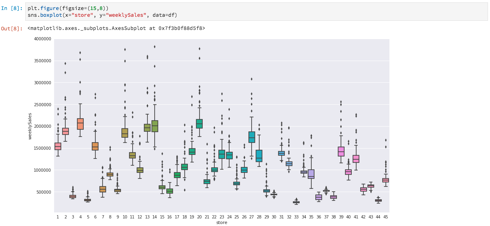

# Analyse de vos données à l’aide de notebooks

Ce tutoriel se concentre sur l’utilisation des notebooks Jupyter, conçus dans Data Science Workspace, pour accéder à vos données, les explorer et les visualiser. D’ici la fin de ce tutoriel, vous devriez avoir une bonne compréhension de certaines des fonctionnalités offertes par les notebooks Jupyter pour mieux comprendre vos données.

Les concepts suivants sont présentés :

- **[!DNL JupyterLab]:** [[!DNL JupyterLab]](https://blog.jupyter.org/jupyterlab-is-ready-for-users-5a6f039b8906) est l’interface web de nouvelle génération pour Project Jupyter et est étroitement intégrée à [!DNL Adobe Experience Platform].
- **Lots :** les jeux de données sont constitués de lots. Un lot est un ensemble de données collectées sur une période donnée et traitées ensemble comme une seule unité. De nouveaux lots sont créés lorsque des données sont ajoutées à un jeu de données.
- **SDK Data Access (obsolète) :** le SDK Data Access est désormais obsolète. Veuillez utiliser le guide [[!DNL Platform SDK]](../authoring/platform-sdk.md).

## Exploration de notebooks dans l’espace de travail de science des données

Dans cette section, nous explorons les données qui ont été précédemment intégrées au schéma de ventes au détail.

Data Science Workspace permet aux utilisateurs de créer [!DNL Jupyter Notebooks] via la plateforme [!DNL JupyterLab] sur laquelle ils peuvent créer et modifier des workflows d’apprentissage automatique. [!DNL JupyterLab] est un outil de collaboration serveur-client qui permet aux utilisateurs de modifier des documents de notebook par le biais d’un navigateur web. Ces notebooks peuvent contenir à la fois du code exécutable et des éléments de texte enrichi. À nos fins, nous utiliserons Markdown pour la description de l’analyse et le code exécutable [!DNL Python] afin d’explorer les données et d’analyser.

### Sélection de votre espace de travail

Lors du lancement de [!DNL JupyterLab], une interface web pour les notebooks Jupyter s’affiche. Selon le type de notebook sélectionné, un noyau correspondant sera lancé.

Lors de la comparaison des environnements à utiliser, il faut tenir compte des limites de chaque service. Par exemple, si nous utilisons la bibliothèque [pandas](https://pandas.pydata.org/) avec [!DNL Python], la limite de RAM pour les utilisateurs réguliers est de 2 Go. Les utilisateurs avancés sont eux limités à 20 Go de RAM. Si vous traitez de plus grands calculs, il serait logique d’utiliser [!DNL Spark] qui offre 1,5 To partagé avec toutes les instances de notebook.

Par défaut, la recette Tensorflow fonctionne dans un cluster GPU et Python s’exécute dans un cluster CPU.

### Création d’un nouveau filtre

Dans l’interface utilisateur de [!DNL Adobe Experience Platform], sélectionnez [!UICONTROL Data Science] dans le menu supérieur pour accéder à Data Science Workspace. Sur cette page, sélectionnez [!DNL JupyterLab] pour ouvrir le lanceur [!DNL JupyterLab]. Vous devriez voir une page similaire à celle-ci.


Dans notre tutoriel, nous utiliserons [!DNL Python] 3 dans le notebook Jupyter pour montrer comment accéder aux données et les explorer. Sur la page du lanceur, vous trouverez des notebooks d’exemple. Nous utiliserons la recette Ventes au détail pour [!DNL Python] 3.


La recette Ventes au détail constitue un exemple autonome qui utilise le même jeu de données Ventes au détail pour illustrer la manière dont les données peuvent être explorées et visualisées dans Jupyter Notebook. En outre, le notebook approfondit encore la formation et la vérification. Vous trouverez plus d’informations sur ce notebook en particulier dans cette [présentation détaillée](../walkthrough.md).

### Accès aux données

>[!NOTE]
>
>`data_access_sdk_python` est obsolète et n’est plus recommandé. Consultez le tutoriel de [conversion du SDK Data Access vers SDK Platform](../authoring/platform-sdk.md) pour convertir votre code. Les étapes décrites ci-dessous s’appliquent également à ce tutoriel.

Nous allons passer en revue l’accès aux données en interne depuis [!DNL Adobe Experience Platform] et aux données en externe. Nous passerons par la bibliothèque `data_access_sdk_python` pour accéder aux données internes telles que les jeux de données et les schémas XDM. Pour les données externes, nous utiliserons la bibliothèque pandas [!DNL Python].

#### Données externes

Une fois le notebook Ventes au détail ouvert, cherchez l’en-tête « Charger les données ». Le code [!DNL Python] suivant utilise la structure de données `DataFrame` de pandas et la fonction [read_csv()](https://pandas.pydata.org/pandas-docs/stable/generated/pandas.read_csv.html#pandas.read_csv) pour lire le fichier CSV hébergé sur [!DNL Github] dans le DataFrame :


La structure de données du DataFrame de pandas est une structure de données étiquetées en deux dimensions. Pour voir rapidement les dimensions de nos données, nous pouvons utiliser `df.shape`. Cette opération renvoie un tuple qui représente les dimensions du DataFrame :


Enfin, nous pouvons avoir un aperçu de l’apparence de nos données. Nous pouvons utiliser `df.head(n)` pour voir les `n` premières lignes du DataFrame :


#### [!DNL Experience Platform] data

Nous allons maintenant passer en revue l’accès aux données [!DNL Experience Platform].

##### Par identifiant du jeu de données

Pour cette section, nous utilisons le jeu de données Ventes au détail, le même que celui utilisé dans le notebook d’exemple Ventes au détail.

Dans Jupyter Notebook, vous pouvez accéder à vos données à partir de l’onglet **Data**  sur la gauche. Deux dossiers sont fournis lors de la sélection de l’onglet. Sélectionnez le dossier **[!UICONTROL Jeux de données]** .


Désormais, dans le répertoire Jeux de données , vous pouvez voir tous les jeux de données ingérés. Remarque : le chargement de toutes les entrées peut prendre quelques instants si de nombreux jeux de données sont présents dans votre répertoire.

Puisque le jeu de données est le même, nous voulons remplacer les données chargées au cours de la section précédente qui utilise des données externes. Sélectionnez le bloc de code sous **Charger les données** et appuyez deux fois sur la touche **« D »** de votre clavier. Assurez-vous que vous avez bien sélectionné le bloc et non le texte. Vous pouvez appuyer sur **« Echap »** pour désélectionner le texte avant d’appuyer deux fois sur **« D »**.

Nous pouvons maintenant cliquer avec le bouton droit sur le jeu de données `Retail-Training-<your-alias>` et sélectionner l’option « Explorer les données dans le notebook » de la liste déroulante. Une entrée de code exécutable apparaîtra dans votre notebook.

>[!TIP]
>
>Reportez-vous au guide [[!DNL Platform SDK]](../authoring/platform-sdk.md) pour convertir votre code.

```PYTHON
from data_access_sdk_python.reader import DataSetReader
from datetime import date
reader = DataSetReader()
df = reader.load(data_set_id="xxxxxxxx", ims_org="xxxxxxxx@AdobeOrg")
df.head()
```

Si vous travaillez sur d’autres noyaux autres que [!DNL Python], reportez-vous à [cette page](https://github.com/adobe/acp-data-services-dsw-reference/wiki/Accessing-Data-on-the-Platform) pour accéder aux données sur [!DNL Adobe Experience Platform].

Sélectionnez la cellule exécutable, puis cliquez sur le bouton de lecture dans la barre d’outils pour exécuter le code exécutable. La sortie pour `head()` sera un tableau comprenant les clés de votre jeu de données sous forme de colonnes et les n premières lignes du jeu de données. `head()` accepte un argument entier pour spécifier le nombre de lignes à générer. Par défaut, cette valeur est définie sur 5.


Si vous redémarrez votre noyau et exécutez à nouveau toutes les cellules, vous devriez obtenir les mêmes sorties qu’auparavant.


### Exploration de vos données

Maintenant que vos données sont accessibles, intéressons-nous aux données elles-mêmes en utilisant les statistiques et la visualisation. Le jeu de données que nous utilisons est un jeu de données relatif aux ventes qui fournit des informations diverses sur 45 boutiques différentes pour un jour donné. Voici quelques caractéristiques pour une `date` et un `store` spécifiques :
- `storeType`
- `weeklySales`
- `storeSize`
- `temperature`
- `regionalFuelPrice`
- `markDown`
- `cpi`
- `unemployment`
- `isHoliday`

#### Résumé statistique

Nous pouvons exploiter la bibliothèque [!DNL Python's] pandas pour obtenir le type de données de chaque attribut. La sortie de l’appel suivant nous donnera des informations sur le nombre d’entrées et le type de données pour chacune des colonnes :

```PYTHON
df.info()
```


Ces informations sont utiles, car elles aident à identifier la méthode de traitement de ces données.

Regardons maintenant le résumé statistique. Seuls les types de données numériques s’affichent. `date`, `storeType` et `isHoliday` ne sont donc pas générés :

```PYTHON
df.describe()
```


Grâce à cela, nous pouvons voir qu’il existe 6 435 instances pour chaque caractéristique. Nous obtenons également des informations statistiques, telles que la moyenne, l’écart type, le minimum, le maximum et les plages interquartiles. Cela nous permet d’identifier les variations de données. Dans la section suivante, nous allons passer en revue la visualisation qui accompagne ces informations, afin d’avoir une bonne compréhension de nos données.

En examinant les valeurs minimale et maximale pour `store`, nous voyons que les données représentent 45 boutiques uniques. Les `storeTypes` permettent également de différencier les boutiques. Nous pouvons voir la distribution des `storeTypes` en procédant comme suit :


Ici, nous avons 22 boutiques `storeType` `A`, 17 boutiques `storeType` `B` et 6 boutiques `storeType` `C`.

#### Visualisation des données

Maintenant que nous connaissons les valeurs de notre DataFrame, nous voulons les compléter par des visualisations, afin de rendre les choses plus claires et d’identifier plus facilement les motifs. Les graphiques servent également à transmettre les résultats à une audience. Voici quelques [!DNL Python] bibliothèques utiles pour la visualisation :
- [Matplotlib](https://matplotlib.org/)
- [pandas](https://pandas.pydata.org/)
- [seaborn](https://seaborn.pydata.org/)
- [ggplot](https://ggplot2.tidyverse.org/)

Dans cette section, nous passerons rapidement en revue certains avantages qu’apporte l’utilisation de chaque bibliothèque.

[Matplotlib](https://matplotlib.org/) est le plus ancien package de visualisation [!DNL Python]. Il a pour but de « simplifier les tâches faciles sans rendre les tâches difficiles impossibles ». Cette affirmation tend à se vérifier, puisque le package est extrêmement puissant, mais aussi relativement complexe. Il n’est pas toujours simple d’obtenir un graphique à l’apparence satisfaisante sans y consacrer beaucoup de temps et d’efforts.

[Pandas](https://pandas.pydata.org/) est principalement utilisé pour son objet DataFrame qui permet la manipulation de données avec l’indexation intégrée. Cependant, pandas inclut également une fonctionnalité de traçage intégrée basée sur matplotlib.

[seaborn](https://seaborn.pydata.org/) est un package élaboré sur la base de matplotlib. Son principal objectif est de rendre les graphiques par défaut plus attrayants visuellement et de simplifier la création de graphiques complexes.

[ggplot](https://ggplot2.tidyverse.org/) est également un package élaboré sur la base de matplotlib. Cependant, sa principale différence est que l’outil est un port de ggplot2 pour R. Tout comme seaborn, l’objectif est de se baser sur matplotlib pour y apporter des améliorations par la suite. Les utilisateurs connaissant bien ggplot2 pour R devraient envisager l’utilisation de cette bibliothèque.


##### Graphiques unidimensionnels

Les graphiques unidimensionnels sont des tracés représentant une seule variable. La boîte à moustaches est un graphique unidimensionnel couramment utilisé pour visualiser les données.

En utilisant le même jeu de données relatif aux ventes, nous pouvons générer un graphique de boîte à moustaches pour chacune des 45 boutiques et leurs ventes hebdomadaires. Le graphique est généré à l’aide de la fonction `seaborn.boxplot`.



Un graphique de boîte à moustaches sert à illustrer la distribution des données. Les lignes extérieures du graphique représentent les quartiles supérieur et inférieur, tandis que la boîte s’étend sur la plage interquartile. La ligne dans la zone indique la médiane. Tout point de données plus de 1,5 fois supérieur ou inférieur au quartile est marqué sous forme de cercle. Ces points sont considérés comme des valeurs aberrantes.

##### Graphiques multidimensionnels

Les graphiques multidimensionnels servent à visualiser les interactions entre les variables. Grâce à cette visualisation, les spécialistes des données peuvent vérifier s’il existe des corrélations ou des motifs entre les variables. La matrice de corrélation est un graphique multidimensionnel couramment utilisé. Avec une matrice de corrélation, les dépendances entre les différentes variables sont quantifiées à l’aide d’un coefficient de corrélation.

En utilisant le même jeu de données relatif aux ventes, nous pouvons générer la matrice de corrélation.


Notez la diagonale de 1 au centre. Elle indique que lorsqu’une variable est comparée à elle-même, elle présente une corrélation positive entière. Une corrélation positive élevée aura une magnitude proche de 1, tandis que les corrélations faibles seront plus proches de 0. Une corrélation négative s’affiche sous la forme d’un coefficient négatif, indiquant une tendance inverse.


## Étapes suivantes

Ce tutoriel explique comment créer un nouveau notebook Jupyter dans Data Science Workspace et comment accéder aux données en externe ainsi qu’à partir de [!DNL Adobe Experience Platform]. Plus précisément, nous avons réalisé les actions suivantes :
- Création d’un nouveau notebook Jupyter
- Accès aux jeux de données et aux schémas
- Exploration des jeux de données

Vous êtes maintenant prêt à passer à la [section suivante](../models-recipes/package-source-files-recipe.md) pour empaqueter une recette et importer dans l’espace de travail de science des données.
