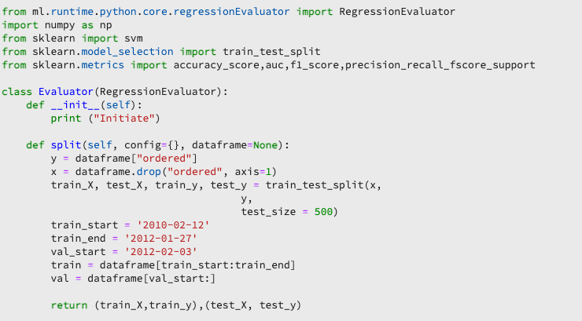

# Créer un modèle à l’aide de notebooks JupyterLab

>[!NOTE]
>
>Le Workspace de science des données ne peut plus être acheté.
>
>Cette documentation est destinée aux clients existants disposant de droits antérieurs sur Data Science Workspace.

Ce tutoriel vous guide tout au long des étapes requises pour créer un modèle à l’aide du modèle de créateur de recettes des notebooks JupyterLab .

## Concepts présentés :

- **Recettes :** une recette est un terme Adobe désignant une spécification de modèle et est un conteneur de niveau supérieur représentant un machine learning spécifique, un algorithme d’IA ou un ensemble d’algorithmes, une logique de traitement et la configuration requise pour créer et exécuter un modèle formé.
- **Modèle** : un modèle est une instance d’une recette de machine learning entraînée à l’aide de données historiques et de configurations dans le but de résoudre un cas d’usage commercial.
- **Formation :** la formation est le processus de formation de modèles et d’informations à partir de données étiquetées.
- **Notation :** la notation est le processus de génération d’informations à partir de données en utilisant un modèle formé.

## Téléchargement des ressources requises {#assets}

Avant de poursuivre ce tutoriel, vous devez créer les schémas et les jeux de données requis. Consultez le tutoriel sur la [création de jeux de données et de schémas de modèle de propension Luma](../models-recipes/create-luma-data.md) pour télécharger les ressources requises et configurer les prérequis.

## Prise en main de l’environnement des notebooks [!DNL JupyterLab]

Vous pouvez créer une recette à partir de zéro dans [!DNL Data Science Workspace]. Pour commencer, accédez à [Adobe Experience Platform](https://platform.adobe.com) et sélectionnez l’onglet **[!UICONTROL Notebooks]** sur la gauche. Pour créer un notebook , sélectionnez le modèle Créateur de recettes dans la [!DNL JupyterLab Launcher].

Le notebook [!UICONTROL Recipe Builder] vous permet d’exécuter des exécutions de formation et de notation dans le notebook . Vous avez ainsi la possibilité d’apporter des modifications à leurs méthodes de `train()` et de `score()` entre deux expériences en cours d’exécution sur les données de formation et de notation. Une fois que vous êtes satisfait des résultats de la formation et de la notation, vous pouvez créer une recette et la publier en tant que modèle à l’aide de la fonctionnalité Recette vers modèle .

>[!NOTE]
>
>Le notebook [!UICONTROL Recipe Builder] prend en charge l’utilisation de tous les formats de fichier, mais actuellement la fonctionnalité de création de recette ne prend en charge que les [!DNL Python].


Lorsque vous sélectionnez le notebook [!UICONTROL Recipe Builder] à partir du lanceur, le notebook est ouvert dans un nouvel onglet.

Dans le nouvel onglet du notebook, en haut, une barre d’outils se charge contenant trois actions supplémentaires : **[!UICONTROL Train]**, **[!UICONTROL Score]** et **[!UICONTROL Create Recipe]**. Ces icônes n’apparaissent que dans le notebook [!UICONTROL Recipe Builder]. Vous trouverez plus d’informations sur ces actions [dans la section Formation et notation](#training-and-scoring) après avoir créé votre recette dans le notebook.


## Prise en main du notebook [!UICONTROL Recipe Builder]

Le dossier de ressources fourni contient un `propensity_model.ipynb` de modèle de propension Luma . À l’aide de l’option de chargement de notebook dans JupyterLab, chargez le modèle fourni et ouvrez le notebook.


Le reste de ce tutoriel couvre les fichiers suivants qui sont prédéfinis dans le notebook de modèle de propension :

- [Fichier des exigences](#requirements-file)
- [Fichiers de configuration](#configuration-files)
- [Chargeur de données d’apprentissage](#training-data-loader)
- [Chargeur de données de notation](#scoring-data-loader)
- [Fichier Pipeline](#pipeline-file)
- [Fichier Evaluator](#evaluator-file)
- [Fichier Data Saver](#data-saver-file)

Le tutoriel vidéo suivant explique le notebook de modèle de propension Luma :

>[!VIDEO](https://video.tv.adobe.com/v/333570)

### Fichier des exigences {#requirements-file}

Le fichier d’exigences est utilisé pour déclarer les bibliothèques supplémentaires que vous souhaitez utiliser dans le modèle. En cas de dépendance, vous pouvez spécifier le numéro de version. Pour rechercher des bibliothèques supplémentaires, visitez [anaconda.org](https://anaconda.org). Pour savoir comment formater le fichier d’exigences, consultez [Conda](https://docs.conda.io/projects/conda/en/latest/user-guide/tasks/manage-environments.html#creating-an-environment-file-manually). Voici une liste non exhaustive des principales bibliothèques déjà utilisées :

```JSON
python=3.6.7
scikit-learn
pandas
numpy
data_access_sdk_python
```

>[!NOTE]
>
>Les bibliothèques ou versions spécifiques que vous ajoutez peuvent être incompatibles avec les bibliothèques ci-dessus. En outre, si vous choisissez de créer manuellement un fichier d’environnement, le champ `name` ne peut pas être remplacé.

Pour le notebook de modèle de propension Luma , les exigences n’ont pas besoin d’être mises à jour.

### Fichiers de configuration {#configuration-files}

Les fichiers de configuration, `training.conf` et `scoring.conf`, servent à spécifier les jeux de données que vous souhaitez utiliser pour la formation et la notation, et à ajouter des hyperparamètres. Les configurations pour la formation et la notation sont distinctes.

Pour qu’un modèle exécute une formation, vous devez fournir les `trainingDataSetId`, `ACP_DSW_TRAINING_XDM_SCHEMA` et `tenantId`. En outre, pour la notation, vous devez fournir les `scoringDataSetId`, `tenantId` et `scoringResultsDataSetId `.

Pour trouver les identifiants du jeu de données et du schéma, accédez à l’onglet Données  dans les notebooks sur la barre de navigation de gauche (sous l’icône de dossier). Trois identifiants de jeu de données différents doivent être fournis. Le `scoringResultsDataSetId` est utilisé pour stocker les résultats de notation du modèle et doit être un jeu de données vide. Ces jeux de données ont été créés précédemment dans l’étape [Ressources requises](#assets).


Vous trouverez les mêmes informations sur [Adobe Experience Platform](https://platform.adobe.com/) sous les onglets **[Schéma](https://platform.adobe.com/schema)** et **[Jeu de données](https://platform.adobe.com/dataset/overview)**.

Une fois l’opération terminée, votre configuration de formation et de notation doit ressembler à la capture d’écran suivante :


Par défaut, les paramètres de configuration suivants sont définis pour vous lorsque vous entraînez et notez des données :

- `ML_FRAMEWORK_IMS_USER_CLIENT_ID`
- `ML_FRAMEWORK_IMS_TOKEN`
- `ML_FRAMEWORK_IMS_ML_TOKEN`
- `ML_FRAMEWORK_IMS_TENANT_ID`

## Présentation du chargeur de données d’apprentissage {#training-data-loader}

Le chargeur de données d’apprentissage est destiné à instancier les données utilisées pour créer le modèle de machine learning. En règle générale, le chargeur de données d’entraînement effectue deux tâches :

- Chargement des données depuis [!DNL Experience Platform]
- Préparation des données et ingénierie des fonctionnalités

Les deux prochaines sections traiteront du chargement et de la préparation des données.

### Chargement des données {#loading-data}

Cette étape utilise le [cadre de données pandas](https://pandas.pydata.org/pandas-docs/stable/generated/pandas.DataFrame.html). Les données peuvent être chargées à partir de fichiers dans [!DNL Adobe Experience Platform] à l’aide de [!DNL Experience Platform] SDK (`platform_sdk`) ou à partir de sources externes à l’aide des fonctions `read_csv()` ou `read_json()` de pandas.

- [[!DNL Experience Platform SDK]](#platform-sdk)
- [Sources externes](#external-sources)

>[!NOTE]
>
>Dans le notebook du créateur de recettes, les données sont chargées via le chargeur de données `platform_sdk`.

### SDK [!DNL Experience Platform] {#platform-sdk}

Pour un tutoriel détaillé sur l’utilisation du chargeur de données `platform_sdk`, consultez le [guide Experience Platform SDK](../authoring/platform-sdk.md). Ce tutoriel fournit des informations sur l’authentification de création, la lecture et l’écriture basiques de données.

### Sources externes {#external-sources}

Cette section vous explique comment importer un fichier JSON ou CSV dans un objet pandas. La documentation officielle de la bibliothèque pandas se trouve ici :

- [read_csv](https://pandas.pydata.org/pandas-docs/stable/generated/pandas.read_csv.html)
- [read_json](https://pandas.pydata.org/pandas-docs/stable/generated/pandas.read_json.html)

Tout d’abord, voici un exemple d’importation d’un fichier CSV. L’argument `data` est le chemin d’accès au fichier CSV. Cette variable a été importée à partir de `configProperties` de la [section précédente](#configuration-files).

```PYTHON
df = pd.read_csv(data)
```

Vous pouvez également réaliser l’importation à partir d’un fichier JSON. L’argument `data` est le chemin d’accès au fichier CSV. Cette variable a été importée à partir de `configProperties` de la [section précédente](#configuration-files).

```PYTHON
df = pd.read_json(data)
```

Vos données se trouvent maintenant dans l’objet « cadre de données » et peuvent être analysées et manipulées dans la [section suivante](#data-preparation-and-feature-engineering).

## Fichier de chargement des données de formation

Dans cet exemple, les données sont chargées à l’aide du SDK Experience Platform. La bibliothèque peut être importée en haut de la page en incluant la ligne :

`from platform_sdk.dataset_reader import DatasetReader`

Vous pouvez ensuite utiliser la méthode `load()` pour récupérer le jeu de données d’entraînement du `trainingDataSetId` comme défini dans le fichier de configuration (`recipe.conf`).

```PYTHON
def load(config_properties):
    print("Training Data Load Start")

    #########################################
    # Load Data
    #########################################    
    client_context = get_client_context(config_properties)
    dataset_reader = DatasetReader(client_context, dataset_id=config_properties['trainingDataSetId'])
```

>[!NOTE]
>
>Comme indiqué dans la section [Fichier de configuration](#configuration-files), les paramètres de configuration ci-dessous sont définis pour vous lorsque vous accédez aux données d’Experience Platform à l’aide de `client_context = get_client_context(config_properties)` :
>
> - `ML_FRAMEWORK_IMS_USER_CLIENT_ID`
> - `ML_FRAMEWORK_IMS_TOKEN`
> - `ML_FRAMEWORK_IMS_ML_TOKEN`
> - `ML_FRAMEWORK_IMS_TENANT_ID`

Maintenant que vous disposez de vos données, vous pouvez commencer leur préparation ainsi que la conception des fonctionnalités.

### Préparation des données et ingénierie des fonctionnalités {#data-preparation-and-feature-engineering}

Une fois les données chargées, elles doivent être nettoyées et subir une préparation des données. Dans cet exemple, l’objectif du modèle est de prédire si un client va commander un produit ou non. Étant donné que le modèle ne s’intéresse pas à des produits spécifiques, vous n’avez pas besoin de `productListItems` et la colonne est donc supprimée. Ensuite, d’autres colonnes ne contenant qu’une ou deux valeurs dans une seule colonne sont ignorées. Lors de l’entraînement d’un modèle, il est important de ne conserver que les données utiles qui aideront à prédire votre objectif.


Une fois que vous avez supprimé toutes les données inutiles, vous pouvez commencer l’ingénierie des fonctionnalités. Les données de démonstration utilisées pour cet exemple ne contiennent aucune information de session. En règle générale, vous souhaiteriez disposer de données sur les sessions en cours et antérieures pour un client spécifique. En raison du manque d’informations sur la session, cet exemple imite plutôt les sessions actuelles et passées via la délimitation du parcours.


Une fois la délimitation terminée, les données sont étiquetées et un parcours est créé.


Ensuite, les fonctionnalités sont créées et divisées en passé et présent. Ensuite, toutes les colonnes inutiles sont supprimées, ce qui vous laisse avec les parcours passés et actuels pour les clients Luma. Ces parcours contiennent des informations telles que si un client a acheté un article et le parcours qu’il a effectué avant l’achat.


## Chargeur de données de notation {#scoring-data-loader}

La procédure de chargement des données pour la notation est similaire au chargement des données d’identification. En regardant attentivement le code, vous pouvez voir que tout est identique, à l’exception des `scoringDataSetId` dans le `dataset_reader`. Cela est dû au fait que la même source de données Luma est utilisée à la fois pour la formation et la notation.

Si vous souhaitez utiliser différents fichiers de données pour l’entraînement et la notation, le chargeur de données d’entraînement et de notation sont distincts. Vous pouvez ainsi effectuer un prétraitement supplémentaire, comme mapper les données de formation à vos données de notation, si nécessaire.

## Fichier Pipeline {#pipeline-file}

Le fichier `pipeline.py` comprend une logique de formation et de notation.

L’objectif de l’entraînement est de créer un modèle à l’aide des fonctionnalités et des libellés de votre jeu de données d’entraînement. Après avoir choisi votre modèle d’entraînement, vous devez adapter vos jeux de données d’entraînement x et y au modèle et la fonction renvoie le modèle entraîné.

>[!NOTE]
> 
>Les fonctionnalités font référence à la variable d’entrée utilisée par le modèle de machine learning pour prédire les libellés.


La fonction `score()` doit contenir l’algorithme de notation et renvoyer une mesure pour indiquer le degré de réussite du modèle. La fonction `score()` utilise les libellés des jeux de données de notation et le modèle formé pour générer un ensemble de fonctionnalités prédites. Ces valeurs prédites sont ensuite comparées aux fonctionnalités réelles du jeu de données de notation. Dans cet exemple, la fonction `score()` utilise le modèle formé pour prédire les fonctionnalités à l’aide des libellés du jeu de données de notation. Les fonctionnalités prédites sont renvoyées.


## Fichier Evaluator {#evaluator-file}

Le fichier `evaluator.py` contient une logique sur la manière dont vous souhaitez évaluer votre recette entraînée et sur la manière dont vos données d’entraînement doivent être fractionnées.

### Fractionnement du jeu de données {#split-the-dataset}

La phase de préparation des données pour la formation nécessite de fractionner le jeu de données à utiliser pour la formation et les tests. Ces données `val` sont utilisées implicitement pour évaluer le modèle après son entraînement. Il s’agit d’un processus distinct de celui de notation.

Cette section présente la fonction `split()` qui charge les données dans le notebook, puis nettoie les données en supprimant les colonnes non liées dans le jeu de données. À partir de là, vous pouvez effectuer l’ingénierie des fonctionnalités qui est le processus de création de fonctionnalités pertinentes supplémentaires à partir des fonctionnalités brutes existantes dans les données.



### Évaluation du modèle formé {#evaluate-the-trained-model}

La fonction `evaluate()` est exécutée après l’entraînement du modèle et renvoie une mesure pour indiquer la réussite des performances du modèle. La fonction `evaluate()` utilise les libellés du jeu de données de test et le modèle entraîné pour prédire un ensemble de fonctionnalités. Ces valeurs prédites sont ensuite comparées aux fonctionnalités réelles du jeu de données de test. Dans cet exemple, les mesures utilisées sont `precision`, `recall`, `f1` et `accuracy`. Vous remarquerez que la fonction renvoie un objet `metric` contenant un tableau de mesures d’évaluation. Ces mesures sont utilisées pour évaluer les performances du modèle formé.


L’ajout de `print(metric)` vous permet d’afficher les résultats de la mesure.


## Fichier Data Saver {#data-saver-file}

Le fichier `datasaver.py` contient la fonction `save()` et est utilisé pour enregistrer votre prédiction lors du test de la notation. La fonction `save()` récupère votre prédiction et écrit les données dans le [!DNL Experience Platform Catalog] spécifié dans votre fichier `scoringResultsDataSetId` à l’aide des API `scoring.conf`. Vous pouvez


## Formation et notation {#training-and-scoring}

Lorsque vous avez terminé d’apporter des modifications à votre notebook et que vous souhaitez entraîner votre recette, vous pouvez sélectionner les boutons associés dans la partie supérieure de la barre pour créer une exécution d’entraînement dans la cellule. Lorsque vous sélectionnez le bouton, un journal des commandes et des sorties du script d’entraînement s’affiche dans le notebook (sous la cellule `evaluator.py`). Conda installe d’abord toutes les dépendances, puis la formation commence.

Remarque : vous devez exécuter la formation au moins une fois avant de pouvoir exécuter la notation. Le fait de sélectionner le bouton **[!UICONTROL Run Scoring]** donne un score au modèle formé généré lors de l’entraînement. Le script de notation apparaît sous `datasaver.py`.

À des fins de débogage, si vous souhaitez afficher la sortie masquée, ajoutez `debug` à la fin de la cellule de sortie et exécutez-la de nouveau.


## Créer une recette {#create-recipe}

Une fois la modification de la recette terminée et le résultat de la formation/du score satisfait, vous pouvez créer une recette à partir du notebook en sélectionnant **[!UICONTROL Create Recipe]** dans le coin supérieur droit.


Après avoir sélectionné **[!UICONTROL Create Recipe]**, vous êtes invité à saisir un nom de recette. Ce nom représente la recette réelle créée le [!DNL Experience Platform].


Une fois que vous avez sélectionné **[!UICONTROL Ok]**, le processus de création de recette commence. Cela peut prendre un certain temps et une barre de progression s’affiche à la place du bouton Créer une recette . Une fois l’opération terminée, vous pouvez sélectionner le bouton **[!UICONTROL View Recipes]** pour accéder à l’onglet **[!UICONTROL Recipes]** sous **[!UICONTROL ML Models]**


>[!CAUTION]
>
> - Ne supprimer aucune cellule de fichier
> - Ne pas modifier la ligne `%%writefile` en haut des cellules de fichier
> - Ne pas créer plusieurs recettes dans différents cahiers simultanément

## Étapes suivantes {#next-steps}

En suivant ce tutoriel, vous avez appris à créer un modèle de machine learning dans le notebook [!UICONTROL Recipe Builder]. Vous avez également appris à faire fonctionner le workflow notebook vers recette.

Pour continuer à apprendre à utiliser les ressources dans [!DNL Data Science Workspace], consultez le menu déroulant [!DNL Data Science Workspace] des recettes et des modèles .