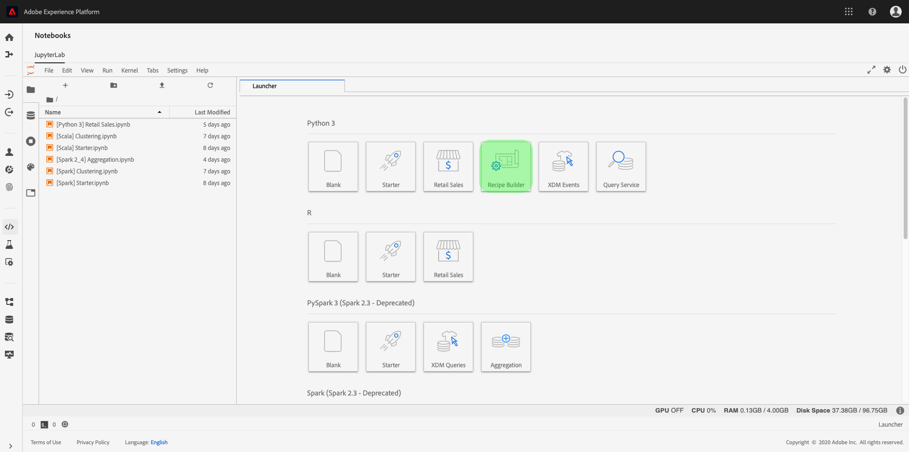
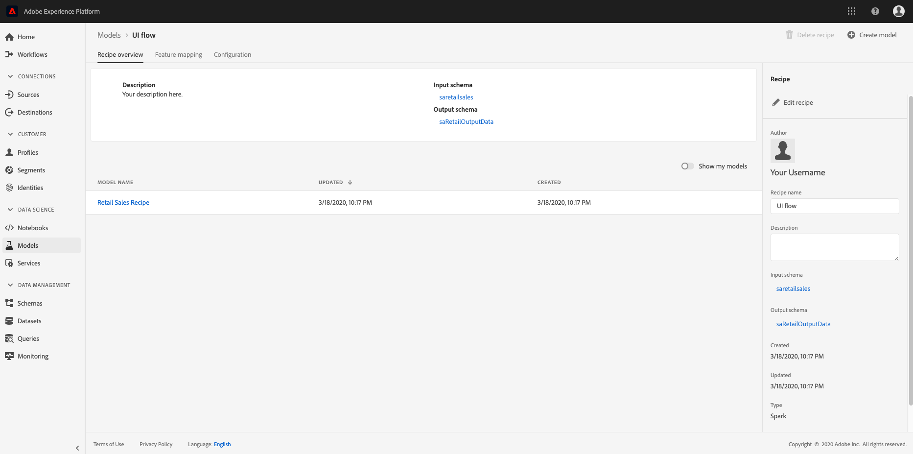

# Création d&#39;une recette à l&#39;aide de cahiers Jupyter

Ce didacticiel s&#39;articule autour de deux sections principales. Tout d&#39;abord, vous allez créer un modèle d&#39;apprentissage automatique à l&#39;aide d&#39;un modèle dans JupyterLab Notebook. Ensuite, vous allez utiliser le bloc-notes pour créer une recette dans l&#39;espace de travail Data Science Workspace dans JupyterLab.

## Concepts introduits :

- **Recettes :** Une recette est le terme utilisé par Adobe pour désigner une spécification de modèle. Il s’agit d’un conteneur de niveau supérieur qui représente un apprentissage automatique, un algorithme d’IA ou un ensemble d’algorithmes, une logique de traitement et une configuration nécessaires à la création et à l’exécution d’un modèle formé et qui contribue ainsi à résoudre des problèmes commerciaux spécifiques.
- **Modèle :** Un modèle est l&#39;instance d&#39;une recette d&#39;apprentissage automatique qui est formée à l&#39;aide de données historiques et de configurations pour résoudre un cas d&#39;utilisation commerciale.
- **Formation :** La formation est le processus d’apprentissage des schémas et des connaissances à partir de données étiquetées.
- **Scoring :** Le score est le processus de génération d’informations à partir de données à l’aide d’un modèle formé.

## Commencez avec l&#39;environnement d&#39;ordinateur portable JupyterLab

Vous pouvez créer une recette à partir de zéro dans Data Science Workspace. Pour début, accédez à [Adobe Experience Platform](https://platform.adobe.com) et cliquez sur l’ **[!UICONTROL Notebooks]** onglet à gauche. Créez un bloc-notes en sélectionnant le modèle Recipe Builder dans le lanceur JupyterLab.

Le bloc-notes Recipe Builder vous permet d&#39;exécuter des exécutions de formation et de score dans le bloc-notes. Vous disposez ainsi de la souplesse nécessaire pour modifier leurs `train()` méthodes et leurs `score()` méthodes entre les expériences en cours d’exécution sur les données de formation et de notation. Une fois que vous êtes satisfait des résultats de la formation et du score, vous pouvez créer une recette à utiliser dans Data Science Workspace à l&#39;aide du bloc-notes pour obtenir la fonctionnalité intégrée au bloc-notes du créateur de recettes.

>[!NOTE]
>Le bloc-notes Recipe Builder prend en charge l&#39;utilisation de tous les formats de fichier, mais actuellement, la fonctionnalité Create Recipe ne prend en charge que Python.



Lorsque vous cliquez sur le bloc-notes du Générateur de recettes depuis le lanceur, le bloc-notes s&#39;ouvre dans l&#39;onglet. Le modèle utilisé dans le bloc-notes est la Recette de prévision des ventes au détail Python qui se trouve également dans [ce référentiel public.](https://github.com/adobe/experience-platform-dsw-reference/tree/master/recipes/python/retail/)

Vous remarquerez que dans la barre d&#39;outils, il y a trois autres actions, à savoir - **[!UICONTROL Train]**, **[!UICONTROL Score]** et **[!UICONTROL Create Recipe]**. Ces icônes n&#39;apparaîtront que dans le bloc-notes Recipe Builder. Vous trouverez plus d&#39;informations sur ces actions [dans la section](#training-and-scoring) Formation et score après avoir créé votre Recette dans le bloc-notes.


## Apporter des modifications aux fichiers de recette

Pour apporter des modifications aux fichiers de recette, accédez à la cellule de Jupyter correspondant au chemin du fichier. Par exemple, si vous souhaitez apporter des modifications à `evaluator.py`, recherchez `%%writefile demo-recipe/evaluator.py`.

Début apportant les modifications nécessaires à la cellule et, une fois terminé, exécutez simplement la cellule. La `%%writefile filename.py` commande écrira le contenu de la cellule dans le `filename.py`. Vous devrez exécuter manuellement la cellule pour chaque fichier avec des modifications.

>[!NOTE] Vous devez exécuter les cellules manuellement, le cas échéant.

## Commencez avec le bloc-notes du Générateur de recettes

Maintenant que vous connaissez les bases de l&#39;environnement de portable JupyterLab, vous pouvez commencer à regarder les fichiers qui constituent une recette de modèle d&#39;apprentissage automatique. Les fichiers dont nous parlerons sont présentés ici :

- [Fichier requis](#requirements-file)
- [Fichiers de configuration](#configuration-files)
- [Chargeur de données de formation](#training-data-loader)
- [Chargeur de données de score](#scoring-data-loader)
- [Fichier de tuyau](#pipeline-file)
- [Fichier d’évaluation](#evaluator-file)
- [Fichier d’enregistrement de données](#data-saver-file)

### Fichier requis {#requirements-file}

Le fichier de configuration requise est utilisé pour déclarer les bibliothèques supplémentaires que vous souhaitez utiliser dans la recette. Vous pouvez spécifier le numéro de version en cas de dépendance. Pour rechercher d’autres bibliothèques, visitez https://anaconda.org. La liste des principales bibliothèques déjà utilisées comprend :

```JSON
python=3.5.2
scikit-learn
pandas
numpy
data_access_sdk_python
```

>[!NOTE]
>Les bibliothèques ou les versions spécifiques que vous ajoutez peuvent être incompatibles avec les bibliothèques ci-dessus.

### Fichiers de configuration {#configuration-files}

Les fichiers de configuration, `training.conf` et `scoring.conf`, sont utilisés pour spécifier les jeux de données à utiliser pour la formation et l’évaluation, ainsi que pour ajouter des hyperparamètres. Il existe des configurations distinctes pour la formation et la notation.

Les utilisateurs doivent renseigner les variables suivantes avant d’exécuter la formation et le score :
- `trainingDataSetId`
- `ACP_DSW_TRAINING_XDM_SCHEMA`
- `scoringDataSetId`
- `ACP_DSW_SCORING_RESULTS_XDM_SCHEMA`
- `scoringResultsDataSetId`

Pour trouver le jeu de données et les ID de schéma, accédez à l&#39;onglet Données des blocs-notes de la barre de navigation de gauche (sous l&#39;icône de dossier).


Les mêmes informations se trouvent sur [Adobe Experience Platform](https://platform.adobe.com/) sous les onglets **[Schéma](https://platform.adobe.com/schema)**et Jeu de**[données](https://platform.adobe.com/dataset/overview)** .

Par défaut, les paramètres de configuration suivants sont définis pour vous lorsque vous accédez aux données :

- `ML_FRAMEWORK_IMS_USER_CLIENT_ID`
- `ML_FRAMEWORK_IMS_TOKEN`
- `ML_FRAMEWORK_IMS_ML_TOKEN`
- `ML_FRAMEWORK_IMS_TENANT_ID`

## Chargeur de données de formation {#training-data-loader}

L’objectif du chargeur de données de formation est d’instancier les données utilisées pour créer le modèle d’apprentissage automatique. En règle générale, le chargeur de données de formation accomplira deux tâches :
- Charger les données de la plateforme
- Préparation des données et ingénierie des fonctionnalités

Les deux sections suivantes traitent du chargement des données et de la préparation des données.

### Chargement de données {#loading-data}

Cette étape utilise la base de données [](https://pandas.pydata.org/pandas-docs/stable/generated/pandas.DataFrame.html)pandas. Les données peuvent être chargées à partir de fichiers dans Adobe Experience Platform à l’aide du SDK de plate-forme (`platform_sdk`) ou à partir de sources externes à l’aide de pandas `read_csv()` ou `read_json()` de fonctions.

- [SDK de plate-forme](#platform-sdk)
- [Sources externes](#external-sources)

>[!NOTE]
>Dans le bloc-notes du créateur de recettes, les données sont chargées via le chargeur de `platform_sdk` données.

### SDK de plate-forme {#platform-sdk}

Pour consulter un didacticiel détaillé sur l’utilisation du chargeur de `platform_sdk` données, consultez le guide [](../authoring/platform-sdk.md)Platform SDK. Ce didacticiel fournit des informations sur l’authentification de création, la lecture de base des données et l’écriture de base des données.

### Sources externes {#external-sources}

Cette section vous explique comment importer un fichier JSON ou CSV dans un objet pandas. La documentation officielle de la bibliothèque des pandas se trouve ici :
- [read_csv](https://pandas.pydata.org/pandas-docs/stable/generated/pandas.read_csv.html)
- [read_json](https://pandas.pydata.org/pandas-docs/stable/generated/pandas.read_json.html)

Tout d’abord, voici un exemple d’importation d’un fichier CSV. L’ `data` argument est le chemin d’accès au fichier CSV. Cette variable a été importée à partir de la `configProperties` section [](#configuration-files)précédente.

```PYTHON
df = pd.read_csv(data)
```

Vous pouvez également importer à partir d’un fichier JSON. L’ `data` argument est le chemin d’accès au fichier CSV. Cette variable a été importée à partir de la `configProperties` section [](#configuration-files)précédente.

```PYTHON
df = pd.read_json(data)
```

Vos données se trouvent désormais dans l’objet dataframe et peuvent être analysées et manipulées dans la section [](#data-preparation-and-feature-engineering)suivante.

### À partir du SDK d’accès aux données (obsolète)

>[!CAUTION]
> `data_access_sdk_python` n’est plus recommandé, voir [Convertir le code d’accès aux données en SDK](../authoring/platform-sdk.md) de plateforme pour obtenir un guide sur l’utilisation du chargeur de `platform_sdk` données.

Les utilisateurs peuvent charger des données à l’aide du SDK d’accès aux données. La bibliothèque peut être importée en haut de la page en incluant la ligne :

`from data_access_sdk_python.reader import DataSetReader`

Nous utilisons ensuite la `load()` méthode pour récupérer le jeu de données d&#39;entraînement dans le `trainingDataSetId` fichier de configuration (`recipe.conf`).

```PYTHON
prodreader = DataSetReader(client_id=configProperties['ML_FRAMEWORK_IMS_USER_CLIENT_ID'],
                           user_token=configProperties['ML_FRAMEWORK_IMS_TOKEN'],
                           service_token=configProperties['ML_FRAMEWORK_IMS_ML_TOKEN'])

df = prodreader.load(data_set_id=configProperties['trainingDataSetId'],
                     ims_org=configProperties['ML_FRAMEWORK_IMS_TENANT_ID'])
```

>[!NOTE]
>Comme mentionné dans la section [Fichier de](#configuration-files)configuration, les paramètres de configuration suivants sont définis pour vous lorsque vous accédez aux données à partir d’Experience Platform :
> - `ML_FRAMEWORK_IMS_USER_CLIENT_ID`
> - `ML_FRAMEWORK_IMS_TOKEN`
> - `ML_FRAMEWORK_IMS_ML_TOKEN`
> - `ML_FRAMEWORK_IMS_TENANT_ID`


Maintenant que vous disposez de vos données, vous pouvez commencer par la préparation des données et l&#39;ingénierie des fonctionnalités.

### Préparation des données et ingénierie des fonctionnalités {#data-preparation-and-feature-engineering}

Une fois les données chargées, elles sont préparées et fractionnées dans les `train` jeux de données et `val` les jeux de données. L&#39;exemple de code est illustré ci-dessous :

```PYTHON
#########################################
# Data Preparation/Feature Engineering
#########################################
dataframe.date = pd.to_datetime(dataframe.date)
dataframe['week'] = dataframe.date.dt.week
dataframe['year'] = dataframe.date.dt.year

dataframe = pd.concat([dataframe, pd.get_dummies(dataframe['storeType'])], axis=1)
dataframe.drop('storeType', axis=1, inplace=True)
dataframe['isHoliday'] = dataframe['isHoliday'].astype(int)

dataframe['weeklySalesAhead'] = dataframe.shift(-45)['weeklySales']
dataframe['weeklySalesLag'] = dataframe.shift(45)['weeklySales']
dataframe['weeklySalesDiff'] = (dataframe['weeklySales'] - dataframe['weeklySalesLag']) / dataframe['weeklySalesLag']
dataframe.dropna(0, inplace=True)

dataframe = dataframe.set_index(dataframe.date)
dataframe.drop('date', axis=1, inplace=True) 
```

Dans cet exemple, le jeu de données d’origine comporte cinq éléments :
- ajouter `week` et `year` colonnes
- convertir `storeType` en variable indicateur
- convertir `isHoliday` en variable numérique
- compenser `weeklySales` pour obtenir la valeur des ventes futures et passées
- fractionner les données, par date, au `train` jeu de données et `val` au jeu de données

Tout d&#39;abord, `week` et `year` des colonnes sont créées et la `date` colonne d&#39;origine convertie en Python [datetime](https://pandas.pydata.org/pandas-docs/stable/generated/pandas.to_datetime.html). Les valeurs Semaine et Année sont extraites de l’objet datetime.

Ensuite, `storeType` est converti en trois colonnes représentant les trois types de magasins différents (`A`, `B`et `C`). Chacun contient une valeur booléenne à l’état qui `storeType` est true. La `storeType` colonne sera supprimée.

De même, `weeklySales` change le `isHoliday` booléen en une représentation numérique, un ou zéro.

Ces données sont fractionnées entre `train` et le `val` jeu de données.

La `load()` fonction doit se terminer avec le `train` jeu de données et `val` comme sortie.

### Chargeur de données de score {#scoring-data-loader}

La procédure de chargement des données pour l’évaluation est similaire au chargement des données d’identification dans la `split()` fonction. Nous utilisons le SDK d&#39;accès aux données pour charger les données provenant du `scoringDataSetId` fichier trouvé dans notre `recipe.conf` fichier.

```PYTHON
def load(configProperties):

    print("Scoring Data Load Start")

    #########################################
    # Load Data
    #########################################
    prodreader = DataSetReader(client_id=configProperties['ML_FRAMEWORK_IMS_USER_CLIENT_ID'],
                               user_token=configProperties['ML_FRAMEWORK_IMS_TOKEN'],
                               service_token=configProperties['ML_FRAMEWORK_IMS_ML_TOKEN'])

    df = prodreader.load(data_set_id=configProperties['scoringDataSetId'],
                         ims_org=configProperties['ML_FRAMEWORK_IMS_TENANT_ID'])
```

Une fois les données chargées, la préparation des données et l’ingénierie des fonctionnalités sont effectuées.

```PYTHON
#########################################
# Data Preparation/Feature Engineering
#########################################
df.date = pd.to_datetime(df.date)
df['week'] = df.date.dt.week
df['year'] = df.date.dt.year

df = pd.concat([df, pd.get_dummies(df['storeType'])], axis=1)
df.drop('storeType', axis=1, inplace=True)
df['isHoliday'] = df['isHoliday'].astype(int)

df['weeklySalesAhead'] = df.shift(-45)['weeklySales']
df['weeklySalesLag'] = df.shift(45)['weeklySales']
df['weeklySalesDiff'] = (df['weeklySales'] - df['weeklySalesLag']) / df['weeklySalesLag']
df.dropna(0, inplace=True)

df = df.set_index(df.date)
df.drop('date', axis=1, inplace=True)

print("Scoring Data Load Finish")

return df
```

Puisque notre modèle a pour but de prédire les ventes hebdomadaires futures, vous devrez créer un jeu de données de notation utilisé pour évaluer les performances de la prévision du modèle.

Ce bloc-notes Recipe Builder le fait en compensant nos ventes hebdomadaires de 7 jours à l&#39;avance. Notez qu&#39;il existe des mesures pour 45 magasins chaque semaine afin que vous puissiez transférer les `weeklySales` valeurs 45 jeux de données vers une nouvelle colonne appelée `weeklySalesAhead`.

```PYTHON
df['weeklySalesAhead'] = df.shift(-45)['weeklySales']
```

De même, vous pouvez créer une colonne `weeklySalesLag` en déplaçant 45 vers le passé. Vous pouvez également calculer la différence dans les ventes hebdomadaires et les stocker dans une colonne `weeklySalesDiff`.

```PYTHON
df['weeklySalesLag'] = df.shift(45)['weeklySales']
df['weeklySalesDiff'] = (df['weeklySales'] - df['weeklySalesLag']) / df['weeklySalesLag']
```

Puisque vous compliquez les `weeklySales` jeux de données 45 points à l’avant et 45 à l’arrière pour créer de nouvelles colonnes, les 45 premiers et derniers points de données auront des valeurs NaN. Vous pouvez supprimer ces points de notre jeu de données en utilisant la `df.dropna()` fonction qui supprime toutes les lignes qui ont des valeurs NaN.

```PYTHON
df.dropna(0, inplace=True)
```

La `load()` fonction de votre chargeur de données de score doit être renseignée avec le jeu de données de score comme sortie.

### Fichier de tuyau {#pipeline-file}

Le `pipeline.py` fichier inclut la logique de formation et de notation.

### Formation {#training}

La formation a pour but de créer un modèle à l’aide de fonctions et d’étiquettes dans votre jeu de données de formation.

>[!NOTE]\
>_Les fonctionnalités_ se rapportent à la variable d’entrée utilisée par le modèle d’apprentissage automatique pour prédire les _étiquettes_.

La `train()` fonction doit inclure le modèle d&#39;entraînement et renvoyer le modèle formé. Vous trouverez quelques exemples de différents modèles dans la documentation [du guide d&#39;utilisation](https://scikit-learn.org/stable/user_guide.html)scikit-learn.

Après avoir choisi votre modèle de formation, vous ajusterez votre jeu de données de formation x et y au modèle et la fonction retournera le modèle formé. Voici un exemple qui illustre cette situation :

```PYTHON
def train(configProperties, data):

    print("Train Start")

    #########################################
    # Extract fields from configProperties
    #########################################
    learning_rate = float(configProperties['learning_rate'])
    n_estimators = int(configProperties['n_estimators'])
    max_depth = int(configProperties['max_depth'])


    #########################################
    # Fit model
    #########################################
    X_train = data.drop('weeklySalesAhead', axis=1).values
    y_train = data['weeklySalesAhead'].values

    seed = 1234
    model = GradientBoostingRegressor(learning_rate=learning_rate,
                                      n_estimators=n_estimators,
                                      max_depth=max_depth,
                                      random_state=seed)

    model.fit(X_train, y_train)

    print("Train Complete")

    return model
```

Notez que selon votre application, vous aurez des arguments dans votre `GradientBoostingRegressor()` fonction. `xTrainingDataset` doit contenir les fonctions utilisées pour la formation, tandis que `yTrainingDataset` doit contenir les étiquettes.

### Scores {#scoring}

La `score()` fonction doit contenir l’algorithme de notation et renvoyer une mesure pour indiquer comment le modèle fonctionne correctement. La `score()` fonction utilise les étiquettes des jeux de données de score et le modèle entraîné pour générer un ensemble de fonctions prédites. Ces valeurs prédites sont ensuite comparées aux fonctionnalités réelles du jeu de données de score. Dans cet exemple, la `score()` fonction utilise le modèle entraîné pour prédire les fonctionnalités à l’aide des libellés du jeu de données de score. Les fonctions prévues sont renvoyées.

```PYTHON
def score(configProperties, data, model):

    print("Score Start")

    X_test = data.drop('weeklySalesAhead', axis=1).values
    y_test = data['weeklySalesAhead'].values
    y_pred = model.predict(X_test)

    data['prediction'] = y_pred
    data = data[['store', 'prediction']].reset_index()
    data['date'] = data['date'].astype(str)

    print("Score Complete")

    return data
```

### Fichier d’évaluation {#evaluator-file}

Le `evaluator.py` fichier contient la logique permettant d&#39;évaluer votre recette de formation ainsi que la manière dont vos données de formation doivent être fractionnées. Dans l&#39;exemple des ventes au détail, la logique de chargement et de préparation des données de formation sera incluse. Nous allons passer en revue les deux sections ci-dessous.

### Fractionner le jeu de données {#split-the-dataset}

La phase de préparation des données pour la formation nécessite la division du jeu de données à utiliser pour la formation et les tests. Ces `val` données seront utilisées implicitement pour évaluer le modèle après sa formation. Ce processus est distinct de la notation.

Cette section présente la `split()` fonction qui chargera d&#39;abord les données dans le bloc-notes, puis nettoiera les données en supprimant les colonnes non liées dans le jeu de données. De là, vous pourrez effectuer l&#39;ingénierie des fonctions, qui est le processus de création de fonctions pertinentes supplémentaires à partir des fonctions brutes existantes dans les données. Vous trouverez ci-dessous un exemple de ce processus accompagné d’une explication.

La `split()` fonction est illustrée ci-dessous. La base de données fournie dans l&#39;argument sera fractionnée en fonction des variables `train` et `val` des variables à renvoyer.

```PYTHON
def split(self, configProperties={}, dataframe=None):
    train_start = '2010-02-12'
    train_end = '2012-01-27'
    val_start = '2012-02-03'
    train = dataframe[train_start:train_end]
    val = dataframe[val_start:]

    return train, val
```

### Évaluer le modèle formé {#evaluate-the-trained-model}

La `evaluate()` fonction est exécutée après la formation du modèle et renvoie une mesure pour indiquer comment le modèle fonctionne correctement. La `evaluate()` fonction utilise les étiquettes des jeux de données de test et le modèle Formé pour prédire un ensemble de fonctionnalités. Ces valeurs prédites sont ensuite comparées aux fonctionnalités réelles du jeu de données de test. Les algorithmes de notation courants incluent :
- [Erreur moyenne en pourcentage absolu (MAPE)](https://en.wikipedia.org/wiki/Mean_absolute_percentage_error)
- [Erreur absolue moyenne (MAE)](https://en.wikipedia.org/wiki/Mean_absolute_error)
- [Erreur racine-moyenne-carrée (RMSE)](https://en.wikipedia.org/wiki/Root-mean-square_deviation)


La `evaluate()` fonction de l’exemple de vente au détail est illustrée ci-dessous :

```PYTHON
def evaluate(self, data=[], model={}, configProperties={}):
    print ("Evaluation evaluate triggered")
    val = data.drop('weeklySalesAhead', axis=1)
    y_pred = model.predict(val)
    y_actual = data['weeklySalesAhead'].values
    mape = np.mean(np.abs((y_actual - y_pred) / y_actual))
    mae = np.mean(np.abs(y_actual - y_pred))
    rmse = np.sqrt(np.mean((y_actual - y_pred) ** 2))

    metric = [{"name": "MAPE", "value": mape, "valueType": "double"},
                {"name": "MAE", "value": mae, "valueType": "double"},
                {"name": "RMSE", "value": rmse, "valueType": "double"}]

    return metric
```

Notez que la fonction renvoie un `metric` objet contenant un tableau de mesures d’évaluation. Ces mesures seront utilisées pour évaluer les performances du modèle formé.

### Fichier d’enregistrement de données {#data-saver-file}

Le `datasaver.py` fichier contient la `save()` fonction permettant d’enregistrer votre prédiction lors du test du score. La `save()` fonction prend vos prédictions et utilise les API du catalogue de plateformes d’expérience, écrit les données dans le `scoringResultsDataSetId` fichier que vous avez spécifié dans votre `scoring.conf` fichier.

L&#39;exemple utilisé dans l&#39;exemple de recette de vente au détail est illustré ici. Notez l’utilisation de `DataSetWriter` la bibliothèque pour écrire des données sur la plate-forme :

```PYTHON
from data_access_sdk_python.writer import DataSetWriter

def save(configProperties, prediction):
    print("Datasaver Start")
    print("Setting up Writer")

    catalog_url = "https://platform.adobe.io/data/foundation/catalog"
    ingestion_url = "https://platform.adobe.io/data/foundation/import"

    writer = DataSetWriter(catalog_url=catalog_url,
                           ingestion_url=ingestion_url,
                           client_id=configProperties['ML_FRAMEWORK_IMS_USER_CLIENT_ID'],
                           user_token=configProperties['ML_FRAMEWORK_IMS_TOKEN'],
                           service_token=configProperties['ML_FRAMEWORK_IMS_ML_TOKEN'])

    print("Writer Configured")

    writer.write(data_set_id=configProperties['scoringResultsDataSetId'],
                 dataframe=prediction,
                 ims_org=configProperties['ML_FRAMEWORK_IMS_TENANT_ID'])

    print("Write Done")
    print("Datasaver Finish")
    print(prediction)
```

## Formation et notation {#training-and-scoring}

Lorsque vous avez terminé d&#39;apporter des modifications à votre bloc-notes et que vous souhaitez former votre recette, vous pouvez cliquer sur les boutons associés en haut de la barre pour créer une session de formation dans la cellule. Lorsque vous cliquez sur le bouton, un journal des commandes et des sorties du script d&#39;entraînement s&#39;affiche dans le bloc-notes (sous la `evaluator.py` cellule). Conda installe d&#39;abord toutes les dépendances, puis la formation est initiée.

Notez que vous devez exécuter la formation au moins une fois avant de pouvoir exécuter la notation. Cliquez sur le **[!UICONTROL Run Scoring]** bouton pour obtenir un score sur le modèle de formation qui a été généré pendant la formation. Le script d’évaluation s’affiche sous `datasaver.py`.

Pour le débogage, si vous souhaitez afficher la sortie masquée, ajoutez `debug` à la fin de la cellule de sortie et réexécutez-la.

## Créer une recette {#create-recipe}

Lorsque vous avez terminé de modifier la recette et que vous êtes satisfait de la sortie formation/score, vous pouvez créer une recette à partir du bloc-notes en appuyant sur **[!UICONTROL Create Recipe]** la barre de navigation supérieure droite.


Après avoir appuyé sur le bouton, vous êtes invité à saisir un nom de recette. Ce nom représente la recette réelle créée sur la plate-forme.


Une fois que vous avez appuyé sur **[!UICONTROL Ok]** vous pourrez accéder à la nouvelle recette sur [Adobe Experience Platform](https://platform.adobe.com/). Vous pouvez cliquer sur le **[!UICONTROL View Recipes]** bouton pour accéder à l’ **[!UICONTROL Recipes]** onglet sous **[!UICONTROL ML Models]**


Une fois le processus terminé, la recette ressemblera à ce qui suit :



>[!CAUTION]
> - Ne supprimez aucune des cellules de fichier
> - Ne modifiez pas la `%%writefile` ligne en haut des cellules du fichier.
> - Ne pas créer simultanément des recettes dans différents blocs-notes


## Étapes suivantes {#next-steps}

En suivant ce didacticiel, vous avez appris à créer un modèle d&#39;apprentissage automatique dans le bloc-notes du Générateur de recettes. Vous avez également appris à utiliser le bloc-notes pour créer une recette dans l&#39;espace de travail Data Science Workspace.

Pour continuer à apprendre à utiliser les ressources dans Data Science Workspace, consultez la liste déroulante Recettes et modèles de Data Science Workspace.

## Ressources supplémentaires {#additional-resources}

La vidéo suivante est conçue pour vous aider à comprendre comment créer et déployer des modèles.

>[!VIDEO](https://video.tv.adobe.com/v/30575?quality=12&enable10seconds=on&speedcontrol=on)


