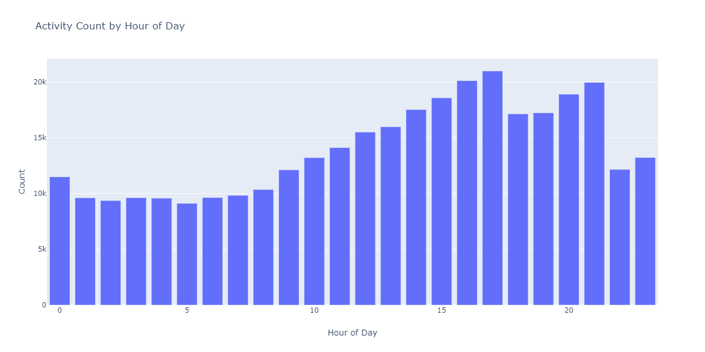

# Exploration de données en ligne pour des modèles prédictifs à l&#39;aide du bloc-notes de l&#39;analyse de données exploratoires (EDA)

Le bloc-notes de l&#39;analyse de données exploratoires (EDA) est conçu pour vous aider à découvrir les schémas des données, à vérifier la qualité des données et à résumer les données pertinentes pour les modèles prédictifs.

L&#39;exemple de bloc-notes EDA a été optimisé en tenant compte des données Web et se compose de deux parties. Débuts de la première partie avec l&#39;utilisation de Requête Service pour les tendances de vue et les instantanés de données. Ensuite, avec un objectif en tête pour l&#39;analyse des données exploratoires, les données sont agrégées au niveau du profil et du visiteur.

Deux débuts en effectuant une analyse descriptive sur des données agrégées à l&#39;aide des bibliothèques Python. Ce bloc-notes présente des visualisations telles que des histogrammes, des tracés de dispersion, des tracés de boîtes et une matrice de corrélation afin de dégager des informations exploitables utilisées pour déterminer les fonctionnalités les plus susceptibles d&#39;être utiles pour prédire un objectif.

## Prise en main

Avant de lire ce guide, consultez le [[!DNL JupyterLab] guide d&#39;utilisateur](./overview.md) pour une présentation de haut niveau de [!DNL JupyterLab] et de son rôle dans Data Science Workspace. De plus, si vous utilisez vos propres données, veuillez consulter la documentation relative à l&#39;[accès aux données dans [!DNL Jupyterlab] portables](./access-notebook-data.md). Ce guide contient des informations importantes sur les limites de données des ordinateurs portables.

Ce bloc-notes utilise un jeu de données de valeurs moyennes sous la forme de données Adobe Analytics Experience Événements trouvées dans Analytics Analysis Workspace. Pour utiliser le bloc-notes EDA, vous devez définir votre table de données avec les valeurs `target_table` et `target_table_id` suivantes. Tout jeu de données de valeurs moyennes peut être utilisé.

Pour rechercher ces valeurs, suivez les étapes décrites dans la section [écriture dans un jeu de données dans python](./access-notebook-data.md#write-python) du guide d&#39;accès aux données JupyterLab. Le nom du jeu de données (`target_table`) se trouve dans le répertoire du jeu de données. Une fois que vous avez cliqué avec le bouton droit sur le jeu de données pour explorer ou écrire des données dans un bloc-notes, un ID de jeu de données (`target_table_id`) est fourni dans l&#39;entrée de code exécutable.

## Détection des données

Cette section contient des étapes de configuration et des exemples de requêtes utilisées pour les tendances de vue, telles que &quot;les dix principales villes par activité d&#39;utilisateur&quot; ou &quot;les dix premiers produits consultés&quot;.

### Configuration des bibliothèques

JupyterLab prend en charge plusieurs bibliothèques. Le code suivant peut être collé et exécuté dans une cellule de code pour collecter et installer tous les packages requis utilisés dans cet exemple. Vous pouvez utiliser d’autres packages ou d’autres packages en dehors de cet exemple pour votre propre analyse de données. Pour une liste des packages pris en charge, copiez et collez `!pip list --format=columns` dans une nouvelle cellule.

```python
!pip install colorama
import chart_studio.plotly as py
import plotly.graph_objs as go
from plotly.offline import iplot
from scipy import stats
import numpy as np
import warnings
warnings.filterwarnings('ignore')
from scipy.stats import pearsonr
import matplotlib.pyplot as plt
from scipy.stats import pearsonr
import pandas as pd
import math
import re
import seaborn as sns
from datetime import datetime
import colorama
from colorama import Fore, Style
pd.set_option('display.max_columns', None)
pd.set_option('display.max_rows', None)
pd.set_option('display.width', 1000)
pd.set_option('display.expand_frame_repr', False)
pd.set_option('display.max_colwidth', -1)
```

### Connexion à Adobe Experience Platform [!DNL Query Service]

[!DNL JupyterLab] sur la plate-forme vous permet d&#39;utiliser SQL dans un  [!DNL Python] bloc-notes pour accéder aux données via  [Requête Service](https://docs.adobe.com/content/help/fr-FR/experience-platform/query/home.html). L&#39;accès aux données via [!DNL Query Service] peut s&#39;avérer utile pour traiter des jeux de données volumineux en raison de ses délais d&#39;exécution supérieurs. Notez que l&#39;interrogation de données à l&#39;aide de [!DNL Query Service] a une durée de traitement limitée à dix minutes.

Avant d&#39;utiliser [!DNL Query Service] dans [!DNL JupyterLab], assurez-vous de bien comprendre la syntaxe [[!DNL Query Service] SQL](https://docs.adobe.com/content/help/fr-FR/experience-platform/query/home.html#!api-specification/markdown/narrative/technical_overview/query-service/sql/syntax.md).

Pour utiliser Query Service dans JupyterLab, vous devez d’abord créer une connexion entre votre notebook Python de travail et Query Service. Pour ce faire, exécutez la cellule suivante.

```python
qs_connect()
```

### Définir le jeu de données de valeurs moyennes pour l’exploration

Pour commencer à interroger et à explorer les données, une table de jeux de données de valeurs moyennes doit être fournie. Copiez et remplacez les valeurs `table_name` et `table_id` par vos propres valeurs de table de données.

```python
target_table = "table_name"
target_table_id = "table_id"
```

Une fois terminée, cette cellule doit ressembler à l’exemple suivant :

```python
target_table = "cross_industry_demo_midvalues"
target_table_id = "5f7c40ef488de5194ba0157a"
```

### Explorer le jeu de données pour les dates disponibles

A l’aide de la cellule ci-dessous, vous pouvez vue la plage de dates couverte dans le tableau. L’objectif de l’exploration du nombre de jours, de la première date et de la dernière date est de faciliter la sélection d’une plage de dates pour une analyse ultérieure.

```python
%%read_sql -c QS_CONNECTION
SELECT distinct Year(timestamp) as Year, Month(timestamp) as Month, count(distinct DAY(timestamp)) as Count_days, min(DAY(timestamp)) as First_date, max(DAY(timestamp)) as Last_date, count(timestamp) as Count_hits
from {target_table}
group by Month(timestamp), Year(timestamp)
order by Year, Month;
```

L’exécution de la cellule génère la sortie suivante :


### Configurer des dates pour la découverte de jeux de données

Après avoir déterminé les dates disponibles pour la découverte de jeux de données, les paramètres ci-dessous doivent être mis à jour. Les dates configurées dans cette cellule ne sont utilisées que pour la découverte de données sous la forme de requêtes. Les dates sont à nouveau mises à jour vers des plages appropriées pour l&#39;analyse de données exploratoires plus loin dans ce guide.

```python
target_year = "2020" ## The target year
target_month = "02" ## The target month
target_day = "(01,02,03)" ## The target days
```

### Découverte des données

Après avoir configuré tous vos paramètres, démarré [!DNL Query Service] et défini une plage de dates, vous êtes prêt à commencer à lire les lignes de données. Vous devez limiter le nombre de lignes lues.

```python
from platform_sdk.dataset_reader import DatasetReader
from datetime import date
dataset_reader = DatasetReader(PLATFORM_SDK_CLIENT_CONTEXT, dataset_id=target_table_id)
# If you do not see any data or would like to expand the default date range, change the following query
Table = dataset_reader.limit(5).read()
```

Pour vue du nombre de colonnes disponibles dans le jeu de données, utilisez la cellule suivante :

```python
print("\nNumber of columns:",len(Table.columns))
```

Pour vue des lignes du jeu de données, utilisez la cellule suivante. Dans cet exemple, le nombre de lignes est limité à cinq.

```python
Table.head(5)
```


Une fois que vous avez une idée des données contenues dans le jeu de données, il peut s’avérer utile de ventiler davantage le jeu de données. Dans cet exemple, les noms des colonnes et les types de données de chacune des colonnes sont répertoriés, tandis que la sortie est utilisée pour vérifier si le type de données est correct ou non.

```python
ColumnNames_Types = pd.DataFrame(Table.dtypes)
ColumnNames_Types = ColumnNames_Types.reset_index()
ColumnNames_Types.columns = ["Column_Name", "Data_Type"]
ColumnNames_Types
```


### Exploration des tendances des jeux de données

La section suivante contient quatre exemples de requêtes utilisées pour explorer les tendances et les modèles dans les données. Les exemples fournis ci-dessous ne sont pas exhaustifs, mais ils couvrent certaines des caractéristiques les plus courantes.

**Nombre d&#39;activités horaires pour un jour donné**

Cette requête analyse le nombre d’actions et de clics tout au long de la journée. La sortie est représentée sous la forme d’un tableau contenant des mesures sur le nombre d’activités pour chaque heure de la journée.

```sql
%%read_sql query_2_df -c QS_CONNECTION

SELECT Substring(timestamp, 12, 2)                        AS Hour, 
       Count(enduserids._experience.aaid.id) AS Count 
FROM   {target_table}
WHERE  Year(timestamp) = {target_year} 
       AND Month(timestamp) = {target_month}  
       AND Day(timestamp) in {target_day}
GROUP  BY Hour
ORDER  BY Hour;
```


Après avoir confirmé le fonctionnement de la requête, les données peuvent être présentées dans un histogramme unifié de traçage pour une clarté visuelle.

```python
trace = go.Bar(
    x = query_2_df['Hour'],
    y = query_2_df['Count'],
    name = "Activity Count"
)

layout = go.Layout(
    title = 'Activity Count by Hour of Day',
    width = 1200,
    height = 600,
    xaxis = dict(title = 'Hour of Day'),
    yaxis = dict(title = 'Count')
)

fig = go.Figure(data = [trace], layout = layout)
iplot(fig)
```



**Les 10 pages les plus consultées pour un jour donné**

Cette requête analyse les pages les plus consultées pour un jour donné. La sortie est représentée sous la forme d’un tableau contenant les mesures sur le nom de la page et le nombre de vues de page.

```sql
%%read_sql query_4_df -c QS_CONNECTION

SELECT web.webpagedetails.name                 AS Page_Name, 
       Sum(web.webpagedetails.pageviews.value) AS Page_Views 
FROM   {target_table}
WHERE  Year(timestamp) = {target_year}
       AND Month(timestamp) = {target_month}
       AND Day(timestamp) in {target_day}
GROUP  BY web.webpagedetails.name 
ORDER  BY page_views DESC 
LIMIT  10;
```

Après avoir confirmé le fonctionnement de la requête, les données peuvent être présentées dans un histogramme unifié de traçage pour une clarté visuelle.

```python
trace = go.Bar(
    x = query_4_df['Page_Name'],
    y = query_4_df['Page_Views'],
    name = "Page Views"
)

layout = go.Layout(
    title = 'Top Ten Viewed Pages For a Given Day',
    width = 1000,
    height = 600,
    xaxis = dict(title = 'Page_Name'),
    yaxis = dict(title = 'Page_Views')
)

fig = go.Figure(data = [trace], layout = layout)
iplot(fig)
```


**Les dix premières villes regroupées par activité d&#39;utilisateurs**

Cette requête analyse les villes d&#39;où proviennent les données.

```sql
%%read_sql query_6_df -c QS_CONNECTION

SELECT concat(placeContext.geo.stateProvince, ' - ', placeContext.geo.city) AS state_city, 
       Count(timestamp)                                                     AS Count
FROM   {target_table}
WHERE  Year(timestamp) = {target_year}
       AND Month(timestamp) = {target_month}
       AND Day(timestamp) in {target_day}
GROUP  BY state_city
ORDER  BY Count DESC
LIMIT  10;
```

Après avoir confirmé le fonctionnement de la requête, les données peuvent être présentées dans un histogramme unifié de traçage pour une clarté visuelle.

```python
trace = go.Bar(
    x = query_6_df['state_city'],
    y = query_6_df['Count'],
    name = "Activity by City"
)

layout = go.Layout(
    title = 'Top Ten Cities by User Activity',
    width = 1200,
    height = 600,
    xaxis = dict(title = 'City'),
    yaxis = dict(title = 'Count')
)

fig = go.Figure(data = [trace], layout = layout)
iplot(fig)
```


**Dix produits les plus consultés**

Cette requête fournit une liste des dix premiers produits consultés. Dans l&#39;exemple ci-dessous, la fonction `Explode()` est utilisée pour renvoyer chaque produit de l&#39;objet `productlistitems` à sa propre ligne. Cela vous permet d’effectuer une requête imbriquée pour agrégat des vues de produits pour différents SKU.

```sql
%%read_sql query_7_df -c QS_CONNECTION

SELECT Product_List_Items.sku AS Product_SKU,
       Sum(Product_Views) AS Total_Product_Views
FROM  (SELECT Explode(productlistitems) AS Product_List_Items, 
              commerce.productviews.value   AS Product_Views 
       FROM   {target_table}
       WHERE  Year(timestamp) = {target_year}
              AND Month(timestamp) = {target_month}
              AND Day(timestamp) in {target_day}
              AND commerce.productviews.value IS NOT NULL) 
GROUP BY Product_SKU 
ORDER BY Total_Product_Views DESC
LIMIT  10;
```

Après avoir confirmé le fonctionnement de la requête, les données peuvent être présentées dans un histogramme unifié de traçage pour une clarté visuelle.

```python
trace = go.Bar(
    x = "SKU-" + query_7_df['Product_SKU'],
    y = query_7_df['Total_Product_Views'],
    name = "Product View"
)

layout = go.Layout(
    title = 'Top Ten Viewed Products',
    width = 1200,
    height = 600,
    xaxis = dict(title = 'SKU'),
    yaxis = dict(title = 'Product View Count')
)

fig = go.Figure(data = [trace], layout = layout)
iplot(fig)
```


Après avoir exploré les tendances et les schémas des données, vous devriez avoir une bonne idée des fonctions que vous souhaitez créer pour prédire un objectif. L’utilisation de tableaux peut rapidement mettre en évidence la forme de chaque attribut de données, les fausses représentations évidentes et les valeurs et le début de valeurs aberrantes pour suggérer des relations entre les attributs.

## Analyse de données exploratoires

L’analyse de données exploratoires permet d’affiner votre compréhension des données et de créer une intuition pour répondre à des questions convaincantes qui peuvent servir de base à votre modélisation.

Après avoir terminé l’étape de découverte des données, vous aurez exploré les données au niveau du événement avec quelques agrégations au niveau du événement, de la ville ou de l’ID utilisateur pour afficher les tendances pour une journée. Bien que ces données soient importantes, elles ne donnent pas une vue d&#39;ensemble. Vous ne comprenez toujours pas ce qui motive un achat sur votre site Web.

Pour comprendre cela, vous devez agrégat les données au niveau du profil/visiteur, définir un objectif d’achat et appliquer des concepts statistiques tels que la corrélation, les diagrammes de zones et les tracés de dispersion. Ces méthodes sont utilisées pour comparer les schémas des activités pour les acheteurs par rapport aux non-acheteurs dans la fenêtre de prédiction que vous définissez.

Les fonctionnalités suivantes sont créées et explorées dans cette section :

- `COUNT_UNIQUE_PRODUCTS_PURCHASED`: Nombre de produits uniques achetés.
- `COUNT_CHECK_OUTS`: Nombre de passages en caisse.
- `COUNT_PURCHASES`: Nombre d’achats.
- `COUNT_INSTANCE_PRODUCTADDS`: Nombre d’instances d’ajout de produit.
- `NUMBER_VISITS` : Nombre de visites.
- `COUNT_PAID_SEARCHES`: Nombre de recherches payantes.
- `DAYS_SINCE_VISIT`: Nombre de jours écoulés depuis la dernière visite.
- `TOTAL_ORDER_REVENUE`: Recettes totales de la commande.
- `DAYS_SINCE_PURCHASE`: Nombre de jours écoulés depuis l’achat précédent.
- `AVG_GAP_BETWEEN_ORDERS_DAYS`: L&#39;écart moyen entre les achats en jours.
- `STATE_CITY`: Contient l’état et la ville.

Avant de poursuivre l’agrégation des données, vous devez définir les paramètres de la variable de prédiction utilisée dans l’analyse de données exploratoires. En d&#39;autres termes, que voulez-vous de votre modèle de science des données ? Les paramètres courants incluent un objectif, une période de prédiction et une période d’analyse.

Si vous utilisez le bloc-notes EDA, vous devez remplacer les valeurs ci-dessous avant de continuer.

```python
goal = "commerce.`order`.purchaseID" #### prediction variable
goal_column_type = "numerical" #### choose either "categorical" or "numerical"
prediction_window_day_start = "2020-01-01" #### YYYY-MM-DD
prediction_window_day_end = "2020-01-31" #### YYYY-MM-DD
analysis_period_day_start = "2020-02-01" #### YYYY-MM-DD
analysis_period_day_end = "2020-02-28" #### YYYY-MM-DD

### If the goal is a categorical goal then select threshold for the defining category and creating bins. 0 is no order placed, and 1 is at least one order placed:
threshold = 1
```

### Agrégation des données pour la création de fonctionnalités et d’objectifs

Pour commencer l&#39;analyse exploratoire, vous devez créer un objectif au niveau du profil, puis agréger votre jeu de données. Dans cet exemple, deux requêtes sont fournies. La première requête contient la création d’un objectif. La deuxième requête doit être mise à jour pour inclure toutes les variables autres que celles de la première requête. Vous pouvez mettre à jour `limit` pour votre requête. Après avoir exécuté les requêtes suivantes, des données agrégées sont désormais disponibles pour l’exploration.

```sql
%%read_sql target_df -d -c QS_CONNECTION

SELECT DISTINCT endUserIDs._experience.aaid.id                  AS ID,
       Count({goal})                                            AS TARGET
FROM   {target_table}
WHERE DATE(TIMESTAMP) BETWEEN '{prediction_window_day_start}' AND '{prediction_window_day_end}'
GROUP BY endUserIDs._experience.aaid.id;
```

```sql
%%read_sql agg_data -d -c QS_CONNECTION

SELECT z.*, z1.state_city as STATE_CITY
from
((SELECT y.*,a2.AVG_GAP_BETWEEN_ORDERS_DAYS as AVG_GAP_BETWEEN_ORDERS_DAYS
from
(select a1.*, f.DAYS_SINCE_PURCHASE as DAYS_SINCE_PURCHASE
from
(SELECT DISTINCT a.ID  AS ID,
COUNT(DISTINCT Product_Items.SKU) as COUNT_UNIQUE_PRODUCTS_PURCHASED,
COUNT(a.check_out) as COUNT_CHECK_OUTS,
COUNT(a.purchases) as COUNT_PURCHASES, 
COUNT(a.product_list_adds) as COUNT_INSTANCE_PRODUCTADDS,
sum(CASE WHEN a.search_paid = 'TRUE' THEN 1 ELSE 0 END) as COUNT_PAID_SEARCHES,
DATEDIFF('{analysis_period_day_end}', MAX(a.date_a)) as DAYS_SINCE_VISIT,
ROUND(SUM(Product_Items.priceTotal * Product_Items.quantity), 2) AS TOTAL_ORDER_REVENUE
from 
(SELECT endUserIDs._experience.aaid.id as ID,
commerce.`checkouts`.value as check_out,
commerce.`order`.purchaseID as purchases, 
commerce.`productListAdds`.value as product_list_adds,
search.isPaid as search_paid,
DATE(TIMESTAMP) as date_a,
Explode(productlistitems) AS Product_Items
from {target_table}
Where DATE(TIMESTAMP) BETWEEN '{analysis_period_day_start}' AND '{analysis_period_day_end}') as a
group by a.ID) as a1
left join 
(SELECT DISTINCT endUserIDs._experience.aaid.id as ID,
DATEDIFF('{analysis_period_day_end}', max(DATE(TIMESTAMP))) as DAYS_SINCE_PURCHASE
from {target_table}
where DATE(TIMESTAMP) BETWEEN '{analysis_period_day_start}' AND '{analysis_period_day_end}'
and commerce.`order`.purchaseid is not null
GROUP BY endUserIDs._experience.aaid.id) as f
on f.ID = a1.ID
where a1.COUNT_PURCHASES>0) as y
left join
(select ab.ID, avg(DATEDIFF(ab.ORDER_DATES, ab.PriorDate)) as AVG_GAP_BETWEEN_ORDERS_DAYS
from
(SELECT distinct endUserIDs._experience.aaid.id as ID, TO_DATE(DATE(TIMESTAMP)) as ORDER_DATES, 
TO_DATE(LAG(DATE(TIMESTAMP),1) OVER (PARTITION BY endUserIDs._experience.aaid.id ORDER BY DATE(TIMESTAMP))) as PriorDate
FROM {target_table}
where DATE(TIMESTAMP) BETWEEN '{analysis_period_day_start}' AND '{analysis_period_day_end}'
AND commerce.`order`.purchaseid is not null) AS ab
where ab.PriorDate is not null
GROUP BY ab.ID) as a2
on a2.ID = y.ID) z    
left join
(select t.ID, t.state_city from
(
SELECT DISTINCT endUserIDs._experience.aaid.id as ID,
concat(placeContext.geo.stateProvince, ' - ', placeContext.geo.city) as state_city, 
ROW_NUMBER() OVER(PARTITION BY endUserIDs._experience.aaid.id ORDER BY DATE(TIMESTAMP) DESC) AS ROWNUMBER
FROM   {target_table}
WHERE  DATE(TIMESTAMP) BETWEEN '{analysis_period_day_start}' AND '{analysis_period_day_end}') as t
where t.ROWNUMBER = 1) z1
on z.ID = z1.ID)
limit 500000;
```

### Fusionner les fonctionnalités du jeu de données agrégé avec un objectif

La cellule suivante permet de fusionner les fonctionnalités du jeu de données agrégé décrit dans l’exemple précédent avec votre objectif de prévision.

```python
Data = pd.merge(agg_data,target_df, on='ID',how='left')
Data['TARGET'].fillna(0, inplace=True)
```

Les trois cellules suivantes sont utilisées pour s’assurer que la fusion a réussi.

`Data.shape` renvoie le nombre de colonnes suivi du nombre de lignes par exemple : (1913, 12).

```python
Data.shape
```

`Data.head(5)` renvoie un tableau contenant 5 lignes de données. Le tableau renvoyé contient les 12 colonnes de données agrégées associées à un ID de profil.

```python
Data.head(5)
```


Cette cellule imprime le nombre de profils uniques.

```python
print("Count of unique profiles :", (len(Data)))
```

### Détecter les valeurs manquantes et les valeurs aberrantes

Une fois que vous avez terminé l’agrégation des données et que vous l’avez fusionnée avec votre objectif, vous devez examiner les données parfois appelées vérification d’intégrité des données.

Ce processus implique d&#39;identifier les valeurs manquantes et les valeurs aberrantes. Lorsque des problèmes sont identifiés, la tâche suivante consiste à élaborer des stratégies spécifiques pour les résoudre.

>[!NOTE]
>
>Au cours de cette étape, vous pouvez détecter une corruption dans les valeurs qui peut signaler une erreur dans le processus de consignation des données.

```python
Missing = pd.DataFrame(round(Data.isnull().sum()*100/len(Data),2))
Missing.columns =['Percentage_missing_values'] 
Missing['Features'] = Missing.index
```

La cellule suivante permet de visualiser les valeurs manquantes.

```python
trace = go.Bar(
    x = Missing['Features'],
    y = Missing['Percentage_missing_values'],
    name = "Percentage_missing_values")

layout = go.Layout(
    title = 'Missing values',
    width = 1200,
    height = 600,
    xaxis = dict(title = 'Features'),
    yaxis = dict(title = 'Percentage of missing values')
)

fig = go.Figure(data = [trace], layout = layout)
iplot(fig)
```


Après avoir détecté des valeurs manquantes, il est essentiel d&#39;identifier les valeurs aberrantes. Les statistiques paramétriques telles que la moyenne, l&#39;écart type et la corrélation sont très sensibles aux valeurs aberrantes. En outre, les hypothèses des procédures statistiques communes, telles que les régressions linéaires, sont également fondées sur ces statistiques. Cela signifie que les valeurs aberrantes peuvent vraiment gâcher une analyse.

Pour identifier les valeurs aberrantes, cet exemple utilise une plage interquartile. L&#39;intervalle interquartile (IQR) est l&#39;intervalle entre le premier et le troisième quartile (25e et 75e percentiles). Cet exemple rassemble tous les points de données qui tombent sous 1,5 fois le QI sous le 25e percentile, ou 1,5 fois le QI au-dessus du 75e percentile. Les valeurs qui tombent sous l’une ou l’autre de ces valeurs sont définies comme une valeur aberrante dans la cellule suivante.

>[!TIP]
>
>Pour corriger les valeurs aberrantes, vous devez connaître l&#39;entreprise et l&#39;industrie dans lesquelles vous travaillez. Parfois, vous ne pouvez pas laisser tomber une observation juste parce que c&#39;est une exception. Les valeurs aberrantes peuvent être des observations légitimes et sont souvent les plus intéressantes. Pour en savoir plus sur la suppression des valeurs aberrantes, consultez l&#39;[étape facultative de nettoyage des données](#optional-data-clean).

```python
TARGET = Data.TARGET

Data_numerical = Data.select_dtypes(include=['float64', 'int64'])
Data_numerical.drop(['TARGET'],axis = 1,inplace = True)
Data_numerical1 = Data_numerical

for i in range(0,len(Data_numerical1.columns)):
    Q1 = Data_numerical1.iloc[:,i].quantile(0.25)
    Q3 = Data_numerical1.iloc[:,i].quantile(0.75)
    IQR = Q3 - Q1
    Data_numerical1.iloc[:,i] = np.where(Data_numerical1.iloc[:,i]<(Q1 - 1.5 * IQR),np.nan, np.where(Data_numerical1.iloc[:,i]>(Q3 + 1.5 * IQR),
                                                                                                    np.nan,Data_numerical1.iloc[:,i]))
    
Outlier = pd.DataFrame(round(Data_numerical1.isnull().sum()*100/len(Data),2))
Outlier.columns =['Percentage_outliers'] 
Outlier['Features'] = Outlier.index   
```

Comme toujours, il est important de visualiser les résultats.

```python
trace = go.Bar(
    x = Outlier['Features'],
    y = Outlier['Percentage_outliers'],
    name = "Percentage_outlier")

layout = go.Layout(
    title = 'Outliers',
    width = 1200,
    height = 600,
    xaxis = dict(title = 'Features'),
    yaxis = dict(title = 'Percentage of outliers')
)

fig = go.Figure(data = [trace], layout = layout)
iplot(fig)
```


### Analyse unifiée

Une fois vos données corrigées pour tenir compte des valeurs manquantes et des valeurs aberrantes, vous pouvez début votre analyse. Il existe trois types d&#39;analyse : analyse unifiée, bivariée et multivariée. L’analyse univariée prend les données, les synthétise et les détecte à l’aide de relations variables uniques. L’analyse binaire examine plusieurs variables à la fois, tandis que l’analyse multivariée examine trois variables ou plus à la fois.

L’exemple suivant montre comment générer un tableau pour visualiser la distribution des fonctionnalités.

```python
Data_numerical = Data.select_dtypes(include=['float64', 'int64'])
distribution = pd.DataFrame([Data_numerical.count(),Data_numerical.mean(),Data_numerical.quantile(0), Data_numerical.quantile(0.01),
                             Data_numerical.quantile(0.05),Data_numerical.quantile(0.25), Data_numerical.quantile(0.5),
                        Data_numerical.quantile(0.75),  Data_numerical.quantile(0.95),Data_numerical.quantile(0.99), Data_numerical.max()])
distribution = distribution.T
distribution.columns = ['Count', 'Mean', 'Min', '1st_perc','5th_perc','25th_perc', '50th_perc','75th_perc','95th_perc','99th_perc','Max']
distribution
```


Une fois que vous avez distribué les fonctionnalités, vous pouvez créer des graphiques de données visualisés à l’aide d’un tableau. Les cellules suivantes permettent de visualiser le tableau ci-dessus avec des données numériques.

```python
A = sns.palplot(sns.color_palette("Blues"))
```

```python
for column in Data_numerical.columns[0:]:
    plt.figure(figsize=(5, 4))
    plt.ticklabel_format(style='plain', axis='y')
    sns.distplot(Data_numerical[column], color = A, kde=False, bins=6, hist_kws={'alpha': 0.4});
```


### Données catégoriques

Le regroupement de données catégoriques permet de comprendre les valeurs contenues dans chacune des colonnes de données agrégées et leur répartition. Cet exemple utilise les 10 premières catégories pour faciliter le mappage des distributions. Il est important de noter qu’une colonne peut contenir des milliers de valeurs uniques. Vous ne souhaitez pas rendre un tracé encombré rendant celui-ci illisible. En gardant à l’esprit vos objectifs commerciaux, le regroupement des données produit des résultats plus significatifs.

```python
Data_categorical = Data.select_dtypes(include='object')
Data_categorical.drop(['ID'], axis = 1, inplace = True, errors = 'ignore')
```

```python
for column in Data_categorical.columns[0:]:
    if (len(Data_categorical[column].value_counts())>10):
        plt.figure(figsize=(12, 8))
        sns.countplot(x=column, data = Data_categorical, order = Data_categorical[column].value_counts().iloc[:10].index, palette="Set2");
    else:
        plt.figure(figsize=(12, 8))
        sns.countplot(x=column, data = Data_categorical, palette="Set2");
```


### Supprimer les colonnes avec une seule valeur distincte

Les colonnes qui n’ont qu’une seule valeur n’ajoutent aucune information à l’analyse et peuvent être supprimées.

```python
for col in Data.columns:
    if len(Data[col].unique()) == 1:
        if col == 'TARGET':
            print(Fore.RED + '\033[1m' + 'WARNING : TARGET HAS A SINGLE UNIQUE VALUE, ANY BIVARIATE ANALYSIS (NEXT STEP IN THIS NOTEBOOK) OR PREDICTION WILL BE MEANINGLESS' + Fore.RESET + '\x1b[21m')
        elif col == 'ID':
            print(Fore.RED + '\033[1m' + 'WARNING : THERE IS ONLY ONE PROFILE IN THE DATA, ANY BIVARIATE ANALYSIS (NEXT STEP IN THIS NOTEBOOK) OR PREDICTION WILL BE MEANINGLESS' + Fore.RESET + '\x1b[21m')
        else:
            print('Dropped column :',col)
            Data.drop(col,inplace=True,axis=1)
```

Une fois que vous avez supprimé les colonnes à valeur unique, vérifiez les autres colonnes à la recherche d&#39;erreurs à l&#39;aide de la commande `Data.columns` dans une nouvelle cellule.

### Correction des valeurs manquantes

La section suivante présente quelques exemples d’approches pour corriger les valeurs manquantes. Événement bien que dans les données ci-dessus, une seule colonne n’avait pas de valeur, les cellules d’exemple en dessous des valeurs correctes pour tous les types de données. Ces cas comprennent notamment :

- Types de données numériques : entrée 0 ou max le cas échéant
- Types de données catégorielles : valeur modale d&#39;entrée

```python
#### Select only numerical data
Data_numerical = Data.select_dtypes(include=['float64', 'int64'])

#### For columns that contain days we impute max days of history for null values, for rest all we impute 0

# Imputing days with max days of history
Days_cols = [col for col in Data_numerical.columns if 'DAYS_' in col]
d1 = datetime.strptime(analysis_period_day_start, "%Y-%m-%d")
d2 = datetime.strptime(analysis_period_day_end, "%Y-%m-%d")
A = abs((d2 - d1).days)

for column in Days_cols:
    Data[column].fillna(A, inplace=True)

# Imputing 0
Data_numerical = Data.select_dtypes(include=['float64', 'int64'])
Missing_numerical = Data_numerical.columns[Data_numerical.isnull().any()].tolist()

for column in Missing_numerical:
    Data[column].fillna(0, inplace=True)
```

```python
#### Correct for missing values in categorical columns (Replace with mode)
Data_categorical = Data.select_dtypes(include='object')
Missing_cat = Data_categorical.columns[Data_categorical.isnull().any()].tolist() 
for column in Missing_cat:
    Data[column].fillna(Data[column].mode()[0], inplace=True)
```

Une fois les données propres terminées, elles sont prêtes à l&#39;analyse.

### Analyse bivarisée

L’analyse binaire est utilisée pour aider à comprendre la relation entre deux ensembles de valeurs, tels que vos fonctionnalités et une variable de cible. Comme les différents tracés correspondent aux types de données catégoriques et numériques, cette analyse doit être effectuée séparément pour chaque type de données. Les graphiques suivants sont recommandés pour l’analyse bivariée :

- **Corrélation** : Un coefficient de corrélation est la mesure de la force d&#39;une relation entre deux caractéristiques. La corrélation contient des valeurs comprises entre -1 et 1, où : 1 indique une forte relation positive, -1 indique une forte relation négative et un résultat de zéro indique aucune relation.
- **Tracé** de paires : Les tracés de paires sont un moyen simple de visualiser les relations entre chaque variable. Il produit une matrice des relations entre chaque variable des données.
- **Carte thermique** : Les cartes thermiques sont le coefficient de corrélation pour toutes les variables du jeu de données.
- **Tracés** de zones : Les diagrammes en boîte sont une façon normalisée d&#39;afficher la distribution des données sur la base d&#39;un résumé à cinq chiffres (minimum, premier quartile (Q1), médian, troisième quartile (Q3) et maximum).
- **Compter le graphique** : Un graphique de décompte est comme un histogramme ou un graphique à barres pour certaines caractéristiques catégoriques. Il indique le nombre d’occurrences d’un élément en fonction d’un certain type de catégorie.

Pour comprendre la relation entre la variable &quot;objectif&quot; et les prédicteurs/fonctionnalités, les graphiques sont utilisés en fonction des types de données. Pour les fonctions numériques, vous devez utiliser un graphique de zone si la variable &quot;objectif&quot; est catégorique, ainsi qu’un graphique de paires et une carte de chaleur si la variable &quot;objectif&quot; est numérique.

Pour les fonctionnalités catégoriques, vous devez utiliser un compteur si la variable &quot;objectif&quot; est catégorique, ainsi qu’un graphique de zone si la variable &quot;objectif&quot; est numérique. L&#39;utilisation de ces méthodes permet de comprendre les relations. Ces relations peuvent prendre la forme de caractéristiques, ou de prédicteurs et d&#39;un objectif.

**Prédicteurs numériques**

```python
if len(Data) == 1:
    print(Fore.RED + '\033[1m' + 'THERE IS ONLY ONE PROFILE IN THE DATA, BIVARIATE ANALYSIS IS NOT APPLICABLE, PLEASE INCLUDE AT LEAST ONE MORE PROFILE TO DO BIVARIATE ANALYSIS')
elif len(Data['TARGET'].unique()) == 1:
    print(Fore.RED + '\033[1m' + 'TARGET HAS A SINGLE UNIQUE VALUE, BIVARIATE ANALYSIS IS NOT APPLICABLE, PLEASE INCLUDE PROFILES WITH ATLEAST ONE DIFFERENT VALUE OF TARGET TO DO BIVARIATE ANALYSIS')
else:
    if (goal_column_type == "categorical"):
        TARGET_categorical = pd.DataFrame(np.where(TARGET>=threshold,"1","0"))
        TARGET_categorical.rename(columns={TARGET_categorical.columns[0]: "TARGET_categorical" }, inplace = True)
        Data_numerical = Data.select_dtypes(include=['float64', 'int64'])
        Data_numerical.drop(['TARGET'],inplace=True,axis=1)
        Data_numerical = pd.concat([Data_numerical, TARGET_categorical.astype(int)], axis = 1)
        ncols_for_charts = len(Data_numerical.columns)-1
        nrows_for_charts = math.ceil(ncols_for_charts/4)
        fig, axes = plt.subplots(nrows=nrows_for_charts, ncols=4, figsize=(18, 15))
        for idx, feat in enumerate(Data_numerical.columns[:-1]):
            ax = axes[int(idx // 4), idx % 4]
            sns.boxplot(x='TARGET_categorical', y=feat, data=Data_numerical, ax=ax)
            ax.set_xlabel('')
            ax.set_ylabel(feat)
            fig.tight_layout();
    else:
        Data_numerical = Data.select_dtypes(include=['float64', 'int64'])
        TARGET = pd.DataFrame(Data_numerical.TARGET)
        Data_numerical = Data.select_dtypes(include=['float64', 'int64'])
        Data_numerical.drop(['TARGET'],inplace=True,axis=1)
        Data_numerical = pd.concat([Data_numerical, TARGET.astype(int)], axis = 1)
        for i in Data_numerical.columns[:-1]:
            sns.pairplot(x_vars=i, y_vars=['TARGET'], data=Data_numerical, height = 4)
        f, ax = plt.subplots(figsize = (10,8))
        corr = Data_numerical.corr()
```

L’exécution de la cellule génère les sorties suivantes :


**Prédicteurs catégoriels**

L’exemple suivant est utilisé pour tracer et vue les diagrammes de fréquence des 10 premières catégories de chaque variable catégorique.

```python
if len(Data) == 1:
    print(Fore.RED + '\033[1m' + 'THERE IS ONLY ONE PROFILE IN THE DATA, BIVARIATE ANALYSIS IS NOT APPLICABLE, PLEASE INCLUDE AT LEAST ONE MORE PROFILE TO DO BIVARIATE ANALYSIS')
elif len(Data['TARGET'].unique()) == 1:
    print(Fore.RED + '\033[1m' + 'TARGET HAS A SINGLE UNIQUE VALUE, BIVARIATE ANALYSIS IS NOT APPLICABLE, PLEASE INCLUDE PROFILES WITH ATLEAST ONE DIFFERENT VALUE OF TARGET TO DO BIVARIATE ANALYSIS')
else:
    if (goal_column_type == "categorical"):
        TARGET_categorical = pd.DataFrame(np.where(TARGET>=threshold,"1","0"))
        TARGET_categorical.rename(columns={TARGET_categorical.columns[0]: "TARGET_categorical" }, inplace = True)
        Data_categorical = Data.select_dtypes(include='object')
        Data_categorical.drop(["ID"], axis =1, inplace = True)
        Cat_columns = Data_categorical
        Data_categorical = pd.concat([TARGET_categorical,Data_categorical], axis =1)
        for column in Cat_columns.columns:
            A = Data_categorical[column].value_counts().iloc[:10].index
            Data_categorical1 = Data_categorical[Data_categorical[column].isin(A)]
            plt.figure(figsize=(12, 8))
            sns.countplot(x="TARGET_categorical",hue=column, data = Data_categorical1, palette = 'Blues')
            plt.xlabel("GOAL")
            plt.ylabel("COUNT")
            plt.show();
    else:
        Data_categorical = Data.select_dtypes(include='object')
        Data_categorical.drop(["ID"], axis =1, inplace = True)
        Target = Data.TARGET
        Data_categorical = pd.concat([Data_categorical,Target], axis =1)
        for column in Data_categorical.columns[:-1]:
            A = Data_categorical[column].value_counts().iloc[:10].index
            Data_categorical1 = Data_categorical[Data_categorical[column].isin(A)]
            sns.catplot(x=column, y="TARGET", kind = "boxen", data =Data_categorical1, height=5, aspect=13/5);
```

L’exécution de la cellule génère la sortie suivante :


### Fonctions numériques importantes

A l’aide de l’analyse de corrélation, vous pouvez créer une liste des dix principales fonctions numériques. Ces fonctionnalités peuvent toutes être utilisées pour prédire la fonctionnalité &quot;objectif&quot;. Cette liste peut être utilisée comme liste de fonctionnalités lorsque vous début de créer votre modèle.

```python
if len(Data) == 1:
    print(Fore.RED + '\033[1m' + 'THERE IS ONLY ONE PROFILE IN THE DATA, BIVARIATE ANALYSIS IS NOT APPLICABLE, PLEASE INCLUDE AT LEAST ONE MORE PROFILE TO FIND IMPORTANT VARIABLES')
elif len(Data['TARGET'].unique()) == 1:
    print(Fore.RED + '\033[1m' + 'TARGET HAS A SINGLE UNIQUE VALUE, BIVARIATE ANALYSIS IS NOT APPLICABLE, PLEASE INCLUDE PROFILES WITH ATLEAST ONE DIFFERENT VALUE OF TARGET TO FIND IMPORTANT VARIABLES')
else:
    Data_numerical = Data.select_dtypes(include=['float64', 'int64'])
    Correlation = pd.DataFrame(Data_numerical.drop("TARGET", axis=1).apply(lambda x: x.corr(Data_numerical.TARGET)))
    Correlation['Corr_abs'] = abs(Correlation)
    Correlation = Correlation.sort_values(by = 'Corr_abs', ascending = False)
    Imp_features = pd.DataFrame(Correlation.index[0:10])
    Imp_features.rename(columns={0:'Important Feature'}, inplace=True)
    print(Imp_features)
```


### Exemple d’informations

Pendant que vous analysez vos données, il n’est pas rare de découvrir des informations. L’exemple suivant présente une information qui mappe la récence et la valeur monétaire d’un événement de cible.

```python
# Proxy for monetary value is TOTAL_ORDER_REVENUE and proxy for frequency is NUMBER_VISITS
if len(Data) == 1:
    print(Fore.RED + '\033[1m' + 'THERE IS ONLY ONE PROFILE IN THE DATA, INSIGHTS ANALYSIS IS NOT APPLICABLE, PLEASE INCLUDE AT LEAST ONE MORE PROFILE TO FIND IMPORTANT VARIABLES')
elif len(Data['TARGET'].unique()) == 1:
    print(Fore.RED + '\033[1m' + 'TARGET HAS A SINGLE UNIQUE VALUE, INSIGHTS ANALYSIS IS NOT APPLICABLE, PLEASE INCLUDE PROFILES WITH ATLEAST ONE DIFFERENT VALUE OF TARGET TO FIND IMPORTANT VARIABLES')
else:
    sns.lmplot("DAYS_SINCE_VISIT", "TOTAL_ORDER_REVENUE", Data, hue="TARGET", fit_reg=False);
```


## Étape facultative de nettoyage des données {#optional-data-clean}

Pour corriger les valeurs aberrantes, vous devez connaître l&#39;entreprise et l&#39;industrie dans lesquelles vous travaillez. Parfois, vous ne pouvez pas laisser tomber une observation juste parce que c&#39;est une exception. Les valeurs aberrantes peuvent être des observations légitimes et sont souvent les plus intéressantes.

Pour plus d&#39;informations sur les valeurs aberrantes et sur leur abandon ou non, lisez cette entrée du [facteur d&#39;analyse](https://www.theanalysisfactor.com/outliers-to-drop-or-not-to-drop/).

L&#39;exemple suivant montre comment les cellules capitalisent et plantent des points de données qui sont des valeurs aberrantes en utilisant [plage interquartile](https://www.thoughtco.com/what-is-the-interquartile-range-rule-3126244).

```python
TARGET = Data.TARGET

Data_numerical = Data.select_dtypes(include=['float64', 'int64'])
Data_numerical.drop(['TARGET'],axis = 1,inplace = True)

for i in range(0,len(Data_numerical.columns)):
    Q1 = Data_numerical.iloc[:,i].quantile(0.25)
    Q3 = Data_numerical.iloc[:,i].quantile(0.75)
    IQR = Q3 - Q1
    Data_numerical.iloc[:,i] = np.where(Data_numerical.iloc[:,i]<(Q1 - 1.5 * IQR), (Q1 - 1.5 * IQR), np.where(Data_numerical.iloc[:,i]>(Q3 + 1.5 * IQR),
                                                                                                     (Q3 + 1.5 * IQR),Data_numerical.iloc[:,i]))
Data_categorical = Data.select_dtypes(include='object')
Data = pd.concat([Data_categorical, Data_numerical, TARGET], axis = 1)
```

## Étapes suivantes

Une fois votre analyse de données exploratoires terminée, vous êtes prêt à commencer à créer un modèle. Vous pouvez également utiliser les données et les statistiques que vous avez dérivées pour créer un tableau de bord avec des outils tels que le Power BI.

Adobe Experience Platform sépare le processus de création de modèle en deux étapes distinctes, Recettes (une instance de modèle) et Modèles. Pour commencer le processus de création de la recette, consultez la documentation de [création d&#39;une recette dans les blocs-notes JupyerLab](./create-a-recipe.md). Ce document contient des informations et des exemples pour la création, la formation et la notation, une recette dans les [!DNL JupyterLab] blocs-notes.
