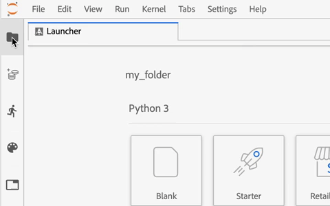

# Guide de l&#39;utilisateur de JupyterLab

JupyterLab est une interface utilisateur Web pour <a href="https://jupyter.org/" target="_blank">Project Jupyter</a> et est étroitement intégré à Adobe Experience Platform. Il fournit un de développement interactif  pour que les scientifiques de données puissent travailler avec des ordinateurs portables, du code et des données Jupyter.

Ce donne un aperçu de JupyterLab et de ses fonctionnalités ainsi que des instructions pour effectuer des actions courantes.

## JupyterLab sur la plateforme d’expérience

L’intégration JupyterLab de la plate-forme d’expérience s’accompagne de modifications architecturales, de considérations de conception, d’extensions personnalisées pour les ordinateurs portables, de bibliothèques préinstallées et d’une interface sur le thème Adobe.

Le suivant présente quelques-unes des fonctionnalités propres à JupyterLab sur la plate-forme :

| Fonction | Description |
| --- | --- |
| **Noisettes** | Les noyaux fournissent un bloc-notes et d&#39;autres interfaces JupyterLab permettant d&#39;exécuter et d&#39;introduire du code dans différents langages de programmation. Experience Platform fournit des noyaux supplémentaires pour prendre en charge le développement en Python, R, PySpark et Spark. Consultez la section [Noisettes](#kernels) pour plus de détails. |
| **Accès aux données** | Accédez aux jeux de données existants directement depuis JupyterLab avec la prise en charge complète des fonctionnalités de lecture et d’écriture. |
| **Intégration du service de plateforme** | Les intégrations intégrées vous permettent d’utiliser d’autres services de plateformes directement depuis JupyterLab. Un complet des intégrations prises en charge est fourni dans la section relative à [l’intégration avec d’autres services](#service-integration)de plateforme. |
| **Authentification** | Outre le modèle <a href="https://jupyter-notebook.readthedocs.io/en/latest/security.html" target="_blank">de sécurité intégré de</a>JupyterLab, chaque interaction entre votre application et la plateforme d’expérience, y compris la communication service-service de plateforme, est chiffrée et authentifiée par le biais du système de gestion des identités <a href="https://www.adobe.io/authentication/auth-methods.html" target="_blank">Adobe (IMS)</a>. |
| **Bibliothèques de développement** | Dans Experience Platform, JupyterLab fournit des bibliothèques préinstallées pour Python, R et PySpark. Consultez l’ [annexe](#supported-libraries) pour obtenir un complet des bibliothèques prises en charge. |
| **Contrôleur de bibliothèque** | Lorsque les bibliothèques pré-installées manquent pour répondre à vos besoins, d&#39;autres bibliothèques peuvent être installées pour Python et R, et sont temporairement stockées dans des isolés afin de préserver l&#39;intégrité de Platform et de protéger vos données. Consultez la section [Noisettes](#kernels) pour plus de détails. |

>[!NOTE] D’autres bibliothèques sont disponibles uniquement pour la session au cours de laquelle elles ont été installées. Vous devez réinstaller les bibliothèques supplémentaires dont vous avez besoin lors du démarrage de nouvelles sessions.

## Intégration à d’autres services de plateforme {#service-integration}

La normalisation et l’interopérabilité sont les concepts clés de la plateforme d’expérience. L&#39;intégration de JupyterLab sur la plate-forme en tant qu&#39;IDE intégré lui permet d&#39;interagir avec d&#39;autres services de la plate-forme, ce qui vous permet d&#39;utiliser Platform à son plein potentiel. Les services Platform suivants sont disponibles dans JupyterLab :

* **Service de catalogue :** Accédez à des jeux de données et explorez-les avec des fonctionnalités de lecture et d’écriture.
* **Service  :** Accédez aux jeux de données et explorez-les à l&#39;aide de SQL, ce qui vous permet de réduire les frais généraux d&#39;accès aux données lorsque vous traitez de grandes quantités de données.
* **Sensei ML Framework :** Le développement de modèles avec la possibilité de former et de marquer des données, ainsi que la création de recettes d&#39;un simple clic.

>[!NOTE] Certaines intégrations de service Platform sur JupyterLab sont limitées à des noyaux spécifiques. Consultez la section sur les [noyaux](#kernels) pour plus de détails.

## Principales fonctionnalités et opérations communes

Vous trouverez des informations sur les principales fonctionnalités de JupyterLab et des instructions sur l&#39;exécution d&#39;opérations communes dans les sections suivantes :

* [Accès à JupyterLab](#access-jupyterlab)
* [Interface de JupyterLab](#jupyterlab-interface)
* [Cellules de code](#code-cells)
* [Noisettes](#kernels)
* [Sessions du noyau](#kernel-sessions)
* [Ressource d’exécution PySpark/Spark](#pysparkspark-execution-resource)
* [Lanceur](#launcher)

### Accès à JupyterLab

Dans <a href="https://platform.adobe.com" target="_blank">Adobe Experience Platform</a>, cliquez sur **Modèles** dans la colonne de navigation de gauche, puis cliquez sur **Ordinateurs portables** trouvés dans la barre de navigation supérieure pour accéder à JupyterLab. Laissez un peu de temps à JupyterLab pour l&#39;initialisation complète.


### Interface de JupyterLab

L&#39;interface de JupyterLab se compose d&#39;une barre de menus, d&#39;une barre latérale gauche réductible et de la zone de travail principale contenant des onglets de  et de  de.

**Barre de menus**

La barre de menus en haut de l’interface comporte des menus de niveau supérieur qui exposent les actions disponibles dans JupyterLab avec leurs raccourcis clavier :

* **Fichier :** Actions relatives aux fichiers et répertoires
* **Modifier :** Actions liées à la modification des  de et d&#39;autres  de
* **:** Actions qui modifient l’aspect de JupyterLab
* **Exécuter :** Actions d’exécution de code dans différents   tels que les ordinateurs portables et les consoles de code
* **Noyau :** Actions de gestion des noyaux
* **Onglets :** Un  de  et deouverts
* **Paramètres :** Paramètres courants et éditeur de paramètres avancé
* **Aide :** Un  de JupyterLab et des liens d&#39;aide du noyau

**Barre latérale gauche**

La barre latérale gauche contient des onglets cliquables qui permettent d’accéder aux fonctionnalités suivantes :

* **Navigateur de fichiers :**  de et de répertoires enregistrés pour les ordinateurs portables
* **Explorateur de données :** Parcourir, accéder et explorer des jeux de données et des  de
* **Cerceaux et terminaux en cours d&#39;exécution:** Un de sessions actives du noyau et du terminal avec la possibilité de s&#39;arrêter
* **Commandes :** Un de commandes utiles
* **Inspecteur de cellule :** Editeur de cellules qui donne accès aux outils et aux métadonnées utiles pour configurer un bloc-notes à des fins de présentation
* **onglets :** d’onglets ouverts

Cliquez sur un onglet pour exposer ses fonctionnalités, ou cliquez sur un onglet développé pour réduire la barre latérale gauche comme illustré ci-dessous :



**Domaine de travail principal**

La zone de travail principale de JupyterLab vous permet d&#39;organiser les  de et les autres  de en panneaux d&#39;onglets qui peuvent être redimensionnés ou subdivisés. Faites glisser un onglet au centre d’un panneau d’onglets pour le faire migrer. Divisez un panneau en faisant glisser un onglet vers la gauche, la droite, le haut ou le bas du panneau :


### Cellules de code

Les cellules de code sont le contenu principal des blocs-notes. Ils contiennent le code source dans la langue du noyau associé au bloc-notes et la sortie résultant de l&#39;exécution de la cellule de code. Un nombre d’exécutions est affiché à droite de chaque cellule de code qui représente son ordre d’exécution.


Les actions de cellule courantes sont décrites ci-dessous :

* **Ajouter une cellule :** Cliquez sur le symbole plus (**+**) dans le menu du bloc-notes pour ajouter une cellule vide. Les nouvelles cellules sont placées sous la cellule qui est en cours d’interaction ou à la fin du bloc-notes si aucune cellule particulière n’est active.

* **Déplacer une cellule :** Placez votre curseur à droite de la cellule que vous souhaitez déplacer, puis cliquez et faites glisser la cellule vers un nouvel emplacement. De plus, le déplacement d&#39;une cellule d&#39;un bloc-notes vers un autre reproduit la cellule avec son contenu.

* **Exécuter une cellule :** Cliquez sur le corps de la cellule à exécuter, puis sur l&#39;icône **play** (**▶**) dans le menu du bloc-notes. Un astérisque (**\***) s&#39;affiche dans le compteur d&#39;exécution de la cellule lorsque le noyau traite l&#39;exécution et est remplacé par un entier une fois l&#39;exécution terminée.

* **Supprimer une cellule :** Cliquez sur le corps de la cellule que vous souhaitez supprimer, puis sur l&#39;icône **ciseau** .

### Noisettes {#kernels}

<!-- will need to edit this sparkmagic %% for data bricks not supported -->

Les noyaux des ordinateurs portables sont les moteurs informatiques spécifiques à la langue pour le traitement des cellules des ordinateurs portables. Outre Python, JupyterLab fournit une prise en charge linguistique supplémentaire dans R, PySpark et Spark. Lorsque vous ouvrez un de bloc-notes, le noyau associé est lancé. Lorsqu&#39;une cellule d&#39;ordinateur portable est exécutée, le noyau effectue le calcul et produit des résultats qui peuvent consommer des ressources importantes en UC et en mémoire. Notez que la mémoire allouée n&#39;est pas libérée tant que le noyau n&#39;est pas fermé.

>[!NOTE] Les fonctionnalités PySpark et Spark sont prises en charge par <a href="https://github.com/jupyter-incubator/sparkmagic" target="_blank">SparkMagic</a>.

Certaines fonctionnalités et fonctionnalités sont limitées à des noyaux particuliers, comme décrit dans le tableau ci-dessous :

| Noyau | Prise en charge de l’installation de la bibliothèque | Intégrations de plateformes |
| :----: | :--------------------------: | :-------------------- |
| **Python** | Oui | <ul><li>Cadre LML Sensei</li><li>Service de catalogue</li><li>Service </li></ul> |
| **r** | Oui | <ul><li>Cadre LML Sensei</li><li>Service de catalogue</li></ul> |
| **PySpark** | Non | <ul><li>Cadre LML Sensei</li><li>Service de catalogue</li></ul> |
| **Spark** | Non | <ul><li>Cadre LML Sensei</li><li>Service de catalogue</li></ul> |

### Sessions du noyau

Chaque bloc-notes actif ou   sur JupyterLab utilise une session de noyau. Toutes les sessions actives peuvent être trouvées en développant l&#39;onglet **Running terminaux et kernels** de la barre latérale gauche. Le type et l&#39;état du noyau d&#39;un bloc-notes peuvent être identifiés en observant l&#39;angle supérieur droit de l&#39;interface du bloc-notes. Dans le diagramme ci-dessous, le noyau associé du bloc-notes est **Python 3** et son état actuel est représenté par un cercle gris à droite. Un cercle creux implique un noyau inactif et un cercle plein implique un noyau occupé.


Si le noyau est fermé ou inactif pendant une longue période, alors **Pas de noyau !** avec un cercle plein s’affiche. Activez un noyau en cliquant sur l&#39;état du noyau et en sélectionnant le type de noyau approprié, comme illustré ci-dessous :


### Ressource d’exécution PySpark/Spark {#execution-resource}

<!-- need to update with databricks -->

Les noyaux PySpark et Spark vous permettent de configurer les ressources de la grappe Spark dans votre ordinateur portable PySpark ou Spark en utilisant la commande configure (`%%configure`) et en fournissant un de configurations. Idéalement, ces configurations sont définies avant l’initialisation de l’application Spark. La modification des configurations lorsque l’application Spark est active requiert un indicateur de force supplémentaire après la commande (`%%configure -f`) qui redémarrera l’application pour que les modifications soient appliquées, comme illustré ci-dessous :

```python
%%configure -f 
{
    "numExecutors": 10,
    "executorMemory": "8G",
    "executorCores":4,
    "driverMemory":"2G",
    "driverCores":2,
    "conf": {
        "spark.cores.max": "40"
    }
}
```

>[!TIP] Utilisez la commande d&#39;aide (`%%help`) pour  toutes les commandes disponibles.

Toutes les propriétés configurables sont répertoriées dans le tableau ci-dessous :

| Propriété | Description | Type |
| :------- | :---------- | :-----:|
| espèce | Type de session (obligatoire) | `session kind`_ |
| proxyUser | Utilisateur à emprunter l’identité qui exécutera cette session (par exemple, bob) | chaîne |
| jars | Fichiers à placer sur le java `classpath` |  de chemins |
| pyFiles | Fichiers à placer sur le `PYTHONPATH` |  de chemins |
| fichiers | Fichiers à placer dans le répertoire de travail de l&#39;exécuteur testamentaire |  de chemins |
| driverMemory | Mémoire du pilote en mégaoctets ou gigaoctets (par exemple, 1 000 M, 2G) | chaîne |
| driverCores | Nombre de noyaux utilisés par le pilote (mode YARN uniquement) | int |
| exécuteurMemory | Mémoire de l&#39;exécuteur testamentaire en mégaoctets ou en gigaoctets (par exemple, 1 000 M, 2G) | chaîne |
| exécuteurCores | Nombre de noyaux utilisés par l&#39;exécuteur | int |
| numExecutors | Nombre d’exécuteurs (mode YARN uniquement) | int |
| archives | Archives à décompresser dans le répertoire de travail de l’exécuteur testamentaire (mode YARN uniquement) |  de chemins |
| queue | File d’attente YARN à soumettre (mode YARN uniquement) | chaîne |
| name | Nom de l’application | chaîne |
| conf | Propriété de configuration Spark | Carte de key=val |

### Lanceur

<!-- Databricks update -->

[//]: # (Talk about the different Notebooks, introduce that certain starter notebooks are limited to particular kernels)

Le *lanceur* personnalisé fournit des modèles de blocs-notes utiles pour les noyaux pris en charge afin de vous aider à démarrer rapidement vos  de, notamment :

| Modèle | Description |
| --- | --- |
| Vide | Un fichier bloc-notes vide. |
| Starter | Un bloc-notes prérempli montrant l&#39;exploration des données à l&#39;aide de données d&#39;exemple. |
| Ventes au détail | Un bloc-notes prérempli présentant la Recette <a href="https://adobe.ly/2wOgO3L" target="_blank">des ventes au</a> détail à l&#39;aide de données d&#39;exemple. |
| Créateur de recettes | Modèle de cahier pour la création d&#39;une recette dans JupyterLab. Il est prérempli de code et de commentaires qui montrent et décrivent le processus de création de la recette. Consultez le <a href="https://www.adobe.com/go/data-science-create-recipe-notebook-tutorial-en" target="_blank">cahier pour obtenir un didacticiel</a> de recette pour une présentation détaillée. |
| Service  | Un cahier prérempli démontrant l&#39;utilisation du service de  directement dans JupyterLab avec un échantillon de  qui analyse les données à l&#39;échelle. |
|  XDM | Un bloc-notes prérempli qui présente l’exploration des données sur les données du d’expérience post-valeur, en mettant l’accent sur les fonctionnalités communes à l’ensemble de la structure de données. |
|  XDM | Un cahier de notes prérempli présentant des exemples de  d’entreprise sur les données de l’ d’expérience. |
| Agrégation | Un ordinateur portable prérempli montrant des échantillons de pour  de grandes quantités de données en petits blocs gérables. |
| Mise en grappe | Un bloc-notes prérempli montrant le processus de modélisation d’apprentissage automatique de bout en bout à l’aide d’algorithmes de mise en grappe. |

Certains modèles de blocs-notes sont limités à certains noyaux. La disponibilité des modèles pour chaque noyau est mise en correspondance dans le tableau suivant :

<table>
    <tr>
        <td></td>
        <th><strong>Vide</strong></th>
        <th><strong>Starter</strong></th>
        <th><strong>Ventes au détail</strong></th>
        <th><strong>Créateur de recettes</strong></th>
        <th><strong>Service </strong></th>
        <th><strong> XDM</strong></th>
        <th><strong> XDM</strong></th>
        <th><strong>Agrégation</strong></th>
        <th><strong>Mise en grappe</strong></th>
    </tr>
    <tr>
        <th><strong>Python</strong></th>
        <td >oui</td>
        <td >oui</td>
        <td >oui</td>
        <td >oui</td>
        <td >oui</td>
        <td >oui</td>
        <td >non</td>
        <td >non</td>
        <td >non</td>
    </tr>
    <tr>
        <th ><strong>r</strong></th>
        <td >oui</td>
        <td >oui</td>
        <td >oui</td>
        <td >non</td>
        <td >non</td>
        <td >non</td>
        <td >non</td>
        <td >non</td>
        <td >non</td>
    </tr>
    <tr>
        <th  ><strong>PySpark</strong></th>
        <td >oui</td>
        <td >oui</td>
        <td >non</td>
        <td >non</td>
        <td >non</td>
        <td >non</td>
        <td >oui</td>
        <td >oui</td>
        <td >non</td>
    </tr>
    <tr>
        <th ><strong>Spark</strong></th>
        <td >oui</td>
        <td >oui</td>
        <td >non</td>
        <td >non</td>
        <td >non</td>
        <td >non</td>
        <td >non</td>
        <td >non</td>
        <td >oui</td>
    </tr>
</table>

Pour ouvrir un nouveau *lanceur*, cliquez sur **Fichier > Nouveau lanceur**. Vous pouvez également développer le navigateur **** de fichiers depuis la barre latérale gauche et cliquer sur le symbole plus (+) (**+**) :


## Accès aux données de la plate-forme à l’aide des ordinateurs portables

Chaque noyau pris en charge fournit des fonctionnalités intégrées qui vous permettent de lire les données de plateforme à partir d&#39;un jeu de données dans un bloc-notes. Cependant, la prise en charge de la pagination des données est limitée aux ordinateurs portables Python et R.

### Lire à partir d&#39;un jeu de données en Python/R

Les portables Python et R vous permettent de paginer les données lors de l&#39;accès aux jeux de données. Vous trouverez ci-dessous un exemple de code pour lire des données avec et sans pagination.

[//]: # (In the following samples, the first step is currently required but once the SDK is complete, users are no longer required to explicitly define client_context)

#### Lire à partir d&#39;un jeu de données en Python/R sans pagination

L&#39;exécution du code suivant lit le jeu de données complet. Si l’exécution est réussie, les données sont enregistrées en tant que cadre de données Pandas référencé par la variable `df`.

```python
# Python

client_context = PLATFORM_SDK_CLIENT_CONTEXT
from platform_sdk.dataset_reader import DatasetReader
dataset_reader = DatasetReader(client_context, "{DATASET_ID}")
df = dataset_reader.read()
df.head()
```

```R
# R

library(reticulate)
use_python("/usr/local/bin/ipython")
psdk <- import("platform_sdk")
py_run_file("../.ipython/profile_default/startup/platform_sdk_context.py")
client_context <- py$PLATFORM_SDK_CLIENT_CONTEXT
DatasetReader <- psdk$dataset_reader$DatasetReader
dataset_reader <- DatasetReader(client_context, "{DATASET_ID}") 
df <- dataset_reader$read() 
df
```

* `{DATASET_ID}`: Identité unique du jeu de données auquel il faut accéder

#### Lire à partir d&#39;un jeu de données en Python/R avec pagination

L&#39;exécution du code suivant lit les données du jeu de données spécifié. La pagination est obtenue en limitant et en décalant les données par le biais des fonctions `limit()` et `offset()` respectivement. La limitation des données fait référence au nombre maximal de points de données à lire, tandis que la compensation fait référence au nombre de points de données à ignorer avant la lecture des données. Si l’opération de lecture s’exécute correctement, les données sont enregistrées en tant que cadre de données Pandas référencé par la variable `df`.

```python
# Python

client_context = PLATFORM_SDK_CLIENT_CONTEXT
from platform_sdk.dataset_reader import DatasetReader

dataset_reader = DatasetReader(client_context, "{DATASET_ID}")
df = dataset_reader.limit(100).offset(10).read()
```

```R
# R

library(reticulate)
use_python("/usr/local/bin/ipython")
psdk <- import("platform_sdk")
py_run_file("../.ipython/profile_default/startup/platform_sdk_context.py")
client_context <- py$PLATFORM_SDK_CLIENT_CONTEXT

DatasetReader <- psdk$dataset_reader$DatasetReader
dataset_reader <- DatasetReader(client_context, "{DATASET_ID}") 
df <- dataset_reader$limit(100L)$offset(10L)$read() 
```

* `{DATASET_ID}`: Identité unique du jeu de données auquel il faut accéder

### Lecture à partir d’un jeu de données dans PySpark/Spark

Une fois qu&#39;un bloc-notes PySpark ou Spark actif est ouvert, développez l&#39;onglet Explorateur **de** données dans la barre latérale **gauche et  cliquez sur** DataSetpour  un  de jeux de données disponibles. Cliquez avec le bouton droit de la souris sur le jeu de données dont vous souhaitez accéder, puis cliquez sur **Explorer les données dans un bloc-notes**. Les cellules de code suivantes sont générées :

```python
# PySpark

pd0 = spark.read.format("com.adobe.platform.dataset").\
    option('orgId', "YOUR_IMS_ORG_ID@AdobeOrg").\
    load("{DATASET_ID}")
pd0.describe()
pd0.show(10, False)
```

```scala
// Spark

import com.adobe.platform.dataset.DataSetOptions
val dataFrame = spark.read.
    format("com.adobe.platform.dataset").
    option(DataSetOptions.orgId, "YOUR_IMS_ORG_ID@AdobeOrg").
    load("{DATASET_ID}")
dataFrame.printSchema()
dataFrame.show()
```

###  de données à l&#39;aide du service de  en Python

JupyterLab sur la plate-forme vous permet d’utiliser SQL dans un bloc-notes Python pour accéder aux données via <a href="https://www.adobe.com/go/query-service-home-en" target="_blank">Adobe Experience Platform Service</a>. L’accès aux données par l’intermédiaire du service de  peut s’avérer utile pour traiter des jeux de données volumineux en raison de ses temps d’exécution supérieurs. Notez que l’interrogation de données à l’aide du service de  est limitée à dix minutes de traitement.

Avant d’utiliser le service  dans JupyterLab, assurez-vous de bien comprendre la syntaxe <a href="https://www.adobe.com/go/query-service-sql-syntax-en" target="_blank">SQL du service de </a>.

L’interrogation de données à l’aide du service  requiert que vous fournissiez le nom du jeu de données . Vous pouvez générer les cellules de code nécessaires en recherchant le jeu de données souhaité à l’aide de l’explorateur **de données**. Cliquez avec le bouton droit de la souris sur la liste des jeux de données et cliquez sur **données dans le bloc-notes** pour générer les deux cellules de code suivantes dans votre bloc-notes :


Pour utiliser le service de  dans JupyterLab, vous devez d&#39;abord créer une connexion entre votre portable Python et votre service de . Pour ce faire, vous pouvez exécuter la première cellule générée.

```python
qs_connect()
```

Dans la seconde cellule générée, la première ligne doit être définie avant le SQL. Par défaut, la cellule générée définit une variable facultative (`df0`) qui enregistre les résultats du sous la forme d’un cadre de données Pandas. <br>L&#39; `-c QS_CONNECTION` argument est obligatoire et indique au noyau d&#39;exécuter le SQL contre le service de . Voir l&#39; [annexe](#optional-sql-flags-for-query-service) pour un d&#39;arguments supplémentaires.

```python
%%read_sql df0 -c QS_CONNECTION
SELECT *
FROM name_of_the_dataset
LIMIT 10
/* Querying table "name_of_the_dataset" (datasetId: {DATASET_ID})*/
```

Les variables Python peuvent être directement référencées dans un SQL en utilisant une syntaxe au format chaîne et en enroulant les variables entre accolades (`{}`), comme indiqué dans l&#39;exemple suivant :

```python
table_name = 'name_of_the_dataset'
table_columns = ','.join(['col_1','col_2','col_3'])
```

```python
%%read_sql demo -c QS_CONNECTION
SELECT {table_columns}
FROM {table_name}
```

### Filtrage des données ExperienceEvent en Python/R

Pour accéder à un jeu de données ExperienceEvent et le filtrer dans un bloc-notes Python ou R, vous devez fournir l’ID du jeu de données (`{DATASET_ID}`) ainsi que les règles de filtre qui définissent une plage de temps spécifique à l’aide d’opérateurs logiques. Lorsqu’une période est définie, toute pagination spécifiée est ignorée et le jeu de données complet est pris en compte.

Un  d’opérateurs de filtrage est décrit ci-dessous :

* `eq()`: Egal à
* `gt()`: Supérieur à
* `ge()`: Supérieur ou égal à
* `lt()`: Inférieur à
* `le()`: Inférieur ou égal à
* `And()`: Opérateur ET logique
* `Or()`: Opérateur OU logique

Les cellules suivantes filtrent un jeu de données ExperienceEvent en données existant exclusivement entre le 1er janvier 2019 et la fin du 31 décembre 2019.

```python
# Python

client_context = PLATFORM_SDK_CLIENT_CONTEXT
from platform_sdk.dataset_reader import DatasetReader

dataset_reader = DatasetReader(client_context, "{DATASET_ID}")
df = dataset_reader.\
    where(dataset_reader["timestamp"].gt("2019-01-01 00:00:00").\
    And(dataset_reader["timestamp"].lt("2019-12-31 23:59:59"))\
).read()
```

```R
# R

library(reticulate)
use_python("/usr/local/bin/ipython")
psdk <- import("platform_sdk")
py_run_file("../.ipython/profile_default/startup/platform_sdk_context.py")
client_context <- py$PLATFORM_SDK_CLIENT_CONTEXT

DatasetReader <- psdk$dataset_reader$DatasetReader
dataset_reader <- DatasetReader(client_context, "{DATASET_ID}") 
df <- dataset_reader$
    where(dataset_reader["timestamp"]$gt("2019-01-01 00:00:00")$
    And(dataset_reader["timestamp"]$lt("2019-12-31 23:59:59"))
)$read()
```

### Filtrage des données ExperienceEvent dans PySpark/Spark

L’accès et le filtrage d’un jeu de données ExperienceEvent dans un bloc-notes PySpark ou Spark nécessitent que vous fournissiez l’identité du jeu de données (`{DATASET_ID}`), l’identité IMS de votre entreprise et les règles de filtre définissant une plage de temps spécifique. Une plage de temps de filtrage est définie à l’aide de la fonction `spark.sql()`, où le paramètre de fonction est une chaîne de SQL.

Les cellules suivantes filtrent un jeu de données ExperienceEvent en données existant exclusivement entre le 1er janvier 2019 et la fin du 31 décembre 2019.

```python
# PySpark

pd = spark.read.format("com.adobe.platform.dataset").\
    option("orgId", "YOUR_IMS_ORG_ID@AdobeOrg").\
    load("{DATASET_ID}")

pd.createOrReplaceTempView("event")
timepd = spark.sql("""
    SELECT *
    FROM event
    WHERE timestamp > CAST('2019-01-01 00:00:00.0' AS TIMESTAMP)
    AND timestamp < CAST('2019-12-31 23:59:59.9' AS TIMESTAMP)
""")
```

```scala
// Spark

import com.adobe.platform.dataset.DataSetOptions
val dataFrame = spark.read.
    format("com.adobe.platform.dataset").
    option(DataSetOptions.orgId, "YOUR_IMS_ORG_ID@AdobeOrg").
    load("{DATASET_ID}")

dataFrame.createOrReplaceTempView("event")
val timedf = spark.sql("""
    SELECT * 
    FROM event 
    WHERE timestamp > CAST('2019-01-01 00:00:00.0' AS TIMESTAMP)
    AND timestamp < CAST('2019-12-31 23:59:59.9' AS TIMESTAMP)
""")
```


## Bibliothèques prises en charge {#supported-libraries}

### Python / R

| Bibliothèque | Version |
| :------ | :------ |
| ordinateur portable | 6.0.0 |
| requêtes | 2.22.0 |
| factice | 4.0.0 |
| folium | 0.10.0 |
| ipywidgets | 7.5.1 |
| bokeh | 1.3.1 |
| gensime | 3.7.3 |
| ipyparallèle | 0.5.2 |
| jq | 1.6 |
| keras | 2.2.4 |
| nltk | 3.2.5 |
| pandas | 0.22.0 |
| pandasql | 0.7.3 |
| oreiller | 6.0.0 |
| scikit-image | 0.15.0 |
| scikit-learn | 0.21.3 |
| scipy | 1.3.0 |
| effrayant | 1.3.0 |
| seaborn | 0.9.0 |
| statsmodels | 0.10.1 |
| élastique | 5.1.0.17 |
| ggplot | 0.11.5 |
| py-xgbooth | 0.90 |
| opencv | 3.4.1 |
| pyspark | 2.4.3 |
| pytorche | 1.0.1 |
| wxpython | 4.0.6 |
| colorlover | 0.3.0 |
| geopandas | 0.5.1 |
| pyshp | 2.1.0 |
| informe | 1.6.4 |
| rpy2 | 2.9.4 |
| r-essentiels | 3.6 |
| r-arules | 1.6_3 |
| r-fpc | 2.2_3 |
| r-e1071 | 1.7_2 |
| r-gam | 1.16.1 |
| r-gbm | 2.1.5 |
| r-ggthemes | 4.2.0 |
| r-ggvis | 0.4.4 |
| r-igraph | 1.2.4.1 |
| sauts-de-page | 3.0 |
| r-manipuler | 1.0.1 |
| r-rocr | 1.0_7 |
| r-rmysql | 0.10.17 |
| r-rodbc | 1.3_15 |
| r-rsqlite | 2.1.2 |
| r-rstan | 2.19.2 |
| r-sqldf | 0.4_11 |
| r-survie | 2.44_1.1 |
| r-zoo | 1.8_6 |
| r-string | 0.9.5.2 |
| r-quadprog | 1.5_7 |
| r-rjson | 0.2.20 |
| r-prévision | 8.7 |
| r-rsolnp | 1.16 |
| r-réticulate | 1.12 |
| r-mlr | 2.14.0 |
| r-viridis | 0.5.1 |
| r-corrplot | 0.84 |
| r-fnn | 1.1.3 |
| r-lubridate | 1.7.4 |
| forêt r-aléatoire | 4.6_14 |
| r-tidyverse | 1.2.1 |
| r-tree | 1.0_39 |
| pymongo | 3.8.0 |
| pyflèche | 0.14.1 |
| boto3 | 1.9.199 |
| ipyvolume | 0.5.2 |
| parquet | 0.3.2 |
| python-snappy | 0.5.4 |
| ipywebrtc | 0.5.0 |
| jupyter_client | 5.3.1 |
| wordcloud | 1.5.0 |
| graphviz | 2.40.1 |
| python-graphviz | 0.11.1 |
|  azure  | 0.36.0 |
| jupyterlab | 1.0.4 |
| pandas_ml | 0.6.1 |
| tensorflow-gpu | 1.14.0 |
| nodejs | 12.3.0 |
| moquer | 3.0.5 |
| ipymphe | 0.3.3 |
| fonts-anacond | 1.0 |
| psycopg2 | 2.8.3 |
| nez | 1.3.7 |
| autovizwidget | 0.12.9 |
| altair | 3.1.0 |
| vega_datasets | 0.7.0 |
| broyeur | 1.0.1 |
| sql_Magic | 0.0.4 |
| iso3166 | 1.0 |
| nbimportateur | 0.3.1 |

### PySpark

| Bibliothèque | Version |
| :------ | :------ |
| requêtes | 2.18.4 |
| gensime | 2.3.0 |
| keras | 2.0.6 |
| nltk | 3.2.4 |
| pandas | 0.20.1 |
| pandasql | 0.7.3 |
| oreiller | 5.3.0 |
| scikit-image | 0.13.0 |
| scikit-learn | 0.19.0 |
| scipy | 0.19.1 |
| effrayant | 1.3.3 |
| statsmodels | 0.8.0 |
| élastique | 4.0.30.44 |
| py-xgbooth | 0.60 |
| opencv | 3.1.0 |
| pyflèche | 0.8.0 |
| boto3 | 1.5.18 |
| azure---blob | 1.4.0 |
| python | 3.6.7 |
| mkl-rt | 11.1 |

## Indicateurs SQL facultatifs pour le service 

Ce tableau décrit les indicateurs SQL facultatifs pouvant être utilisés pour le service de  de.

| **Indicateur** | **Description** |
| --- | --- |
| `-h`, `--help` | Afficher le message d’aide et quitter. |
| `-n`, `--notify` | Active/désactive l’option permettant d’avertir les résultats  du. |
| `-a`, `--async` | L&#39;utilisation de cet indicateur permet d&#39;exécuter le  de manière asynchrone et de libérer le noyau pendant l&#39;exécution du . Soyez prudent lorsque vous affectez des résultats  aux variables, car il se peut qu’ils ne soient pas définis si la  du n’est pas terminée. |
| `-d`, `--display` | L’utilisation de cet indicateur empêche l’affichage des résultats. |

