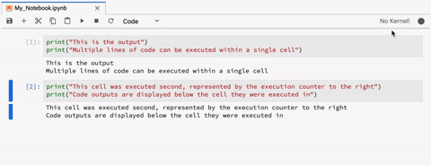

# [!DNL JupyterLab] Présentation de l’interface utilisateur

[!DNL JupyterLab] est une interface utilisateur web pour [Project Jupyter](https://jupyter.org/) et est étroitement intégré à Adobe Experience Platform. Il fournit un environnement de développement interactif pour que les chercheurs en données puissent travailler avec des ordinateurs portables, du code et des données Jupyter.

Ce document fournit un aperçu de [!DNL JupyterLab] et de ses fonctionnalités ainsi que des instructions pour effectuer des actions communes.

## [!DNL JupyterLab] on [!DNL Experience Platform]

L’intégration JupyterLab d’Experience Platform est accompagnée de modifications architecturales, de considérations de conception, d’extensions de notebooks personnalisées, de bibliothèques préinstallées et d’une interface sur le thème Adobe.

La liste suivante présente quelques-unes des fonctionnalités propres à JupyterLab sur Platform :

| Fonctionnalité | Description |
| --- | --- |
| **Noyaux** | Les noyaux fournissent un bloc-notes et d&#39;autres [!DNL JupyterLab] front-ends la possibilité d&#39;exécuter et d&#39;introduire du code dans différents langages de programmation. [!DNL Experience Platform] fournit des noyaux supplémentaires pour prendre en charge le développement dans  [!DNL Python], R, PySpark et  [!DNL Spark]. Pour plus d’informations, consultez la section sur les [noyaux](#kernels). |
| **Accès aux données** | Accédez directement aux jeux de données existants à partir de [!DNL JupyterLab] avec une prise en charge complète des capacités de lecture et d&#39;écriture. |
| **[!DNL Platform]intégration de service** | Les intégrations intégrées vous permettent d&#39;utiliser d&#39;autres services [!DNL Platform] directement depuis [!DNL JupyterLab]. Une liste complète des intégrations prises en charge est fournie dans la section sur l’[intégration avec d’autres services Platform](#service-integration). |
| **Authentification** | Outre <a href="https://jupyter-notebook.readthedocs.io/en/latest/security.html" target="_blank">le modèle de sécurité intégré de JupyterLab</a>, chaque interaction entre votre application et Experience Platform, y compris la communication service à service de Platform, est chiffrée et authentifiée à l’aide d’<a href="https://www.adobe.io/authentication/auth-methods.html" target="_blank">[!DNL Adobe Identity Management System] (IMS)</a>. |
| **Bibliothèques de développement** | Dans [!DNL Experience Platform], [!DNL JupyterLab] fournit des bibliothèques préinstallées pour [!DNL Python], R et PySpark. Consultez l’[annexe](#supported-libraries) pour obtenir une liste complète des bibliothèques prises en charge. |
| **Contrôleur de bibliothèque** | Lorsque les bibliothèques préinstallées ne répondent pas à vos besoins, d&#39;autres bibliothèques peuvent être installées pour Python et R, et sont temporairement stockées dans des conteneurs isolés afin de préserver l&#39;intégrité de [!DNL Platform] et de protéger vos données. Pour plus d’informations, consultez la section sur les [noyaux](#kernels). |

>[!NOTE]
>
>Les bibliothèques supplémentaires sont uniquement disponibles pour la session dans laquelle elles ont été installées. Vous devez réinstaller les bibliothèques supplémentaires nécessaires lorsque vous démarrez de nouvelles sessions.

## Intégration à d&#39;autres services [!DNL Platform] {#service-integration}

La normalisation et l&#39;interopérabilité sont les concepts clés qui sous-tendent [!DNL Experience Platform]. L&#39;intégration de [!DNL JupyterLab] sur [!DNL Platform] en tant qu&#39;IDE intégré lui permet d&#39;interagir avec d&#39;autres services [!DNL Platform], ce qui vous permet d&#39;utiliser [!DNL Platform] à son plein potentiel. Les services [!DNL Platform] suivants sont disponibles dans [!DNL JupyterLab] :

* **[!DNL Catalog Service]:** Accédez aux jeux de données et explorez-les avec des fonctionnalités de lecture et d’écriture.
* **[!DNL Query Service] :** accédez aux jeux de données et explorez-les à l’aide de SQL, ce qui vous permet de réduire les frais généraux d’accès aux données lorsque vous traitez de grandes quantités de données.
* **[!DNL Sensei ML Framework] :** développement de modèles avec la possibilité de former et de noter des données, ainsi que de créer des recettes en un seul clic.
* **[!DNL Experience Data Model (XDM)]:** La normalisation et l’interopérabilité sont les concepts clés d’Adobe Experience Platform. [Le modèle de données d’expérience (XDM)](https://www.adobe.com/go/xdm-home-en), piloté par l’Adobe, vise à normaliser les données d’expérience client et à définir des schémas pour la gestion de l’expérience client.

>[!NOTE]
>
>Certaines intégrations de service [!DNL Platform] sur [!DNL JupyterLab] sont limitées à des noyaux spécifiques. Pour plus d’informations, consultez la section sur les [noyaux](#kernels).

## Fonctionnalités clés et opérations courantes

Les sections suivantes contiennent des informations sur les principales caractéristiques de [!DNL JupyterLab] et des instructions sur l&#39;exécution d&#39;opérations communes :

* [Accès à JupyterLab](#access-jupyterlab)
* [Interface de JupyterLab](#jupyterlab-interface)
* [Cellules de code](#code-cells)
* [Noyaux](#kernels)
* [Sessions de noyau](#kernel-sessions)
* [Lanceur](#launcher)

### Accès [!DNL JupyterLab] {#access-jupyterlab}

Dans [Adobe Experience Platform](https://platform.adobe.com), sélectionnez **[!UICONTROL Ordinateurs portables]** dans la colonne de navigation de gauche. Patientez un certain temps pour que [!DNL JupyterLab] s&#39;initialise complètement.

### [!DNL JupyterLab] interface {#jupyterlab-interface}

L&#39;interface [!DNL JupyterLab] comprend une barre de menus, une barre latérale gauche réductible et la zone de travail principale contenant des onglets de documents et d&#39;activités.

**Barre de menus**

La barre de menus en haut de l&#39;interface comporte des menus de niveau supérieur qui exposent les actions disponibles dans [!DNL JupyterLab] avec leurs raccourcis clavier :

* **Fichier :** actions relatives aux fichiers et répertoires
* **Modifier :** actions relatives à la modification des documents et d’autres activités
* **Afficher :** actions qui modifient l’apparence de [!DNL JupyterLab]
* **Exécuter :** actions d’exécution de code dans différentes activités telles que les notebooks et les consoles de code
* **Noyau :** actions de gestion des noyaux
* **Onglets :** une liste des activités et des documents ouverts
* **Paramètres :** paramètres courants et un éditeur de paramètres avancés
* **Aide :**[!DNL JupyterLab] une liste des liens d’aide de et du noyau

**Barre latérale gauche**

La barre latérale gauche contient des onglets cliquables qui permettent d’accéder aux fonctionnalités suivantes :

* **Navigateur de fichiers :** une liste de documents et de répertoires de notebook enregistrés
* **Explorateur de données :** accédez aux jeux de données et aux schémas, explorez-les et parcourez-les
* **Noyaux et terminaux en cours d’exécution :** une liste des sessions de noyau et de terminal actives pouvant être interrompues
* **Commandes :** une liste de commandes utiles
* **Inspecteur de cellule :** un éditeur de cellules qui donne accès aux outils et aux métadonnées utiles pour configurer un notebook à des fins de présentation
* **onglets :** une liste d’onglets ouverts

Sélectionnez un onglet pour exposer ses fonctionnalités ou sélectionnez-le sur un onglet développé pour réduire la barre latérale gauche comme illustré ci-dessous :

**Espace de travail principal**

La zone de travail principale de [!DNL JupyterLab] vous permet d&#39;organiser les documents et autres activités en panneaux d&#39;onglets qui peuvent être redimensionnés ou subdivisés. Faites glisser un onglet au centre d’un panneau à onglets pour le faire migrer. Divisez un panneau en faisant glisser un onglet vers la gauche, la droite, le haut ou le bas du panneau :

### Configuration du GPU et du serveur de mémoire dans [!DNL Python]/R

Dans [!DNL JupyterLab], sélectionnez l&#39;icône d&#39;engrenage dans le coin supérieur droit pour ouvrir *Configuration du serveur portable*. Vous pouvez activer GPU et allouer la quantité de mémoire dont vous avez besoin en utilisant le curseur. La quantité de mémoire que vous pouvez allouer dépend de la quantité de mémoire allouée par votre organisation. Sélectionnez **[!UICONTROL Mettre à jour les configurations]** à enregistrer.

>[!NOTE]
>
>Un seul processeur graphique est configuré par organisation pour les ordinateurs portables. Si le GPU est en cours d’utilisation, vous devez attendre que l’utilisateur qui a actuellement réservé le GPU le publie. Pour ce faire, déconnectez-vous ou quittez le GPU en état d&#39;inactivité pendant quatre heures ou plus.

### Arrêter et redémarrer [!DNL JupyterLab]

Dans [!DNL JupyterLab], vous pouvez mettre fin à votre session afin d’empêcher l’utilisation de ressources supplémentaires. Début en sélectionnant l&#39;icône **alimentation**, puis **[!UICONTROL Arrêter]** dans la fenêtre contextuelle qui semble arrêter votre session. Les sessions de bloc-notes se terminent automatiquement après 12 heures sans activité.

Pour redémarrer [!DNL JupyterLab], sélectionnez l&#39;icône **redémarrer** située directement à gauche de l&#39;icône d&#39;alimentation, puis sélectionnez **[!UICONTROL Redémarrer]** dans la fenêtre contextuelle qui s&#39;affiche.

### Cellules de code {#code-cells}

Les cellules de code constituent le contenu principal des notebooks. Elles contiennent le code source dans le langage du noyau associé au notebook et la sortie résultant de l’exécution de la cellule de code. Le nombre d’exécutions est affiché à droite de chaque cellule de code qui représente son ordre d’exécution.

Les actions de cellule courantes sont décrites ci-dessous :

* **Ajouter une cellule :** cliquez sur le symbole plus (**+**) dans le menu du notebook pour ajouter une cellule vide. Les nouvelles cellules sont placées sous la cellule en cours d’interaction ou à la fin du notebook si aucune cellule particulière n’est concernée.

* **Déplacer une cellule :** placez votre curseur à droite de la cellule que vous souhaitez déplacer, puis cliquez sur la cellule et faites-la glisser vers un nouvel emplacement. De plus, le déplacement d’une cellule d’un notebook vers un autre réplique la cellule et son contenu.

* **Exécuter une cellule :** cliquez sur le corps de la cellule que vous souhaitez exécuter, puis sur l’icône **lecture** (**▶**) dans le menu du notebook. Un astérisque (**\***) est affiché dans le compteur d’exécution de la cellule lorsque le noyau traite l’exécution, et est remplacé par un nombre entier une fois l’exécution terminée.

* **Supprimer une cellule :** cliquez sur le corps de la cellule que vous souhaitez supprimer, puis sur l’icône **ciseaux**.

### Noyaux {#kernels}

Les noyaux des notebooks sont les moteurs informatiques spécifiques au langage pour le traitement des cellules des notebooks. Outre [!DNL Python], [!DNL JupyterLab] fournit une prise en charge linguistique supplémentaire dans R, PySpark et [!DNL Spark] (Scala). Lorsque vous ouvrez un document de notebook, le noyau associé est lancé. Lorsqu’une cellule de notebook est exécutée, le noyau effectue le calcul et produit des résultats qui peuvent consommer d’importantes ressources de processeur et de mémoire. Notez que la mémoire allouée n&#39;est pas libérée tant que le noyau n&#39;est pas fermé.

Certaines fonctionnalités sont limitées à des noyaux particuliers, comme décrit dans le tableau ci-dessous :

| Noyau | Prise en charge de l’installation de la bibliothèque | [!DNL Platform] intégrations |
| :----: | :--------------------------: | :-------------------- |
| **[!DNL Python]** | Oui | <ul><li>[!DNL Sensei ML Framework]</li><li>[!DNL Catalog Service]</li><li>[!DNL Query Service]</li></ul> |
| **r** | Oui | <ul><li>[!DNL Sensei ML Framework]</li><li>[!DNL Catalog Service]</li></ul> |
| **Scala** | Non | <ul><li>[!DNL Sensei ML Framework]</li><li>[!DNL Catalog Service]</li></ul> |

### Sessions de noyau {#kernel-sessions}

Chaque principal bloc-notes ou activité sur [!DNL JupyterLab] utilise une session de noyau. Vous trouverez toutes les sessions actives en développant l’onglet **Noyaux et terminaux en cours d’exécution** de la barre latérale gauche. Vous pouvez identifier le type et l’état du noyau d’un notebook en observant le coin supérieur droit de l’interface du notebook. Dans le diagramme ci-dessous, le noyau associé au notebook est **[!DNL Python] 3** et son état actuel est représenté par un cercle gris à droite. Un cercle creux implique un noyau inactif et un cercle plein implique un noyau occupé.

Si le noyau est arrêté ou inactif pendant une longue période, alors **Aucun noyau !** avec un cercle plein n’est affiché. Activez un noyau en cliquant sur l’état du noyau et en sélectionnant le type de noyau approprié, comme illustré ci-dessous :

### Lanceur {#launcher}

[//]: # (Talk about the different Notebooks, introduce that certain starter notebooks are limited to particular kernels)

Le *Lanceur* personnalisé fournit des modèles de notebook utiles pour les noyaux pris en charge afin de vous aider à démarrer rapidement vos tâches, notamment :

| Modèle | Description |
| --- | --- |
| Vide | Un fichier de notebook vide. |
| Démarrage | Un notebook prérempli présentant l’exploration des données à l’aide de données d’exemple. |
| Ventes au détail | Un bloc-notes prérempli présentant la recette de vente au détail  à l&#39;aide de données d&#39;exemple. |
| Recipe Builder | Un modèle de notebook pour la création d’une recette dans [!DNL JupyterLab]. Il est prérempli de code et de commentaires qui présentent et décrivent le processus de création de la recette. Consultez le [tutoriel notebook vers recette](https://www.adobe.com/go/data-science-create-recipe-notebook-tutorial-en) pour une présentation détaillée. |
| [!DNL Query Service] | Un bloc-notes prérempli montrant l&#39;utilisation de [!DNL Query Service] directement dans [!DNL JupyterLab] avec des exemples de workflows fournis qui analysent les données à l&#39;échelle. |
| Événements XDM | Un notebook prérempli qui présente l’exploration des données sur les données d’événement d’expérience de valeur post, en mettant l’accent sur les fonctionnalités communes à l’ensemble de la structure de données. |
| Requêtes XDM | Un notebook prérempli présentant des exemples de requêtes d’entreprise sur les données d’événement d’expérience. |
| Agrégation | Un notebook prérempli présentant des exemples de processus pour agréger de grandes quantités de données en petits blocs gérables. |
| Mise en cluster | Un notebook prérempli présentant le processus de modélisation d’apprentissage automatique de bout en bout à l’aide d’algorithmes de mise en cluster. |

Certains modèles de notebook sont limités à des noyaux spécifiques. La disponibilité des modèles pour chaque noyau est mappée dans le tableau suivant :

<table>
    <tr>
        <td></td>
        <th><strong>Vide</strong></th>
        <th><strong>Démarrage</strong></th>
        <th><strong>Ventes au détail</strong></th>
        <th><strong>Créateur de recettes</strong></th>
        <th><strong>[ !Service de Requête DNL]</strong></th>
        <th><strong>Événements XDM</strong></th>
        <th><strong>Requêtes XDM</strong></th>
        <th><strong>Agrégation</strong></th>
        <th><strong>Mise en cluster</strong></th>
    </tr>
    <tr>
        <th><strong>[ ! DNL Python]</strong></th>
        <td >oui</td>
        <td >oui</td>
        <td >oui</td>
        <td >oui</td>
        <td >oui</td>
        <td >oui</td>
        <td >non</td>
        <td >non</td>
        <td >non</td>
    </tr>
    <tr>
        <th ><strong>R</strong></th>
        <td >oui</td>
        <td >oui</td>
        <td >oui</td>
        <td >non</td>
        <td >non</td>
        <td >non</td>
        <td >non</td>
        <td >non</td>
        <td >non</td>
    </tr>
      <tr>
        <th  ><strong>PySpark 3 ([!DNL Spark] 2.4)</strong></th>
        <td >non</td>
        <td >oui</td>
        <td >non</td>
        <td >non</td>
        <td >non</td>
        <td >non</td>
        <td >oui</td>
        <td >oui</td>
        <td >non</td>
    </tr>
    <tr>
        <th ><strong>Scala</strong></th>
        <td >oui</td>
        <td >oui</td>
        <td >non</td>
        <td >non</td>
        <td >non</td>
        <td >non</td>
        <td >non</td>
        <td >non</td>
        <td >oui</td>
    </tr>
</table>

Pour ouvrir un nouveau *lanceur*, cliquez sur **Fichier > Nouveau lanceur**. Vous pouvez également développer le **navigateur de fichiers** depuis la barre latérale gauche et cliquer sur le symbole plus (**+**) :

## Étapes suivantes

Pour en savoir plus sur chacun des blocs-notes pris en charge et comment les utiliser, consultez le [Guide du développeur Accès aux données des blocs-notes Jupyterlab](./access-notebook-data.md). Ce guide se concentre sur l&#39;utilisation des portables JupyterLab pour accéder à vos données, y compris la lecture, l&#39;écriture et l&#39;interrogation de données. Le guide d&#39;accès aux données contient également des informations sur la quantité maximale de données pouvant être lues par chaque bloc-notes pris en charge.

## Bibliothèques prises en charge {#supported-libraries}

Pour une liste de paquets pris en charge dans Python, R et PySpark, copiez et collez `!pip list --format=columns` dans une nouvelle cellule, puis exécutez la cellule. Une liste de packages pris en charge est renseignée par ordre alphabétique.

