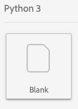

# Service de Requête sur ordinateur portable Jupyter

Adobe Experience Platform vous permet d’utiliser le langage de Requête structurée (SQL) dans Data Science Workspace en intégrant Requête Service dans JupyterLab en tant que fonctionnalité standard.

Ce didacticiel présente des exemples de requêtes SQL pour des cas d’utilisation courants afin d’explorer, de transformer et d’analyser des données Adobe Analytics.

## Prise en main

Avant de commencer ce didacticiel, vous devez disposer des conditions préalables suivantes :

- Accès à Adobe Experience Platform. Si vous n’avez pas accès à une organisation IMS dans Experience Platform, contactez votre administrateur système avant de continuer

- Un jeu de données Adobe Analytics

- Une compréhension pratique des concepts clés suivants utilisés dans ce tutoriel :
   - [Modèle de données d’expérience (XDM) et système XDM](../../xdm/home.md)
   - [Requête Service](../../query-service/home.md)
   - [Syntaxe SQL Requête Service](../../query-service/sql/overview.md)
   - Adobe Analytics

## Accès à JupyterLab et au service de Requête {#access-jupyterlab-and-query-service}

1. Dans la plate-forme [](https://platform.adobe.com)d’expérience, accédez à **[!UICONTROL Notebooks]** partir de la colonne de navigation de gauche. Il faut un moment pour que JupyterLab se charge.

   

   > [!NOTE] Si un nouvel onglet Lanceur n’apparaissait pas automatiquement, ouvrez un nouvel onglet Lanceur en cliquant sur **[!UICONTROL File]** puis sélectionnez **[!UICONTROL New Launcher]**.

2. Dans l&#39;onglet Lanceur, cliquez sur l&#39; **[!UICONTROL Blank]** icône d&#39;un environnement Python 3 pour ouvrir un bloc-notes vide.

   

   > [!NOTE] Python 3 est actuellement le seul environnement pris en charge pour Requête Service dans les portables.

3. Dans le rail de sélection de gauche, cliquez sur l’ **[!UICONTROL Data]** icône et doublon sur le **[!UICONTROL Datasets]** répertoire pour liste de tous les jeux de données.

   

4. Recherchez un jeu de données Adobe Analytics à explorer et cliquez avec le bouton droit sur la liste, cliquez **[!UICONTROL Query Data in Notebook]** pour générer des requêtes SQL dans le bloc-notes vide.

5. Cliquez sur la première cellule générée contenant la fonction `qs_connect()` et exécutez-la en cliquant sur le bouton de lecture. Cette fonction crée une connexion entre votre instance de bloc-notes et le service de Requête.

   

6. Copiez le nom du jeu de données Adobe Analytics à partir de la seconde requête SQL générée. Il s’agira de la valeur située après `FROM`.

   

7. Insérez une nouvelle cellule de bloc-notes en cliquant sur le bouton **+** .

   

8. Copiez, collez et exécutez les instructions d&#39;importation suivantes dans une nouvelle cellule. Les instructions suivantes seront utilisées pour visualiser vos données :

   ```python
   import plotly.plotly as py
   import plotly.graph_objs as go
   from plotly.offline import iplot
   ```

9. Ensuite, copiez et collez les variables suivantes dans une nouvelle cellule. Modifiez leurs valeurs selon vos besoins, puis exécutez-les.

   ```python
   target_table = "your Adobe Analytics dataset name"
   target_year = "2019"
   target_month = "04"
   target_day = "01"
   ```

   - `target_table` : Nom de votre jeu de données Adobe Analytics.
   - `target_year` : Année spécifique à partir de laquelle proviennent les données de cible.
   - `target_month` : Mois spécifique d’où provient la cible.
   - `target_day` : Jour spécifique à partir duquel proviennent les données de la cible.
   >[!NOTE] Vous pouvez modifier ces valeurs à tout moment. Dans ce cas, veillez à exécuter la cellule de variables pour que les modifications soient appliquées.

## Requête de vos données {#query-your-data}

Entrez les requêtes SQL suivantes dans des cellules de bloc-notes individuelles. Exécutez une requête en cliquant sur sa cellule, puis en cliquant sur le **[!UICONTROL play]** bouton. Les résultats de la requête ou les journaux d’erreurs sont affichés sous la cellule exécutée.

Lorsqu&#39;un bloc-notes est inactif pendant une longue période, la connexion entre le bloc-notes et Requête Service peut se rompre. Dans ce cas, redémarrez JupyterLab en cliquant sur le **[!UICONTROL Power]** bouton situé dans le coin supérieur droit.


Le noyau du bloc-notes sera réinitialisé mais les cellules resteront, réexécutez **[!UICONTROL all]** les cellules pour continuer là où vous l&#39;aviez laissé.

### Nombre de visiteurs horaires {#hourly-visitor-count}

La requête suivante renvoie le nombre de visiteurs horaires pour une date spécifiée :

#### Requête

```sql
%%read_sql hourly_visitor -c QS_CONNECTION
SELECT Substring(timestamp, 1, 10)                               AS Day,
       Substring(timestamp, 12, 2)                               AS Hour, 
       Count(DISTINCT concat(enduserids._experience.aaid.id, 
                             _experience.analytics.session.num)) AS Visit_Count 
FROM   {target_table}
WHERE _acp_year = {target_year} 
      AND _acp_month = {target_month}  
      AND _acp_day = {target_day}
GROUP  BY Day, Hour
ORDER  BY Hour;
```

Dans la requête ci-dessus, la cible `_acp_year` de la `WHERE` clause est définie sur la valeur de `target_year`. Incluez des variables dans les requêtes SQL en les contenant entre accolades (`{}`).

La première ligne de la requête contient la variable facultative `hourly_visitor`. Les résultats de la Requête seront stockés dans cette variable sous la forme d&#39;une base de données Pandas. Le stockage des résultats dans un cadre de données vous permet de visualiser ultérieurement les résultats de la requête à l&#39;aide d&#39;un paquet Python souhaité. Exécutez le code Python suivant dans une nouvelle cellule pour générer un graphique à barres :

```python
trace = go.Bar(
    x = hourly_visitor['Hour'],
    y = hourly_visitor['Visit_Count'],
    name = "Visitor Count"
)
layout = go.Layout(
    title = 'Visit Count by Hour of Day',
    width = 1200,
    height = 600,
    xaxis = dict(title = 'Hour of Day'),
    yaxis = dict(title = 'Count')
)
fig = go.Figure(data = [trace], layout = layout)
iplot(fig)
```

### Nombre d&#39;activités horaires {#hourly-activity-count}

La requête suivante renvoie le nombre d&#39;actions horaires pour une date spécifiée :

#### Requête <!-- omit in toc -->

```sql
%%read_sql hourly_actions -d -c QS_CONNECTION
SELECT Substring(timestamp, 1, 10)                        AS Day,
       Substring(timestamp, 12, 2)                        AS Hour, 
       Count(concat(enduserids._experience.aaid.id, 
                    _experience.analytics.session.num,
                    _experience.analytics.session.depth)) AS Count 
FROM   {target_table}
WHERE  _acp_year = {target_year} 
       AND _acp_month = {target_month}  
       AND _acp_day = {target_day}
GROUP  BY Day, Hour
ORDER  BY Hour;
```

L&#39;exécution de la requête ci-dessus stockera les résultats dans `hourly_actions` un cadre de données. Exécutez la fonction suivante dans une nouvelle cellule pour prévisualisation des résultats :

```python
hourly_actions.head()
```

La requête ci-dessus peut être modifiée afin de renvoyer le nombre d’actions horaires pour une plage de dates spécifiée à l’aide d’opérateurs logiques dans la clause **WHERE** :

#### Requête <!-- omit in toc -->

```sql
%%read_sql hourly_actions_date_range -d -c QS_CONNECTION
SELECT Substring(timestamp, 1, 10)                        AS Day,
       Substring(timestamp, 12, 2)                        AS Hour, 
       Count(concat(enduserids._experience.aaid.id, 
                    _experience.analytics.session.num,
                    _experience.analytics.session.depth)) AS Count 
FROM   {target_table}
WHERE  timestamp >= TO_TIMESTAMP('2019-06-01 00', 'YYYY-MM-DD HH')
       AND timestamp <= TO_TIMESTAMP('2019-06-02 23', 'YYYY-MM-DD HH')
GROUP  BY Day, Hour
ORDER  BY Hour;
```

L&#39;exécution de la requête modifiée stockera les résultats dans `hourly_actions_date_range` un cadre de données. Exécutez la fonction suivante dans une nouvelle cellule pour prévisualisation des résultats :

```python
hourly_actions_date_rage.head()
```

### Nombre de événements par session de visiteur {#number-of-events-per-visitor-session}

La requête suivante renvoie le nombre de événements par session de visiteur pour une date spécifiée :

#### Requête <!-- omit in toc -->

```sql
%%read_sql events_per_session -c QS_CONNECTION
SELECT concat(enduserids._experience.aaid.id, 
              '-#', 
              _experience.analytics.session.num) AS aaid_sess_key, 
       Count(timestamp)                          AS Count 
FROM   {target_table}
WHERE  _acp_year = {target_year} 
       AND _acp_month = {target_month}  
       AND _acp_day = {target_day}
GROUP BY aaid_sess_key
ORDER BY Count DESC;
```

Exécutez le code Python suivant pour générer un histogramme pour le nombre de événements par session de visite :

```python
data = [go.Histogram(x = events_per_session['Count'])]

layout = go.Layout(
    title = 'Histogram of Number of Events per Visit Session',
    xaxis = dict(title = 'Number of Events'),
    yaxis = dict(title = 'Count')
)

fig = go.Figure(data = data, layout = layout)
iplot(fig)
```

### Pages populaires pour un jour donné {#popular-pages-for-a-given-day}

La requête suivante renvoie les dix pages les plus populaires pour une date spécifiée :

#### Requête <!-- omit in toc -->

```sql
%%read_sql popular_pages -c QS_CONNECTION
SELECT web.webpagedetails.name                 AS Page_Name, 
       Sum(web.webpagedetails.pageviews.value) AS Page_Views 
FROM   {target_table}
WHERE  _acp_year = {target_year}
       AND _acp_month = {target_month}
       AND _acp_day = {target_day}
GROUP  BY web.webpagedetails.name 
ORDER  BY page_views DESC 
LIMIT  10;
```

### Utilisateurs actifs pour une journée donnée {#active-users-for-a-given-day}

La requête suivante renvoie les dix utilisateurs les plus actifs pour une date spécifiée :

#### Requête <!-- omit in toc -->

```sql
%%read_sql active_users -c QS_CONNECTION
SELECT enduserids._experience.aaid.id AS aaid, 
       Count(timestamp)               AS Count
FROM   {target_table}
WHERE  _acp_year = {target_year}
       AND _acp_month = {target_month}
       AND _acp_day = {target_day}
GROUP  BY aaid
ORDER  BY Count DESC
LIMIT  10;
```

### Villes actives par activité utilisateur {#active-cities-by-user-activity}

La requête suivante renvoie les dix villes qui génèrent la majorité des activités utilisateur pour une date spécifiée :

#### Requête <!-- omit in toc -->

```sql
%%read_sql active_cities -c QS_CONNECTION
SELECT concat(placeContext.geo.stateProvince, ' - ', placeContext.geo.city) AS state_city, 
       Count(timestamp)                                                     AS Count
FROM   {target_table}
WHERE  _acp_year = {target_year}
       AND _acp_month = {target_month}
       AND _acp_day = {target_day}
GROUP  BY state_city
ORDER  BY Count DESC
LIMIT  10;
```

## Étapes suivantes <!-- omit in toc -->

Ce didacticiel a montré quelques exemples d’utilisation de Requête Service dans des cahiers Jupyter. Suivez le didacticiel [Analyser vos données à l’aide de Jupyter Notebooks](./analyze-your-data.md) pour voir comment des opérations similaires sont effectuées à l’aide du SDK d’accès aux données.