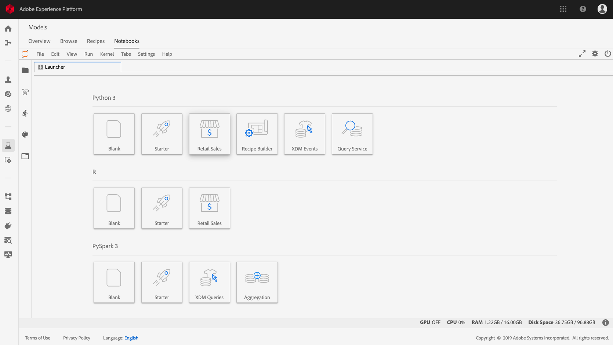

# Service  sur ordinateur portable Jupyter

Adobe Experience Platform vous permet d’utiliser le langage de structuré (SQL) dans Data Science Workspace en intégrant le service de dans JupyterLab en tant que fonctionnalité standard.

Ce didacticiel présente l’exemple de  SQL suivant pour des cas d’utilisation courants afin d’explorer, de transformer et d’analyser les données Adobe Analytics :

- [Accès au service JupyterLab et au service](#access-jupyterlab-and-query-service)
- [vos données](#query-your-data)
   - [Nombre de horaire](#hourly-visitor-count)
   - [Nombre de  de  horaire](#hourly-activity-count)
   - [Nombre de  par session](#number-of-events-per-visitor-session)
   - [Pages populaires pour un jour donné](#popular-pages-for-a-given-day)
   - [Utilisateurs actifs pour une journée donnée](#active-users-for-a-given-day)
   - [Villes actives par utilisateur  par](#active-cities-by-user-activity)

## Prise en main

Avant de commencer ce didacticiel, vous devez disposer des conditions préalables suivantes :

- Accès à Adobe Experience Platform. Si vous n’avez pas accès à une organisation IMS dans Experience Platform, contactez votre administrateur système avant de poursuivre

- Un jeu de données Adobe Analytics

- Une compréhension pratique des concepts clés suivants utilisés dans ce didacticiel :
   - [Modèle de données d’expérience (XDM) et système XDM](../../xdm/home.md)
   - [Service](../../query-service/home.md)
   - [Syntaxe SQL du service](../../query-service/sql/overview.md)
   - Adobe Analytics

## Accès au service JupyterLab et au service 

1. Dans [Experience Platform](https://platform.adobe.com), accédez à **Models** à partir de la colonne de navigation de gauche. Cliquez sur **Ordinateurs portables** dans l’en-tête supérieur pour ouvrir JupyterLab. Laissez un moment à JupyterLab pour charger.

   

   > [!NOTE] Si un nouvel onglet Lanceur ne s’affichait pas automatiquement, ouvrez un nouvel onglet Lanceur en cliquant sur **Fichier > Nouveau lanceur**.

2. Dans l&#39;onglet Lanceur, cliquez sur l&#39;icône **vierge** dans un Python 3  pour ouvrir un bloc-notes vide.

   

   > [!NOTE] Python 3 est actuellement le seul  pris en charge pour le service  dans les portables.

3. Dans le rail de sélection de gauche, cliquez sur l’icône **Données** et  cliquez sur le répertoire **DataSet** pour  tous les jeux de données.

   

4. Recherchez un jeu de données Adobe Analytics pour explorer et cliquez avec le bouton droit sur la liste, cliquez sur **données dans le bloc-notes** pour générer des  SQL dans le bloc-notes vide.

5. Cliquez sur la première cellule générée contenant la fonction `qs_connect()` et exécutez-la en cliquant sur le bouton de lecture. Cette fonction crée une connexion entre votre instance de bloc-notes et le service de  de.

   

6. Copiez le nom du jeu de données Adobe Analytics du deuxième SQL généré, il sera la valeur après `FROM`.

   

7. Insérez une nouvelle cellule de bloc-notes en cliquant sur le bouton **+** .

   

8. Copiez, collez et exécutez les instructions d’importation suivantes dans une nouvelle cellule. Les instructions suivantes seront utilisées pour visualiser vos données :

   ```python
   import plotly.plotly as py
   import plotly.graph_objs as go
   from plotly.offline import iplot
   ```

9. Ensuite, copiez et collez les variables suivantes dans une nouvelle cellule. Modifiez leurs valeurs en fonction de vos besoins, puis exécutez-les.

   ```python
   target_table = "your Adobe Analytics dataset name"
   target_year = "2019"
   target_month = "04"
   target_day = "01"
   ```

   - `target_table` : Nom de votre jeu de données Adobe Analytics.
   - `target_year` : Année spécifique à partir de laquelle proviennent les données  du.
   - `target_month` : Mois spécifique d’où vient le .
   - `target_day` : Jour spécifique d’où proviennent les données  du.
   >[!NOTE] Vous pouvez modifier ces valeurs à tout moment. Dans ce cas, veillez à exécuter la cellule de variables pour que les modifications soient appliquées.

##  vos données

Entrez les  SQL suivantes dans les cellules d&#39;un bloc-notes. Exécutez un  en cliquant sur sa cellule, puis sur le bouton **Lecture** . Les résultats  ou les journaux d’erreurs du sont affichés sous la cellule exécutée.

Lorsqu&#39;un bloc-notes est inactif pendant une longue période, la connexion entre le bloc-notes et le service de  peut être rompue. Dans ce cas, redémarrez JupyterLab en cliquant sur le bouton **Power** situé dans le coin supérieur droit.


Le noyau du bloc-notes se réinitialisera, mais les cellules resteront, réexécuteront **toutes les** cellules pour continuer là où vous vous êtes arrêté.

### Nombre de horaire

Le suivant renvoie le nombre de horaires pour une date spécifiée :

#### Requête

```sql
%%read_sql hourly_visitor -c QS_CONNECTION
SELECT Substring(timestamp, 1, 10)                               AS Day,
       Substring(timestamp, 12, 2)                               AS Hour, 
       Count(DISTINCT concat(enduserids._experience.aaid.id, 
                             _experience.analytics.session.num)) AS Visit_Count 
FROM   {target_table}
WHERE _acp_year = {target_year} 
      AND _acp_month = {target_month}  
      AND _acp_day = {target_day}
GROUP  BY Day, Hour
ORDER  BY Hour;
```

Dans le  ci-dessus, le  `_acp_year` dans la `WHERE` clause est défini comme la valeur de `target_year`. Incluez des variables dans le SQL en les contenant entre accolades (`{}`).

La première ligne du  contient la variable facultative `hourly_visitor`. Les résultats  seront stockés dans cette variable sous la forme d’un cadre de données Pandas. Le stockage des résultats dans un cadre de données vous permet de visualiser plus tard les résultats  à l&#39;aide d&#39;un paquet Python souhaité. Exécutez le code Python suivant dans une nouvelle cellule pour générer un graphique à barres :

```python
trace = go.Bar(
    x = hourly_visitor['Hour'],
    y = hourly_visitor['Visit_Count'],
    name = "Visitor Count"
)
layout = go.Layout(
    title = 'Visit Count by Hour of Day',
    width = 1200,
    height = 600,
    xaxis = dict(title = 'Hour of Day'),
    yaxis = dict(title = 'Count')
)
fig = go.Figure(data = [trace], layout = layout)
iplot(fig)
```

### Nombre de  de  horaire

Le suivant renvoie le nombre d’actions horaires pour une date spécifiée :

#### Requête <!-- omit in toc -->

```sql
%%read_sql hourly_actions -d -c QS_CONNECTION
SELECT Substring(timestamp, 1, 10)                        AS Day,
       Substring(timestamp, 12, 2)                        AS Hour, 
       Count(concat(enduserids._experience.aaid.id, 
                    _experience.analytics.session.num,
                    _experience.analytics.session.depth)) AS Count 
FROM   {target_table}
WHERE  _acp_year = {target_year} 
       AND _acp_month = {target_month}  
       AND _acp_day = {target_day}
GROUP  BY Day, Hour
ORDER  BY Hour;
```

L&#39;exécution du  ci-dessus stocke les résultats dans `hourly_actions` un cadre de données. Exécutez la fonction suivante dans une nouvelle cellule pour des résultats :

```python
hourly_actions.head()
```

Le ci-dessus peut être modifié pour renvoyer le nombre d’actions horaires pour une plage de dates spécifiée à l’aide d’opérateurs logiques dans la clause **WHERE** :

#### Requête <!-- omit in toc -->

```sql
%%read_sql hourly_actions_date_range -d -c QS_CONNECTION
SELECT Substring(timestamp, 1, 10)                        AS Day,
       Substring(timestamp, 12, 2)                        AS Hour, 
       Count(concat(enduserids._experience.aaid.id, 
                    _experience.analytics.session.num,
                    _experience.analytics.session.depth)) AS Count 
FROM   {target_table}
WHERE  timestamp >= TO_TIMESTAMP('2019-06-01 00', 'YYYY-MM-DD HH')
       AND timestamp <= TO_TIMESTAMP('2019-06-02 23', 'YYYY-MM-DD HH')
GROUP  BY Day, Hour
ORDER  BY Hour;
```

L&#39;exécution du modifié stocke les résultats dans `hourly_actions_date_range` un cadre de données. Exécutez la fonction suivante dans une nouvelle cellule pour des résultats :

```python
hourly_actions_date_rage.head()
```

### Nombre de  par session

Le suivant renvoie le nombre de  par session depour une date spécifiée :

#### Requête <!-- omit in toc -->

```sql
%%read_sql events_per_session -c QS_CONNECTION
SELECT concat(enduserids._experience.aaid.id, 
              '-#', 
              _experience.analytics.session.num) AS aaid_sess_key, 
       Count(timestamp)                          AS Count 
FROM   {target_table}
WHERE  _acp_year = {target_year} 
       AND _acp_month = {target_month}  
       AND _acp_day = {target_day}
GROUP BY aaid_sess_key
ORDER BY Count DESC;
```

Exécutez le code Python suivant pour générer un histogramme pour le nombre de par session de visite :

```python
data = [go.Histogram(x = events_per_session['Count'])]

layout = go.Layout(
    title = 'Histogram of Number of Events per Visit Session',
    xaxis = dict(title = 'Number of Events'),
    yaxis = dict(title = 'Count')
)

fig = go.Figure(data = data, layout = layout)
iplot(fig)
```

### Pages populaires pour un jour donné

Le suivant renvoie les dix pages les plus populaires pour une date spécifiée :

#### Requête <!-- omit in toc -->

```sql
%%read_sql popular_pages -c QS_CONNECTION
SELECT web.webpagedetails.name                 AS Page_Name, 
       Sum(web.webpagedetails.pageviews.value) AS Page_Views 
FROM   {target_table}
WHERE  _acp_year = {target_year}
       AND _acp_month = {target_month}
       AND _acp_day = {target_day}
GROUP  BY web.webpagedetails.name 
ORDER  BY page_views DESC 
LIMIT  10;
```

### Utilisateurs actifs pour une journée donnée

Le suivant renvoie les dix utilisateurs les plus actifs pour une date spécifiée :

#### Requête <!-- omit in toc -->

```sql
%%read_sql active_users -c QS_CONNECTION
SELECT enduserids._experience.aaid.id AS aaid, 
       Count(timestamp)               AS Count
FROM   {target_table}
WHERE  _acp_year = {target_year}
       AND _acp_month = {target_month}
       AND _acp_day = {target_day}
GROUP  BY aaid
ORDER  BY Count DESC
LIMIT  10;
```

### Villes actives par utilisateur  par 

Le suivant  renvoie les dix villes qui génèrent une majorité d’utilisateurs  des pour une date spécifique :

#### Requête <!-- omit in toc -->

```sql
%%read_sql active_cities -c QS_CONNECTION
SELECT concat(placeContext.geo.stateProvince, ' - ', placeContext.geo.city) AS state_city, 
       Count(timestamp)                                                     AS Count
FROM   {target_table}
WHERE  _acp_year = {target_year}
       AND _acp_month = {target_month}
       AND _acp_day = {target_day}
GROUP  BY state_city
ORDER  BY Count DESC
LIMIT  10;
```

## Étapes suivantes <!-- omit in toc -->

Ce didacticiel présente quelques exemples d’utilisation de la  de dans les cahiers Jupyter. Suivez le didacticiel [Analyser vos données à l’aide des blocs-notes](./analyze-your-data.md) Jupyter pour voir comment des opérations similaires sont exécutées à l’aide du SDK d’accès aux données.