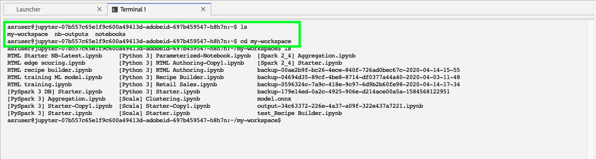

# Collaborer dans [!DNL JupyterLab] à l’aide de [!DNL Git]

>[!NOTE]
>
>Data Science Workspace ne peut plus être acheté.
>
>Cette documentation est destinée aux clients existants disposant de droits antérieurs à Data Science Workspace.

[!DNL Git] est un système de contrôle de version distribué qui permet d’effectuer le suivi des modifications du code source pendant le développement du logiciel. Git est préinstallé dans l’environnement [!DNL Data Science Workspace JupyterLab].

## Conditions préalables

>[!NOTE]
>
> Le serveur Git que vous souhaitez utiliser doit être accessible via Internet.

L’environnement [!DNL Data Science Workspace JupyterLab] est un environnement hébergé qui n’est pas déployé dans le pare-feu de votre entreprise. Par conséquent, le serveur Git auquel vous vous connectez doit être accessible à partir d’une connexion Internet publique. Il peut s’agir d’un référentiel public ou privé sur [GitHub](https://github.com/) ou d’une autre instance d’un serveur [!DNL Git] que vous avez décidé d’héberger vous-même.

## Connecter [!DNL Git] à l’environnement [!DNL Data Science Workspace JupyterLab Notebooks]

Commencez par lancer [!DNL Adobe Experience Platform] et par accéder à l’environnement [[!DNL JupyterLabs Notebooks]](https://platform.adobe.com/notebooks/jupyterLab).

Dans [!DNL JupyterLab], sélectionnez **[!UICONTROL Fichier]**, puis pointez sur **[!UICONTROL Nouveau]**. Dans la liste déroulante qui s’affiche, sélectionnez **[!UICONTROL Terminal]**.

Dans *Terminal*, accédez ensuite à votre espace de travail à l’aide de la commande suivante : `cd my-workspace`.

>[!TIP]
>
> Pour afficher la liste des commandes Git disponibles, lancez la commande `git -help` dans votre terminal.

Ensuite, clonez le référentiel que vous souhaitez utiliser à l’aide de la commande `git clone`. Clonez votre projet à l’aide d’une URL `https://` plutôt que `ssh://`.

**Exemple** :

`git clone https://github.com/adobe/experience-platform-dsw-reference.git`

>[!NOTE]
>
> Pour effectuer toute opération d’écriture (`git push` par exemple), les commandes de configuration suivantes doivent être exécutées pour chaque nouvelle session. Notez également que toute commande push demande un nom d’utilisateur et un mot de passe.
>
>`git config --global user.email "you@example.com"`
>
>`git config --global user.name "Your Name"`

## Étapes suivantes

Une fois le clonage de votre référentiel terminé, vous pouvez utiliser Git comme vous le feriez normalement sur votre ordinateur local pour collaborer avec d’autres personnes sur des notebooks. Pour plus d’informations sur ce que vous pouvez faire dans [!DNL JupyterLab], reportez-vous à la section [[!DNL JupyterLab user guide]](./overview.md).
