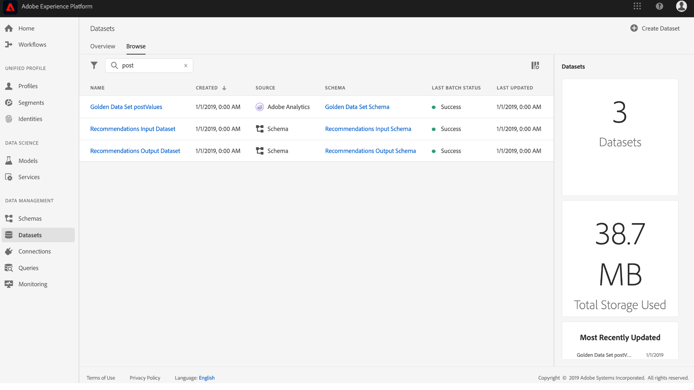
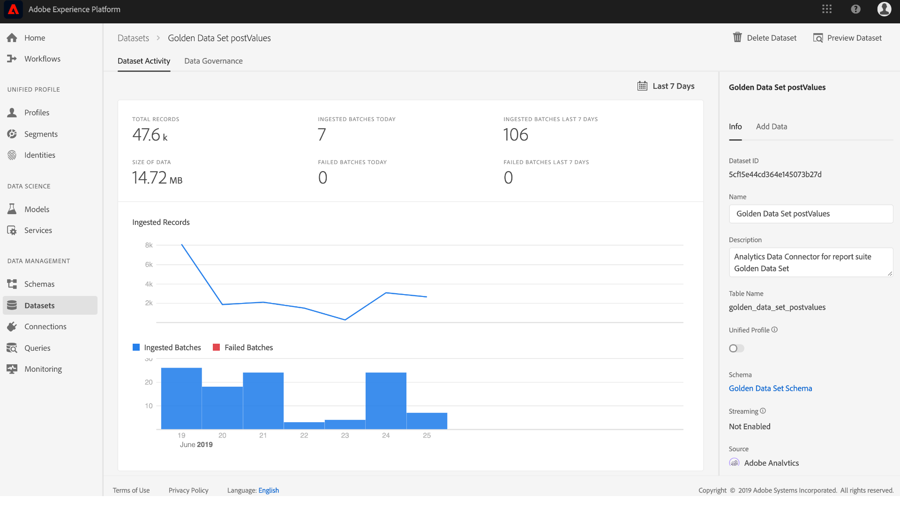
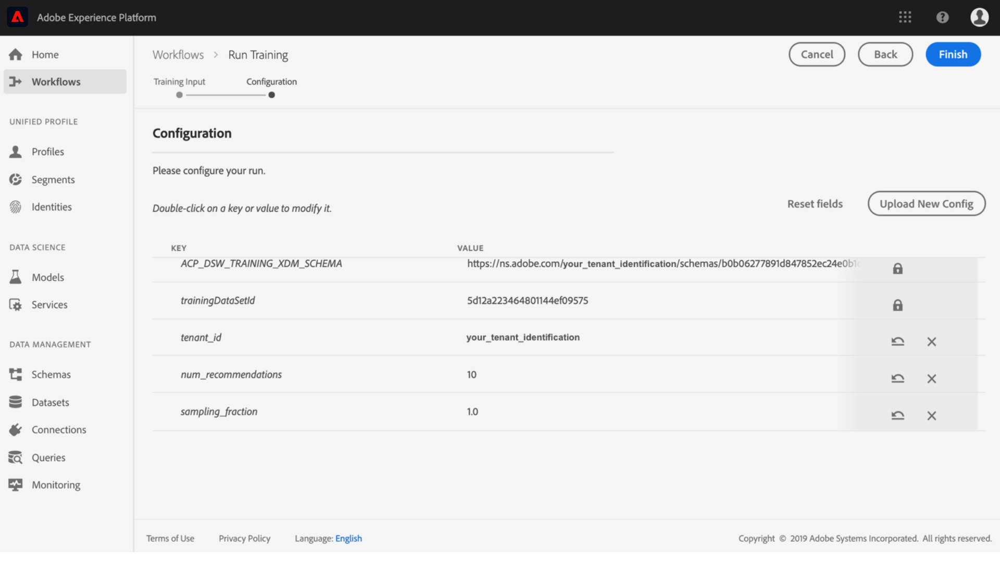

# Création et publication d’une présentation du modèle d’apprentissage automatique

Faites semblant de posséder un site Web de vente au détail en ligne. Lorsque vos clients achètent sur votre site Web de vente au détail, vous souhaitez leur présenter des recommandations de produits personnalisées afin d’exposer une variété d’autres produits  votre entreprise . Au cours de l’existence de votre site Web, vous avez continuellement rassemblé les données client et souhaitez utiliser ces données d’une manière ou d’une autre pour générer des recommandations de produits personnalisées.

Adobe Experience Platform Data Science Workspace fournit les moyens d’atteindre votre objectif à l’aide de la recette [de recommandations de produits](../pre-built-recipes/product-recommendations.md)prédéfinie. Suivez ce didacticiel pour découvrir comment accéder à vos données de vente au détail et les comprendre, créer et optimiser un modèle d’apprentissage automatique et générer des informations dans Data Science Workspace.

Ce didacticiel reflète le flux de travail de Data Science Workspace et décrit les étapes suivantes pour créer un modèle d’apprentissage automatique :

1. [Préparation de vos données](#prepare-your-data)
2. [Création de votre modèle](#author-your-model)
3. [Former et évaluer votre modèle](#train-and-evaluate-your-model)
4. [Opérationaliser votre modèle](#operationalize-your-model)

## Prise en main

Avant de commencer ce didacticiel, vous devez disposer des conditions préalables suivantes :

* Accès à Adobe Experience Platform. Si vous n’avez pas accès à une organisation IMS dans Experience Platform, contactez votre administrateur système avant de poursuivre.

* Ressources d’activation. Contactez le représentant de votre compte pour que les éléments suivants soient mis en service.
   * Recette des recommandations
   * Jeu de données d’entrée de recommandations
   *  d’entrée de recommandations
   * Jeu de données de sortie de recommandations
   *  de sortie de recommandations
   * Jeu de données d’or postValues
   *  d’ensemble de données dorées

* Téléchargez les trois fichiers Jupyter Notebook requis à partir du référentiel <a href="https://github.com/adobe/experience-platform-dsw-reference/tree/master/Summit/2019/resources/Notebooks-Thurs" target="_blank">Git public</a>Adobe. Ils serviront à démontrer le flux de travaux JupyterLab dans Data Science Workspace.

* Une compréhension pratique des concepts clés suivants utilisés dans ce didacticiel :
   * [Modèle](../../xdm/home.md)de données d’expérience : Effort de normalisation mené par Adobe pour définir des  standard, telles que  et ExperienceEvent, pour la gestion de l’expérience client.
   * Jeu de données : Un concept  de  et de gestion pour les données réelles. Instance instanciée physique d’un [XDM](../../xdm/schema/field-dictionary.md).
   * Lots : Les jeux de données sont constitués de lots. Un lot est un ensemble de données collectées sur une période donnée et traitées ensemble en une seule unité.
   * JupyterLab : [JupyterLab](https://blog.jupyter.org/jupyterlab-is-ready-for-users-5a6f039b8906) est une interface web open-source pour Project Jupyter et est étroitement intégrée à Experience Platform.

## Préparation de vos données {#prepare-your-data}

Pour créer un modèle d’apprentissage automatique qui recommande des produits personnalisés à vos clients, vous devez analyser les achats précédents de clients sur votre site Web. Cette section explique comment ces données sont assimilées à une plateforme via Adobe Analytics et comment ces données sont transformées en un jeu de données de fonctionnalités à utiliser par votre modèle d’apprentissage automatique.

### Explorez les données et comprenez le 

1. Connectez-vous à [Adobe Experience Platform](https://platform.adobe.com/) et cliquez sur **DataSet** pour tous les jeux de données existants et sélectionnez le jeu de données à explorer. Dans ce cas, le jeu de données Analytics **Golden Data Set postValues**.
   
2. Sélectionnez **jeude données** de près du coin supérieur droit pour examiner les enregistrements d’échantillons, puis cliquez sur **Fermer**.
   
3. Sélectionnez le lien sous  du dans le rail de droite pour  l&#39; du jeu de données, puis revenez à la page des détails du jeu de données.&quot;
   

Les autres jeux de données ont été préremplis avec des lots à des fins d’aperçu. Vous pouvez  ces jeux de données en répétant les étapes ci-dessus.

| Nom du jeu de données | Schéma | Description |
| ----- | ----- | ----- |
| Jeu de données d’or postValues |  d’ensemble de données dorées | Données source Analytics de votre site Web |
| Jeu de données d’entrée de recommandations |  d’entrée de recommandations | Les données Analytics sont transformées en jeu de données de formation à l’aide d’un pipeline de fonctionnalités. Ces données sont utilisées pour former le modèle d’apprentissage automatique de Recommandations de produit. `itemid` et `userid` correspondent à un produit acheté par ce client. |
| Jeu de données de sortie de recommandations |  de sortie de recommandations | Le jeu de données pour lequel les résultats de notation sont stockés contient le des produits recommandés pour chaque client. |

## Création de votre modèle {#author-your-model}

Le deuxième composant du cycle de vie de l’espace de travail Data Science implique la création de recettes et de modèles. La Recette des recommandations de produits est conçue pour générer des recommandations de produits à l’échelle en utilisant les données d’achat antérieures et l’apprentissage automatique.

Les recettes sont la base d&#39;un modèle puisqu&#39;elles contiennent des algorithmes d&#39;apprentissage automatique et une logique conçue pour résoudre des problèmes spécifiques. Plus important encore, Recettes vous permet de démocratiser l&#39;apprentissage automatique dans votre entreprise, en permettant à d&#39;autres utilisateurs d&#39;accéder à un modèle pour des cas d&#39;utilisation disparates sans écrire de code.

### Explorez la recette des recommandations de produit

1. Dans Adobe Experience Platform, accédez à **Modèles** dans la colonne de navigation de gauche, puis cliquez sur **Recettes** en haut pour un  de recettes disponibles pour votre organisation.
   
2. Recherchez et ouvrez la recette **de** recommandations fournie en cliquant sur son nom.
   
3. Dans le rail de droite, cliquez sur **d’entrée de recommandations** pour  le qui alimente la recette. Les champs **** itemId **et** userId **du correspondent à un produit acheté (** interactionType **) par ce client à un moment spécifique (horodatage).** Suivez les mêmes étapes pour consulter les champs du de sortie **Recommendations**.
   

Vous avez maintenant examiné les  d’entrée et de sortie requises par la Recette des recommandations de produit. Vous pouvez maintenant passer à la section suivante pour savoir comment créer, former et évaluer un modèle de recommandations de produits.

## Former et évaluer votre modèle {#train-and-evaluate-your-model}

Maintenant que vos données sont préparées et que la Recette est prête à être utilisée, vous pouvez créer, former et évaluer votre modèle d&#39;apprentissage automatique.

### Créer un modèle

Un modèle est une instance d’une recette qui vous permet de vous former et de marquer des données à l’échelle.

1. Dans Adobe Experience Platform, accédez à **Modèles** dans la colonne de navigation de gauche, puis cliquez sur **Recettes** en haut de la page pour afficher un de toutes les Recettes disponibles pour votre entreprise.
   
2. Recherchez et ouvrez la recette **de** recommandations fournie en cliquant sur son nom, en saisissant la page d&#39;aperçu de la recette. Cliquez sur **Créer un modèle** soit à partir du centre (s’il n’existe aucun modèle), soit en haut à droite de la page Aperçu de la recette.
   
3. Un  de jeux de données d’entrée disponibles pour la formation s’affiche, sélectionnez Jeu de données d’entrée **Recommendations** et cliquez sur **Suivant**.
   
4. Attribuez un nom au modèle, par exemple &quot;Modèle de recommandations de produits&quot;. Les configurations disponibles pour le modèle sont répertoriées, contenant les paramètres des comportements de formation et de notation par défaut du modèle. Aucune modification n’est nécessaire, car ces configurations sont propres à votre entreprise. Vérifiez les configurations et cliquez sur **Terminer**.
   
5. Le modèle a maintenant été créé et la page *Aperçu* du modèle s&#39;affiche dans une nouvelle session de formation générée. Une exécution de formation est générée par défaut lors de la création d’un modèle.
   

Vous pouvez choisir d’attendre la fin de l’exécution de la formation ou de continuer à créer une nouvelle exécution de la formation dans la section suivante.

### Former le modèle à l’aide d’hyperparamètres personnalisés

1. Sur la page Aperçu *du* modèle, cliquez sur **Train** près du coin supérieur droit pour créer une nouvelle session de formation. Sélectionnez le même jeu de données d&#39;entrée que celui utilisé lors de la création du modèle, puis cliquez sur **Suivant**.
   
2. The *Configuration* page appears. Vous pouvez configurer ici la valeur **num_recommendations** de l’exécution de formation, également connue sous le nom d’hyperparamètre. Un modèle formé et optimisé utilisera les paramètres Hyperparamètres les plus performants en fonction des résultats de l&#39;entraînement.

   Les hyperparamètres ne peuvent pas être appris. Par conséquent, ils doivent être attribués avant que l’exécution de la formation ne se produise. L&#39;ajustement d&#39;hyperparamètres peut modifier la précision du modèle formé. L&#39;optimisation d&#39;un modèle étant un processus itératif, il peut être nécessaire de procéder à plusieurs exercices de formation avant d&#39;effectuer une évaluation satisfaisante.

   >[!TIP] Définissez **num_recommendations** sur 10.

   
3. Un point de données supplémentaire apparaîtra sur le tableau d&#39;évaluation du modèle une fois la nouvelle période de formation terminée, ce qui peut prendre jusqu&#39;à plusieurs minutes.
   

### Évaluer le modèle

Chaque fois qu’une session de formation se termine, vous pouvez  les mesures d’évaluation qui en résultent pour déterminer l’efficacité du modèle.

1. Vérifiez les mesures d’évaluation (Précision et Rappel) pour chaque exécution de formation terminée en cliquant sur le cycle de formation.
2. Explorez les informations fournies pour chaque mesure d’évaluation. Plus ces mesures sont élevées, plus le modèle est performant.
   
3. Vous pouvez voir le jeu de données, les  de et les paramètres de configuration utilisés pour chaque exécution de formation sur le rail droit.
4. Revenez à la page Modèle et identifiez les formations les plus performantes exécutées en observant leurs mesures d’évaluation.

## Opérationaliser votre modèle {#operationalize-your-model}

La dernière étape du flux de travaux des sciences de données consiste à rendre opérationnel votre modèle afin de recueillir et d’exploiter les informations de votre banque de données.

### Score et génération d’informations

1. Sur la page *Aperçu* du modèle des recommandations de produit, cliquez sur le nom de la série de formations la plus performante, avec les valeurs de rappel et de précision les plus élevées.
2. Dans la partie supérieure droite de la page des détails de la série d’exercices de formation, cliquez sur **Score**.
3. Sélectionnez le jeu **de données d’entrée de** recommandations comme jeu de données d’entrée de notation, qui est le même jeu de données que celui utilisé lors de la création du modèle et de l’exécution de ses exécutions de formation. Cliquez ensuite sur **Suivant**.
   
4. Sélectionnez le jeu **de données de sortie** Recommendations comme jeu de données de sortie de score. Les résultats de score seront stockés dans ce jeu de données sous la forme d’un lot.
   
5. Vérifiez les configurations de notation. Ces paramètres contiennent les jeux de données d’entrée et de sortie sélectionnés plus tôt, ainsi que le  approprié. Cliquez sur **Terminer** pour lancer l’exécution de notation. L’exécution peut prendre plusieurs minutes.
   

###  a marqué des informations

Une fois l’exécution de score terminée, vous serez en mesure de  les résultats et de  les informations générées.

1. Sur la page des séries de résultats, cliquez sur la série de résultats terminée, puis cliquez sur **jeu de données** des résultats du score sur le rail de droite.
   
2. Dans le tableau  du, chaque ligne contient des recommandations de produit pour un client particulier, libellées respectivement **recommendations** et **userId** . Puisque l’hyperparamètre **num_recommendations** a été défini sur 10 dans les exemples de captures d’écran, chaque ligne de recommandations peut contenir jusqu’à 10 identités de produit délimitées par un signe dièse (#).
   

Bien joué, vous avez généré avec succès des recommandations de produit.

Ce didacticiel vous a présenté le flux de travail de Data Science Workspace, en montrant comment les données brutes non traitées peuvent être transformées en informations utiles par l’apprentissage automatique. Pour en savoir plus sur l’utilisation de Data Science Workspace, consultez le guide suivant sur la [création du  de vente au détail et du jeu de données](./create-retails-sales-dataset.md).