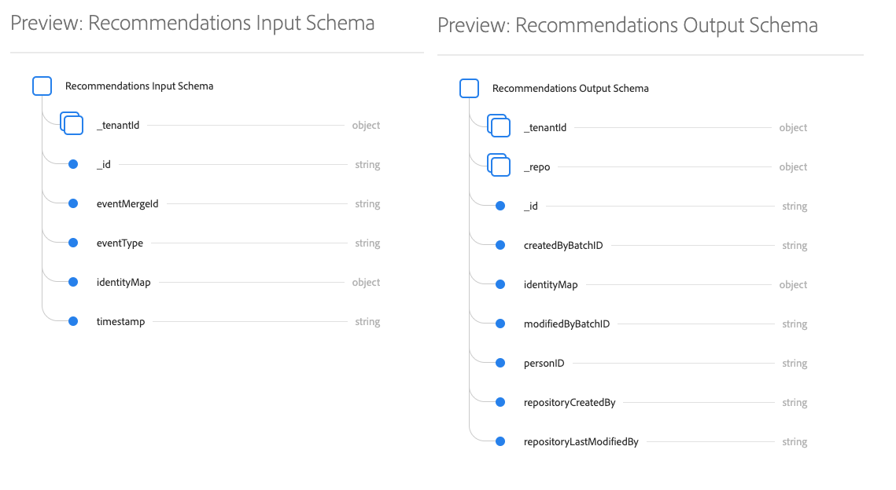
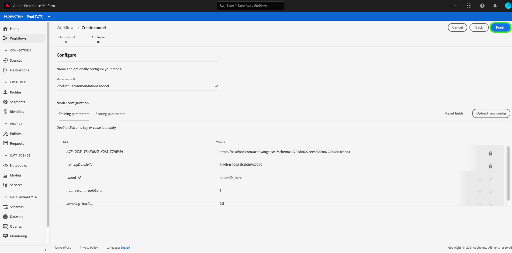
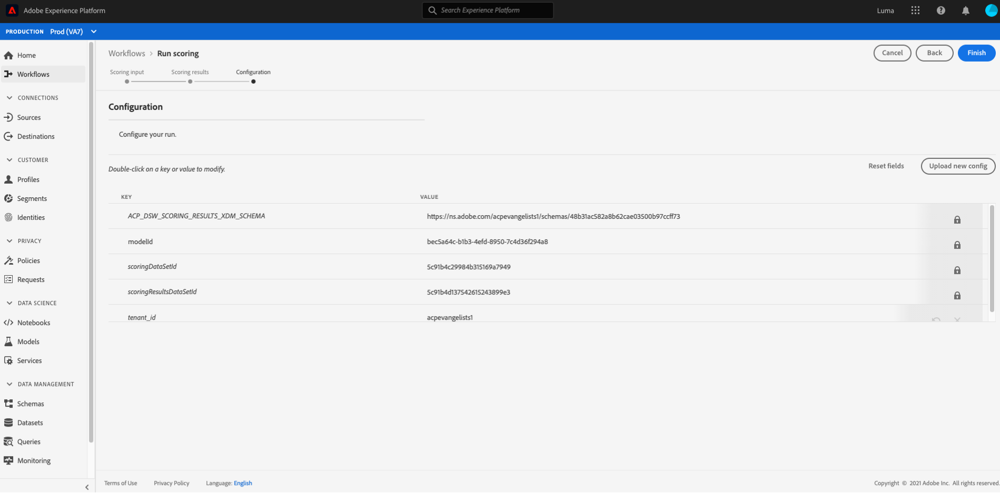

# Création et publication d’un modèle d’apprentissage automatique

Imaginons que vous possédez un site web de vente en ligne. Lorsque vos clients achètent sur votre site web de vente en ligne, vous souhaitez leur présenter des recommandations de produits personnalisées afin d’exposer une variété d’autres produits proposés par votre entreprise. Au cours de l’existence de votre site web, vous avez continuellement rassemblé des données clients et souhaitez utiliser ces données d’une manière ou d’une autre pour générer des recommandations de produits personnalisées.

[!DNL Adobe Experience Platform] [!DNL Data Science Workspace] fournit les moyens d&#39;atteindre votre objectif à l&#39;aide de la Recette du produit prédéfinie Recommendations. Suivez ce didacticiel pour découvrir comment accéder à vos données de vente au détail et les comprendre, créer et optimiser un modèle d&#39;apprentissage automatique et générer des informations dans [!DNL Data Science Workspace].

Ce didacticiel reflète le flux de travail de [!DNL Data Science Workspace] et décrit les étapes suivantes pour créer un modèle d’apprentissage automatique :

1. [Préparation de vos données](#prepare-your-data)
2. [Création de votre modèle](#author-your-model)
3. [Formation et évaluation de votre modèle](#train-and-evaluate-your-model)
4. [Exploitation de votre modèle](#operationalize-your-model)

## Prise en main

Avant de commencer ce tutoriel, vous devez disposer des éléments suivants :

- Accès à [!DNL Adobe Experience Platform]. Si vous n&#39;avez pas accès à une organisation IMS dans [!DNL Experience Platform], contactez votre administrateur système avant de continuer.

- Ressources d’activation. Contactez le représentant de votre compte pour que les éléments suivants soient mis en service.
   - Recette des recommandations
   - Jeu de données d’entrée des recommandations
   - Schéma d’entrée des recommandations
   - Jeu de données de sortie des recommandations
   - Schéma de sortie des recommandations
   - Valeurs de publication du jeu de données favori
   - Schéma du jeu de données favori

- Téléchargez les trois fichiers [!DNL Jupyter Notebook] requis à partir du [référentiel  [!DNL Git] public d&#39;Adobe](https://github.com/adobe/experience-platform-dsw-reference/tree/master/Summit/2019/resources/Notebooks-Thurs), qui seront utilisés pour démontrer le flux de travaux [!DNL JupyterLab] dans [!DNL Data Science Workspace].

Une connaissance concrète des concepts clés suivants employés dans ce tutoriel :
- [[!DNL Experience Data Model]](../../xdm/home.md): L’effort de normalisation conduit par l’Adobe pour définir des schémas standard tels que  [!DNL Profile] et ExperienceEvent, pour la gestion de l’expérience client.
- Jeux de données : construction de stockage et de gestion pour les données réelles. Instance instanciée physique d’un [schéma XDM](../../xdm/schema/field-dictionary.md).
- Lots : les jeux de données sont constitués de lots. Un lot est un ensemble de données collectées sur une période donnée et traitées ensemble comme une seule unité.
- [!DNL JupyterLab]:  [[!DNL JupyterLab]](https://blog.jupyter.org/jupyterlab-is-ready-for-users-5a6f039b8906) est une interface web open-source pour Project  [!DNL Jupyter] et est étroitement intégrée dans  [!DNL Experience Platform].

## Préparation de vos données {#prepare-your-data}

Pour créer un modèle d’apprentissage automatique qui recommande des produits personnalisés à vos clients, vous devez analyser les achats précédents de clients sur votre site web. Cette section explique comment ces données sont ingérées dans [!DNL Platform] à [!DNL Adobe Analytics] et comment ces données sont transformées en un jeu de données de fonctionnalités à utiliser par votre modèle d&#39;apprentissage automatique.

### Exploration des données et compréhension des schémas

Connectez-vous à [Adobe Experience Platform](https://platform.adobe.com/) et sélectionnez **[!UICONTROL Datasets]** pour liste à tous les jeux de données existants et sélectionnez le jeu de données que vous souhaitez explorer. Dans ce cas, le jeu de données [!DNL Analytics] **Golden Data Set postValues**.

La page d&#39;activité des jeux de données s&#39;ouvre et répertorie les informations relatives à votre jeu de données. Vous pouvez sélectionner **[!UICONTROL Jeu de données de Prévisualisation]** en haut à droite pour examiner les enregistrements d’échantillons. Vous pouvez également vue le schéma du jeu de données sélectionné. Sélectionnez le lien du schéma dans le rail droit. Une fenêtre contextuelle s’affiche, où vous sélectionnez le lien sous **[!UICONTROL nom du schéma]** pour ouvrir le schéma dans un nouvel onglet.

Les autres jeux de données ont été préremplis avec des lots à des fins d’aperçu. Vous pouvez afficher ces jeux de données en répétant les étapes ci-dessus.

| Nom du jeu de données | Schéma | Description |
| ----- | ----- | ----- |
| Valeurs de publication du jeu de données favori | Schéma du jeu de données favori | [!DNL Analytics]Données source de votre site web |
| Jeu de données d’entrée des recommandations | Schéma d’entrée des recommandations | Les données [!DNL Analytics] sont transformées en un jeu de données d’identification à l’aide d’un pipeline de fonctionnalités. Ces données sont utilisées pour former le modèle d’apprentissage automatique de recommandations de produits. `itemid` et `userid` correspondent à un produit acheté par ce client. |
| Jeu de données de sortie des recommandations | Schéma de sortie des recommandations | Le jeu de données pour lequel les résultats de notation sont stockés contient la liste des produits recommandés pour chaque client. |

## Création de votre modèle {#author-your-model}

Le deuxième composant du cycle de vie [!DNL Data Science Workspace] implique la création de Recettes et de Modèles. La recette des recommandations de produits est conçue pour générer des recommandations de produits à grande échelle en utilisant les données d’achats antérieurs et l’apprentissage automatique.

Les recettes sont la base d’un modèle puisqu’elles contiennent des algorithmes d’apprentissage automatique et une logique conçue pour résoudre des problèmes spécifiques. Plus important encore, les recettes vous permettent de démocratiser l’apprentissage automatique au sein de votre organisation, en permettant à d’autres utilisateurs d’accéder à un modèle pour des cas d’utilisation variés sans devoir coder.

### Exploration de la recette des recommandations de produits

Dans Experience Platform, accédez à **[!UICONTROL Modèles]** dans la colonne de navigation de gauche, puis sélectionnez **[!UICONTROL Recettes]** dans la barre de navigation supérieure pour vue une liste de recettes disponibles pour votre organisation.

Ensuite, recherchez et ouvrez la **[!UICONTROL Recette de Recommendations]** fournie en sélectionnant son nom. La page d&#39;aperçu de la recette s&#39;affiche.

Puis, dans le rail de droite, sélectionnez **[!UICONTROL Schéma d&#39;entrée Recommendations]** pour vue au schéma qui alimente la recette. Les champs de schéma &quot;[!UICONTROL itemId]&quot; et &quot;[!UICONTROL userId]&quot; correspondent à un produit acheté ([!UICONTROL interactionType]) par ce client à un moment spécifique ([!UICONTROL horodatage]). Suivez les mêmes étapes pour consulter le **[!UICONTROL Schéma de sortie des recommandations]**.

Vous avez maintenant examiné les schémas d’entrée et de sortie requis par la recette des recommandations de produits. Passez à la section suivante pour découvrir comment créer, former et évaluer un modèle Recommendations de produit.

## Formation et évaluation de votre modèle {#train-and-evaluate-your-model}

Maintenant que vos données sont préparées et que la Recette est prête, vous pouvez créer, former et évaluer votre modèle d&#39;apprentissage automatique.

### Création d’un modèle

Un modèle est une instance de recette qui permet l’entraînement et l’évaluation de données à grande échelle.

Dans l’Experience Platform, accédez à **[!UICONTROL Modèles]** dans la colonne de navigation de gauche, puis sélectionnez **[!UICONTROL Recettes]** dans la barre de navigation supérieure. Il affiche une liste de recettes disponibles pour votre organisation.Sélectionnez la recette de recommandation de produit.

Dans la page de recette, sélectionnez **[!UICONTROL Créer un modèle]**.

Le processus de création de modèle commence par sélectionner une recette. Sélectionnez **[!UICONTROL Recommendations Recipe]**, puis **[!UICONTROL Next]** dans le coin supérieur droit.

Indiquez ensuite un nom de modèle. Les configurations disponibles pour le modèle sont répertoriées avec les paramètres des comportements de formation et de notation par défaut du modèle. Vérifiez les configurations et sélectionnez **[!UICONTROL Terminer]**.

Vous êtes redirigé vers la page d’aperçu des modèles avec une nouvelle série de formations générée. Une session d’entraînement est générée par défaut lors de la création d’un modèle.

Vous pouvez choisir d’attendre la fin de la session d’entraînement ou continuer à créer une session d’entraînement dans la section suivante.

### Entraînement du modèle à l’aide d’hyperparamètres personnalisés

Sur la page **Présentation du modèle**, sélectionnez **[!UICONTROL Train]** en haut à droite pour créer une nouvelle session de formation. Sélectionnez le même jeu de données d’entrée que celui utilisé lors de la création du modèle et sélectionnez **[!UICONTROL Suivant]**.

La page de **[!UICONTROL configuration]** s’affiche. Vous pouvez configurer ici la valeur d&#39;exécution de la formation `num_recommendations`, également appelée hyperparamètre. Un modèle formé et optimisé utilisera les hyperparamètres les plus performants en fonction des résultats de l&#39;entraînement.

Les hyperparamètres ne peuvent pas être appris. Par conséquent, ils doivent être attribués avant les sessions d’entraînement. Le réglage des hyperparamètres peut modifier la précision du modèle entraîné. Comme l&#39;optimisation d&#39;un modèle est un processus itératif, il peut s&#39;avérer nécessaire de procéder à plusieurs exercices de formation avant d&#39;effectuer une évaluation satisfaisante.

>[!TIP]
>
>Définissez `num_recommendations` sur 10.

D’autres points de données apparaissent sur le graphique d’évaluation du modèle. Cette opération peut prendre plusieurs minutes une fois l’exécution terminée.

### Évaluation du modèle

Chaque fois qu’une session d’entraînement se termine, vous pouvez afficher les mesures d’évaluation qui en résultent pour déterminer l’efficacité du modèle.

Pour passer en revue les mesures d&#39;évaluation (Précision et rappel) pour chaque période de formation terminée, sélectionnez la période de formation.

Vous pouvez explorer les informations fournies pour chaque mesure d’évaluation. Plus ces mesures sont élevées, meilleure est la performance du modèle.

Vous pouvez voir le jeu de données, les schémas et les paramètres de configuration utilisés pour chaque session d’entraînement sur le rail droit. Revenez à la page Modèle et identifiez les sessions d’entraînement les plus performantes en observant leurs mesures d’évaluation.

## Exploitation de votre modèle  {#operationalize-your-model}

La dernière étape du workflow Data Science consiste à rendre opérationnel votre modèle afin de recueillir et d’exploiter les insights de votre banque de données.

### Évaluation et génération d’insights

Sur la page d’aperçu du modèle de recommandations de produits, sélectionnez le nom de la série de formations la plus performante, avec les valeurs de rappel et de précision les plus élevées.

Puis, dans l’angle supérieur droit de la page des détails de la série de formations, sélectionnez **[!UICONTROL Score]**.

Ensuite, sélectionnez le **[!UICONTROL jeu de données d&#39;entrée Recommendations]** comme jeu de données d&#39;entrée de score, qui est le même jeu de données que celui que vous avez utilisé lorsque vous avez créé le modèle et exécuté ses exécutions de formation. Sélectionnez ensuite **[!UICONTROL Suivant]**.

Une fois que vous disposez de votre jeu de données d’entrée, sélectionnez **[!UICONTROL Recommendations Output Dataset]** comme jeu de données de sortie de score. Les résultats de score sont stockés par lot dans ce jeu de données.

Enfin, passez en revue les configurations de notation. Ces paramètres contiennent les jeux de données d’entrée et de sortie que vous avez sélectionnés précédemment, ainsi que les schémas appropriés. Sélectionnez **[!UICONTROL Terminer]** pour commencer l’exécution de score. Cela peut prendre plusieurs minutes.

### Affichage des insights évalués

Une fois l’exécution de score terminée, vous pouvez prévisualisation les résultats et vue les informations générées.

Sur la page d’exécutions de score, sélectionnez l’exécution de score terminée, puis sélectionnez **[!UICONTROL Jeu de données de résultats de score de Prévisualisation]** dans le rail de droite.

Dans le tableau de prévisualisation, chaque ligne contient des recommandations de produits pour un client en particulier, respectivement libellés [!UICONTROL recommendations] et [!UICONTROL userId]. Puisque l’hyperparamètre [!UICONTROL num_recommendations] a été défini sur 10 dans les exemples de captures d’écran, chaque ligne de recommandations peut contenir jusqu’à 10 identités de produit délimitées par un signe dièse (#).

## Étapes suivantes {#next-steps}

Ce didacticiel vous a présenté le flux de travail de [!DNL Data Science Workspace], qui montre comment les données brutes non traitées peuvent être transformées en informations utiles par l&#39;apprentissage automatique. Pour en savoir plus sur l&#39;utilisation du [!DNL Data Science Workspace], consultez le guide suivant sur la création du [schéma de vente au détail et du jeu de données](./create-retails-sales-dataset.md).
