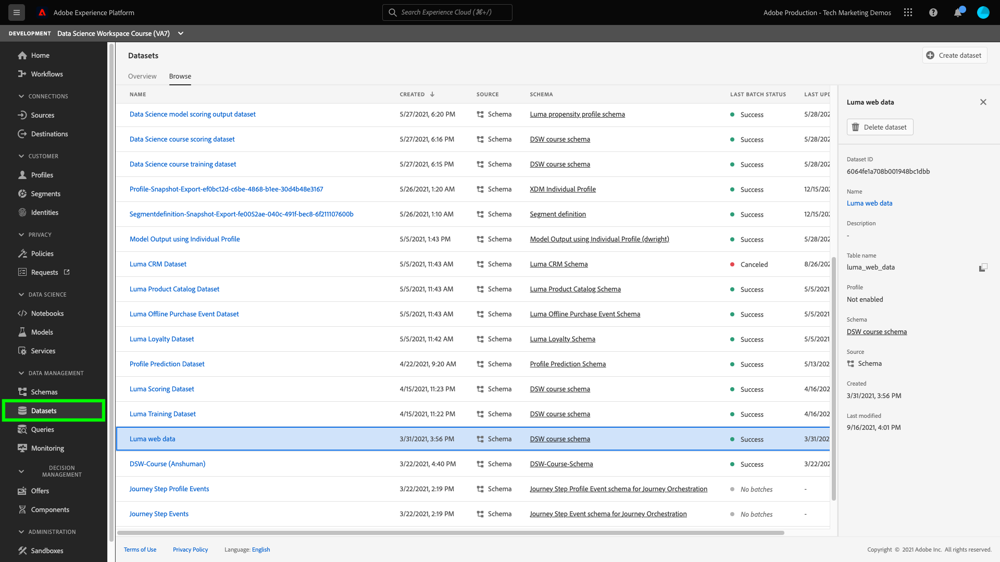
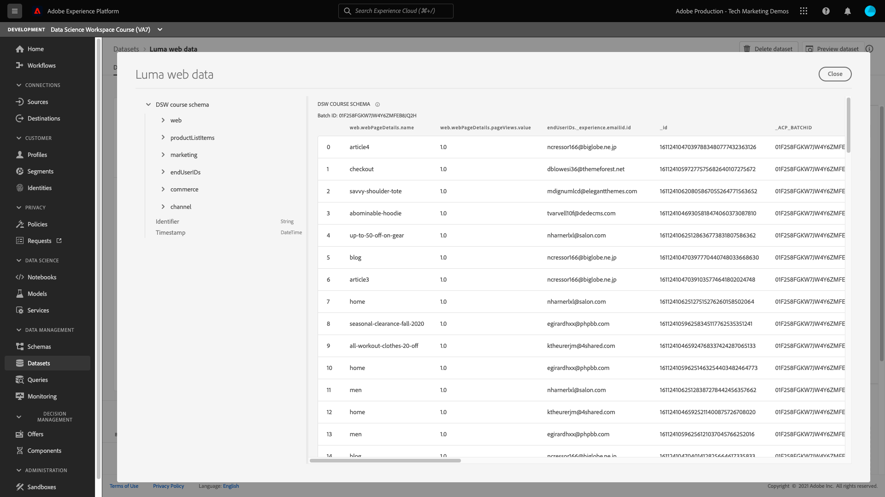
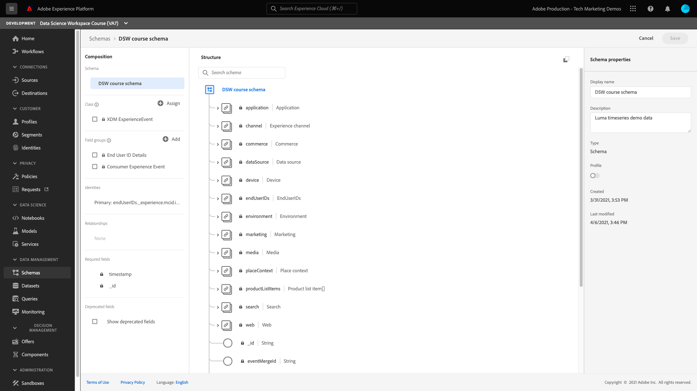

# Création et publication d’un modèle de machine learning

>[!NOTE]
>
>Le Workspace de science des données ne peut plus être acheté.
>
>Cette documentation est destinée aux clients existants disposant de droits antérieurs sur Data Science Workspace.

Le guide suivant décrit les étapes requises pour créer et publier un modèle de machine learning. Chaque section contient une description de ce que vous allez faire et un lien vers l’interface utilisateur et la documentation de l’API pour effectuer l’étape décrite.

## Prise en main

Avant de commencer ce tutoriel, vous devez disposer des éléments suivants :

- Accès à [!DNL Adobe Experience Platform]. Si vous n’avez pas accès à une organisation dans [!DNL Experience Platform], contactez votre administrateur système avant de continuer.

- Tous les tutoriels de Data Science Workspace utilisent le modèle de propension Luma. Pour suivre cette procédure, vous devez avoir créé les jeux de données et schémas de modèle de propension [Luma](./create-luma-data.md).

### Exploration des données et compréhension des schémas

Connectez-vous à [&#128279;](https://platform.adobe.com/) puis sélectionnez **[!UICONTROL Datasets]** pour répertorier tous les jeux de données existants et sélectionnez le jeu de données à explorer. Dans ce cas, vous devez sélectionner le jeu de données **Données web Luma**.

La page d’activité du jeu de données s’ouvre, répertoriant les informations relatives à votre jeu de données. Vous pouvez sélectionner **[!UICONTROL Preview Dataset]** en haut à droite pour examiner les exemples d’enregistrements. Vous pouvez également afficher le schéma du jeu de données sélectionné.

Sélectionnez le lien du schéma dans le rail de droite. Une fenêtre contextuelle s’affiche. Si vous sélectionnez le lien sous **[!UICONTROL schema name]**, le schéma s’ouvre dans un nouvel onglet.

Vous pouvez explorer davantage les données à l’aide du notebook d’analyse exploratoire des données (AED) fourni. Ce notebook peut être utilisé pour aider à comprendre les modèles dans les données Luma, vérifier l’intégrité des données et résumer les données pertinentes pour le modèle de propension prédictif. Pour en savoir plus sur l’analyse exploratoire des données, consultez la documentation [AED](../jupyterlab/eda-notebook.md).

## Création de la recette de propension Luma {#author-your-model}

L’un des principaux composants du cycle de vie des [!DNL Data Science Workspace] implique la création de recettes et de modèles. Le modèle de propension de Luma est conçu pour générer une prédiction sur la propension élevée des clients et clientes à acheter un produit de Luma.

Pour créer le modèle de propension Luma, le modèle de créateur de recettes est utilisé. Les recettes constituent la base d’un modèle, dans la mesure où elles contiennent des algorithmes de machine learning ainsi qu’une logique conçue pour résoudre des problèmes spécifiques. Plus important encore, les recettes vous permettent de démocratiser le machine learning au sein de votre organisation, en permettant à d’autres utilisateurs d’accéder à un modèle pour des cas d’utilisation variés sans devoir coder.

Suivez le tutoriel [Créer un modèle à l’aide de notebooks JupyterLab](../jupyterlab/create-a-model.md) pour créer la recette de modèle de propension Luma qui est utilisée dans les tutoriels suivants.

## Importer et regrouper une recette provenant de sources externes (*facultatif*)

Si vous souhaitez importer et compresser une recette pour l’utiliser dans le Workspace de science des données, vous devez compresser vos fichiers sources dans un fichier d’archive. Suivez le tutoriel [package des fichiers sources dans une recette](./package-source-files-recipe.md). Ce tutoriel vous explique comment compresser les fichiers sources dans une recette, ce qui est l’étape préalable à l’importation d’une recette dans le Workspace de science des données. Une fois le tutoriel terminé, une image Docker vous est fournie dans un registre de conteneurs Azure, avec l’URL de l’image correspondante, en d’autres termes, un fichier d’archive.

Ce fichier d’archive peut être utilisé pour créer une recette dans le Workspace de science des données en suivant le workflow d’importation des recettes à l’aide du [&#x200B; workflow de l’interface utilisateur &#x200B;](./import-packaged-recipe-ui.md) ou du [&#x200B; workflow de l’API &#x200B;](./import-packaged-recipe-api.md).

## Former et évaluer un modèle {#train-and-evaluate-your-model}

Maintenant que vos données sont prêtes et qu’une recette est prête, vous avez la possibilité de créer, d’entraîner et d’évaluer davantage votre modèle de machine learning. Lors de l’utilisation du créateur de recettes, vous devriez avoir déjà formé, noté et évalué votre modèle avant de le transformer en recette.

L’interface utilisateur et l’API Data Science Workspace vous permettent de publier votre recette en tant que modèle. De plus, vous pouvez affiner davantage des aspects spécifiques de votre modèle, tels que l’ajout, la suppression et la modification d’hyperparamètres.

### Création d’un modèle

Pour en savoir plus sur la création d’un modèle à l’aide de l’interface utilisateur, consultez la page Formation et évaluation d’un modèle dans le tutoriel sur l’interface utilisateur de Workspace [tutoriel sur l’interface utilisateur](./train-evaluate-model-ui.md) ou [&#x200B; tutoriel sur l’API](./train-evaluate-model-api.md). Ce tutoriel fournit un exemple de création, d’entraînement et de mise à jour d’hyperparamètres pour affiner votre modèle.

>[!NOTE]
>
> Les hyperparamètres ne peuvent pas être appris. Par conséquent, ils doivent être attribués avant les sessions d’entraînement. Le réglage des hyperparamètres peut modifier la précision de votre modèle entraîné. L’optimisation d’un modèle étant un processus itératif, plusieurs cycles de formation peuvent être nécessaires avant d’obtenir une évaluation satisfaisante.

## Notation d’un modèle {#score-a-model}

L’étape suivante de la création et de la publication d’un modèle consiste à opérationnaliser votre modèle afin de noter et d’utiliser les informations du lac de données et du profil client en temps réel.

La notation dans le Workspace de science des données peut être réalisée en alimentant un modèle formé existant avec des données d’entrée. Les résultats de la notation sont ensuite stockés et consultables dans un jeu de données de sortie spécifié sous la forme d’un nouveau lot.

Pour savoir comment noter votre modèle, consultez la section Noter un modèle [tutoriel de l’interface utilisateur](./score-model-ui.md) ou [tutoriel de l’API](./score-model-api.md).

## Publier un modèle noté en tant que service

Le Workspace de science des données vous permet de publier votre modèle formé en tant que service. Cela permet aux utilisateurs et utilisatrices de votre organisation de noter des données sans avoir à créer leurs propres modèles.

Pour savoir comment publier un modèle en tant que service, consultez le tutoriel [tutoriel de l’interface utilisateur](./publish-model-service-ui.md) ou [&#x200B; tutoriel de l’API](./publish-model-service-api.md).

### Planification d’une formation automatisée pour un service

Une fois que vous avez publié un modèle en tant que service, vous pouvez configurer des exécutions de notation et de formation planifiées pour votre service de machine learning. L’automatisation du processus de formation et de notation peut contribuer à maintenir et à améliorer l’efficacité d’un service au fil du temps en suivant les schémas au sein de vos données. Consultez le tutoriel [planifier un modèle dans l’interface utilisateur de Workspace de science des données](./schedule-models-ui.md).

>[!NOTE]
>
> Vous pouvez uniquement planifier un modèle pour la formation et la notation automatisées à partir de l’interface utilisateur.

## Étapes suivantes {#next-steps}

Adobe Experience Platform [!DNL Data Science Workspace] fournit des outils et des ressources pour créer, évaluer et utiliser des modèles de machine learning afin de générer des prédictions et des informations sur les données. Lorsque des informations d’apprentissage automatique sont ingérées dans un jeu de données activé pour [!DNL Profile], ces mêmes données sont également ingérées en tant qu’enregistrements [!DNL Profile] et peuvent ensuite être segmentées à l’aide de [!DNL Adobe Experience Platform Segmentation Service].

À mesure que les données de profil et de série temporelle sont ingérées, le profil client en temps réel décide automatiquement d’inclure ou d’exclure ces données des segments par le biais d’un processus continu appelé la segmentation par flux, avant de les fusionner avec les données existantes et de mettre à jour la vue d’union. Par conséquent, vous pouvez instantanément effectuer des calculs et prendre des décisions pour offrir aux clients de meilleures expériences personnalisées lorsqu’ils interagissent avec votre marque.

Consultez le tutoriel pour [enrichir le profil client en temps réel avec des informations de machine learning](./enrich-profile.md) pour en savoir plus sur l’utilisation des informations de machine learning.
