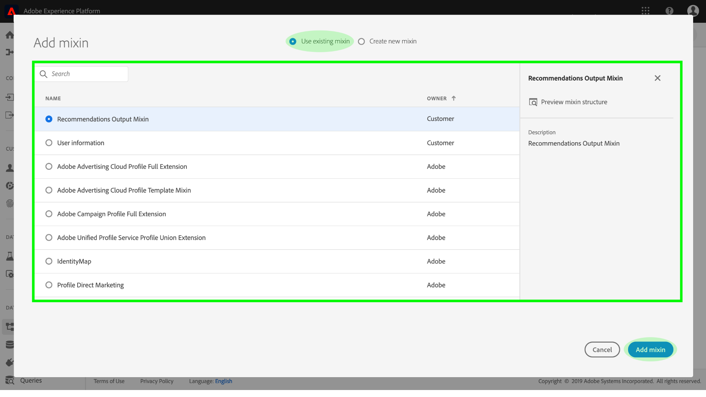
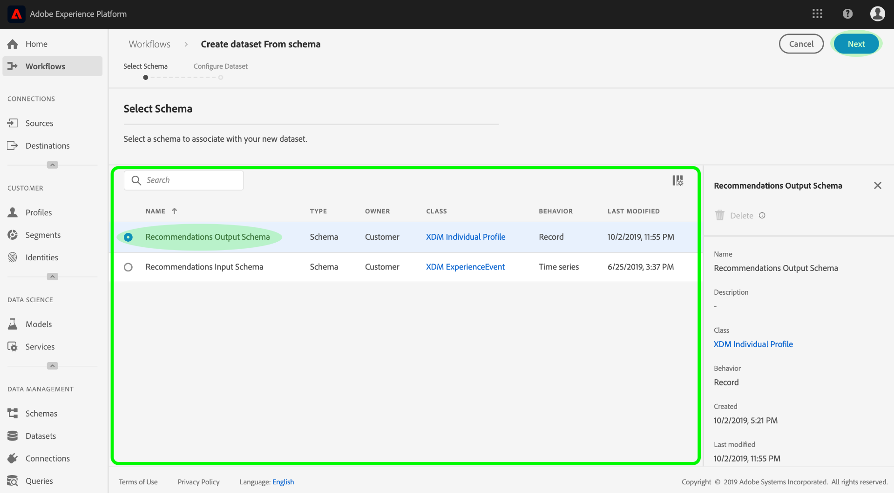

# Enrichir les  des clients en temps réel avec des informations d’apprentissage automatique

L’espace de travail Data Science d’Adobe Experience Platform fournit les outils et les ressources nécessaires pour créer, évaluer et utiliser des modèles d’apprentissage automatique afin de générer des prévisions et des informations sur les données. Lorsque des informations d’apprentissage automatique sont assimilées à un jeu de données compatible avec les , ces mêmes données sont également assimilées à des enregistrements  qui peuvent ensuite être segmentés en sous-ensembles d’éléments connexes à l’aide du service de segmentation de la plateforme d’expérience.

Ce fournit un didacticiel détaillé pour enrichir le client en temps réel de connaissances sur l’apprentissage automatique. Les étapes sont divisées en sections suivantes :

1. [Création d’un  de sortie et d’un jeu de données](#create-an-output-schema-and-dataset)
2. [Configuration d’un  de sortie et d’un jeu de données](#configure-an-output-schema-and-dataset)
3. [Création de segments à l’aide du créateur de segments](#create-segments-using-the-segment-builder)

## Prise en main

Ce didacticiel nécessite une compréhension pratique des différents aspects d’Adobe Experience Platform impliqués dans l’assimilation de données  et la création de segments. Avant de commencer ce didacticiel, veuillez consulter la documentation des services suivants :

* du client en temps réel : Fournit un client en temps réel unifié basé sur des données agrégées provenant de plusieurs sources.
* [Service](../../identity-service/home.md)d&#39;identité : Permet d’activer les  de clients en temps réel en rapprochant les identités des sources de données disparates qui sont assimilées dans la plateforme.
* [Modèle de données d’expérience (XDM)](../../xdm/home.md): Cadre normalisé selon lequel la plateforme organise les données d’expérience client.

Outre le  de mentionné ci-dessus, il est vivement recommandé de consulter également les guides suivants sur l’ de et l’éditeur de  d’outils :

* [Principes de base de la composition](../../xdm/schema/composition.md)de  : Décrit les  XDM, les blocs de création, les principes et les meilleures pratiques pour la composition de à utiliser dans Experience Platform.
* [Didacticiel](../../xdm/tutorials/create-schema-ui.md)de l’éditeur de  : Fournit des instructions détaillées sur la création de  d’à l’aide de l’éditeur de  de dans la plateforme d’expérience.

## Création d’un  de sortie et d’un jeu de données

La première étape vers l’enrichissement du client en temps réel avec des informations de score consiste à savoir quel objet réel (tel qu’une personne) vos données définissent. La compréhension de vos données vous permet de décrire et de concevoir une structure qui donne du sens à vos données, tout comme la conception d&#39;une base de données relationnelle.

La composition d’un  commence par l’affectation d’une classe. Les classes définissent les aspects comportementaux des données que le contiendra (enregistrements ou séries chronologiques). Cette section fournit des instructions de base pour créer un  à l’aide du générateur de  de. Pour un didacticiel plus détaillé, reportez-vous au didacticiel sur la [création d’un à l’aide de l’éditeur](../../xdm/tutorials/create-schema-ui.md)de  de.

1. Sur Adobe Experience Platform, cliquez sur l’onglet **du** pour accéder au navigateur . Cliquez sur **Créer un** accédez à l’éditeur *de  de*, où vous pouvez créer et créer des  de manière interactive.
   

2. Dans la fenêtre *Composition* , cliquez sur **Attribuer** pour parcourir les classes disponibles.
   * Pour affecter une classe existante, cliquez et mettez en surbrillance la classe souhaitée, puis cliquez sur **Attribuer une classe**.
      

   * Pour créer une classe personnalisée, cliquez sur **Créer une classe** située près du centre de la fenêtre du navigateur. Indiquez un nom de classe, une description et choisissez le comportement de la classe. Cliquez sur **Attribuer une classe** une fois que vous avez terminé.
      
   A ce stade, la structure de votre  de doit contenir certains champs de classe et vous êtes prêt à affecter des mixins. Un mixin est un groupe d’un ou de plusieurs champs qui décrivent un concept particulier.

3. Dans la fenêtre *Composition* , cliquez sur **Ajouter** dans la sous-section *Mélanges* .
   * Pour attribuer un mixin existant, cliquez sur le mixin souhaité, puis cliquez sur **Ajouter Mixin**. Contrairement aux classes, plusieurs mixins peuvent être affectés à un seul  de tant qu’il est approprié de le faire.
      

   * Pour créer un nouveau mixin, cliquez sur **Créer un nouveau mixin** situé près du centre de la fenêtre du navigateur. Attribuez un nom et une description au mixin, puis cliquez sur **Attribuer le mixin** une fois que vous avez terminé.
      

   * Pour ajouter des champs de mixage, cliquez sur le nom du mixin dans la fenêtre *Composition* . Vous aurez alors la possibilité d’ajouter des champs de mixage en cliquant sur **Ajouter champ** dans la fenêtre *Structure* . Veillez à fournir les propriétés de mixin en conséquence.
      

4. Une fois que vous avez terminé de créer votre  de, cliquez sur le champ de niveau supérieur de votre  dans la fenêtre *Structure* pour afficher les propriétés de l&#39; de lastructure dans la fenêtre de propriétés appropriée. Donnez un nom et une description, puis cliquez sur **Enregistrer** pour créer le  de.
   

5. Créez un jeu de données de sortie à l’aide de votre nouveau  de en cliquant sur **Jeu de données** dans la colonne de navigation de gauche, puis sur **Créer un jeu de données**. Dans l’écran suivant, choisissez **Créer un jeu de données à partir de**de.
   

6. A l’aide du navigateur , recherchez et sélectionnez le nouvellement créé, puis cliquez sur **Suivant**.
   

7. Attribuez un nom et une description facultative, puis cliquez sur **Terminer** pour créer le jeu de données.
   

Maintenant que vous avez créé un jeu de données de de sortie, vous êtes prêt à passer à la section suivante pour le configurer et l&#39;activer pour les  de de  de données.

## Configuration d’un  de sortie et d’un jeu de données

Avant d’activer un jeu de données pour les  de, vous devez configurer le du jeu de données pour qu’il ait un champ d’identité principal, puis activer lejeu dedonnées pour les. Si vous souhaitez créer et activer une nouvelle  de, vous pouvez vous reporter au didacticiel sur la [création d’un  de à l’aide de l’éditeur](../../xdm/tutorials/create-schema-ui.md)de  decréation de. Sinon, suivez les instructions ci-dessous pour activer un  et un jeu de données existants.

1. Sur Adobe Experience Platform, utilisez le navigateur  pour trouver le de sortie  sur lequel vous souhaitez activer l’, puis cliquez sur son nom pour sa composition.
   

2. Développez la structure de  du et recherchez un champ approprié à définir comme identifiant principal. Cliquez sur le champ de votre choix pour afficher ses propriétés.
   

3. Définissez le champ comme identité principale en activant la propriété **Identity** du champ, la propriété **Primary Identity** , puis en sélectionnant une **identité  un** Identity approprié. Cliquez sur **Appliquer** une fois les modifications effectuées.
   

4. Cliquez sur l’objet de niveau supérieur de la structure de votre  de pour afficher les propriétés  de et activer le **commutateur de** -pour le modèle de formulaire. Cliquez sur **Enregistrer** pour finaliser vos modifications, les jeux de données créés à l&#39;aide de ce  de peuvent désormais être activés pour les  de.
   

5. Utilisez le navigateur de jeux de données pour trouver le jeu de données sur lequel vous souhaitez activer le  et cliquez sur son nom pour accéder à ses détails.
   

6. Activez le jeu de données pour les  de en activant le commutateur de **** situé dans la colonne d&#39;informations appropriée.
   

Lorsque des données sont ingérées dans un jeu de données compatible avec les , ces mêmes données sont également assimilées à des enregistrements . Maintenant que votre et votre jeu de données sont préparés, générez des données dans le jeu de données en exécutant des exécutions de score à l’aide d’un modèle approprié, puis poursuivez avec ce didacticiel pour créer des segments d’informations à l’aide du créateur de segments.

## Création de segments à l’aide du créateur de segments

Maintenant que vous avez généré et assimilé des informations dans votre jeu de données compatible avec les , vous pouvez gérer ces données en identifiant des sous-ensembles d’éléments associés à l’aide du Créateur de segments. Suivez les étapes ci-dessous pour créer vos propres segments.

1. Sur Adobe Experience Platform, cliquez sur l’onglet **Segments** suivi de **Créer un segment** pour accéder au créateur de segments.
   

2. Dans le créateur de segments, le rail de gauche permet d’accéder aux blocs de création principaux des segments : attributs,  et segments existants. Chaque bloc de création apparaît dans son propre onglet respectif. Sélectionnez la classe à laquelle s’étend votre compatible avec les , puis recherchez les blocs de création de votre segment.
   

3. Faites glisser des blocs de création sur le canevas du créateur de règles, puis complétez-les en fournissant des instructions comparatives.
   

4. Lorsque vous créez votre segment, vous pouvez  les résultats estimés des segments en observant le panneau Propriétés *du* segment.
   

5. Sélectionnez une stratégie **de** fusion appropriée, attribuez un nom et une description facultative, puis cliquez sur **Enregistrer** pour terminer votre nouveau segment.
   

## Étapes suivantes

Ce vous a  décrit les étapes requises pour activer un  de et un jeu de données pour l’ et a brièvement décrit le processus de création de segments d’informations à l’aide du créateur de segments. Pour en savoir plus sur les segments et le créateur de segments, reportez-vous à la présentation [du service de](../../segmentation/home.md)segmentation.