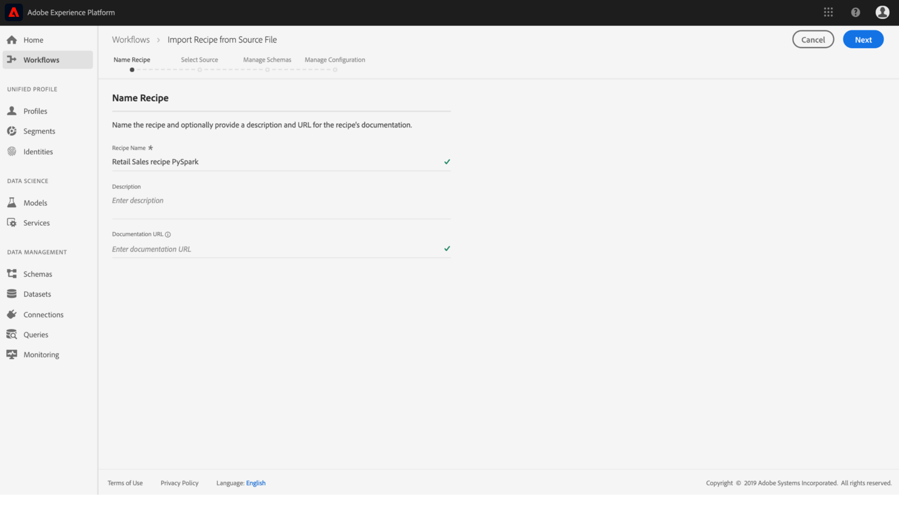
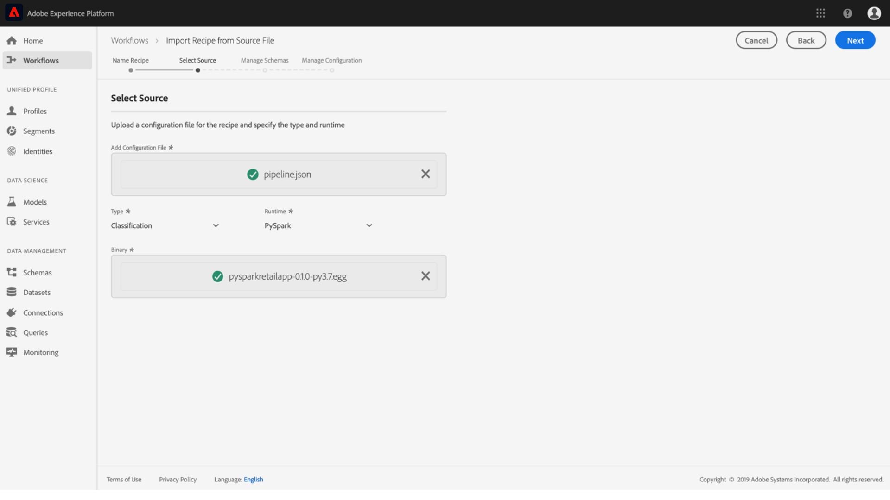
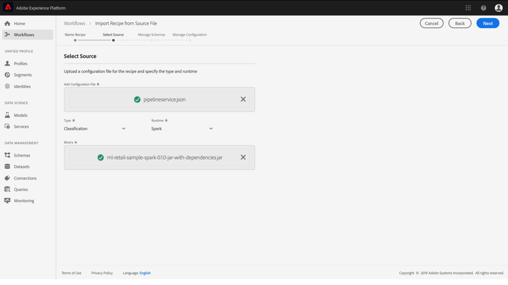

# Importer une recette assemblée (IU)

Ce didacticiel explique comment configurer et importer une recette assemblée à l&#39;aide de l&#39;exemple Ventes au détail fourni. D’ici la fin de ce didacticiel, vous serez prêt à créer, à former et à évaluer un modèle dans l’espace de travail Data Science d’Adobe Experience Platform.

## Conditions préalables

Ce didacticiel nécessite une recette assemblée sous la forme d’une URL d’image Docker. Pour plus d’informations, consultez le didacticiel sur la manière de [compresser les fichiers source dans une recette](./package-source-files-recipe.md) .

## Flux d’interface

L’importation d’une recette assemblée dans Data Science Workspace requiert des configurations de recette spécifiques, compilées dans un seul fichier JSON (JavaScript Object Notation), cette compilation des configurations de recette est appelée fichier **de** configuration. Une recette assemblée avec un ensemble particulier de configurations est appelée instance **de** recette. Une recette peut être utilisée pour créer de nombreuses instances de recette dans Data Science Workspace.

Le processus d’importation d’une recette de package se compose des étapes suivantes :
- [Configuration d’une recette](#configure)
- [Recette basée sur un Docker d&#39;importation - Python](#python)
- [Importer la recette basée sur un Docker - R](#r)
- [Importer une recette basée sur un Docker - PySpark](#pyspark)
- [Recette basée sur un Docker d&#39;importation - Scala](#scala)

 obsolète :
- [Importer une recette binaire - PySpark](#pyspark-deprecated)
- [Importer une recette binaire - Scala Spark](#scala-deprecated)

### Configuration d’une recette {#configure}

Chaque instance de recette dans Data Science Workspace est accompagnée d’un ensemble de configurations qui adaptent l’instance de recette à un cas d’utilisation particulier. Les fichiers de configuration définissent les comportements d’identification et de notation par défaut d’un modèle créé à l’aide de cette instance de recette.

>[!NOTE] Les fichiers de configuration sont spécifiques à la recette et à la casse.

Vous trouverez ci-dessous un exemple de fichier de configuration présentant les comportements de formation et de notation par défaut de la recette Ventes au détail.

```json
[
    {
        "name": "train",
        "parameters": [
            {
                "key": "learning_rate",
                "value": "0.1"  
            },
            {
                "key": "n_estimators",
                "value": "100"
            },
            {
                "key": "max_depth",
                "value": "3"
            },
            {
                "key": "ACP_DSW_INPUT_FEATURES",
                "value": "date,store,storeType,storeSize,temperature,regionalFuelPrice,markdown,cpi,unemployment,isHoliday"
            },
            {
                "key": "ACP_DSW_TARGET_FEATURES",
                "value": "weeklySales"
            },
            {
                "key": "ACP_DSW_FEATURE_UPDATE_SUPPORT",
                "value": false
            },
            {
                "key": "tenantId",
                "value": "_{TENANT_ID}"
            },
            {
                "key": "ACP_DSW_TRAINING_XDM_SCHEMA",
                "value": "{SEE BELOW FOR DETAILS}"
            },
            {
                "key": "evaluation.labelColumn",
                "value": "weeklySalesAhead"
            },
            {
                "key": "evaluation.metrics",
                "value": "MAPE,MAE,RMSE,MASE"
            }
        ]
    },
    {
        "name": "score",
        "parameters": [
            {
                "key": "tenantId",
                "value": "_{TENANT_ID}"
            },
            {
                "key":"ACP_DSW_SCORING_RESULTS_XDM_SCHEMA",
                "value":"{SEE BELOW FOR DETAILS}"
            }
        ]
    }
]
```

| Clé de paramètre | Type | Description |
| ----- | ----- | ----- |
| `learning_rate` | Nombre | Echelle pour la multiplication des dégradés. |
| `n_estimators` | Nombre | Nombre d’arbres dans la forêt pour le classificateur de forêt aléatoire. |
| `max_depth` | Nombre | Profondeur maximale d’un arbre dans le classificateur de forêt aléatoire. |
| `ACP_DSW_INPUT_FEATURES` | Chaîne |  d’attributs de d’entrée séparés par des virgules. |
| `ACP_DSW_TARGET_FEATURES` | Chaîne |  d’attributs de de sortie séparés par des virgules. |
| `ACP_DSW_FEATURE_UPDATE_SUPPORT` | Booléen | Détermine si les fonctions d’entrée et de sortie peuvent être modifiées |
| `tenantId` | Chaîne | Cet ID permet de s’assurer que les ressources que vous créez sont correctement nommées et contenues dans votre organisation IMS. [Suivez les étapes ci-dessous](../../xdm/api/getting-started.md#know-your-tenant_id) pour trouver votre ID de locataire. |
| `ACP_DSW_TRAINING_XDM_SCHEMA` | Chaîne | d’entrée utilisé pour la formation d’un modèle. Laissez ce champ vide lors de l’importation dans l’interface utilisateur, remplacez-le par l’ID de schéma de formation lors de l’importation à l’aide de l’API. |
| `evaluation.labelColumn` | Chaîne | Libellé de colonne pour les visualisations d’évaluation. |
| `evaluation.metrics` | Chaîne | de mesures d’évaluation séparées par des virgules à utiliser pour évaluer un modèle. |
| `ACP_DSW_SCORING_RESULTS_XDM_SCHEMA` | Chaîne | de sortie utilisé pour marquer un modèle. Laissez ce champ vide lors de l’importation dans l’interface utilisateur, remplacez-le par un ID de schéma de notation lors de l’importation à l’aide de l’API. |

Dans ce didacticiel, vous pouvez laisser les fichiers de configuration par défaut de la recette Ventes au détail dans la référence de l’espace de travail Data Science de la manière dont ils sont.

### Recette basée sur un Docker d&#39;importation - Python {#python}

en naviguant et en sélectionnant les **** situés dans le coin supérieur gauche de l’interface utilisateur de la plateforme. Ensuite, sélectionnez *Importer la recette* et cliquez sur **Lancer**.


La page *Configurer* pour le flux de travail *Importer une recette* s’affiche. Entrez un nom et une description pour la recette, puis sélectionnez **Suivant** dans le coin supérieur droit.


>[!NOTE]
> Dans le didacticiel Recette [des fichiers source du](./package-source-files-recipe.md) package, une URL du Docker a été fournie à la fin de la création de la recette Ventes au détail à l’aide de fichiers source Python.

Une fois que vous êtes sur la page *Sélectionner la source* , collez l&#39;URL du Docker correspondant à la recette assemblée créée à l&#39;aide des fichiers source Python dans le champ URL **** source. Importez ensuite le fichier de configuration fourni en le faisant glisser et en le déposant, ou utilisez le **navigateur** du système de fichiers. Le fichier de configuration fourni se trouve à l’adresse `experience-platform-dsw-reference/recipes/python/retail/retail.config.json`. Sélectionnez **Python** dans la liste déroulante *Runtime* et **Classification** dans la liste déroulante *Type.* Une fois tout terminé, cliquez sur **Suivant** dans le coin supérieur droit pour accéder à *Gérer les* de.

>[!NOTE]
> *Type *prend en charge **la classification**et **la régression**. Si votre modèle ne figure pas sous l’un de ces types, sélectionnez **Personnalisé**.


Ensuite, sélectionnez le d’entrée et de sortie des ventes au détail sous la section *Gérer les*, ils ont été créés à l’aide du script d’amorçage fourni dans le didacticiel [Création du](../models-recipes/create-retails-sales-dataset.md) jeu de données et dujournal de vente au détail.


Sous la section Gestion des *fonctionnalités* , cliquez sur votre identification de client dans le lecteur de  pour développer le d’entrée Vente au détail . Sélectionnez les fonctions d’entrée et de sortie en mettant en surbrillance la fonction souhaitée, puis sélectionnez Fonction **d’** entrée ou Fonction **** dans la fenêtre Propriétés **du** champ de droite. Dans le cadre de ce didacticiel, définissez **weeklySales** comme fonction **de  du** et tout le reste comme fonction **d’** entrée. Cliquez sur **Suivant** pour consulter votre nouvelle recette configurée.

Vérifiez la recette, ajoutez, modifiez ou supprimez des configurations, le cas échéant. Cliquez sur **Terminer** pour créer la recette.


Passez aux étapes [](#next-steps) suivantes pour savoir comment créer un modèle dans Data Science Workspace à l’aide de la nouvelle recette Ventes au détail.

### Importer la recette basée sur un Docker - R {#r}

en naviguant et en sélectionnant les **** situés dans le coin supérieur gauche de l’interface utilisateur de la plateforme. Ensuite, sélectionnez *Importer la recette* et cliquez sur **Lancer**.


La page *Configurer* pour le flux de travail *Importer une recette* s’affiche. Entrez un nom et une description pour la recette, puis sélectionnez **Suivant** dans le coin supérieur droit.


>[!NOTE]
> Dans le didacticiel Recette [des fichiers source du](./package-source-files-recipe.md) package, une URL de dossier a été fournie à la fin de la création de la recette Ventes au détail à l’aide des fichiers source R.

Une fois que vous êtes sur la page *Sélectionner la source* , collez l’URL du Docker correspondant à la recette assemblée générée à l’aide des fichiers source R dans le champ URL **** source. Importez ensuite le fichier de configuration fourni en le faisant glisser et en le déposant, ou utilisez le **navigateur** du système de fichiers. Le fichier de configuration fourni se trouve à l’adresse `experience-platform-dsw-reference/recipes/R/Retail\ -\ GradientBoosting/retail.config.json`. Sélectionnez **R** dans la liste déroulante *Runtime* et **Classification** dans la liste déroulante *Type.* Une fois tout terminé, cliquez sur **Suivant** dans le coin supérieur droit pour accéder à *Gérer les* de.

>[!NOTE]
> *Type *prend en charge **la classification**et **la régression**. Si votre modèle ne figure pas sous l’un de ces types, sélectionnez **Personnalisé**.


Ensuite, sélectionnez le d’entrée et de sortie des ventes au détail sous la section *Gérer les*, ils ont été créés à l’aide du script d’amorçage fourni dans le didacticiel [Création du](../models-recipes/create-retails-sales-dataset.md) jeu de données et dujournal de vente au détail.


Sous la section Gestion des *fonctionnalités* , cliquez sur votre identification de client dans le lecteur de  pour développer le d’entrée Vente au détail . Sélectionnez les fonctions d’entrée et de sortie en mettant en surbrillance la fonction souhaitée, puis sélectionnez Fonction **d’** entrée ou Fonction **** dans la fenêtre Propriétés **du** champ de droite. Dans le cadre de ce didacticiel, définissez **weeklySales** comme fonction **de  du** et tout le reste comme fonction **d’** entrée. Cliquez sur **Suivant** pour consulter votre nouvelle recette configurée.

Vérifiez la recette, ajoutez, modifiez ou supprimez des configurations, le cas échéant. Cliquez sur **Terminer** pour créer la recette.


Passez aux étapes [](#next-steps) suivantes pour savoir comment créer un modèle dans Data Science Workspace à l’aide de la nouvelle recette Ventes au détail.

### Importer une recette basée sur un Docker - PySpark {#pyspark}

en naviguant et en sélectionnant les **** situés dans le coin supérieur gauche de l’interface utilisateur de la plateforme. Ensuite, sélectionnez *Importer la recette* et cliquez sur **Lancer**.


La page *Configurer* pour le flux de travail *Importer une recette* s’affiche. Entrez un nom et une description pour la recette, puis sélectionnez **Suivant** dans le coin supérieur droit pour continuer.


>[!NOTE]
> Dans le didacticiel Recette [des fichiers source du](./package-source-files-recipe.md) package, une URL de dossier a été fournie à la fin de la création de la recette Ventes au détail à l’aide des fichiers source PySpark.

Une fois que vous êtes sur la page *Sélectionner la source* , collez l’URL du Docker correspondant à la recette assemblée créée à l’aide des fichiers source PySpark dans le champ URL **de la** source. Importez ensuite le fichier de configuration fourni en le faisant glisser et en le déposant, ou utilisez le **navigateur** du système de fichiers. Le fichier de configuration fourni se trouve à l’adresse `experience-platform-dsw-reference/recipes/pyspark/retail/pipeline.json`. Sélectionnez **PySpark** dans la liste déroulante *Runtime* . Une fois l’exécution de PySpark sélectionnée, l’artefact par défaut est automatiquement renseigné sur **Docker**. Ensuite, sélectionnez **Classification** dans la liste déroulante *Type* . Une fois tout terminé, cliquez sur **Suivant** dans le coin supérieur droit pour accéder à *Gérer les* de.

>[!NOTE]
> *Type *prend en charge **la classification**et **la régression**. Si votre modèle ne figure pas sous l’un de ces types, sélectionnez **Personnalisé**.


Ensuite, sélectionnez le d’entrée et de sortie des ventes au détail sous la section *Gérer les*, ils ont été créés à l’aide du script d’amorçage fourni dans le didacticiel [Création du](../models-recipes/create-retails-sales-dataset.md) jeu de données et dujournal de vente au détail.


Sous la section Gestion des *fonctionnalités* , cliquez sur votre identification de client dans le lecteur de  pour développer le d’entrée Vente au détail . Sélectionnez les fonctions d’entrée et de sortie en mettant en surbrillance la fonction souhaitée, puis sélectionnez Fonction **d’** entrée ou Fonction **** dans la fenêtre Propriétés **du** champ de droite. Dans le cadre de ce didacticiel, définissez **weeklySales** comme fonction **de  du** et tout le reste comme fonction **d’** entrée. Cliquez sur **Suivant** pour consulter votre nouvelle recette configurée.

Vérifiez la recette, ajoutez, modifiez ou supprimez des configurations, le cas échéant. Cliquez sur **Terminer** pour créer la recette.


Passez aux étapes [](#next-steps) suivantes pour savoir comment créer un modèle dans Data Science Workspace à l’aide de la nouvelle recette Ventes au détail.

### Recette basée sur un Docker d&#39;importation - Scala {#scala}

en naviguant et en sélectionnant les **** situés dans le coin supérieur gauche de l’interface utilisateur de la plateforme. Ensuite, sélectionnez *Importer la recette* et cliquez sur **Lancer**.


La page *Configurer* pour le flux de travail *Importer une recette* s’affiche. Entrez un nom et une description pour la recette, puis sélectionnez **Suivant** dans le coin supérieur droit pour continuer.


>[!NOTE]
> Dans le didacticiel Recette [des fichiers source du](./package-source-files-recipe.md) package, une URL de dossier a été fournie à la fin de la création de la recette Ventes au détail à l’aide des fichiers source Scala (Spark).

Une fois que vous êtes sur la page *Sélectionner la source* , collez l’URL du Docker correspondant à la recette assemblée créée à l’aide des fichiers source Scala dans le champ URL ** source. Importez ensuite le fichier de configuration fourni en le faisant glisser et en le déposant, ou utilisez le **navigateur** du système de fichiers. Le fichier de configuration fourni se trouve à l’adresse `experience-platform-dsw-reference/recipes/scala/retail/pipelineservice.json`. Sélectionnez **Spark** dans la liste déroulante *Runtime* . Une fois l’exécution Spark sélectionnée, l’artefact par défaut est automatiquement renseigné sur **Docker**. Ensuite, sélectionnez **Régression** dans la liste déroulante *Type* . Une fois tout terminé, cliquez sur **Suivant** dans le coin supérieur droit pour accéder à *Gérer les* de.

>[!NOTE]
> *Type *prend en charge **la classification**et **la régression**. Si votre modèle ne figure pas sous l’un de ces types, sélectionnez **Personnalisé**.


Ensuite, sélectionnez le d’entrée et de sortie des ventes au détail sous la section *Gérer les*, ils ont été créés à l’aide du script d’amorçage fourni dans le didacticiel [Création du](../models-recipes/create-retails-sales-dataset.md) jeu de données et dujournal de vente au détail.


Sous la section Gestion des *fonctionnalités* , cliquez sur votre identification de client dans le lecteur de  pour développer le d’entrée Vente au détail . Sélectionnez les fonctions d’entrée et de sortie en mettant en surbrillance la fonction souhaitée, puis sélectionnez Fonction **d’** entrée ou Fonction **** dans la fenêtre Propriétés **du** champ de droite. Dans le cadre de ce didacticiel, définissez **weeklySales** comme fonction **de  du** et tout le reste comme fonction **d’** entrée. Cliquez sur **Suivant** pour consulter votre nouvelle recette configurée.

Vérifiez la recette, ajoutez, modifiez ou supprimez des configurations, le cas échéant. Cliquez sur **Terminer** pour créer la recette.


Passez aux étapes [](#next-steps) suivantes pour savoir comment créer un modèle dans Data Science Workspace à l’aide de la nouvelle recette Ventes au détail.

## Étapes suivantes

Ce didacticiel explique comment configurer et importer une recette dans Data Science Workspace. Vous pouvez désormais créer, former et évaluer un modèle à l’aide de la nouvelle recette créée.

- [Formation et évaluation d’un modèle dans l’interface utilisateur](./train-evaluate-model-ui.md)
- [Former et évaluer un modèle à l’aide de l’API](./train-evaluate-model-api.md)

##  obsolète

>[!CAUTION]
>L’importation de recettes binaires n’est plus prise en charge dans PySpark 3 (Spark 2.4) et Scala (Spark 2.4).

### Importer une recette binaire - PySpark {#pyspark-deprecated}

Dans le didacticiel Recette [des fichiers source du](./package-source-files-recipe.md) package, un fichier binaire **EGG** a été créé à l’aide des fichiers source PySpark de vente au détail.

1. Dans [Adobe Experience Platform](https://platform.adobe.com/), recherchez le panneau de navigation de gauche, puis cliquez sur **de**. Dans l’interface  du, **lancez** un nouveau processus d’ **importation de recette à partir du fichier** source.
   
2. Entrez un nom approprié pour la recette Ventes au détail. Par exemple, &quot;Recette Ventes au détail PySpark&quot;. Vous pouvez éventuellement inclure une description de recette et une URL de documentation. Cliquez sur **Suivant** lorsque vous avez terminé.
   
3. Importez la recette Ventes au détail PySpark qui a été créée dans les fichiers source du [package dans un didacticiel Recette](./package-source-files-recipe.md) en faisant glisser-déposer, ou utilisez le **navigateur** du système de fichiers. La recette emballée doit se trouver dans `experience-platform-dsw-reference/recipes/pyspark/dist`.
De même, importez le fichier de configuration fourni en le faisant glisser et en le déposant, ou utilisez le **navigateur** du système de fichiers. Le fichier de configuration fourni se trouve à l’adresse `experience-platform-dsw-reference/recipes/pyspark/pipeline.json`. Cliquez sur **Suivant** lorsque les deux fichiers ont été fournis.
   
4. Vous pouvez rencontrer des erreurs à ce stade. Il s&#39;agit d&#39;un comportement normal et il est à prévoir. Sélectionnez le  d’entrée et de sortie des ventes au détail dans la section **Gérer le**, ils ont été créés à l’aide du script d’amorçage fourni dans le didacticiel [Création du](../models-recipes/create-retails-sales-dataset.md) jeu de données et dujournal de vente au détail.
   
Sous la section Gestion des **fonctionnalités** , cliquez sur votre identification de client dans le lecteur de  pour développer le d’entrée Vente au détail . Sélectionnez les fonctions d’entrée et de sortie en mettant en surbrillance la fonction souhaitée, puis sélectionnez Fonction **d’** entrée ou Fonction **** dans la fenêtre Propriétés **du** champ de droite. Dans le cadre de ce didacticiel, définissez **weeklySales** comme fonction **de  du** et tout le reste comme fonction **d’** entrée. Cliquez sur **Suivant** pour consulter votre nouvelle recette configurée.
5. Vérifiez la recette, ajoutez, modifiez ou supprimez des configurations, le cas échéant. Cliquez sur **Terminer** pour créer la recette.
   

Passez aux étapes [](#next-steps) suivantes pour savoir comment créer un modèle dans Data Science Workspace à l’aide de la nouvelle recette Ventes au détail.


### Importer une recette binaire - Scala Spark {#scala-deprecated}

Dans le didacticiel Recette [des fichiers source du](./package-source-files-recipe.md) package, un fichier binaire **JAR** a été créé à l’aide des fichiers source Scala Spark de vente au détail.

1. Dans [Adobe Experience Platform](https://platform.adobe.com/), recherchez le panneau de navigation de gauche, puis cliquez sur **de**. Dans l’interface  du, **lancez** un nouveau processus d’ **importation de recette à partir du fichier** source.
   
2. Entrez un nom approprié pour la recette Ventes au détail. Par exemple, &quot;Recette Vente au détail Scala Spark&quot;. Vous pouvez éventuellement inclure une description de recette et une URL de documentation. Cliquez sur **Suivant** lorsque vous avez terminé.
   
3. Importez la recette des ventes au détail Scala Spark qui a été créée dans les fichiers source du [package dans un didacticiel Recette](./package-source-files-recipe.md) en faisant glisser et en déplaçant, ou utilisez le **navigateur** du système de fichiers. La recette assemblée **avec dépendances** se trouve dans `experience-platform-dsw-reference/recipes/scala/target`. De même, importez le fichier de configuration fourni en le faisant glisser et en le déposant, ou utilisez le **navigateur** du système de fichiers. Le fichier de configuration fourni se trouve à l’adresse `experience-platform-dsw-reference/recipes/scala/src/main/resources/pipelineservice.json`. Cliquez sur **Suivant** lorsque les deux fichiers ont été fournis.
   
4. Vous pouvez rencontrer des erreurs à ce stade. Il s&#39;agit d&#39;un comportement normal et il est à prévoir. Sélectionnez le  d’entrée et de sortie des ventes au détail dans la section **Gérer le**, ils ont été créés à l’aide du script d’amorçage fourni dans le didacticiel [Création du](../models-recipes/create-retails-sales-dataset.md) jeu de données et dujournal de vente au détail.
   
Sous la section Gestion des **fonctionnalités** , cliquez sur votre identification de client dans le lecteur de  pour développer le d’entrée Vente au détail . Sélectionnez les fonctions d’entrée et de sortie en mettant en surbrillance la fonction souhaitée, puis sélectionnez Fonction **d’** entrée ou Fonction **** dans la fenêtre Propriétés **du** champ de droite. Dans le cadre de ce didacticiel, définissez **weeklySales** comme fonction **de  du** et tout le reste comme fonction **d’** entrée. Cliquez sur **Suivant** pour consulter votre nouvelle recette configurée.
5. Vérifiez la recette, ajoutez, modifiez ou supprimez des configurations, le cas échéant. Cliquez sur **Terminer** pour créer la recette.
   

Passez aux étapes [](#next-steps) suivantes pour savoir comment créer un modèle dans Data Science Workspace à l’aide de la nouvelle recette Ventes au détail.