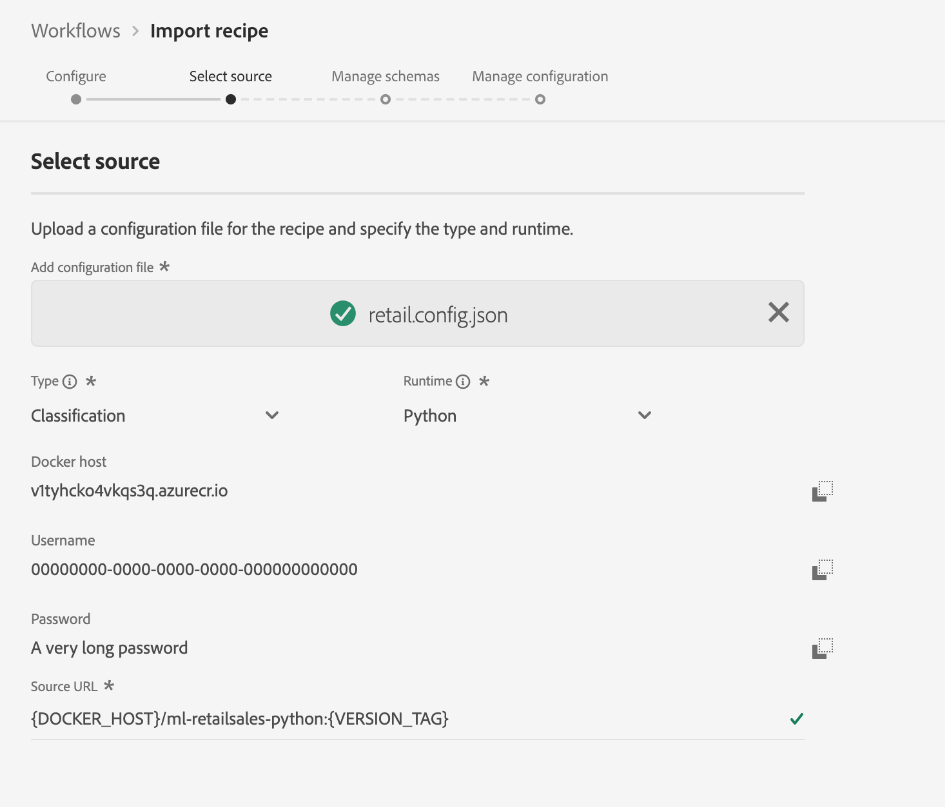

# Importation d’une recette empaquetée (interface utilisateur)

Ce tutoriel explique comment configurer et importer une recette empaquetée à l’aide de l’exemple de ventes au détail fourni. Après avoir terminé ce tutoriel, vous serez prêt à créer, à former et à évaluer un modèle dans Adobe Experience Platform [!DNL Data Science Workspace].

## Conditions préalables 

Ce didacticiel nécessite une recette empaquetée sous la forme d&#39;une URL d&#39;image Docker. Pour plus d’informations, consultez le tutoriel expliquant comment [Former une recette empaquetée à partir de fichiers source](./package-source-files-recipe.md).

## Workflow de l’interface utilisateur

Importing a packaged recipe into [!DNL Data Science Workspace] requires specific recipe configurations, compiled into a single JavaScript Object Notation (JSON) file, this compilation of recipe configurations is referred to as the **configuration file**. Une recette empaquetée avec un ensemble particulier de configurations est appelée **instance de recette**. One recipe can be used to create many recipe instances in [!DNL Data Science Workspace].

Voici les différentes étapes du workflow d’importation d’une recette empaquetée :
- [Configuration d’une recette](#configure)
- [Importation d’une recette Docker - Python](#python)
- [Importation d’une recette Docker - R](#r)
- [Importer une recette basée sur un Docker - PySpark](#pyspark)
- [Recette basée sur un Docker d&#39;importation - Scala](#scala)

### Configuration d’une recette {#configure}

Every recipe instance in [!DNL Data Science Workspace] is accompanied with a set of configurations that tailor the recipe instance to suit a particular use case. Les fichiers de configuration définissent les comportements de formation et de notation par défaut d’un modèle créé à l’aide de cette instance de recette.

>[!NOTE]
>
>Les fichiers de configuration sont spécifiques à la recette et au cas.

Vous trouverez ci-dessous un échantillon de fichier de configuration présentant les comportements de formation et de notation par défaut de la recette Ventes au détail.

```json
[
    {
        "name": "train",
        "parameters": [
            {
                "key": "learning_rate",
                "value": "0.1"  
            },
            {
                "key": "n_estimators",
                "value": "100"
            },
            {
                "key": "max_depth",
                "value": "3"
            },
            {
                "key": "ACP_DSW_INPUT_FEATURES",
                "value": "date,store,storeType,storeSize,temperature,regionalFuelPrice,markdown,cpi,unemployment,isHoliday"
            },
            {
                "key": "ACP_DSW_TARGET_FEATURES",
                "value": "weeklySales"
            },
            {
                "key": "ACP_DSW_FEATURE_UPDATE_SUPPORT",
                "value": false
            },
            {
                "key": "tenantId",
                "value": "_{TENANT_ID}"
            },
            {
                "key": "ACP_DSW_TRAINING_XDM_SCHEMA",
                "value": "{SEE BELOW FOR DETAILS}"
            },
            {
                "key": "evaluation.labelColumn",
                "value": "weeklySalesAhead"
            },
            {
                "key": "evaluation.metrics",
                "value": "MAPE,MAE,RMSE,MASE"
            }
        ]
    },
    {
        "name": "score",
        "parameters": [
            {
                "key": "tenantId",
                "value": "_{TENANT_ID}"
            },
            {
                "key":"ACP_DSW_SCORING_RESULTS_XDM_SCHEMA",
                "value":"{SEE BELOW FOR DETAILS}"
            }
        ]
    }
]
```

| Clé paramètre | Type | Description |
| ----- | ----- | ----- |
| `learning_rate` | Nombre | Scalaire pour la multiplication des gradients. |
| `n_estimators` | Nombre | Nombre d’arbres dans la forêt pour le classificateur Forêt aléatoire. |
| `max_depth` | Nombre | Profondeur maximale d’un arbre dans le classificateur Forêt aléatoire. |
| `ACP_DSW_INPUT_FEATURES` | Chaîne | Liste d’attributs de schéma d’entrée séparés par des virgules. |
| `ACP_DSW_TARGET_FEATURES` | Chaîne | Liste d’attributs de schéma de sortie séparés par des virgules. |
| `ACP_DSW_FEATURE_UPDATE_SUPPORT` | Booléen | Détermine si les fonctionnalités d’entrée et de sortie peuvent être modifiées. |
| `tenantId` | Chaîne | Cet identifiant permet de garantir que les ressources que vous créez sont des espaces de noms corrects et contenus dans votre organisation IMS. [Suivez ces étapes](../../xdm/api/getting-started.md#know-your-tenant_id) pour trouver votre identifiant client. |
| `ACP_DSW_TRAINING_XDM_SCHEMA` | Chaîne | Le schéma d’entrée utilisé pour la formation d’un modèle. Laissez ce champ vide lors de l’importation dans l’interface utilisateur ; remplacez-le par l’identifiant du schéma de formation lors de l’importation à l’aide de l’API. |
| `evaluation.labelColumn` | Chaîne | Libellé de colonne pour visualiser les évaluations. |
| `evaluation.metrics` | Chaîne | Liste de mesures d’évaluation séparées par des virgules à utiliser pour l’évaluation d’un modèle. |
| `ACP_DSW_SCORING_RESULTS_XDM_SCHEMA` | Chaîne | Le schéma de sortie utilisé pour la notation d’un modèle. Laissez ce champ vide lors de l’importation dans l’interface utilisateur ; remplacez-le par l’identifiant du schéma de notation lors de l’importation à l’aide de l’API. |

For the purpose of this tutorial, you can leave the default configuration files for Retail Sales recipe in the [!DNL Data Science Workspace] Reference the way they are.

### Importation d’une recette Docker - [!DNL Python] {#python}

Début en naviguant et en sélectionnant **[!UICONTROL des Workflows]** situés dans le coin supérieur gauche de l’ [!DNL Platform] interface utilisateur. Ensuite, sélectionnez *Importer la recette* et cliquez sur **[!UICONTROL Lancer]**.


La page *Configurer* pour le flux de travail *Importer une recette* s&#39;affiche. Entrez un nom et une description pour la recette, puis sélectionnez **[!UICONTROL Suivant]** dans le coin supérieur droit.


>[!NOTE]
>
> Dans le tutoriel [Former une recette empaquetée à partir de fichiers source](./package-source-files-recipe.md), une URL Docker a été fournie à la fin de la création de la recette Ventes au détail à l’aide de fichiers source Python.

Une fois que vous êtes sur la page *Sélectionner la source* , collez l&#39;URL du Docker correspondant à la recette assemblée générée à l&#39;aide de fichiers [!DNL Python] source dans le champ URL **** source. Importez ensuite le fichier de configuration fourni en le faisant glisser et en le déposant, ou utilisez le **Navigateur** du système de fichiers. Le fichier de configuration fourni se trouve ici : `experience-platform-dsw-reference/recipes/python/retail/retail.config.json`. Sélectionnez **[!UICONTROL Python]** dans la liste déroulante *Runtime* et **[!UICONTROL Classification]** dans la liste déroulante *Type.* Une fois que tout a été renseigné, cliquez sur **[!UICONTROL Suivant]** dans le coin supérieur droit pour accéder à *Gérer les schémas*.

>[!NOTE]
>
> *Type* prend en charge la **[!UICONTROL classification]** et **[!UICONTROL la régression]**. Si votre modèle ne tombe pas sous l&#39;un de ces types, sélectionnez **[!UICONTROL Personnalisé]**.



Next, select the Retail Sales input and output schemas under the section *Manage Schemas*, they were created using the provided bootstrap script in the [create the retail sales schema and dataset](../models-recipes/create-retails-sales-dataset.md) tutorial.


Under the *Feature Management* section, click on your tenant identification in the schema viewer to expand the Retail Sales input schema. Sélectionnez les fonctionnalités d’entrée et de sortie en mettant en surbrillance la fonctionnalité souhaitée, puis sélectionnez **[!UICONTROL Fonctionnalité d’entrée]** ou **[!UICONTROL Fonctionnalité cible]** dans la fenêtre **[!UICONTROL Propriétés du champ]** à droite. Pour les besoins de ce tutoriel, définissez **[!UICONTROL weeklySales]** en tant que **[!UICONTROL Fonctionnalité cible]** et tout le reste en tant que **[!UICONTROL Fonctionnalité d’entrée]**. Cliquez sur **[!UICONTROL Suivant]** pour consulter votre nouvelle recette configurée.

Vérifiez la recette, ajoutez, modifiez ou supprimez des configurations si nécessaire. Cliquez sur **[!UICONTROL Terminer]** pour créer la recette.


Proceed to the [next steps](#next-steps) to find out how to create a Model in [!DNL Data Science Workspace] using the newly created Retail Sales recipe.

### Importation d’une recette Docker - R {#r}

Début en naviguant et en sélectionnant **[!UICONTROL des Workflows]** situés dans le coin supérieur gauche de l’ [!DNL Platform] interface utilisateur. Ensuite, sélectionnez *Importer la recette* et cliquez sur **[!UICONTROL Lancer]**.


La page *Configurer* pour le flux de travail *Importer une recette* s&#39;affiche. Entrez un nom et une description pour la recette, puis sélectionnez **[!UICONTROL Suivant]** dans le coin supérieur droit.


>[!NOTE]
>
> Dans le tutoriel [Former une recette empaquetée à partir de fichiers source](./package-source-files-recipe.md), une URL Docker a été fournie à la fin de la création de la recette Ventes au détail à l’aide de fichiers source R.

Une fois que vous êtes sur la page *Sélectionner la source* , collez l&#39;URL du Docker correspondant à la recette assemblée générée à l&#39;aide des fichiers source R dans le champ URL **** source. Importez ensuite le fichier de configuration fourni en le faisant glisser et en le déposant, ou utilisez le **Navigateur** du système de fichiers. Le fichier de configuration fourni se trouve ici : `experience-platform-dsw-reference/recipes/R/Retail\ -\ GradientBoosting/retail.config.json`. Sélectionnez **[!UICONTROL R]** dans la liste déroulante *Exécution* et **[!UICONTROL Classification]** dans la liste déroulante *Type.* Une fois que tout a été renseigné, cliquez sur **[!UICONTROL Suivant]** dans le coin supérieur droit pour accéder à *Gérer les schémas*.

>[!NOTE]
>
> *Type* prend en charge la **[!UICONTROL classification]** et **[!UICONTROL la régression]**. Si votre modèle ne tombe pas sous l&#39;un de ces types, sélectionnez **[!UICONTROL Personnalisé]**.


Next, select the Retail Sales input and output schemas under the section *Manage Schemas*, they were created using the provided bootstrap script in the [create the retail sales schema and dataset](../models-recipes/create-retails-sales-dataset.md) tutorial.


Under the *Feature Management* section, click on your tenant identification in the schema viewer to expand the Retail Sales input schema. Sélectionnez les fonctionnalités d’entrée et de sortie en mettant en surbrillance la fonctionnalité souhaitée, puis sélectionnez **[!UICONTROL Fonctionnalité d’entrée]** ou **[!UICONTROL Fonctionnalité cible]** dans la fenêtre **[!UICONTROL Propriétés du champ]** à droite. Pour les besoins de ce tutoriel, définissez **[!UICONTROL weeklySales]** en tant que **[!UICONTROL Fonctionnalité cible]** et tout le reste en tant que **[!UICONTROL Fonctionnalité d’entrée]**. Click **[!UICONTROL Next]** to review your new Configured recipe.

Vérifiez la recette, ajoutez, modifiez ou supprimez des configurations si nécessaire. Cliquez sur **Terminer** pour créer la recette.


Proceed to the [next steps](#next-steps) to find out how to create a Model in [!DNL Data Science Workspace] using the newly created Retail Sales recipe.

### Import Docker based recipe - PySpark {#pyspark}

Début en naviguant et en sélectionnant **[!UICONTROL des Workflows]** situés dans le coin supérieur gauche de l’ [!DNL Platform] interface utilisateur. Ensuite, sélectionnez *Importer la recette* et cliquez sur **[!UICONTROL Lancer]**.


La page *Configurer* pour le flux de travail *Importer une recette* s&#39;affiche. Entrez un nom et une description pour la recette, puis sélectionnez **[!UICONTROL Suivant]** dans le coin supérieur droit pour continuer.


>[!NOTE]
>
> In the [Package source files into a Recipe](./package-source-files-recipe.md) tutorial, a Docker URL was provided at the end of building the Retail Sales recipe using PySpark source files.

Une fois que vous êtes sur la page *Sélectionner la source* , collez l&#39;URL du Docker correspondant à la recette assemblée générée à l&#39;aide des fichiers source PySpark dans le champ URL **** source. Importez ensuite le fichier de configuration fourni en le faisant glisser et en le déposant, ou utilisez le **Navigateur** du système de fichiers. Le fichier de configuration fourni se trouve ici : `experience-platform-dsw-reference/recipes/pyspark/retail/pipeline.json`. Sélectionnez **[!UICONTROL PySpark]** dans la liste déroulante *Runtime* . Une fois l&#39;exécution de PySpark sélectionnée, l&#39;artefact par défaut est automatiquement renseigné sur **[!UICONTROL Docker]**. Ensuite, sélectionnez **[!UICONTROL Classification]** dans la liste déroulante *Type* . Une fois que tout a été renseigné, cliquez sur **[!UICONTROL Suivant]** dans le coin supérieur droit pour accéder à *Gérer les schémas*.

>[!NOTE]
>
> *Type* prend en charge la **[!UICONTROL classification]** et **[!UICONTROL la régression]**. Si votre modèle ne tombe pas sous l&#39;un de ces types, sélectionnez **[!UICONTROL Personnalisé]**.


Next, select the Retail Sales input and output schemas under the section *Manage Schemas*, they were created using the provided bootstrap script in the [create the retail sales schema and dataset](../models-recipes/create-retails-sales-dataset.md) tutorial.


Under the *Feature Management* section, click on your tenant identification in the schema viewer to expand the Retail Sales input schema. Sélectionnez les fonctionnalités d’entrée et de sortie en mettant en surbrillance la fonctionnalité souhaitée, puis sélectionnez **[!UICONTROL Fonctionnalité d’entrée]** ou **[!UICONTROL Fonctionnalité cible]** dans la fenêtre **[!UICONTROL Propriétés du champ]** à droite. Pour les besoins de ce tutoriel, définissez **[!UICONTROL weeklySales]** en tant que **[!UICONTROL Fonctionnalité cible]** et tout le reste en tant que **[!UICONTROL Fonctionnalité d’entrée]**. Cliquez sur **[!UICONTROL Suivant]** pour consulter votre nouvelle recette configurée.

Vérifiez la recette, ajoutez, modifiez ou supprimez des configurations si nécessaire. Cliquez sur **[!UICONTROL Terminer]** pour créer la recette.


Proceed to the [next steps](#next-steps) to find out how to create a Model in [!DNL Data Science Workspace] using the newly created Retail Sales recipe.

### Import Docker based recipe - Scala {#scala}

Début en naviguant et en sélectionnant **[!UICONTROL des Workflows]** situés dans le coin supérieur gauche de l’ [!DNL Platform] interface utilisateur. Ensuite, sélectionnez *Importer la recette* et cliquez sur **[!UICONTROL Lancer]**.


La page *Configurer* pour le flux de travail *Importer une recette* s&#39;affiche. Entrez un nom et une description pour la recette, puis sélectionnez **[!UICONTROL Suivant]** dans le coin supérieur droit pour continuer.


>[!NOTE]
>
> In the [Package source files into a Recipe](./package-source-files-recipe.md) tutorial, a Docker URL was provided at the end of building the Retail Sales recipe using Scala ([!DNL Spark]) source files.

Une fois que vous êtes sur la page *Sélectionner la source* , collez l&#39;URL du Docker correspondant à la recette assemblée générée à l&#39;aide des fichiers source Scala dans le champ URL ** source. Importez ensuite le fichier de configuration fourni en le faisant glisser et en le déposant, ou utilisez le **Navigateur** du système de fichiers. Le fichier de configuration fourni se trouve ici : `experience-platform-dsw-reference/recipes/scala/retail/pipelineservice.json`. Sélectionnez **[!UICONTROL Spark]** dans la liste déroulante *Runtime* . Une fois l&#39; [!DNL Spark] exécution sélectionnée, l&#39;artefact par défaut est automatiquement renseigné en **[!UICONTROL Docker]**. Ensuite, sélectionnez **[!UICONTROL Régression]** dans la liste déroulante *Type* . Une fois que tout a été renseigné, cliquez sur **[!UICONTROL Suivant]** dans le coin supérieur droit pour accéder à *Gérer les schémas*.

>[!NOTE]
>
> *Type* prend en charge la **[!UICONTROL classification]** et **[!UICONTROL la régression]**. Si votre modèle ne tombe pas sous l&#39;un de ces types, sélectionnez **[!UICONTROL Personnalisé]**.


Next, select the Retail Sales input and output schemas under the section *Manage Schemas*, they were created using the provided bootstrap script in the [create the retail sales schema and dataset](../models-recipes/create-retails-sales-dataset.md) tutorial.


Under the *Feature Management* section, click on your tenant identification in the schema viewer to expand the Retail Sales input schema. Sélectionnez les fonctionnalités d’entrée et de sortie en mettant en surbrillance la fonctionnalité souhaitée, puis sélectionnez **[!UICONTROL Fonctionnalité d’entrée]** ou **[!UICONTROL Fonctionnalité cible]** dans la fenêtre **[!UICONTROL Propriétés du champ]** à droite. Pour les besoins de ce tutoriel, définissez **[!UICONTROL weeklySales]** en tant que **[!UICONTROL Fonctionnalité cible]** et tout le reste en tant que **[!UICONTROL Fonctionnalité d’entrée]**. Cliquez sur **[!UICONTROL Suivant]** pour consulter votre nouvelle recette configurée.

Vérifiez la recette, ajoutez, modifiez ou supprimez des configurations si nécessaire. Cliquez sur **[!UICONTROL Terminer]** pour créer la recette.


Proceed to the [next steps](#next-steps) to find out how to create a Model in [!DNL Data Science Workspace] using the newly created Retail Sales recipe.

## Étapes suivantes {#next-steps}

This tutorial provided insight on configuring and importing a recipe into [!DNL Data Science Workspace]. Vous pouvez désormais créer, former et évaluer un modèle à l’aide de la nouvelle recette créée.

- [Formation et évaluation d’un modèle dans l’interface utilisateur](./train-evaluate-model-ui.md)
- [Formation et évaluation d’un modèle à l’aide de l’API](./train-evaluate-model-api.md)