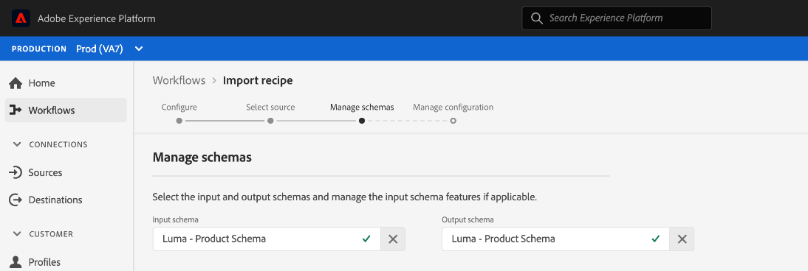

# Importer une recette empaquetée dans l’interface utilisateur de Workspace de science des données

>[!NOTE]
>
>Le Workspace de science des données ne peut plus être acheté.
>
>Cette documentation est destinée aux clients existants disposant de droits antérieurs sur Data Science Workspace.

Ce tutoriel explique comment configurer et importer une recette empaquetée à l’aide de l’exemple de ventes au détail fourni. À la fin de ce tutoriel, vous serez prêt à créer, à entraîner et à évaluer un modèle dans Adobe Experience Platform [!DNL Data Science Workspace].

## Conditions préalables

Ce tutoriel nécessite une recette empaquetée sous la forme d’une URL d’image Docker. Pour plus d’informations, consultez le tutoriel expliquant comment [Former une recette empaquetée à partir de fichiers sources](./package-source-files-recipe.md).

## Workflow de l’interface utilisateur

L’importation d’une recette empaquetée dans [!DNL Data Science Workspace] nécessite des configurations de recette spécifiques, compilées dans un seul fichier JSON (JavaScript Object Notation). Cette compilation de configurations de recette est appelée fichier de configuration. Une recette empaquetée avec un ensemble particulier de configurations est appelée instance de recette. Une recette peut être utilisée pour créer de nombreuses instances de recette dans [!DNL Data Science Workspace].

Voici les différentes étapes du workflow d’importation d’une recette empaquetée :
- [Configuration d’une recette](#configure)
- [Importer la recette basée sur Docker - Python](#python)
- [Importer la recette basée sur Docker - R](#r)
- [Importer la recette Docker - PySpark](#pyspark)
- [Importer la recette Docker - Scala](#scala)

### Configuration d’une recette {#configure}

Chaque instance de recette dans [!DNL Data Science Workspace] est accompagnée d’un ensemble de configurations qui adaptent l’instance de recette à un cas d’utilisation particulier. Les fichiers de configuration définissent les comportements de formation et de notation par défaut d’un modèle créé à l’aide de cette instance de recette.

>[!NOTE]
>
>Les fichiers de configuration sont spécifiques aux recettes et aux cas.

Vous trouverez ci-dessous un échantillon de fichier de configuration présentant les comportements de formation et de notation par défaut de la recette Ventes au détail.

```json
[
    {
        "name": "train",
        "parameters": [
            {
                "key": "learning_rate",
                "value": "0.1"  
            },
            {
                "key": "n_estimators",
                "value": "100"
            },
            {
                "key": "max_depth",
                "value": "3"
            },
            {
                "key": "ACP_DSW_INPUT_FEATURES",
                "value": "date,store,storeType,storeSize,temperature,regionalFuelPrice,markdown,cpi,unemployment,isHoliday"
            },
            {
                "key": "ACP_DSW_TARGET_FEATURES",
                "value": "weeklySales"
            },
            {
                "key": "ACP_DSW_FEATURE_UPDATE_SUPPORT",
                "value": false
            },
            {
                "key": "tenantId",
                "value": "_{TENANT_ID}"
            },
            {
                "key": "ACP_DSW_TRAINING_XDM_SCHEMA",
                "value": "{SEE BELOW FOR DETAILS}"
            },
            {
                "key": "evaluation.labelColumn",
                "value": "weeklySalesAhead"
            },
            {
                "key": "evaluation.metrics",
                "value": "MAPE,MAE,RMSE,MASE"
            }
        ]
    },
    {
        "name": "score",
        "parameters": [
            {
                "key": "tenantId",
                "value": "_{TENANT_ID}"
            },
            {
                "key":"ACP_DSW_SCORING_RESULTS_XDM_SCHEMA",
                "value":"{SEE BELOW FOR DETAILS}"
            }
        ]
    }
]
```

| Clé paramètre | Type | Description |
| ----- | ----- | ----- |
| `learning_rate` | Nombre | Scalaire pour la multiplication des gradients. |
| `n_estimators` | Nombre | Nombre d’arbres dans la forêt pour le classificateur Forêt aléatoire. |
| `max_depth` | Nombre | Profondeur maximale d’un arbre dans le classificateur Forêt aléatoire. |
| `ACP_DSW_INPUT_FEATURES` | Chaîne | Liste d’attributs de schéma d’entrée séparés par des virgules. |
| `ACP_DSW_TARGET_FEATURES` | Chaîne | Liste d’attributs de schéma de sortie séparés par des virgules. |
| `ACP_DSW_FEATURE_UPDATE_SUPPORT` | Booléen | Détermine si les fonctionnalités d’entrée et de sortie peuvent être modifiées. |
| `tenantId` | Chaîne | Cet identifiant permet de s’assurer que les ressources que vous créez ont un espace de noms correct et sont contenues dans votre organisation. [Suivez ces étapes](../../xdm/api/getting-started.md#know-your-tenant_id) pour trouver votre identifiant client. |
| `ACP_DSW_TRAINING_XDM_SCHEMA` | Chaîne | Le schéma d’entrée utilisé pour la formation d’un modèle. Laissez ce champ vide lors de l’importation dans l’interface utilisateur ; remplacez-le par l’identifiant du schéma de formation lors de l’importation à l’aide de l’API. |
| `evaluation.labelColumn` | Chaîne | Libellé de colonne pour visualiser les évaluations. |
| `evaluation.metrics` | Chaîne | Liste de mesures d’évaluation séparées par des virgules à utiliser pour l’évaluation d’un modèle. |
| `ACP_DSW_SCORING_RESULTS_XDM_SCHEMA` | Chaîne | Le schéma de sortie utilisé pour la notation d’un modèle. Laissez ce champ vide lors de l’importation dans l’interface utilisateur ; remplacez-le par l’identifiant du schéma de notation lors de l’importation à l’aide de l’API. |

Pour les besoins de ce tutoriel, vous pouvez conserver les fichiers de configuration par défaut pour la recette Ventes au détail dans la référence de [!DNL Data Science Workspace] tels qu’ils sont.

### Importer la recette basée sur Docker - [!DNL Python] {#python}

Commencez par naviguer et sélectionnez **[!UICONTROL Workflows]** dans le coin supérieur gauche de l’interface utilisateur de [!DNL Experience Platform]. Sélectionnez ensuite **Importer la recette** et sélectionnez **[!UICONTROL Lancer]**.


La page **Configurer** du workflow **Importer la recette** s’affiche. Saisissez un nom et une description pour la recette, puis sélectionnez **[!UICONTROL Suivant]** dans le coin supérieur droit.


>[!NOTE]
>
> Dans le tutoriel [Former une recette empaquetée à partir de fichiers sources](./package-source-files-recipe.md), une URL Docker a été fournie à la fin de la création de la recette Ventes au détail à l’aide de fichiers sources Python.

Une fois que vous êtes sur la page **Sélectionner la source**, collez l’URL Docker correspondant à la recette empaquetée créée à l’aide de fichiers source [!DNL Python] dans le champ **[!UICONTROL URL Source]**. Importez ensuite le fichier de configuration fourni en le faisant glisser et en le déposant, ou utilisez le **Navigateur** du système de fichiers. Le fichier de configuration fourni se trouve ici : `experience-platform-dsw-reference/recipes/python/retail/retail.config.json`. Sélectionnez **[!UICONTROL Python]** dans la liste déroulante **Runtime** et **[!UICONTROL Classification]** dans la liste déroulante **Type**. Une fois que tout a été rempli, sélectionnez **[!UICONTROL Suivant]** dans le coin supérieur droit pour passer à **Gérer les schémas**.

>[!NOTE]
>
> Type prend en charge **[!UICONTROL Classification]** et **[!UICONTROL Régression]**. Si votre modèle ne relève pas de l’un de ces types, sélectionnez **[!UICONTROL Personnalisé]**.


Sélectionnez ensuite les schémas d’entrée et de sortie de ventes au détail dans la section **Gérer les schémas**. Ils ont été créés à l’aide du script de bootstrap fourni dans le tutoriel [créer le schéma et le jeu de données de ventes au détail](../models-recipes/create-retails-sales-dataset.md).


Dans la section **Gestion des fonctionnalités**, sélectionnez sur votre identification de client dans la visionneuse de schémas pour développer le schéma d’entrée Ventes au détail . Sélectionnez les fonctionnalités d’entrée et de sortie en mettant en surbrillance la fonctionnalité souhaitée, puis sélectionnez **[!UICONTROL Fonctionnalité d’entrée]** ou **[!UICONTROL Fonctionnalité cible]** dans la fenêtre **[!UICONTROL Propriétés du champ]** à droite. Pour les besoins de ce tutoriel, définissez **[!UICONTROL weeklySales]** en tant que **[!UICONTROL Fonctionnalité cible]** et tout le reste en tant que **[!UICONTROL Fonctionnalité d’entrée]**. Sélectionnez **[!UICONTROL Suivant]** pour passer en revue votre nouvelle recette configurée.

Vérifiez la recette, ajoutez, modifiez ou supprimez des configurations si nécessaire. Sélectionnez **[!UICONTROL Terminer]** pour créer la recette.


Passez aux [étapes suivantes](#next-steps) pour savoir comment créer un modèle dans [!DNL Data Science Workspace] à l’aide de la recette Ventes au détail qui vient d’être créée.

### Importer la recette basée sur Docker - R {#r}

Commencez par naviguer et sélectionnez **[!UICONTROL Workflows]** dans le coin supérieur gauche de l’interface utilisateur de [!DNL Experience Platform]. Sélectionnez ensuite **Importer la recette** et sélectionnez **[!UICONTROL Lancer]**.


La page **Configurer** du workflow **Importer la recette** s’affiche. Saisissez un nom et une description pour la recette, puis sélectionnez **[!UICONTROL Suivant]** dans le coin supérieur droit.


>[!NOTE]
>
> Dans le tutoriel [Former une recette empaquetée à partir de fichiers sources](./package-source-files-recipe.md), une URL Docker a été fournie à la fin de la création de la recette Ventes au détail à l’aide de fichiers sources R.

Une fois que vous êtes sur la page **Sélectionner la source**, collez l’URL Docker correspondant à la recette empaquetée créée à l’aide des fichiers source R dans le champ **[!UICONTROL URL Source]**. Importez ensuite le fichier de configuration fourni en le faisant glisser et en le déposant, ou utilisez le **Navigateur** du système de fichiers. Le fichier de configuration fourni se trouve ici : `experience-platform-dsw-reference/recipes/R/Retail\ -\ GradientBoosting/retail.config.json`. Sélectionnez **[!UICONTROL R]** dans la liste déroulante **Exécution** et **[!UICONTROL Classification]** dans la liste déroulante **Type**. Une fois que tout a été rempli, sélectionnez **[!UICONTROL Suivant]** dans le coin supérieur droit pour passer à **Gérer les schémas**.

>[!NOTE]
>
> *Type* prend en charge **[!UICONTROL Classification]** et **[!UICONTROL Régression]**. Si votre modèle ne relève pas de l’un de ces types, sélectionnez **[!UICONTROL Personnalisé]**.


Sélectionnez ensuite les schémas d’entrée et de sortie de ventes au détail dans la section **Gérer les schémas**. Ils ont été créés à l’aide du script de bootstrap fourni dans le tutoriel [créer le schéma et le jeu de données de ventes au détail](../models-recipes/create-retails-sales-dataset.md).


Dans la section *Gestion des fonctionnalités*, sélectionnez sur votre identification de client dans la visionneuse de schémas pour développer le schéma d’entrée Ventes au détail . Sélectionnez les fonctionnalités d’entrée et de sortie en mettant en surbrillance la fonctionnalité souhaitée, puis sélectionnez **[!UICONTROL Fonctionnalité d’entrée]** ou **[!UICONTROL Fonctionnalité cible]** dans la fenêtre **[!UICONTROL Propriétés du champ]** à droite. Pour les besoins de ce tutoriel, définissez **[!UICONTROL weeklySales]** en tant que **[!UICONTROL Fonctionnalité cible]** et tout le reste en tant que **[!UICONTROL Fonctionnalité d’entrée]**. Sélectionnez **[!UICONTROL Suivant]** pour passer en revue votre nouvelle recette configurée.

Vérifiez la recette, ajoutez, modifiez ou supprimez des configurations si nécessaire. Sélectionnez **Terminer** pour créer la recette.


Passez aux [étapes suivantes](#next-steps) pour savoir comment créer un modèle dans [!DNL Data Science Workspace] à l’aide de la recette Ventes au détail qui vient d’être créée.

### Importer la recette Docker - PySpark {#pyspark}

Commencez par naviguer et sélectionnez **[!UICONTROL Workflows]** dans le coin supérieur gauche de l’interface utilisateur de [!DNL Experience Platform]. Sélectionnez ensuite **Importer la recette** et sélectionnez **[!UICONTROL Lancer]**.


La page **Configurer** du workflow **Importer la recette** s’affiche. Saisissez un nom et une description pour la recette, puis sélectionnez **[!UICONTROL Suivant]** dans le coin supérieur droit pour continuer.


>[!NOTE]
>
> Dans le tutoriel [Créer des fichiers sources de packages dans une recette](./package-source-files-recipe.md), une URL Docker était fournie à la fin de la création de la recette Ventes au détail à l’aide des fichiers sources PySpark.

Une fois que vous êtes sur la page **Sélectionner la source**, collez l’URL Docker correspondant à la recette empaquetée créée à l’aide des fichiers source PySpark dans le champ **[!UICONTROL URL Source]**. Importez ensuite le fichier de configuration fourni en le faisant glisser et en le déposant, ou utilisez le **Navigateur** du système de fichiers. Le fichier de configuration fourni se trouve ici : `experience-platform-dsw-reference/recipes/pyspark/retail/pipeline.json`. Sélectionnez **[!UICONTROL PySpark]** dans le menu déroulant **Runtime**. Une fois l’exécution PySpark sélectionnée, l’artefact par défaut est automatiquement renseigné sur **[!UICONTROL Docker]**. Sélectionnez ensuite **[!UICONTROL Classification]** dans le menu déroulant **Type**. Une fois que tout a été rempli, sélectionnez **[!UICONTROL Suivant]** dans le coin supérieur droit pour passer à **Gérer les schémas**.

>[!NOTE]
>
> *Type* prend en charge **[!UICONTROL Classification]** et **[!UICONTROL Régression]**. Si votre modèle ne relève pas de l’un de ces types, sélectionnez **[!UICONTROL Personnalisé]**.


Sélectionnez ensuite les schémas d’entrée et de sortie des ventes au détail à l’aide du sélecteur **Gérer les schémas**. Les schémas ont été créés à l’aide du script de bootstrap fourni dans le tutoriel [Créer le schéma et le jeu de données des ventes au détail](../models-recipes/create-retails-sales-dataset.md).



Dans la section **Gestion des fonctionnalités**, sélectionnez sur votre identification de client dans la visionneuse de schémas pour développer le schéma d’entrée Ventes au détail . Sélectionnez les fonctionnalités d’entrée et de sortie en mettant en surbrillance la fonctionnalité souhaitée, puis sélectionnez **[!UICONTROL Fonctionnalité d’entrée]** ou **[!UICONTROL Fonctionnalité cible]** dans la fenêtre **[!UICONTROL Propriétés du champ]** à droite. Pour les besoins de ce tutoriel, définissez **[!UICONTROL weeklySales]** en tant que **[!UICONTROL Fonctionnalité cible]** et tout le reste en tant que **[!UICONTROL Fonctionnalité d’entrée]**. Sélectionnez **[!UICONTROL Suivant]** pour passer en revue votre nouvelle recette configurée.


Vérifiez la recette, ajoutez, modifiez ou supprimez des configurations si nécessaire. Sélectionnez **[!UICONTROL Terminer]** pour créer la recette.


Passez aux [étapes suivantes](#next-steps) pour savoir comment créer un modèle dans [!DNL Data Science Workspace] à l’aide de la recette Ventes au détail qui vient d’être créée.

### Importer la recette Docker - Scala {#scala}

Commencez par naviguer et sélectionnez **[!UICONTROL Workflows]** dans le coin supérieur gauche de l’interface utilisateur de [!DNL Experience Platform]. Sélectionnez ensuite **Importer la recette** et sélectionnez **[!UICONTROL Lancer]**.


La page **Configurer** du workflow **Importer la recette** s’affiche. Saisissez un nom et une description pour la recette, puis sélectionnez **[!UICONTROL Suivant]** dans le coin supérieur droit pour continuer.


>[!NOTE]
>
> Dans le tutoriel [Créer des fichiers sources de package dans une recette](./package-source-files-recipe.md), une URL Docker était fournie à la fin de la création de la recette Ventes au détail à l’aide des fichiers sources Scala ([!DNL Spark]).

Une fois que vous êtes sur la page **Sélectionner la source**, collez l’URL Docker correspondant à la recette empaquetée créée à l’aide de fichiers source Scala dans le champ URL Source . Importez ensuite le fichier de configuration fourni en effectuant un glisser-déposer ou utilisez le navigateur du système de fichiers. Le fichier de configuration fourni se trouve ici : `experience-platform-dsw-reference/recipes/scala/retail/pipelineservice.json`. Sélectionnez **[!UICONTROL Spark]** dans le menu déroulant **Runtime**. Une fois l’exécution [!DNL Spark] sélectionnée, l’artefact par défaut est automatiquement renseigné sur **[!UICONTROL Docker]**. Sélectionnez ensuite **[!UICONTROL Régression]** dans le menu déroulant **Type**. Une fois que tout a été rempli, sélectionnez **[!UICONTROL Suivant]** dans le coin supérieur droit pour passer à **Gérer les schémas**.

>[!NOTE]
>
> Type prend en charge **[!UICONTROL Classification]** et **[!UICONTROL Régression]**. Si votre modèle ne relève pas de l’un de ces types, sélectionnez **[!UICONTROL Personnalisé]**.


Sélectionnez ensuite les schémas d’entrée et de sortie des ventes au détail à l’aide du sélecteur **Gérer les schémas**. Les schémas ont été créés à l’aide du script de bootstrap fourni dans le tutoriel [Créer le schéma et le jeu de données des ventes au détail](../models-recipes/create-retails-sales-dataset.md).


Dans la section **Gestion des fonctionnalités**, sélectionnez sur votre identification de client dans la visionneuse de schémas pour développer le schéma d’entrée Ventes au détail . Sélectionnez les fonctionnalités d’entrée et de sortie en mettant en surbrillance la fonctionnalité souhaitée, puis sélectionnez **[!UICONTROL Fonctionnalité d’entrée]** ou **[!UICONTROL Fonctionnalité cible]** dans la fenêtre **[!UICONTROL Propriétés du champ]** à droite. Pour les besoins de ce tutoriel, définissez « [!UICONTROL weeklySales] » comme **[!UICONTROL Fonctionnalité Target]** et tout le reste comme **[!UICONTROL Fonctionnalité d’entrée]**. Sélectionnez **[!UICONTROL Suivant]** pour passer en revue votre nouvelle recette configurée.


Vérifiez la recette, ajoutez, modifiez ou supprimez des configurations si nécessaire. Sélectionnez **[!UICONTROL Terminer]** pour créer la recette.


Passez aux [étapes suivantes](#next-steps) pour savoir comment créer un modèle dans [!DNL Data Science Workspace] à l’aide de la recette Ventes au détail qui vient d’être créée.

## Étapes suivantes {#next-steps}

Ce tutoriel a fourni à insight des informations sur la configuration et l’importation d’une recette dans [!DNL Data Science Workspace]. Vous pouvez désormais créer, former et évaluer un modèle à l’aide de la nouvelle recette créée.

- [Formation et évaluation d’un modèle dans l’interface utilisateur](./train-evaluate-model-ui.md)
- [Entraînement et évaluation d’un modèle à l’aide de l’API](./train-evaluate-model-api.md)
