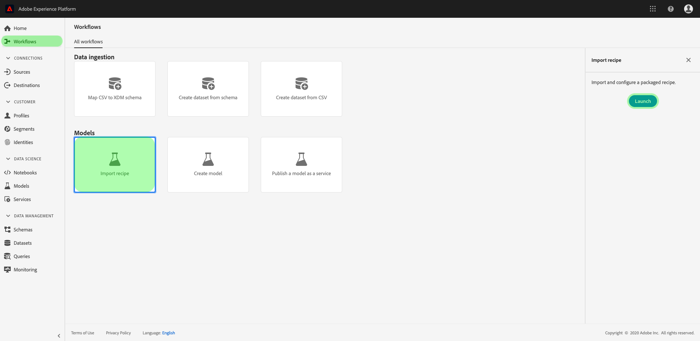
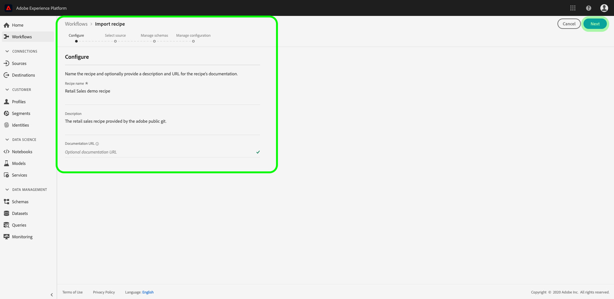

# compresser des fichiers source dans une recette ;

Ce didacticiel explique comment assembler les fichiers source d’exemples de ventes au détail fournis dans un fichier d’archive, qui peut être utilisé pour créer une recette dans Adobe Experience Platform Data Science Workspace en suivant le processus d’importation des recettes dans l’interface utilisateur ou à l’aide de l’API.

Concepts à comprendre :

- **Recettes**: Une recette est le terme utilisé par Adobe pour désigner une spécification de modèle. Il s’agit d’un de niveau supérieur représentant un apprentissage automatique spécifique, un algorithme d’intelligence artificielle ou un ensemble d’algorithmes, une logique de traitement et une configuration nécessaires pour créer et exécuter un modèle formé et aider ainsi à résoudre des problèmes commerciaux spécifiques.
- **Fichiers** source : Fichiers individuels de votre projet contenant la logique d’une recette.

## Conditions préalables

- [Docteur](https://docs.docker.com/install/#supported-platforms)
- [Python 3 et pip](https://docs.conda.io/en/latest/miniconda.html)
- [Scala](https://www.scala-sbt.org/download.html?_ga=2.42231906.690987621.1558478883-2004067584.1558478883)
- [Maven](https://maven.apache.org/install.html)

## Création de recettes

de création de recette avec les fichiers source d’assemblage pour créer un fichier d’archive. Les fichiers source définissent la logique d’apprentissage automatique et les algorithmes utilisés pour résoudre un problème spécifique à portée de main. Ils sont écrits en Python, R, PySpark ou Scala. Les fichiers d’archives créés prennent la forme d’une image Docker. Une fois le fichier d’archive compressé créé, il est importé dans Data Science Workspace pour créer une recette [dans l’interface utilisateur](./import-packaged-recipe-ui.md) ou [à l’aide de l’API](./import-packaged-recipe-api.md).

### Création de modèles basés sur le Docker

Une image Docker permet au développeur de créer un package d’application avec toutes les parties dont il a besoin, telles que les bibliothèques et d’autres dépendances, et de l’expédier sous forme d’un package unique.

L&#39;image Docker construite est transmise au Registre des  Azure à l&#39;aide des informations d&#39;identification fournies lors du processus de création de recette.

Pour obtenir vos informations d’identification de Registre Azure, connectez-vous à <a href="https://platform.adobe.com" target="_blank">Adobe Experience Platform</a>. Dans la colonne de navigation de gauche, accédez au  ****. Sélectionnez **Importer la recette** , puis sélectionnez **Lancer**. Voir la capture d’écran ci-dessous pour référence.



La page *Configurer* s’ouvre. Indiquez un nom **de** recette approprié, par exemple &quot;Recette des ventes au détail&quot;, et éventuellement une description ou une URL de documentation. Une fois terminé, cliquez sur **Suivant**.



Sélectionnez le *runtime* approprié, puis choisissez une **classification** pour le *type*. Vos informations d&#39;identification de Registre Azure  sont générées une fois l&#39;opération terminée.

>[!NOTE]
>*Le type *est la classe de problème d&#39;apprentissage automatique pour laquelle la recette est conçue et est utilisée après la formation pour aider à personnaliser l&#39;évaluation de la course de formation.

>[!TIP]
>- Pour les recettes Python, sélectionnez le **moteur d&#39;exécution Python** .
>- Pour les recettes R, sélectionnez le **moteur d’exécution R** .
>- Pour les recettes PySpark, sélectionnez le **runtime PySpark** . Un type d’artefact est renseigné automatiquement.
>- Pour les recettes Scala, sélectionnez le **moteur d’exécution Spark** . Un type d’artefact est renseigné automatiquement.


Notez les valeurs de *Docker Host*, *Username* et *Password*. Elles sont utilisées pour créer et pousser l&#39;image de votre Docker dans le décrit ci-dessous.

>[!NOTE]
>L’URL source est fournie après avoir suivi les étapes décrites ci-dessous. Le fichier de configuration est expliqué dans les didacticiels suivants, qui se trouvent dans les étapes [](#next-steps)suivantes.

### Assemblage des fichiers source

en obtenant l’exemple de code de base trouvé dans le référentiel <a href="https://github.com/adobe/experience-platform-dsw-reference" target="_blank">Experience Platform Data Science Workspace Reference</a> .

- [Créer une image Python Dock](#python-docker)
- [Créer une image R Docker](#r-docker)
- [Création d’une image PySpark Docker](#pyspark-docker)
- [Créer une image d’ancrage Scala (Spark)](#scala-docker)

### Créer une image Python Dock {#python-docker}

Si vous ne l’avez pas fait, cloner le référentiel github sur votre système local à l’aide de la commande suivante :

```shell
git clone https://github.com/adobe/experience-platform-dsw-reference.git
```

Navigate to the directory `experience-platform-dsw-reference/recipes/python/retail`. Ici, vous trouverez les scripts `login.sh` et `build.sh` utilisés pour vous connecter à Docker et pour construire l&#39;image python Docker. Si vos informations d’identification [de](#docker-based-model-authoring) Docker sont prêtes, saisissez les commandes suivantes dans l’ordre :

```BASH
# for logging in to Docker
./login.sh
 
# for building Docker image
./build.sh
```

Notez que lors de l’exécution du script de connexion, vous devez fournir l’hôte, le nom d’utilisateur et le mot de passe du Docker. Lors de la création, vous devez fournir l’hôte du Docker et une balise de version pour la génération.

Une fois le script de génération terminé, vous recevez une URL de fichier source Docker dans la sortie de la console. Pour cet exemple spécifique, il se présente comme suit :

```BASH
# URL format: 
{DOCKER_HOST}/ml-retailsales-python:{VERSION_TAG}
```

Copiez cette URL et passez aux étapes [](#next-steps)suivantes.

### Créer une image R Docker {#r-docker}

Si vous ne l’avez pas fait, cloner le référentiel github sur votre système local à l’aide de la commande suivante :

```BASH
git clone https://github.com/adobe/experience-platform-dsw-reference.git
```

Accédez au répertoire `experience-platform-dsw-reference/recipes/R/Retail - GradientBoosting` dans votre référentiel cloné. Ici, vous trouverez les fichiers `login.sh` et `build.sh` que vous utiliserez pour vous connecter à Docker et pour créer l&#39;image R Docker. Si vos informations d’identification [de](#docker-based-model-authoring) Docker sont prêtes, saisissez les commandes suivantes dans l’ordre :

```BASH
# for logging in to Docker
./login.sh
 
# for build Docker image
./build.sh
```

Notez que lors de l’exécution du script de connexion, vous devez fournir l’hôte, le nom d’utilisateur et le mot de passe du Docker. Lors de la création, vous devez fournir l’hôte du Docker et une balise de version pour la génération.

Une fois le script de génération terminé, vous recevez une URL de fichier source Docker dans la sortie de la console. Pour cet exemple spécifique, il se présente comme suit :

```BASH
# URL format: 
{DOCKER_HOST}/ml-retail-r:{VERSION_TAG}
```

Copiez cette URL et passez aux étapes [](#next-steps)suivantes.

### Création d’une image PySpark Docker {#pyspark-docker}

en clonant le référentiel github sur votre système local avec la commande suivante :

```shell
git clone https://github.com/adobe/experience-platform-dsw-reference.git
```

Navigate to the directory `experience-platform-dsw-reference/recipes/pyspark/retail`. Les scripts `login.sh` et `build.sh` sont situés ici et utilisés pour se connecter au Docker et pour créer l&#39;image du Docker. Si vos informations d’identification [de](#docker-based-model-authoring) Docker sont prêtes, saisissez les commandes suivantes dans l’ordre :

```BASH
# for logging in to Docker
./login.sh
 
# for building Docker image
./build.sh
```

Notez que lors de l’exécution du script de connexion, vous devez fournir l’hôte, le nom d’utilisateur et le mot de passe du Docker. Lors de la création, vous devez fournir l’hôte du Docker et une balise de version pour la génération.

Une fois le script de génération terminé, vous recevez une URL de fichier source Docker dans la sortie de la console. Pour cet exemple spécifique, il se présente comme suit :

```BASH
# URL format: 
{DOCKER_HOST}/ml-retailsales-pyspark:{VERSION_TAG}
```

Copiez cette URL et passez aux étapes [](#next-steps)suivantes.

### Création d’une image Scala Dock {#scala-docker}

en clonant le référentiel github sur votre système local avec la commande suivante dans le terminal :

```shell
git clone https://github.com/adobe/experience-platform-dsw-reference.git
```

Accédez ensuite au répertoire `experience-platform-dsw-reference/recipes/scala/retail` où vous trouverez les scripts `login.sh` et `build.sh`. Ces scripts sont utilisés pour se connecter au Docker et créer l’image du Docker. Si vos informations d&#39;identification [](#docker-based-model-authoring) Docker sont prêtes, entrez les commandes suivantes pour le terminal dans l&#39;ordre :

```BASH
# for logging in to Docker
./login.sh
 
# for building Docker image
./build.sh
```

Lors de l’exécution du script de connexion, vous devez indiquer l’hôte, le nom d’utilisateur et le mot de passe du Docker. Lors de la création, vous devez fournir l’hôte du Docker et une balise de version pour la génération.

Une fois le script de génération terminé, vous recevez une URL de fichier source Docker dans la sortie de la console. Pour cet exemple spécifique, il se présente comme suit :

```BASH
# URL format: 
{DOCKER_HOST}/ml-retailsales-spark:{VERSION_TAG}
```

Copiez cette URL et passez aux étapes [](#next-steps)suivantes.

## Étapes suivantes {#next-steps}

Ce didacticiel a été consacré à l’assemblage des fichiers source dans une recette, étape préalable à l’importation d’une recette dans Data Science Workspace. Vous devez désormais disposer d&#39;une image Docker dans le Registre des Azure avec l&#39;URL d&#39;image correspondante. Vous êtes maintenant prêt à commencer le didacticiel sur l’ **importation d’une recette assemblée dans Data Science Workspace**. Sélectionnez l’un des liens du didacticiel ci-dessous pour commencer.

- [Importer une recette assemblée dans l’interface utilisateur](./import-packaged-recipe-ui.md)
- [Importer une recette assemblée à l’aide de l’API](./import-packaged-recipe-api.md)

## Création de fichiers binaires (obsolète)

>[!CAUTION]
> Les binaires ne sont pas pris en charge dans les nouvelles recettes PySpark et Scala et sont définis pour être supprimés dans une version ultérieure. Veuillez suivre le [Docker](#docker-based-model-authoring) lorsque vous travaillez avec PySpark et Scala. Les  suivantes ne s’appliquent qu’aux recettes Spark 2.3.

### Création de fichiers binaires PySpark (obsolète)

Si vous ne l’avez pas fait, cloner le référentiel github sur votre système local à l’aide de la commande suivante :

```BASH
git clone https://github.com/adobe/experience-platform-dsw-reference.git
```

Accédez au référentiel cloné sur votre système local et exécutez les commandes suivantes afin de créer le `.egg` fichier requis pour importer une recette PySpark :

```BASH
cd recipes/pyspark
./build.sh
```

Le `.egg` fichier est généré dans le `dist` dossier.

Vous pouvez maintenant passer aux étapes [](#next-steps)suivantes.

#### Création de fichiers binaires Scala (obsolète)

Si vous ne l’avez pas déjà fait, exécutez la commande suivante pour cloner le référentiel Github sur votre système local :

```BASH
git clone https://github.com/adobe/experience-platform-dsw-reference.git
```

Pour créer l’ `.jar` artefact utilisé pour importer une recette Scala, accédez à votre référentiel cloné et procédez comme suit :

```BASH
cd recipes/scala/
./build.sh
```

L’ `.jar` artefact généré avec dépendances se trouve dans le `/target` répertoire.

Vous pouvez maintenant passer aux étapes [](#next-steps)suivantes.