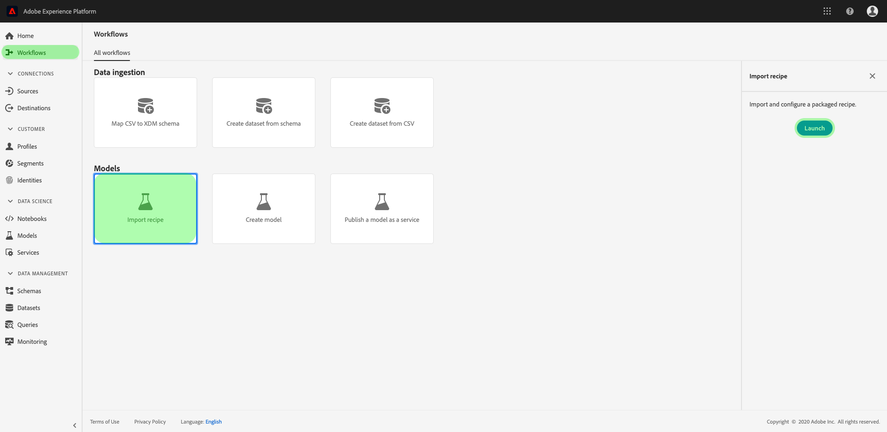
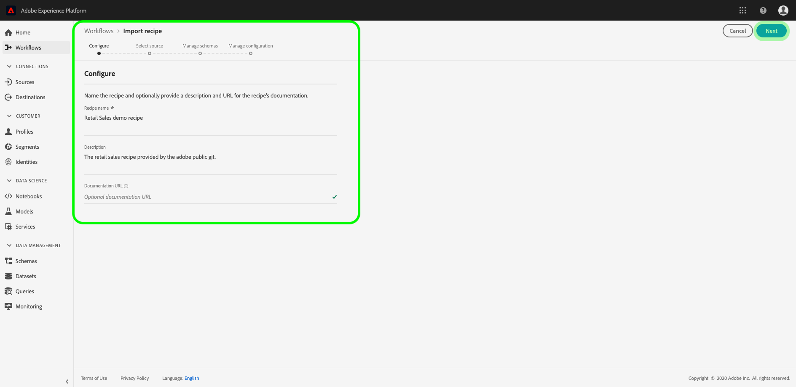
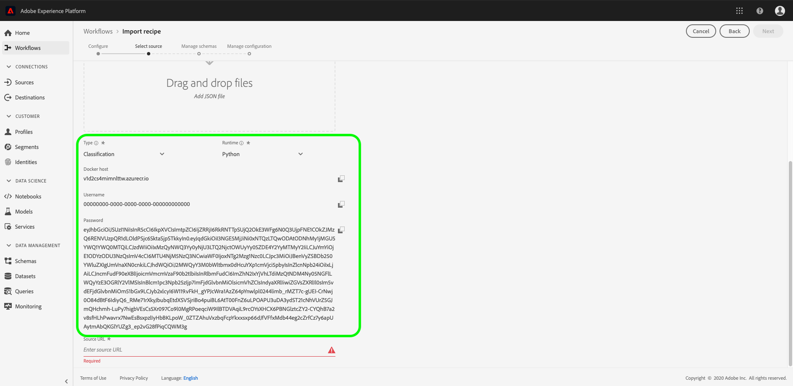

# Regroupement des fichiers sources dans une recette

>[!NOTE]
>
>Le Workspace de science des données ne peut plus être acheté.
>
>Cette documentation est destinée aux clients existants disposant de droits antérieurs sur Data Science Workspace.

Ce tutoriel explique comment regrouper les fichiers sources fournis d’exemples de ventes au détail dans un fichier d’archive, qui peut être utilisé pour créer une recette dans Adobe Experience Platform [!DNL Data Science Workspace] en suivant le processus d’importation des recettes dans l’interface utilisateur ou à l’aide de l’API.

Concepts à comprendre :

- **Recettes** : une recette est le terme utilisé par Adobe pour désigner une spécification de modèle. Il s’agit d’un conteneur de niveau supérieur qui représente un machine learning spécifique, un algorithme d’intelligence artificielle ou un ensemble d’algorithmes, une logique de traitement et la configuration nécessaires pour créer et exécuter un modèle formé et ainsi aider à résoudre des problèmes d’entreprise spécifiques.
- **Fichiers source** : fichiers individuels de votre projet contenant la logique pour une recette.

## Conditions préalables

- [[!DNL Docker]](https://docs.docker.com/install/#supported-platforms)
- [[!DNL Python 3 and pip]](https://docs.conda.io/en/latest/miniconda.html)
- [[!DNL Scala]](https://www.scala-sbt.org/download.html?_ga=2.42231906.690987621.1558478883-2004067584.1558478883)
- [[!DNL Maven]](https://maven.apache.org/install.html)

## Création de recettes

La création de recettes commence par le regroupement des fichiers afin de créer un fichier d’archives. Les fichiers Source définissent la logique et les algorithmes de machine learning utilisés pour résoudre un problème spécifique. Ils sont écrits en [!DNL Python], R, PySpark ou Scala. Les fichiers d’archive créés prennent la forme d’une image Docker. Une fois créé, le fichier d’archive empaqueté est importé dans [!DNL Data Science Workspace] pour créer une recette [dans l’interface utilisateur](./import-packaged-recipe-ui.md) ou [à l’aide de l’API](./import-packaged-recipe-api.md).

### Création de modèles basés sur Docker {#docker-based-model-authoring}

Une image Docker permet au développeur d’empaqueter une application avec tous les éléments dont elle a besoin, comme les bibliothèques et autres dépendances, et de l’expédier sous forme d’un package unique.

L’image Docker créée est transmise au registre des conteneurs d’Azure à l’aide des informations d’identification fournies lors du workflow de création de recette.

Pour obtenir vos informations d’identification Azure Container Registry, connectez-vous à [Adobe Experience Platform](https://platform.adobe.com). Dans la colonne de navigation de gauche, accédez à **[!UICONTROL Workflows]**. Sélectionnez **[!UICONTROL Importer la recette]** puis **[!UICONTROL Lancer]**. Voir la capture d’écran ci-dessous pour référence.



La page **[!UICONTROL Configurer]** s’ouvre. Fournissez un **[!UICONTROL Nom de la recette]** approprié, par exemple, « Recette Ventes au détail », et éventuellement une description ou une URL de documentation. Une fois l’opération terminée, cliquez sur **[!UICONTROL Suivant]**.



Sélectionnez le *Runtime* approprié, puis choisissez un **[!UICONTROL Classification]** pour *Type*. Vos informations d’identification Azure Container Registry sont générées une fois cette opération terminée.

>[!NOTE]
>
>*Type* correspond à la catégorie du problème de machine learning pour lequel la recette est conçue et utilisée après formation afin d’adapter l’évaluation du cycle de formation.

>[!TIP]
>
>- Pour les recettes [!DNL Python], sélectionnez l’exécution **[!UICONTROL Python]**.
>- Pour les recettes R, sélectionnez l’exécution **[!UICONTROL R]**.
>- Pour les recettes PySpark, sélectionnez le runtime **[!UICONTROL PySpark]**. Un type d’artefact est automatiquement renseigné.
>- Pour les recettes Scala, sélectionnez le runtime **[!UICONTROL Spark]**. Un type d’artefact est automatiquement renseigné.



Notez les valeurs de l’hôte Docker, du nom d’utilisateur et du mot de passe. Ils sont utilisés pour créer et diffuser votre image [!DNL Docker] dans les workflows décrits ci-dessous.

>[!NOTE]
>
>L’URL de Source est fournie après avoir suivi les étapes décrites ci-dessous. Le fichier de configuration est expliqué dans les tutoriels suivants, présentés dans [étapes suivantes](#next-steps).

### Regroupement des fichiers sources

Commencez par obtenir l’exemple de base de code qui se trouve dans le référentiel <a href="https://github.com/adobe/experience-platform-dsw-reference" target="_blank">Experience Platform Data Science Workspace Reference</a>.

- [Création d’une image Python Docker](#python-docker)
- [Création d’une image R Docker](#r-docker)
- [Créer une image PySpark Docker](#pyspark-docker)
- [Créer une image Scala (Spark) Docker](#scala-docker)

### Créer [!DNL Python] image Docker {#python-docker}

Si vous ne l’avez pas fait, clonez le référentiel [!DNL GitHub] sur votre système local avec la commande suivante :

```shell
git clone https://github.com/adobe/experience-platform-dsw-reference.git
```

Accédez au répertoire `experience-platform-dsw-reference/recipes/python/retail`. Vous y trouverez les scripts `login.sh` et `build.sh` utilisés pour vous connecter à Docker et créer l’image [!DNL Python Docker]. Si vos [informations d’identification Docker](#docker-based-model-authoring) sont prêtes, saisissez les commandes suivantes dans l’ordre :

```BASH
# for logging in to Docker
./login.sh
 
# for building Docker image
./build.sh
```

Notez que lors de l’exécution du script de connexion, vous devez fournir l’hôte Docker, le nom d’utilisateur et le mot de passe. Lors de la création, vous devez fournir l’hôte Docker et une balise de version pour la génération.

Une fois le script de génération terminé, vous recevez une URL de fichier source Docker dans la sortie de la console. Pour cet exemple spécifique, il se présente comme suit :

```BASH
# URL format: 
{DOCKER_HOST}/ml-retailsales-python:{VERSION_TAG}
```

Copiez cette URL et passez aux [étapes suivantes](#next-steps).

### Créer une image [!DNL Docker] {#r-docker}

Si vous ne l’avez pas fait, clonez le référentiel [!DNL GitHub] sur votre système local avec la commande suivante :

```BASH
git clone https://github.com/adobe/experience-platform-dsw-reference.git
```

Accédez au répertoire `experience-platform-dsw-reference/recipes/R/Retail - GradientBoosting` dans votre référentiel cloné. Vous y trouverez les fichiers `login.sh` et `build.sh` que vous utiliserez pour vous connecter à Docker et créer l’image R Docker. Si vos [informations d’identification Docker](#docker-based-model-authoring) sont prêtes, saisissez les commandes suivantes dans l’ordre :

```BASH
# for logging in to Docker
./login.sh
 
# for build Docker image
./build.sh
```

Notez que lors de l’exécution du script de connexion, vous devez fournir l’hôte Docker, le nom d’utilisateur et le mot de passe. Lors de la création, vous devez fournir l’hôte Docker et une balise de version pour la génération.

Une fois le script de génération terminé, vous recevez une URL de fichier source Docker dans la sortie de la console. Pour cet exemple spécifique, il se présente comme suit :

```BASH
# URL format: 
{DOCKER_HOST}/ml-retail-r:{VERSION_TAG}
```

Copiez cette URL et passez aux [étapes suivantes](#next-steps).

### Créer une image PySpark Docker {#pyspark-docker}

Commencez par cloner le référentiel [!DNL GitHub] sur votre système local à l’aide de la commande suivante :

```shell
git clone https://github.com/adobe/experience-platform-dsw-reference.git
```

Accédez au répertoire `experience-platform-dsw-reference/recipes/pyspark/retail`. Les scripts `login.sh` et `build.sh` se trouvent ici et servent à la connexion à Docker et à la création de l’image Docker. Si vos [informations d’identification Docker](#docker-based-model-authoring) sont prêtes, saisissez les commandes suivantes dans l’ordre :

```BASH
# for logging in to Docker
./login.sh
 
# for building Docker image
./build.sh
```

Notez que lors de l’exécution du script de connexion, vous devez fournir l’hôte Docker, le nom d’utilisateur et le mot de passe. Lors de la création, vous devez fournir l’hôte Docker et une balise de version pour la génération.

Une fois le script de génération terminé, vous recevez une URL de fichier source Docker dans la sortie de la console. Pour cet exemple spécifique, il se présente comme suit :

```BASH
# URL format: 
{DOCKER_HOST}/ml-retailsales-pyspark:{VERSION_TAG}
```

Copiez cette URL et passez aux [étapes suivantes](#next-steps).

### Créer une image Scala Docker {#scala-docker}

Commencez par cloner le référentiel [!DNL GitHub] sur votre système local avec la commande suivante dans le terminal :

```shell
git clone https://github.com/adobe/experience-platform-dsw-reference.git
```

Ensuite, accédez au `experience-platform-dsw-reference/recipes/scala` de répertoire dans lequel vous trouverez les scripts `login.sh` et `build.sh`. Ces scripts sont utilisés pour se connecter à Docker et créer l’image Docker. Si vos [informations d’identification Docker](#docker-based-model-authoring) sont prêtes, saisissez les commandes suivantes dans le terminal dans l’ordre :

```BASH
# for logging in to Docker
./login.sh
 
# for building Docker image
./build.sh
```

>[!TIP]
>
>Si vous recevez une erreur d’autorisation lors de la tentative de connexion à Docker à l’aide du script `login.sh`, essayez d’utiliser la `bash login.sh` de commande .

Lors de l’exécution du script de connexion, vous devez fournir l’hôte Docker, le nom d’utilisateur et le mot de passe. Lors de la création, vous devez fournir l’hôte Docker et une balise de version pour la génération.

Une fois le script de génération terminé, vous recevez une URL de fichier source Docker dans la sortie de la console. Pour cet exemple spécifique, il se présente comme suit :

```BASH
# URL format: 
{DOCKER_HOST}/ml-retailsales-spark:{VERSION_TAG}
```

Copiez cette URL et passez aux [étapes suivantes](#next-steps).

## Étapes suivantes {#next-steps}

Ce tutoriel a porté sur le conditionnement des fichiers sources dans une recette, l’étape préalable à l’importation d’une recette dans [!DNL Data Science Workspace]. Vous devez maintenant disposer d’une image Docker dans le registre des conteneurs d’Azure avec l’URL d’image correspondante. Vous êtes maintenant prêt à commencer le tutoriel sur l’importation d’une recette empaquetée dans [!DNL Data Science Workspace]. Pour commencer, sélectionnez l’un des liens de tutoriel ci-dessous :

- [Importer une recette empaquetée dans l’interface utilisateur](./import-packaged-recipe-ui.md)
- [Importer une recette empaquetée à l’aide de l’API](./import-packaged-recipe-api.md)
