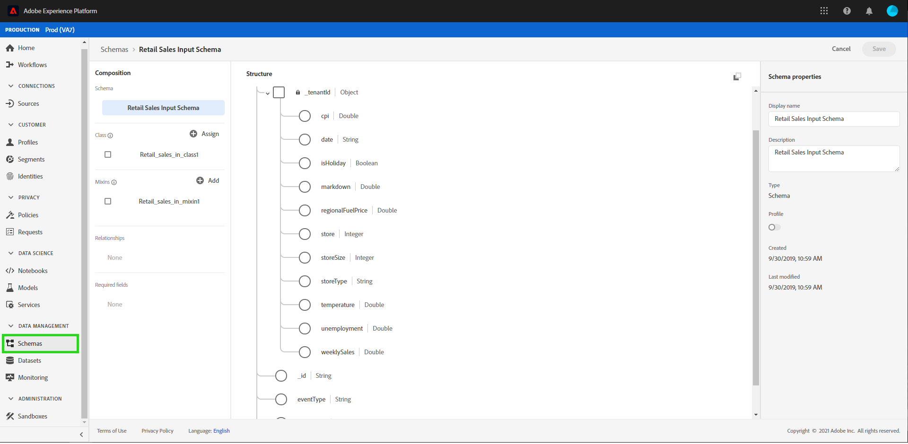

# Prévisualiser le schéma et le jeu de données des ventes au détail

>[!NOTE]
>
>Le Workspace de science des données ne peut plus être acheté.
>
>Cette documentation est destinée aux clients existants disposant de droits antérieurs sur Data Science Workspace.

Une fois l’exécution du script de bootstrap terminée à partir du tutoriel [jeu de données et schéma de ventes au détail](./create-retails-sales-dataset.md). Les schémas et les jeux de données de sortie peuvent être affichés sur [!DNL Experience Platform]. Pour afficher les schémas et les jeux de données, suivez les étapes ci-dessous :

Sélectionnez l’onglet **[!UICONTROL Schemas]** situé dans le volet de navigation de gauche et recherchez le schéma d’entrée créé par le script de bootstrap. Le nom du schéma correspondra à ce qui a été défini dans `config.yaml` à l’étape précédente. Affichez les détails du schéma et sa composition en cliquant dessus.

Sélectionnez l’onglet **[!UICONTROL Datasets]** situé dans le volet de navigation de gauche et ouvrez le jeu de données d’entrée qui a été créé en sélectionnant le nom du jeu de données. Le nom du jeu de données correspond à ce qui a été défini dans `config.yaml` à partir de l’étape précédente.

Sélectionnez **[!UICONTROL Preview Dataset]** situé en haut à droite pour prévisualiser un sous-ensemble du jeu de données.

## Étapes suivantes

Vous avez désormais ingéré avec succès des données d’exemple de ventes au détail dans [!DNL Experience Platform] à l’aide du script de bootstrap fourni.

Pour continuer à travailler sur les données ingérées, procédez de la façon suivante :

- [Analysez vos données à l’aide de Jupyter Notebooks](../jupyterlab/analyze-your-data.md)
   - Utilisez les notebooks Jupyter dans [!DNL Data Science Workspace] pour accéder, explorer, visualiser et comprendre vos données.
- [Regrouper les fichiers sources dans une recette](./package-source-files-recipe.md)
   - Suivez ce tutoriel pour savoir comment importer votre propre modèle dans [!DNL Data Science Workspace] en regroupant les fichiers sources dans un fichier de recette importable.
