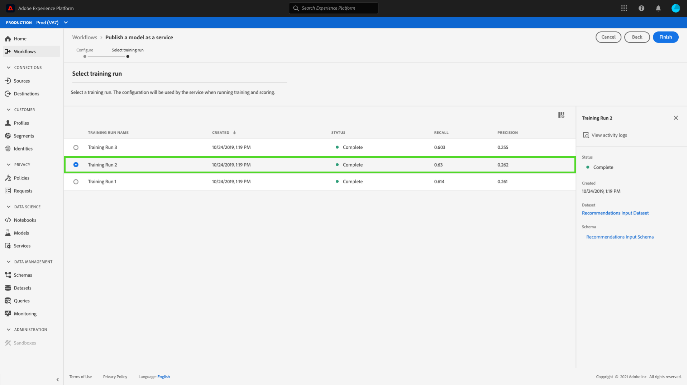

# Publier un modèle en tant que service dans l’interface d’utilisation de l’espace de travail de science des données {#publish-a-model-as-a-service}

>[!NOTE]
>
>Le Workspace de science des données ne peut plus être acheté.
>
>Cette documentation est destinée aux clients existants disposant de droits antérieurs sur Data Science Workspace.

>[!CONTEXTUALHELP]
>id="platform_intelligentservices_publishmodel"
>title="Publier un modèle en tant que service"
>abstract=""

Le Workspace de science des données de Adobe Experience Platform vous permet de publier votre modèle formé et évalué en tant que service, ce qui permet aux utilisateurs de votre organisation de noter des données sans avoir à créer leurs propres modèles.

## Commencer

Pour suivre ce tutoriel, vous devez avoir accès à [!DNL Experience Platform]. Si vous n’avez pas accès à une organisation dans [!DNL Experience Platform], contactez votre administrateur système avant de continuer.

Ce tutoriel nécessite un modèle existant avec une opération de formation réussie. Si vous ne disposez pas d’un modèle publiable, suivez le tutoriel [Formation et notation d’un modèle dans l’interface utilisateur](./train-evaluate-model-ui.md) avant de poursuivre.

Si vous préférez publier un modèle à l’aide des API Sensei Machine Learning, reportez-vous au [tutoriel sur l’API](./publish-model-service-api.md).

## Publication d’un modèle {#publish-a-model}

Dans Adobe Experience Platform, sélectionnez **[!UICONTROL Modèles]** dans la colonne de navigation de gauche, puis sélectionnez l’onglet **[!UICONTROL Parcourir]** pour tous les modèles existants. Sélectionnez le nom du modèle que vous souhaitez publier en tant que service.

Sélectionnez **[!UICONTROL Publier]** en haut à droite de la page Aperçu du modèle pour lancer un processus de création de service.

Saisissez le nom souhaité pour le service et éventuellement fournissez une description du service, puis sélectionnez **[!UICONTROL Suivant]** lorsque vous avez terminé.

Toutes les opérations de formation réussies du modèle sont répertoriées. Le nouveau service héritera des configurations de formation et de notation de l’opération de formation sélectionnée.

Sélectionnez **[!UICONTROL Terminer]** pour créer le service et rediriger vers la **[!UICONTROL Galerie de services]** pour afficher tous les services disponibles, y compris le service nouvellement créé.

## Notation à l’aide d’un service {#access-a-service}

Dans Adobe Experience Platform, sélectionnez l’onglet **[!UICONTROL Services]** situé dans la colonne de navigation de gauche pour accéder à la **[!UICONTROL Galerie de services]**. Recherchez le service que vous souhaitez utiliser, puis sélectionnez **[!UICONTROL Ouvrir]**.

Dans la page d’aperçu du service, sélectionnez **[!UICONTROL Score]**.

Sélectionnez un jeu de données d’entrée approprié pour l’exécution de notation, puis sélectionnez **[!UICONTROL Suivant]**. Il vous est demandé d’effectuer la même étape pour le jeu de données de notation. Une fois que vous avez sélectionné le jeu de données d’entrée et de sortie, vous pouvez mettre à jour les configurations.

Lorsqu’un service est créé, il hérite des configurations de notation par défaut. Vous pouvez revoir ces configurations et les ajuster selon les besoins en double-cliquant sur les valeurs. Une fois que les configurations vous conviennent, sélectionnez **[!UICONTROL Terminer]** pour lancer l’exécution de notation.

Sur la page **Présentation** du service, vous retrouvez les détails de la nouvelle tâche de notation et sa progression. Une fois la tâche terminée, l’en-tête **[!UICONTROL Le plus récent]** du conteneur **[!UICONTROL Notation]** est mis à jour.

## Étapes suivantes {#next-steps}

En suivant ce tutoriel, vous avez publié avec succès un modèle en tant que service accessible et noté des données à l’aide du nouveau service, par le biais de la [!UICONTROL Galerie de services]. Passez au tutoriel suivant pour apprendre à [planifier des opérations de formation et de notation automatisées sur un service](./schedule-models-ui.md).
