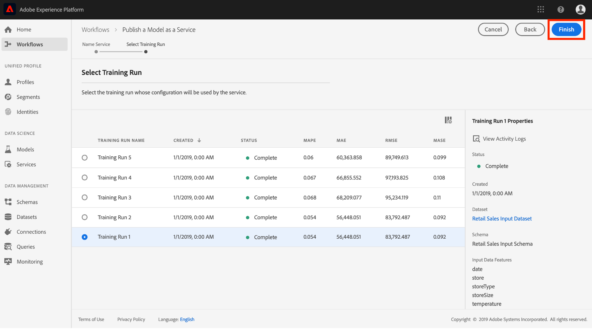

# Publication d’un modèle en tant que service (interface utilisateur)

Adobe Experience Platform Data Science Workspace vous permet de publier votre modèle en tant que service, formé et évalué, ce qui permet aux utilisateurs de votre organisation IMS de noter des données sans avoir à créer leurs propres modèles.

Ce didacticiel décrit les étapes à suivre pour publier un modèle en tant que service et noter des données à l’aide d’un service dans la Galerie *de* services. Il est divisé en plusieurs sections principales :

- [Publication d’un modèle](#publish-a-model)
- [Score à l’aide d’un service](#access-a-service)

## Prise en main

Pour terminer ce didacticiel, vous devez avoir accès à Experience Platform. Si vous n’avez pas accès à une organisation IMS dans Experience Platform, contactez votre administrateur système avant de poursuivre.

Ce didacticiel nécessite un modèle existant avec une formation réussie. Si vous ne disposez pas d’un modèle publiable, suivez le [didacticiel Formation et évaluez un modèle dans le didacticiel sur l’interface utilisateur](./train-evaluate-model-ui.md) avant de poursuivre.

Si vous préférez publier un modèle à l’aide des API d’apprentissage automatique Sensei, reportez-vous au didacticiel API.

## Publication d’un modèle

1. Dans Adobe Experience Platform, cliquez sur le lien **Modèles** situé dans la colonne de navigation de gauche pour tous les modèles existants. Recherchez et cliquez sur le nom du modèle à publier en tant que service.
   
1. Cliquez sur **Publier** dans la partie supérieure droite de la page d’aperçu du modèle pour un processus de création de service.
   
1. Saisissez un nom pour le service et éventuellement une description du service, puis cliquez sur **Suivant** une fois terminé.
   
1. Toutes les sessions de formation réussies pour le modèle sont répertoriées. Le nouveau service héritera des configurations de formation et de notation de l’exécution de formation sélectionnée.
   
1. Cliquez sur **Terminer** pour créer le service et rediriger vers la Galerie **de** services afin d’afficher tous les services disponibles, y compris le nouveau service.
   

## Score à l’aide d’un service

1. Dans Adobe Experience Platform, cliquez sur l’onglet **Services** situé dans la colonne de navigation de gauche pour accéder à la Galerie *de* services. Recherchez le service que vous souhaitez utiliser et cliquez sur **Score**.
   
1. Sélectionnez un jeu de données d’entrée approprié pour l’exécution de notation, puis cliquez sur **Suivant**.
   
1. Sélectionnez un jeu de données de sortie approprié pour les résultats de score, puis cliquez sur **Suivant**.
   
1. Lorsqu’un service est créé, il hérite des configurations de notation par défaut. Vous pouvez revoir ces configurations et les ajuster selon les besoins en cliquant sur les valeurs en -cliquant dessus. Une fois que vous êtes satisfait des configurations, cliquez sur **Terminer** pour commencer l’exécution de score.
   
1. Sur la page *Aperçu* du service, les détails de la nouvelle tâche de notation et de sa progression sont affichés. Une fois la tâche terminée, la tâche de notation **La plus récente** est mise à jour.
   

## Étapes suivantes

En suivant ce didacticiel, vous avez publié avec succès un modèle en tant que service accessible et marqué des données à l’aide du nouveau service par l’intermédiaire de la Galerie *de* services. Passez au didacticiel suivant pour savoir comment [planifier des sessions de formation automatisée et des exécutions de notation sur un service](./schedule-models-ui.md).
