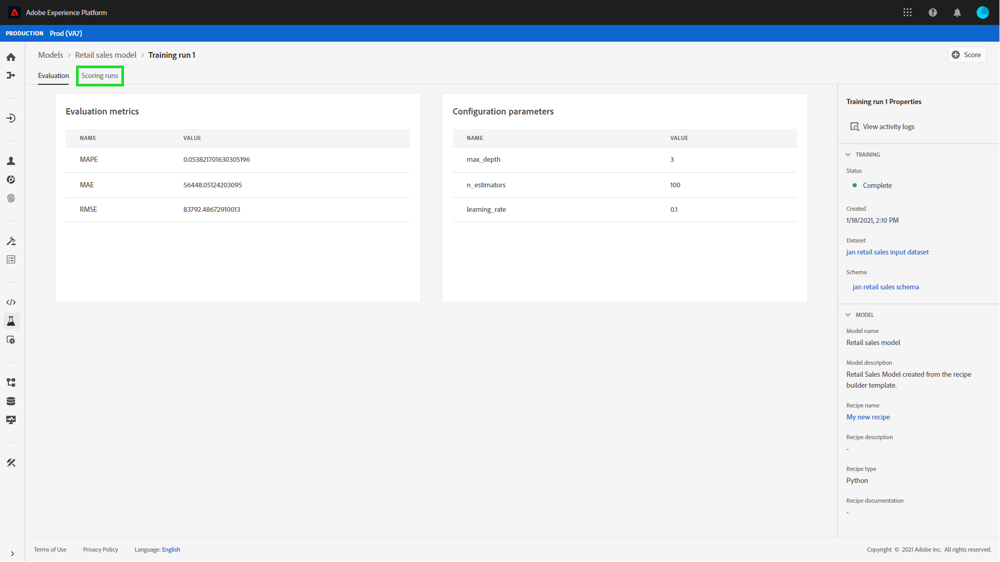
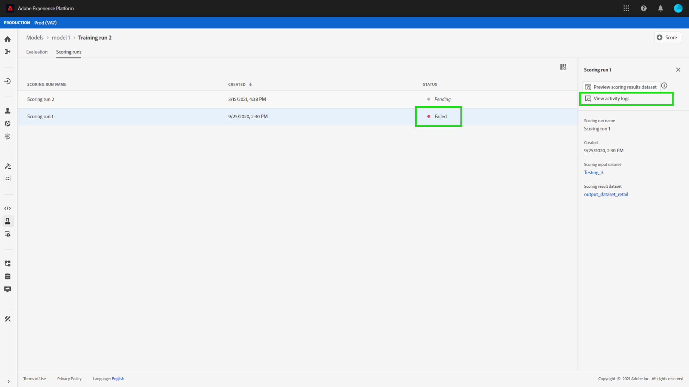

# Notation d’un modèle dans l’interface utilisateur de Workspace de science des données

>[!NOTE]
>
>Le Workspace de science des données ne peut plus être acheté.
>
>Cette documentation est destinée aux clients existants disposant de droits antérieurs sur Data Science Workspace.

La notation dans Adobe Experience Platform [!DNL Data Science Workspace] peut être réalisée en alimentant un modèle formé existant avec des données d’entrée. Les résultats de la notation sont ensuite stockés et consultables dans un jeu de données de sortie spécifié sous la forme d’un nouveau lot.

Ce tutoriel décrit les étapes requises pour noter un modèle dans l’interface utilisateur [!DNL Data Science Workspace].

## Commencer

Pour suivre ce tutoriel, vous devez avoir accès à [!DNL Experience Platform]. Si vous n’avez pas accès à une organisation dans [!DNL Experience Platform], contactez votre administrateur système avant de continuer.

Ce tutoriel nécessite un modèle formé. Si vous ne disposez pas d’un modèle formé, suivez le tutoriel [Formation et évaluation d’un modèle dans l’interface utilisateur](./train-evaluate-model-ui.md) avant de poursuivre.

## Création d’une opération de notation

Vous pouvez créer une opération de notation l’aide de configurations optimisées provenant d’une opération de formation déjà terminée et évaluée. L’ensemble des configurations optimales d’un modèle est généralement déterminé en examinant les mesures d’évaluation de l’opération de formation.

Trouvez l’opération de formation optimale afin d’utiliser ses configurations pour la notation. Ouvrez ensuite l’exécution de formation souhaitée en sélectionnant le lien hypertexte associé à son nom.

Dans l’onglet **[!UICONTROL Evaluation]** de l’exécution de formation , sélectionnez **[!UICONTROL Score]** dans la partie supérieure droite de l’écran. Un nouveau workflow de notation commence.

Sélectionnez le jeu de données de notation d’entrée et sélectionnez **[!UICONTROL Next]**.

Sélectionnez le jeu de données de notation de sortie. Il s’agit du jeu de données de sortie dédié dans lequel les résultats de la notation sont stockés. Confirmez votre sélection et sélectionnez **[!UICONTROL Next]**.

La dernière étape du processus vous invite à configurer votre opération de notation. Ces configurations sont utilisées par le modèle pour l’exécution de notation.
Notez que vous ne pouvez pas supprimer les paramètres hérités qui ont été définis lors de la création des modèles. Vous pouvez modifier ou rétablir des paramètres non hérités en double-cliquant sur la valeur ou en sélectionnant l’icône Rétablir lors du survol de l’entrée.

Vérifiez et confirmez les configurations de notation et sélectionnez **[!UICONTROL Finish]** pour créer et exécuter l’exécution de notation. Vous êtes dirigé vers l’onglet **[!UICONTROL Scoring Runs]** et la nouvelle exécution de notation avec le statut **[!UICONTROL Pending]** s’affiche.

Une exécution de notation peut être affichée avec l’un des statuts suivants :

- En attente
- Terminée
- Échec
- En cours d’exécution

Les statuts sont mis à jour automatiquement. Passez à l’étape suivante si le statut est **[!UICONTROL Complete]** ou **[!UICONTROL Failed]**.

## Affichage des résultats de la notation

Pour afficher les résultats de notation, commencez par sélectionner une exécution de formation.

Vous êtes redirigé vers la page de **[!UICONTROL Evaluation]** des exécutions de formation. En haut de la page d’évaluation des exécutions de formation, sélectionnez l’onglet **[!UICONTROL Scoring Runs]** pour afficher la liste des exécutions de notation existantes.

Sélectionnez ensuite une exécution de notation pour afficher les détails de l’exécution.

Si le statut de l’exécution de notation sélectionnée est défini sur « Terminé » ou « Échec », le lien **[!UICONTROL View Activity Logs]** est rendu disponible. Si l’exécution d’une notation échoue, les journaux d’exécution peuvent fournir des informations utiles pour déterminer la raison de l’échec. Pour télécharger les journaux d’exécution, sélectionnez **[!UICONTROL View Activity Logs]**.

La fenêtre contextuelle **[!UICONTROL View activity logs]** s’affiche. Sélectionnez une URL pour télécharger automatiquement les journaux associés.

Vous avez également la possibilité d’afficher les résultats de votre notation en sélectionnant **[!UICONTROL Preview scoring results dataset]**.

Un aperçu du jeu de données de sortie est fourni.

Pour obtenir l’ensemble complet des résultats de notation, cliquez sur le lien **[!UICONTROL Scoring Results Dataset]** situé dans la colonne de droite.

## Étapes suivantes

Ce tutoriel vous a guidé à travers les étapes pour noter des données à l’aide d’un modèle formé dans [!DNL Data Science Workspace]. Suivez le tutoriel sur la [publication d’un modèle en tant que service dans l’interface utilisateur](./publish-model-service-ui.md) pour permettre aux utilisateurs de votre organisation de noter des données en leur fournissant un accès facile à un service de machine learning.
