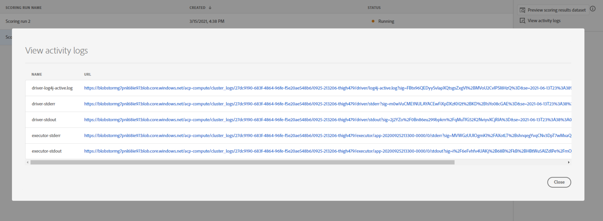

# Score d’un modèle (interface utilisateur)

Le score dans Adobe Experience Platform Data Science Workspace peut être obtenu en alimentant les données d’entrée dans un modèle existant. Les résultats de score sont alors stockés et visibles dans un jeu de données de sortie spécifié sous la forme d’un nouveau lot.

Ce didacticiel présente les étapes requises pour marquer un modèle dans l’interface utilisateur de l’espace de travail Data Science Workspace.

## Prise en main

Pour terminer ce didacticiel, vous devez avoir accès à Experience Platform. Si vous n’avez pas accès à une organisation IMS dans Experience Platform, contactez votre administrateur système avant de poursuivre.

Ce didacticiel nécessite un modèle formé. Si vous n’avez pas de modèle formé, suivez le [train et évaluez un modèle dans le didacticiel sur l’interface utilisateur](./train-evaluate-model-ui.md) avant de poursuivre.

## Création d’une série de scores

Une série de notation est créée à l’aide de configurations optimisées à partir d’une série de formations précédemment terminée et évaluée. L&#39;ensemble des configurations optimales d&#39;un modèle est généralement déterminé par la révision des mesures d&#39;évaluation des cycles de formation.

1. Trouvez l’exécution de formation la plus optimale pour utiliser ses configurations pour la notation. Ouvrez l’exécution de formation souhaitée en cliquant sur son nom.

2. Dans l’onglet **Évaluation** des cours de formation, cliquez sur le bouton **Score** en haut à droite de l’écran. Cette opération déclenchera un nouveau flux de travail **Exécuter le score** .
   

3. Sélectionnez le jeu de données de score d’entrée, puis cliquez sur **Suivant**.
   

4. Sélectionnez le jeu de données de score de sortie, il s’agit du jeu de données de sortie dédié dans lequel les résultats de score sont stockés. Confirmez votre sélection et cliquez sur **Suivant**.
   

5. La dernière étape du processus vous invite à configurer votre exécution de score. Ces configurations sont utilisées par le modèle pour l’exécution de notation.
Notez que vous ne pourrez pas supprimer les paramètres hérités définis lors de la création du modèle. Vous pouvez modifier ou rétablir des paramètres non hérités en cliquant  sur la valeur ou en cliquant sur l’icône de rétablissement tout en passant la souris sur l’entrée.
   
Vérifiez et confirmez les configurations de notation, puis cliquez sur **Terminer** pour créer et exécuter l’exécution de notation. Vous serez dirigé vers l’onglet Exécutions **de** score et la nouvelle série de scores affichera un état.
   
Une série de scores affiche l’un des quatre états suivants : En attente, Terminé, Echec ou En cours d’exécution, et sont mis à jour automatiquement. Passez à l’étape suivante si l’état est &quot;Terminé&quot; ou &quot;Échec&quot;.

## Résultats de  de notation des

1. Recherchez l’exécution de formation utilisée pour l’exécution de notation, puis cliquez sur le nom pour de sa page **d’évaluation** .

2. Près de la partie supérieure de la page d’évaluation de l’exécution de formation, cliquez sur l’onglet Exécutions **de** score pour une liste des exécutions de score existantes. Cliquez sur la liste de pointage pour  ses détails dans la colonne de droite.
   

3. Si l’exécution de score sélectionnée a l’état &quot;Terminé&quot; ou &quot;Échec&quot;, le lien    de journaux **** de l’situé dans la colonne de droite est actif. Cliquez sur le lien pour  ou télécharger les journaux d&#39;exécution. En cas d’échec d’une série de scores, les journaux d’exécution peuvent fournir des informations utiles pour déterminer la raison de l’échec.
   

4. Cliquez sur le lien Jeu de données **des résultats du score** du situé dans la colonne de droite. Vous pourrez voir un du jeu de données de sortie à partir de l’exécution de score.
   

5. Pour l’ensemble complet des résultats de score, cliquez sur le lien Jeu de données **des résultats de** score situé dans la colonne de droite.

## Étapes suivantes

Ce didacticiel vous a guidé tout au long des étapes pour marquer des données à l’aide d’un modèle de l’espace de travail des sciences de données. Suivez le didacticiel sur la [publication d’un modèle en tant que service dans l’interface utilisateur](./publish-model-service-ui.md) pour permettre aux utilisateurs de votre entreprise de noter des données en leur fournissant un accès facile à un service d’apprentissage automatique.
