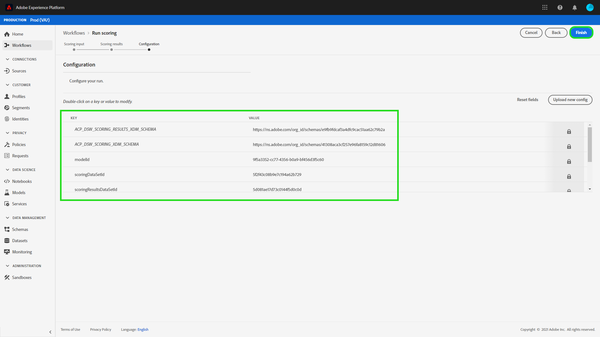

# Score d’un modèle dans l’interface utilisateur de Data Science Workspace

Le score dans Adobe Experience Platform [!DNL Data Science Workspace] peut être obtenu en alimentant les données d&#39;entrée dans un modèle existant. Les résultats de la notation sont ensuite stockés et consultables dans un jeu de données de sortie spécifié sous la forme d’un nouveau lot.

Ce didacticiel présente les étapes requises pour marquer un modèle dans l&#39;interface utilisateur [!DNL Data Science Workspace].

## Prise en main

Pour suivre ce tutoriel, vous devez avoir accès à [!DNL Experience Platform]. Si vous n&#39;avez pas accès à une organisation IMS dans [!DNL Experience Platform], contactez votre administrateur système avant de continuer.

Ce tutoriel nécessite un modèle formé. Si vous ne disposez pas d’un modèle formé, suivez le tutoriel [Formation et évaluation d’un modèle dans l’interface utilisateur](./train-evaluate-model-ui.md) avant de poursuivre.

## Création d’une opération de notation

Vous pouvez créer une opération de notation l’aide de configurations optimisées provenant d’une opération de formation déjà terminée et évaluée. L’ensemble des configurations optimales d’un modèle est généralement déterminé en examinant les mesures d’évaluation de l’opération de formation.

Trouvez l’opération de formation optimale afin d’utiliser ses configurations pour la notation. Ouvrez ensuite l’exécution de formation souhaitée en sélectionnant l’hyperlien associé à son nom.

Dans l&#39;onglet **[!UICONTROL Evaluation]** de l&#39;exécution de formation, sélectionnez **[!UICONTROL Score]** dans la partie supérieure droite de l&#39;écran. Un nouveau processus de notation commence.

Sélectionnez le jeu de données de score d’entrée et sélectionnez **[!UICONTROL Suivant]**.

Sélectionnez le jeu de données de notation de sortie. Il s’agit du jeu de données de sortie dédié dans lequel les résultats de la notation sont stockés. Confirmez votre sélection et sélectionnez **[!UICONTROL Suivant]**.

La dernière étape du processus vous invite à configurer votre opération de notation. Ces configurations sont utilisées par le modèle pour l’exécution de notation.
Notez que vous ne pouvez pas supprimer les paramètres hérités qui ont été définis lors de la création des modèles. Vous pouvez modifier ou rétablir des paramètres non hérités en cliquant sur la valeur ou en sélectionnant l’icône de rétablissement tout en survolant l’entrée.

Vérifiez et confirmez les configurations de score et sélectionnez **[!UICONTROL Terminer]** pour créer et exécuter l&#39;exécution de score. Vous êtes dirigé vers l’onglet **[!UICONTROL Scoring Runs]** et la nouvelle série de notes avec l’état **[!UICONTROL En attente]** s’affiche.

Une série de scores peut être affichée avec l’un des états suivants :
- En attente
- Terminée
- Échoué
- En cours

Les états sont mis à jour automatiquement. Passez à l’étape suivante si l’état est **[!UICONTROL Terminé]** ou **[!UICONTROL Échec]**.

## Affichage des résultats de la notation

Pour vue les résultats de score, début en sélectionnant une série de formations.

Vous êtes redirigé vers la page des exécutions de formation **[!UICONTROL Evaluation]**. Près de la partie supérieure de la page d’évaluation de l’exécution de formation, sélectionnez l’onglet **[!UICONTROL Scoring Runs]** pour vue une liste d’exécutions de score existantes.

Ensuite, sélectionnez une série de scores pour vue les détails de la série.

Si l&#39;exécution de score sélectionnée a l&#39;état &quot;Terminé&quot; ou &quot;Échec&quot;, le lien **[!UICONTROL Journaux des Activités de Vue]** est disponible. En cas d’échec d’une exécution de score, les journaux d’exécution peuvent fournir des informations utiles pour déterminer la raison de l’échec. Pour télécharger les journaux d&#39;exécution, sélectionnez **[!UICONTROL Journaux des Activités de Vue]**.

La fenêtre contextuelle **[!UICONTROL Journaux des activités de Vue]** s&#39;affiche. Sélectionnez une URL pour télécharger automatiquement les journaux associés.

Vous avez également la possibilité de vue vos résultats de score en sélectionnant **[!UICONTROL jeu de données de résultats de score de Prévisualisation]**.

Une prévisualisation du jeu de données de sortie est fournie.

Pour obtenir l’ensemble complet des résultats de score, sélectionnez le lien **[!UICONTROL Score Results Dataset]** situé dans la colonne de droite.

## Étapes suivantes

Ce tutoriel vous a expliqué les étapes à suivre pour noter les données à l’aide d’un modèle formé dans [!DNL Data Science Workspace]. Suivez le tutoriel sur la [publication d’un modèle en tant que service dans l’interface utilisateur](./publish-model-service-ui.md) pour permettre aux utilisateurs de votre organisation de noter des données en leur fournissant un accès facile à un service d’apprentissage automatique.
