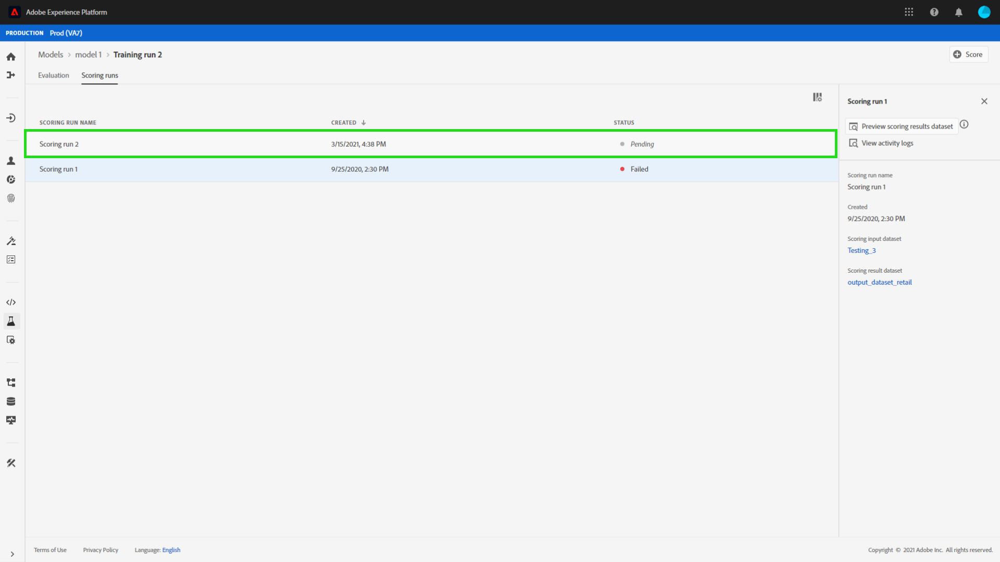

# Notation d’un modèle (interface utilisateur)

Scoring in Adobe Experience Platform [!DNL Data Science Workspace] can be achieved by feeding input data into an existing trained Model. Les résultats de la notation sont ensuite stockés et consultables dans un jeu de données de sortie spécifié sous la forme d’un nouveau lot.

This tutorial demonstrates the steps required to score a Model in the [!DNL Data Science Workspace] user interface.

## Prise en main

Pour suivre ce tutoriel, vous devez avoir accès à [!DNL Experience Platform]. If you do not have access to an IMS Organization in [!DNL Experience Platform], please speak to your system administrator before proceeding.

Ce tutoriel nécessite un modèle formé. Si vous ne disposez pas d’un modèle formé, suivez le tutoriel [Formation et évaluation d’un modèle dans l’interface utilisateur](./train-evaluate-model-ui.md) avant de poursuivre.

## Création d’une opération de notation

Vous pouvez créer une opération de notation l’aide de configurations optimisées provenant d’une opération de formation déjà terminée et évaluée. L’ensemble des configurations optimales d’un modèle est généralement déterminé en examinant les mesures d’évaluation de l’opération de formation.

1. Trouvez l’opération de formation optimale afin d’utiliser ses configurations pour la notation. Ouvrez l’opération de formation souhaitée en cliquant sur son nom.

2. Dans l’onglet **[!UICONTROL Évaluation]** de l’opération de formation, cliquez sur le bouton **[!UICONTROL Noter]** dans le coin supérieur droit de l’écran. Cela lancera un nouveau processus *Exécuter la notation*.
   

3. Sélectionnez le jeu de données de notation d’entrée, puis cliquez sur **[!UICONTROL Suivant]**.
   

4. Sélectionnez le jeu de données de notation de sortie. Il s’agit du jeu de données de sortie dédié dans lequel les résultats de la notation sont stockés. Confirmez votre sélection et cliquez sur **[!UICONTROL Suivant]**.
   

5. La dernière étape du processus vous invite à configurer votre opération de notation. Ces configurations sont utilisées par le modèle pour l’opération de notation.
Notez que vous ne pourrez pas supprimer les paramètres hérités définis lors de la création du modèle. Vous pouvez modifier ou rétablir des paramètres non hérités en double-cliquant sur la valeur ou en cliquant sur l’icône d’annulation lorsque vous survolez l’entrée.
   
Vérifiez et confirmez les configurations de notation, puis cliquez sur **[!UICONTROL Terminer]** pour créer et exécuter l’opération de notation. Vous serez dirigé vers l’onglet **[!UICONTROL Opérations de notation]** et la nouvelle opération de notation affichera un état.
   
L’opération de notation affiche l’un des quatre états suivants : En attente, Terminé, Échec ou En cours d’exécution. Ils sont mis à jour automatiquement. Passez à l’étape suivante si l’état affiché est « Terminé » ou « Échec ».

## Affichage des résultats de la notation

1. Recherchez l’opération de formation utilisée pour l’opération de notation, puis cliquez sur le nom pour afficher sa page **[!UICONTROL Évaluation]**.

2. Près de la partie supérieure de la page d’évaluation de l’opération de formation, cliquez sur l’onglet **[!UICONTROL Opérations de notation]** pour afficher une liste des opérations de notation existantes. Cliquez sur la liste de notation pour afficher ses détails dans la colonne de droite.
   

3. Si l’état de l’opération de notation sélectionnée est « Terminé » ou « Échec », le lien **[!UICONTROL Afficher les journaux d’activité]** de la colonne de droite est actif. Cliquez sur le lien pour afficher ou télécharger les journaux d’exécution. En cas d’échec de l’opération de notation, les journaux d’exécution peuvent fournir des informations utiles pour déterminer la raison de l’échec.
   

4. Cliquez sur le lien **[!UICONTROL Aperçu du jeu de données des résultats de la notation]** situé dans la colonne de droite. Vous pourrez consulter un aperçu du jeu de données de sortie de l’opération de notation.
   

5. Pour consulter l’ensemble des résultats de la notation, cliquez sur le lien **[!UICONTROL Jeu de données des résultats de la notation]** situé dans la colonne de droite.

## Étapes suivantes

Ce tutoriel vous a expliqué les étapes à suivre pour noter les données à l’aide d’un modèle formé dans [!DNL Data Science Workspace]. Suivez le tutoriel sur la [publication d’un modèle en tant que service dans l’interface utilisateur](./publish-model-service-ui.md) pour permettre aux utilisateurs de votre organisation de noter des données en leur fournissant un accès facile à un service d’apprentissage automatique.
