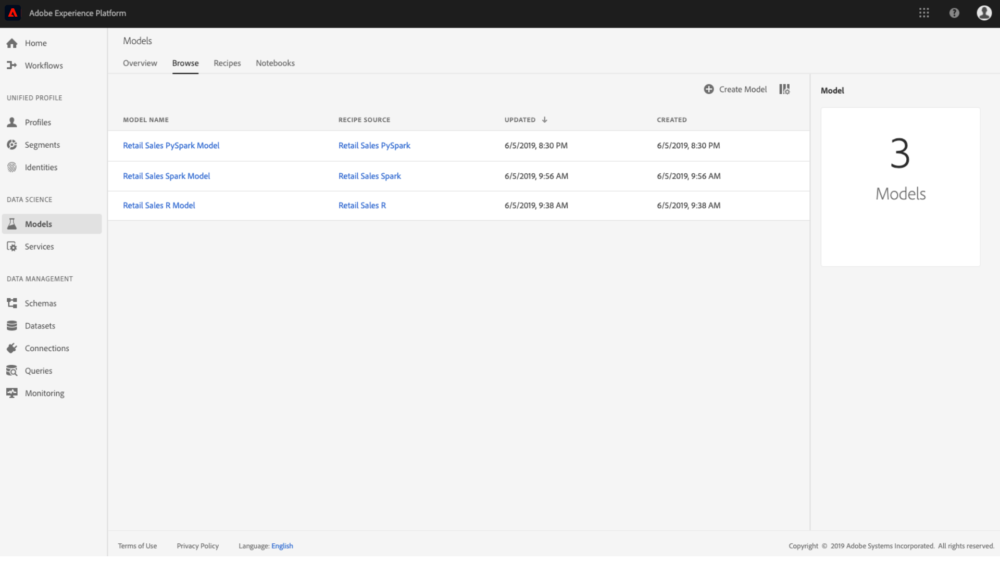

# Former et évaluer un modèle (IU)

Dans Adobe Experience Platform Data Science Workspace, un modèle d’apprentissage automatique est créé en incorporant une recette existante appropriée à l’intention du modèle. Le modèle est ensuite formé et évalué afin d&#39;optimiser son efficacité et son efficacité opérationnelle en affinant ses Hyperparamètres associés. Les recettes sont réutilisables, ce qui signifie que plusieurs modèles peuvent être créés et adaptés à des fins spécifiques avec une seule recette.

Ce didacticiel décrit les étapes à suivre pour créer, former et évaluer un modèle.

## Prise en main

Pour terminer ce didacticiel, vous devez avoir accès à Experience Platform. Si vous n’avez pas accès à une organisation IMS dans Experience Platform, contactez votre administrateur système avant de poursuivre.

Ce didacticiel nécessite une recette existante. Si vous n’avez pas de recette, suivez le didacticiel [Importer une recette assemblée dans l’interface utilisateur](./import-packaged-recipe-ui.md) avant de continuer.

## Créer un modèle

1. Dans Adobe Experience Platform, cliquez sur le lien **Modèles** situé dans la colonne de navigation de gauche pour tous les modèles existants. Cliquez sur **Créer un modèle** dans la partie supérieure droite de la page pour lancer un processus de création de modèle.
   

2. Parcourez le des recettes existantes, recherchez et sélectionnez la recette à utiliser pour créer le modèle, puis cliquez sur **Suivant**.
   

3. Sélectionnez un jeu de données d’entrée approprié, puis cliquez sur **Suivant**. Cette opération définit le jeu de données de formation en entrée par défaut pour le modèle.
   

4. Attribuez un nom au modèle et examinez les configurations de modèle par défaut. Les configurations par défaut ont été appliquées lors de la création de Recette, de la révision et de la modification des valeurs de configuration en cliquant sur les valeurs en . Pour fournir un nouveau jeu de configurations, cliquez sur **Télécharger une nouvelle configuration** et faites glisser un fichier JSON contenant des configurations de modèle dans la fenêtre du navigateur. Cliquez sur **Terminer** pour créer le modèle.
   >[!NOTE]Les configurations sont uniques et spécifiques à la Recette prévue, ce qui signifie que les configurations pour la Recette Vente au détail ne fonctionneront pas pour la Recette des recommandations de produit. Voir la section de [référence](#reference) pour une  de configuration des recettes de vente au détail.

   

## Création d’une session de formation

1. Dans Adobe Experience Platform, cliquez sur le lien **Modèles** situé dans la colonne de navigation de gauche pour tous les modèles existants. Recherchez et cliquez sur le nom du modèle à former.
   

2. Toutes les sessions de formation existantes avec leur statut actuel sont répertoriées. Pour les modèles créés à l’aide de l’interface utilisateur de l’espace de travail des sciences de données, une exécution de formation est automatiquement générée et exécutée à l’aide des configurations par défaut et du jeu de données de formation en entrée.
   

3. Créez une nouvelle formation en cliquant sur **Train** en haut à droite de la page d&#39;aperçu du modèle.
   

4. Sélectionnez le jeu de données d’entrée de formation pour l’exécution de la formation, puis cliquez sur **Suivant**.
   

5. Les configurations par défaut fournies lors de la création du modèle sont affichées, modifiées et modifiées en conséquence en cliquant  sur les valeurs. Cliquez sur **Terminer** pour créer et exécuter l’exécution de la formation.
   >[!NOTE]Les configurations sont uniques et spécifiques à la Recette prévue, ce qui signifie que les configurations pour la Recette Vente au détail ne fonctionneront pas pour la Recette des recommandations de produit. Voir la section de [référence](#reference) pour une  de configuration des recettes de vente au détail.

   

## Évaluer le modèle

1. Dans Adobe Experience Platform, cliquez sur le lien **Modèles** situé dans la colonne de navigation de gauche pour tous les modèles existants. Recherchez et cliquez sur le nom du modèle à évaluer.
   

2. Toutes les sessions de formation existantes avec leur statut actuel sont répertoriées. Avec plusieurs exécutions de formation terminées, les mesures d&#39;évaluation peuvent être comparées entre différentes exécutions de formation dans le graphique d&#39;évaluation du modèle, puis sélectionnez une mesure d&#39;évaluation à l&#39;aide du déroulant  au-dessus du graphique.

   La mesure Erreur en pourcentage absolu moyen (MAPE) exprime la précision sous forme de pourcentage de l’erreur. Elle permet d’identifier l’expérience la plus performante. Plus le MAPE est bas, mieux c&#39;est.

   

   La mesure &quot;Précision&quot; décrit le pourcentage des instances pertinentes par rapport au total des instances *récupérées* . La précision peut être considérée comme la probabilité qu’un résultat sélectionné de manière aléatoire soit correct.
   

   Cliquez sur une session de formation spécifique pour  les détails de cette série. Cela peut être fait avant même que l’exécution ne soit terminée. Sur la page des détails de l’exécution, vous pouvez voir d’autres mesures d’évaluation, paramètres de configuration et visualisations spécifiques à l’exécution de la formation. Vous pouvez également télécharger  journaux  pour afficher les détails de l’exécution. Les journaux sont particulièrement utiles pour les échecs d’exécution afin de voir ce qui s’est mal passé.
   

3. Les hyperparamètres ne peuvent pas être formés et un modèle doit être optimisé en testant différentes combinaisons d&#39;hyperparamètres. Répétez ce processus de formation et d&#39;évaluation du modèle jusqu&#39;à ce que vous ayez atteint un modèle optimisé.

## Étapes suivantes

Ce didacticiel vous guide tout au long des étapes nécessaires pour créer, former et évaluer un modèle dans Data Science Workspace. Une fois que vous êtes arrivé à un modèle optimisé, vous pouvez utiliser le modèle formé pour générer des informations en suivant le didacticiel [Score a Model dans l’interface utilisateur](./score-model-ui.md) .

## Référence {#reference}

### Configurations des recettes de vente au détail

Les hyperparamètres déterminent le comportement d&#39;entraînement du modèle, et la modification des hyperparamètres aura une incidence sur la précision et la précision du modèle:

| Hyperparamètre | Description | Plage recommandée |
--- | --- | ---
| learning_rate | Le taux d’apprentissage réduit la contribution de chaque arbre par learning_rate. Il existe un compromis entre le taux d’apprentissage et le taux d’évaluation. | 0.1 | [2 - 10] / nombre d&#39;estimateurs |
| n_estimateurs | Nombre d’étapes de renforcement à exécuter. L&#39;augmentation du dégradé est assez robuste pour être trop ajusté, de sorte qu&#39;un grand nombre d&#39;entre eux donne généralement de meilleures performances. | 100 | 100 - 1000 |
| max_depth | Profondeur maximale des estimateurs de régression individuels. La profondeur maximale limite le nombre de noeuds dans l’arborescence. Réglez ce paramètre pour obtenir de meilleures performances ; la meilleure valeur dépend de l’interaction des variables d’entrée. | 3 | 4 - 10 |

Des paramètres supplémentaires déterminent les propriétés techniques du modèle:

| Clé de paramètre | Type | Description |
| ----- | ----- | ----- |
| `ACP_DSW_INPUT_FEATURES` | Chaîne |  d’attributs de d’entrée séparés par des virgules. |
| `ACP_DSW_TARGET_FEATURES` | Chaîne |  d’attributs de de sortie séparés par des virgules. |
| `ACP_DSW_FEATURE_UPDATE_SUPPORT` | Booléen | Détermine si les fonctions d’entrée et de sortie peuvent être modifiées |
| `tenantId` | Chaîne | Cet ID permet de s’assurer que les ressources que vous créez sont correctement nommées et contenues dans votre organisation IMS. [Suivez les étapes ci-dessous](../../xdm/api/getting-started.md#know-your-tenant-id) pour trouver votre ID de locataire. |
| `ACP_DSW_TRAINING_XDM_SCHEMA` | Chaîne | d’entrée utilisé pour la formation d’un modèle. |
| `evaluation.labelColumn` | Chaîne | Libellé de colonne pour les visualisations d’évaluation. |
| `evaluation.metrics` | Chaîne | de mesures d’évaluation séparées par des virgules à utiliser pour évaluer un modèle. |
| `ACP_DSW_SCORING_RESULTS_XDM_SCHEMA` | Chaîne | de sortie utilisé pour marquer un modèle. |