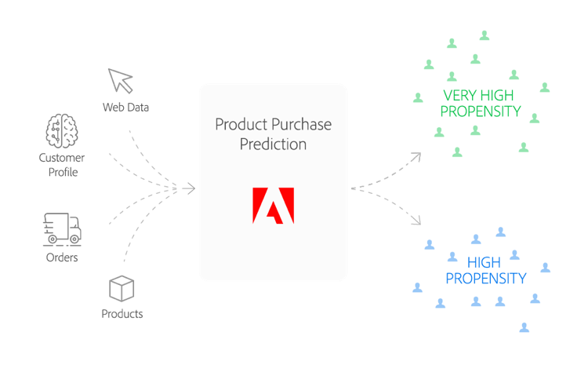

# Recette d’achat de produit

## Présentation

La recette Prédiction des achats de produits vous permet de prévoir la probabilité d’un certain type de événement d’achat client - un achat de produit, par exemple.

Le document suivant répond à des questions telles que :
* Pour qui est construite cette recette ?
* Que fait cette recette ?

## Pour qui est construite cette recette ?

Votre marque cherche à augmenter les ventes trimestrielles de votre gamme de produits grâce à des promotions efficaces et ciblées destinées à vos clients. Cependant, tous les clients ne se ressemblent pas et vous voulez que votre argent vaille. Qui cibles-tu ? Parmi vos clients, lequel est le plus susceptible de répondre sans que votre promotion soit intrusive ? Comment personnaliser vos promotions pour chaque client ? Quels canaux devriez-vous compter et quand devriez-vous envoyer des promotions ?

## Que fait cette recette ?

La recette Prédiction des achats de produits utilise l’apprentissage automatique pour prédire le comportement d’achat des clients. Pour ce faire, il applique un classificateur de forêt aléatoire personnalisé et un modèle de données d’expérience à deux niveaux (XDM) pour prévoir la probabilité d’un événement d’achat. Le modèle utilise des données d’entrée incorporant des informations sur le profil client et l’historique des achats précédents et utilise par défaut des paramètres de configuration prédéterminés déterminés déterminés par nos Data Scientists pour améliorer la précision prédictive.

## Data schema

Cette recette utilise des schémas  XDM pour modéliser les données. Le schéma utilisé pour cette recette est illustré ci-dessous :

| Nom du champ | Type |
--- | ---
| userId | Chaîne |
| genderRatio | Nombre |
| ageY | Nombre |
| ageM | Nombre |
| optinEmail | Booléen |
| optinMobile | Booléen |
| optinAddress | Booléen |
| created | Entier |
| totalOrders | Nombre |
| totalItems | Nombre |
| orderDate1 | Nombre |
| shippingDate1 | Nombre |
| totalPrice1 | Nombre |
| tax1 | Nombre |
| orderDate2 | Nombre |
| shippingDate2 | Nombre |
| totalPrice2 | Nombre |

## Algorithme

Tout d’abord, le jeu de données d’identification dans le schéma *ProductPrediction* est chargé. À partir de là, le modèle est formé à l&#39;aide d&#39;un classificateur [de forêt](https://scikit-learn.org/stable/modules/generated/sklearn.ensemble.RandomForestClassifier.html)aléatoire. Le classificateur de forêt aléatoire est un type d’algorithme intégré qui fait référence à un algorithme qui combine plusieurs algorithmes pour obtenir de meilleures performances prédictives. L&#39;idée derrière l&#39;algorithme est que le classificateur de forêt aléatoire construit plusieurs arbres de décision et les fusionne pour créer une prédiction plus précise et plus stable.

Ce processus début avec la création d’un ensemble d’arbres de décision qui sélectionne de manière aléatoire des sous-ensembles de données d’identification. Par la suite, les résultats de chaque arbre de décision sont calculés en moyenne.