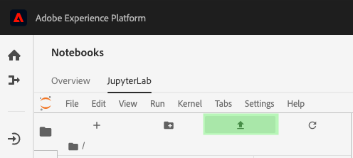
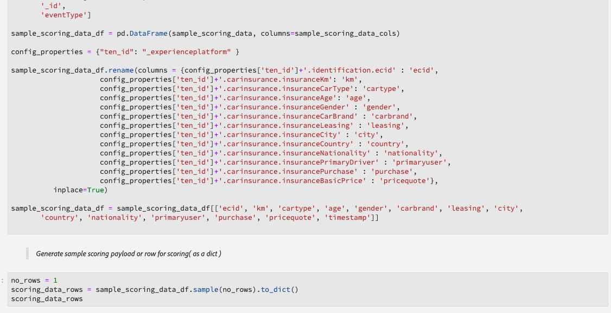

# Guide de l&#39;utilisateur du portable d&#39;apprentissage automatique en temps réel (Alpha)

>[!IMPORTANT]
>L&#39;apprentissage automatique en temps réel n&#39;est pas encore disponible pour tous les utilisateurs. Cette fonction est en alpha et est encore en cours de test. Ce document est sujet à changement.

Le guide suivant décrit les étapes nécessaires à la création d&#39;une application d&#39;apprentissage automatique en temps réel. En utilisant le modèle de bloc-notes ML **** Python fourni par Adobe, ce guide couvre la formation d&#39;un modèle, la création d&#39;un DSL, la publication d&#39;un DSL sur Edge et le score de la demande. Au fur et à mesure que vous progressez dans la mise en oeuvre de votre modèle d’apprentissage automatique en temps réel, il est prévu que vous modifiez le modèle en fonction des besoins de votre jeu de données.

## Créer un bloc-notes d&#39;apprentissage automatique en temps réel

Dans l’interface utilisateur d’Adobe Experience Platform, sélectionnez **[!UICONTROL Ordinateurs portables]** dans *Data Science*. Ensuite, sélectionnez **[!UICONTROL JupyterLab]** et accordez un peu de temps pour que l&#39;environnement se charge.


Le lanceur JupyterLab s&#39;affiche. Faites défiler l&#39;écran jusqu&#39;à *Real-Time Machine Learning* et sélectionnez le bloc-notes ML **en temps** réel. Un modèle s&#39;ouvre et contient des cellules d&#39;exemple de bloc-notes avec un exemple de jeu de données.


## Importer et découvrir des noeuds

Début en important tous les packages requis pour votre modèle. Assurez-vous que tout package que vous prévoyez d’utiliser pour la création de noeuds est importé.

>[!NOTE]
>La liste des importations peut différer selon le modèle que vous souhaitez faire. Cette liste va changer à mesure que de nouveaux noeuds seront ajoutés au fil du temps. Consultez le guide [de référence des](./node-reference.md) noeuds pour obtenir une liste complète des noeuds disponibles.

```python
from pprint import pprint
import pandas as pd
import numpy as np
import json
import uuid
from shutil import copyfile
from pathlib import Path
from datetime import date, datetime, timedelta
from platform_sdk.dataset_reader import DatasetReader

from rtml_nodelibs.nodes.standard.preprocessing.json_to_df import JsonToDataframe
from rtml_sdk.edge.utils import EdgeUtils
from rtml_sdk.graph.utils import GraphBuilder
from rtml_nodelibs.nodes.standard.ml.onnx import ONNXNode
from rtml_nodelibs.core.nodefactory import NodeFactory as nf
from rtml_nodelibs.nodes.standard.preprocessing.pandasnode import Pandas
from rtml_nodelibs.nodes.standard.preprocessing.one_hot_encoder import OneHotEncoder
from rtml_nodelibs.nodes.standard.ml.artifact_utils import ModelUpload
from rtml_nodelibs.core.nodefactory import NodeFactory as nf
from rtml_nodelibs.core.datamsg import DataMsg
```

La cellule de code suivante imprime une liste de noeuds disponibles.

```python
# Discover Nodes
pprint(nf.discover_nodes())
```


## Formation à un modèle d&#39;apprentissage automatique en temps réel

En utilisant l&#39;une des options suivantes, vous allez écrire du code Python pour lire, prétraiter et analyser des données. Ensuite, vous devez former votre propre modèle ML, le sérialiser au format ONNX, puis le télécharger dans la boutique de modèles d&#39;apprentissage automatique en temps réel.

- [Formation de votre propre modèle sur des portables JupyterLab](#training-your-own-model)
- [Téléchargement de votre propre modèle ONNX préentraîné vers des portables JupyterLab](#pre-trained-model-upload)

### Formation de votre propre modèle {#training-your-own-model}

Début en chargeant vos données de formation.

>[!NOTE]
>Dans le modèle ML **** en temps réel, le jeu de données [CSV d&#39;assurance](https://github.com/adobe/experience-platform-dsw-reference/tree/master/datasets/insurance) automobile est saisi à Github.

Si vous souhaitez utiliser un jeu de données dans Adobe Experience Platform, annulez la mise en commentaire de la cellule ci-dessous. Ensuite, vous devez remplacer `DATASET_ID` par la valeur appropriée.


Pour accéder à un jeu de données dans votre bloc-notes JupyterLab, sélectionnez l&#39;onglet **Data** dans le volet de navigation de gauche de JupyterLab. Les répertoires *Datasets* et *Schémas* s’affichent. Sélectionnez **[!UICONTROL Datasets]** et cliquez avec le bouton droit de la souris, puis sélectionnez l&#39;option **[!UICONTROL Explorer les données dans le bloc-notes]** dans le menu déroulant du jeu de données que vous souhaitez utiliser. Une entrée de code exécutable s&#39;affiche au bas du bloc-notes. Cette cellule a ta `dataset_id`cellule.


Une fois l&#39;opération terminée, cliquez avec le bouton droit de la souris et supprimez la cellule que vous avez générée au bas du bloc-notes.

### Propriétés de formation

A l’aide du modèle fourni, modifiez l’une des propriétés de formation dans `config_properties`.

```python
config_properties = {
    "train_records_limit":1000000,
    "n_estimators": "80",
    "max_depth": "5",
    "ten_id": "_experienceplatform"  
}
```

### Préparation de votre modèle

En utilisant le modèle ML *en temps* réel, vous devez analyser, prétraiter, former et évaluer votre modèle ML. Pour ce faire, il applique les transformations de données et crée un canal de formation.

**Transformations de données**

La cellule de transformation *des* données des modèles ML *en temps* réel doit être modifiée pour fonctionner avec votre propre jeu de données. Cela implique généralement de renommer les colonnes, le cumul de données et la préparation des données/l&#39;ingénierie des fonctionnalités.

>[!NOTE]
>L&#39;exemple suivant a été condensé à des fins de lisibilité à l&#39;aide de `[ ... ]`. Veuillez vue le modèle ML ** en temps réel pour la cellule de code complète.

```python
df1.rename(columns = {config_properties['ten_id']+'.identification.ecid' : 'ecid',
                     [ ... ]}, inplace=True)
df1 = df1[['ecid', 'km', 'cartype', 'age', 'gender', 'carbrand', 'leasing', 'city', 
       'country', 'nationality', 'primaryuser', 'purchase', 'pricequote', 'timestamp']]
print("df1 shape 1", df1.shape)
#########################################
# Data Rollup
######################################### 
df1['timestamp'] = pd.to_datetime(df1.timestamp)
df1['hour'] = df1['timestamp'].dt.hour.astype(int)
df1['dayofweek'] = df1['timestamp'].dt.dayofweek

df1.loc[(df1['purchase'] == 'yes'), 'purchase'] = 1
df1.purchase.fillna(0, inplace=True)
df1['purchase'] = df1['purchase'].astype(int)

[ ... ]

print("df1 shape 2", df1.shape)

#########################################
# Data Preparation/Feature Engineering
#########################################      

df1['carbrand'] = df1['carbrand'].str.lower()
df1['country'] = df1['country'].str.lower()
df1.loc[(df1['carbrand'] == 'vw'), 'carbrand'] = 'volkswagen'

[ ... ]

df1['age'].fillna(df1['age'].median(), inplace=True)
df1['gender'].fillna('notgiven', inplace=True)

[ ... ]

df1['city'] = df1.groupby('country')['city'].transform(lambda x : x.fillna(x.mode()))
df1.dropna(subset = ['pricequote'], inplace=True)
print("df1 shape 3", df1.shape)
print(df1)

#grouping
grouping_cols = ['carbrand', 'cartype', 'city', 'country']

for col in grouping_cols:
    df_idx = pd.DataFrame(df1[col].value_counts().head(6))

    def grouping(x):
        if x in df_idx.index:
            return x
        else:
            return "Others"
    df1[col] = df1[col].apply(lambda x: grouping(x))

def age(x):
    if x < 20:
        return "u20"
    elif x > 19 and x < 29:
    [ ... ]
    else: 
        return "Others"

df1['age'] = df1['age'].astype(int)
df1['age_bucket'] = df1['age'].apply(lambda x: age(x))

df_final = df1[['hour', 'dayofweek','age_bucket', 'gender', 'city',  
   'country', 'carbrand', 'cartype', 'leasing', 'pricequote', 'purchase']]
print("df final", df_final.shape)

cat_cols = ['age_bucket', 'gender', 'city', 'dayofweek', 'country', 'carbrand', 'cartype', 'leasing']
df_final = pd.get_dummies(df_final, columns = cat_cols)
```

Exécutez la cellule fournie pour afficher un exemple de résultat. La table de sortie renvoyée par le jeu de `carinsurancedataset.csv` données renvoie les modifications définies.


**Gazoduc de formation**

Ensuite, vous devez créer le canal de formation. Cela ressemblera à n&#39;importe quel autre fichier de pipeline de formation, sauf que vous devez convertir et générer un fichier ONNX.

Modifiez le modèle en utilisant les transformations de données définies dans votre cellule précédente. Le code suivant, mis en évidence ci-dessous, est utilisé pour générer un fichier ONNX dans votre pipeline de fonctionnalités. Veuillez vue le modèle ML ** en temps réel pour la cellule de code de pipeline complète.

```python
#for generating onnx
def generate_onnx_resources(self):        
    install_dir = os.path.expanduser('~/my-workspace')
    print("Generating Onnx")
        
    from skl2onnx import convert_sklearn
    from skl2onnx.common.data_types import FloatTensorType
        
    # ONNX-ification
    initial_type = [('float_input', FloatTensorType([None, self.feature_len]))]

    print("Converting Model to Onnx")
    onx = convert_sklearn(self.model, initial_types=initial_type)
             
    with open("model.onnx", "wb") as f:
        f.write(onx.SerializeToString())
            
    print("Model onnx created")
```

Une fois que vous avez terminé votre pipeline de formation et modifié vos données par le biais de la transformation des données, utilisez la cellule suivante pour exécuter la formation.

```python
model = train(config_properties, df_final)
```

### Générer et télécharger un modèle ONNX

Une fois que vous avez terminé une session de formation réussie, vous devez générer un modèle ONNX et télécharger le modèle formé dans la boutique de modèles d&#39;apprentissage automatique en temps réel. Après avoir exécuté les cellules suivantes, votre modèle ONNX s&#39;affiche dans le rail gauche à côté de tous vos autres ordinateurs portables.

```python
import os
import skl2onnx, subprocess

model.generate_onnx_resources()
```

```python
model_path = "model.onnx"

model = ModelUpload(params={'model_path': model_path})
msg_model = model.process(None, 1)
model_id = msg_model.model['model_id']
 
print("Model ID : ", model_id)
```

>[!NOTE]
>Modifiez la valeur `model_path` de chaîne pour nommer votre modèle.


### Téléchargement de votre propre modèle ONNX préentraîné {#pre-trained-model-upload}

A l&#39;aide du bouton de téléchargement situé dans les blocs-notes JupyterLab, téléchargez votre modèle ONNX préformé sur l&#39;environnement des blocs-notes Data Science Workspace.



Ensuite, modifiez la valeur de la `model_path` chaîne dans le bloc-notes ML *en temps* réel pour qu&#39;elle corresponde au nom du modèle ONNX. Une fois terminé, exécutez la cellule *Définir le chemin* du modèle, puis exécutez la cellule *Télécharger votre modèle vers la cellule Magasin* de modèles RTML. L&#39;emplacement de votre modèle et l&#39;ID du modèle sont tous deux renvoyés dans la réponse en cas de réussite.


## Création d&#39;un langage spécifique au domaine (DSL)

Cette section décrit la création d&#39;un DSL. Vous allez créer les noeuds qui incluent tout prétraitement des données avec le noeud ONNX. Ensuite, un graphique DSL est créé à l&#39;aide de noeuds et de bords. Les arêtes connectent les noeuds au format de tuple (node_1, node_2). Le graphique ne doit pas avoir de cycles.

>[!IMPORTANT]
>L’utilisation du noeud ONNX est obligatoire. Sans le noeud ONNX, l&#39;application échoue.

### Création de noeuds

>[!NOTE]
> Il est probable que vous ayez plusieurs noeuds en fonction du type de données utilisé. L&#39;exemple suivant illustre un seul noeud dans le modèle ML ** en temps réel. Veuillez vue le modèle ML ** en temps réel pour la cellule de code complète.

Le noeud Pandas ci-dessous utilise `"import": "map"` pour importer le nom de la méthode sous la forme d’une chaîne dans les paramètres, suivie de l’entrée des paramètres sous la forme d’une fonction de mappage. L’exemple ci-dessous effectue cette opération en utilisant `{'arg': {'dataLayerNull': 'notgiven', 'no': 'no', 'yes': 'yes', 'notgiven': 'notgiven'}}`. Une fois la carte en place, vous avez la possibilité de la définir `inplace` en tant que `True` ou `False`. Définissez `inplace` la variable comme `True` ou `False` selon si vous souhaitez appliquer ou non la transformation. Par défaut, `"inplace": False` crée une colonne. La prise en charge d’un nouveau nom de colonne est définie pour être ajoutée dans une version ultérieure. La dernière ligne `cols` peut être un nom de colonne unique ou une liste de colonnes. Spécifiez les colonnes sur lesquelles vous souhaitez appliquer la transformation. Dans cet exemple, `leasing` est spécifié. Pour plus d’informations sur les noeuds disponibles et sur leur utilisation, consultez le guide [de référence des](./node-reference.md)noeuds.

```python
# Renaming leasing column using Pandas Node
leasing_mapper_node = Pandas(params={'import': 'map',
                                'kwargs': {'arg': {
                                    'dataLayerNull': 'notgiven', 
                                    'no': 'no', 
                                    'yes': 'yes', 
                                    'notgiven': 'notgiven'}},
                                'inplace': True,
                                'cols': 'leasing'})
```

### Création du graphique DSL

Une fois les noeuds créés, l’étape suivante consiste à les relier pour créer un graphique.

Début en répertoriant tous les noeuds qui font partie du graphique en créant un tableau.

```python
nodes = [json_df_node, 
        to_datetime_node,
        hour_node,
        dayofweek_node,
        age_fillna_node,
        carbrand_fillna_node,
        country_fillna_node,
        cartype_primary_nationality_km_fillna_node,
        carbrand_mapper_node,
        cartype_mapper_node,
        country_mapper_node,
        gender_mapper_node,
        leasing_mapper_node,
        age_to_int_node,
        age_bins_node,
        dummies_node, 
        onnx_node]
```

Ensuite, connectez les noeuds aux bords. Chaque tuple est une connexion Edge.

>[!TIP]
> Comme les noeuds dépendent les uns des autres de façon linéaire (chaque noeud dépend de la sortie du noeud précédent), vous pouvez créer des liens en utilisant une simple compréhension de la liste Python. Ajoutez vos propres connexions si un noeud dépend de plusieurs entrées.

```python
edges = [(nodes[i], nodes[i+1]) for i in range(len(nodes)-1)]
```

Une fois vos noeuds connectés, créez le graphique.

```python
dsl = GraphBuilder.generate_dsl(nodes=nodes, edges=edges)
pprint(json.loads(dsl))
```

Une fois terminé, un `edge` objet est renvoyé contenant chacun des noeuds et les paramètres qui leur ont été associés.


## Publier sur Edge (Hub)

>[!NOTE]
>L’apprentissage automatique en temps réel est temporairement déployé et géré par Adobe Experience Platform Hub. Pour plus d&#39;informations, consultez la section d&#39;aperçu sur l&#39;architecture [d&#39;apprentissage automatique en temps](./home.md#architecture)réel.

Maintenant que vous avez créé un graphique DSL, vous pouvez déployer votre graphique sur le bord.

>[!IMPORTANT]
>Ne publiez pas souvent sur Edge, cela peut surcharger les noeuds Edge. Il n’est pas recommandé de publier le même modèle plusieurs fois.

```python
edge_utils = EdgeUtils()
(edge_location, service_id) = edge_utils.publish_to_edge(dsl=dsl)
print(f'Edge Location: {edge_location}')
print(f'Service ID: {service_id}')
```

### Mise à jour de votre DSL et republication sur Edge (facultatif)

Si vous n&#39;avez pas besoin de mettre à jour votre DSL, vous pouvez passer à la [notation](#scoring).

>[!NOTE]
>Les cellules suivantes ne sont requises que si vous souhaitez mettre à jour un fichier DSL existant qui a été publié sur Edge.

Vos modèles continueront probablement de se développer. Plutôt que de créer un tout nouveau service, il est possible de mettre à jour un service existant avec votre nouveau modèle. Vous pouvez définir un noeud que vous souhaitez mettre à jour, lui attribuer un nouvel ID, puis recharger la nouvelle liste de distribution sur le serveur Edge.

Dans l’exemple ci-dessous, le noeud 0 est mis à jour avec un nouvel ID.

```python
# Update the id of Node 0 with a random uuid.

dsl_dict = json.loads(dsl)
print(f"ID of Node 0 in current DSL: {dsl_dict['edge']['applicationDsl']['nodes'][0]['id']}")

new_node_id = str(uuid.uuid4())
print(f'Updated Node ID: {new_node_id}')

dsl_dict['edge']['applicationDsl']['nodes'][0]['id'] = new_node_id
```


Après la mise à jour de l’ID de noeud, vous pouvez republier un fichier DSL mis à jour sur le serveur Edge.

```python
# Republish the updated DSL to Edge
(edge_location_ret, service_id, updated_dsl) = edge_utils.update_deployment(dsl=json.dumps(dsl_dict), service_id=service_id)
print(f'Updated dsl: {updated_dsl}')
```

Vous recevez le DSL mis à jour.


## Scores {#scoring}

Après la publication sur Edge, le score est effectué par une requête POST d’un client. En règle générale, cela peut être fait à partir d’une application cliente qui a besoin de scores ML. Vous pouvez aussi le faire depuis Postman. Le modèle ML ** en temps réel utilise EdgeUtils pour démontrer ce processus.

>[!NOTE]
>Un petit temps de traitement est nécessaire avant les débuts de notation.

```python
# Wait for the app to come up
import time
time.sleep(20)
```

En utilisant le même schéma que celui utilisé dans la formation, des données de score d’exemple sont générées. Ces données sont utilisées pour créer un cadre de données de notation, puis converties en dictionnaire de notation. Veuillez vue le modèle ML ** en temps réel pour la cellule de code complète.



### Score par rapport au point de terminaison Edge

Utilisez la cellule suivante dans le modèle ML ** en temps réel pour obtenir un score par rapport à votre service Edge.


Une fois le score terminé, l’URL d’Edge, la charge utile et la sortie notée de l’Edge sont renvoyées.

## Suppression d’une application déployée à partir d’Edge (facultatif)

>!![CAUTION]
Cette cellule est utilisée pour supprimer votre application Edge déployée. N&#39;utilisez pas la cellule suivante, sauf si vous devez supprimer une application Edge déployée.

```python
if edge_utils.delete_from_edge(service_id=service_id):
    print(f"Deleted service id {service_id} successfully")
else:
    print(f"Failed to delete service id {service_id}")
```

## Étapes suivantes

En suivant le tutoriel ci-dessus, vous avez réussi à former et à télécharger un modèle ONNX dans la boutique de modèles d&#39;apprentissage automatique en temps réel. De plus, vous avez marqué et déployé votre modèle d&#39;apprentissage automatique en temps réel. Si vous souhaitez en savoir plus sur les noeuds disponibles pour la création de modèles, consultez le guide [de référence des](./node-reference.md)noeuds.