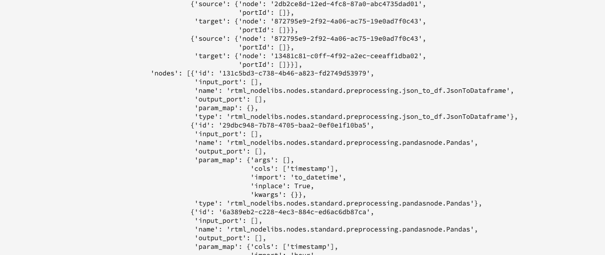

# Gérer les notebooks de machine learning en temps réel (Alpha)

>[!IMPORTANT]
>
>Le machine learning en temps réel n’est pas encore disponible pour tous les utilisateurs et utilisatrices. Cette fonctionnalité est en version alpha et est encore en cours de test. Ce document est sujet à modification.

Le guide suivant décrit les étapes nécessaires à la création d’une application de machine learning en temps réel. En utilisant le modèle de notebook Python de **[!UICONTROL ML en temps réel]** fourni par Adobe, ce guide couvre l’apprentissage d’un modèle, la création d’un DSL, la publication d’un DSL sur Edge et la notation de la requête. Au fur et à mesure que vous passez à la mise en oeuvre de votre modèle de machine learning en temps réel, vous devez modifier le modèle en fonction des besoins de votre jeu de données.

## Créer un notebook de machine learning en temps réel

Dans l’interface utilisateur d’Adobe Experience Platform, sélectionnez **[!UICONTROL Notebooks]** depuis **Science des données**. Ensuite, sélectionnez **[!UICONTROL JupyterLab]** et patientez le temps que l’environnement se charge.


Le lanceur [!DNL JupyterLab] s’affiche. Faites défiler jusqu’à *Machine learning en temps réel* et sélectionnez le notebook **[!UICONTROL ML en temps réel]**. Un modèle s’ouvre, contenant des exemples de cellules de notebook avec un exemple de jeu de données.


## Importer et découvrir les nœuds

Commencez par importer tous les packages requis pour votre modèle. Assurez-vous que tous les packages que vous prévoyez d’utiliser pour la création de nœuds sont importés.

>[!NOTE]
>
>La liste des importations peut différer en fonction du modèle que vous souhaitez créer. Cette liste va changer à mesure que de nouveaux nœuds seront ajoutés. Veuillez consulter le [Guide de référence des nœuds](./node-reference.md) pour obtenir une liste complète des nœuds disponibles.

```python
from pprint import pprint
import pandas as pd
import numpy as np
import json
import uuid
from shutil import copyfile
from pathlib import Path
from datetime import date, datetime, timedelta
from platform_sdk.dataset_reader import DatasetReader

from rtml_nodelibs.nodes.standard.preprocessing.json_to_df import JsonToDataframe
from rtml_sdk.edge.utils import EdgeUtils
from rtml_sdk.graph.utils import GraphBuilder
from rtml_nodelibs.nodes.standard.ml.onnx import ONNXNode
from rtml_nodelibs.core.nodefactory import NodeFactory as nf
from rtml_nodelibs.nodes.standard.preprocessing.pandasnode import Pandas
from rtml_nodelibs.nodes.standard.preprocessing.one_hot_encoder import OneHotEncoder
from rtml_nodelibs.nodes.standard.ml.artifact_utils import ModelUpload
from rtml_nodelibs.core.nodefactory import NodeFactory as nf
from rtml_nodelibs.core.datamsg import DataMsg
```

La cellule de code suivante affiche une liste de nœud disponibles.

```python
# Discover Nodes
pprint(nf.discover_nodes())
```


## Entraînement d’un modèle de machine learning en temps réel

En utilisant l’une des options suivantes, vous allez écrire du code [!DNL Python] pour lire, prétraiter et analyser les données. Ensuite, vous devez entraîner votre propre modèle ML, le sérialiser au format ONNX, puis le charger dans la boutique de modèles de machine learning en temps réel.

- [Entraînement de votre propre modèle dans les notebooks JupyterLab](#training-your-own-model)
- [Chargement de votre propre modèle ONNX pré-entraîné vers les notebooks JupyterLab](#pre-trained-model-upload)

### Entraînement de votre propre modèle {#training-your-own-model}

Commencez par charger vos données d’identification.

>[!NOTE]
>
>Dans le modèle **ML en temps réel**, le [jeu de données CSV d’assurance automobile](https://github.com/adobe/experience-platform-dsw-reference/tree/master/datasets/insurance) est capturé à partir de [!DNL Github].


Si vous souhaitez utiliser un jeu de données dans Adobe Experience Platform, supprimez les commentaires de la cellule ci-dessous. Ensuite, vous devez remplacer `DATASET_ID` avec la valeur appropriée.


Pour accéder à un jeu de données dans votre notebook [!DNL JupyterLab], sélectionnez l’onglet **Données** dans le volet de navigation de gauche de [!DNL JupyterLab]. Les **[!UICONTROL jeux de données]** et les répertoires de **[!UICONTROL schémas]** s’affichent. Sélectionnez **[!UICONTROL Jeux de données]** puis cliquez avec le bouton droit de la souris. Sélectionnez ensuite l’option **[!UICONTROL Exploration des données dans Notebook]** dans le menu déroulant du jeu de données que vous souhaitez utiliser. Une entrée de code exécutable s’affiche en bas du notebook. Cette cellule a votre `dataset_id`.


Une fois l’opération terminée, cliquez avec le bouton droit de la souris et supprimez la cellule que vous avez générée en bas du notebook.

### Propriétés d’apprentissage

À l’aide du modèle fourni, modifiez l’une des propriétés d’apprentissage dans `config_properties`.

```python
config_properties = {
    "train_records_limit":1000000,
    "n_estimators": "80",
    "max_depth": "5",
    "ten_id": "_experienceplatform"  
}
```

### Préparer votre modèle

En utilisant le modèle **[!UICONTROL ML en temps réel]**, vous devez analyser, prétraiter, former et évaluer votre modèle ML. Pour ce faire, il faut appliquer des transformations de données et créer un pipeline d’apprentissage.

**Transformations de données**

La cellule de **[!UICONTROL transformation des données]** des modèles de **ML en temps réel** doit être modifiée pour fonctionner avec votre propre jeu de données. Cela implique généralement le renommage des colonnes, l’agrégation des données et la préparation des données/l’ingénierie des fonctionnalités.

>[!NOTE]
>
>L’exemple suivant a été condensé à des fins de lisibilité à l’aide de `[ ... ]`. Consultez et développez la section sur les transformations de données des modèles de *ML en temps réel* pour la cellule de code complète.

```python
df1.rename(columns = {config_properties['ten_id']+'.identification.ecid': 'ecid',
                     [ ... ]}, inplace=True)
df1 = df1[['ecid', 'km', 'cartype', 'age', 'gender', 'carbrand', 'leasing', 'city', 
       'country', 'nationality', 'primaryuser', 'purchase', 'pricequote', 'timestamp']]
print("df1 shape 1", df1.shape)
#########################################
# Data Rollup
######################################### 
df1['timestamp'] = pd.to_datetime(df1.timestamp)
df1['hour'] = df1['timestamp'].dt.hour.astype(int)
df1['dayofweek'] = df1['timestamp'].dt.dayofweek

df1.loc[(df1['purchase'] == 'yes'), 'purchase'] = 1
df1.purchase.fillna(0, inplace=True)
df1['purchase'] = df1['purchase'].astype(int)

[ ... ]

print("df1 shape 2", df1.shape)

#########################################
# Data Preparation/Feature Engineering
#########################################      

df1['carbrand'] = df1['carbrand'].str.lower()
df1['country'] = df1['country'].str.lower()
df1.loc[(df1['carbrand'] == 'vw'), 'carbrand'] = 'volkswagen'

[ ... ]

df1['age'].fillna(df1['age'].median(), inplace=True)
df1['gender'].fillna('notgiven', inplace=True)

[ ... ]

df1['city'] = df1.groupby('country')['city'].transform(lambda x: x.fillna(x.mode()))
df1.dropna(subset = ['pricequote'], inplace=True)
print("df1 shape 3", df1.shape)
print(df1)

#grouping
grouping_cols = ['carbrand', 'cartype', 'city', 'country']

for col in grouping_cols:
    df_idx = pd.DataFrame(df1[col].value_counts().head(6))

    def grouping(x):
        if x in df_idx.index:
            return x
        else:
            return "Others"
    df1[col] = df1[col].apply(lambda x: grouping(x))

def age(x):
    if x < 20:
        return "u20"
    elif x > 19 and x < 29:
    [ ... ]
    else: 
        return "Others"

df1['age'] = df1['age'].astype(int)
df1['age_bucket'] = df1['age'].apply(lambda x: age(x))

df_final = df1[['hour', 'dayofweek','age_bucket', 'gender', 'city',  
   'country', 'carbrand', 'cartype', 'leasing', 'pricequote', 'purchase']]
print("df final", df_final.shape)

cat_cols = ['age_bucket', 'gender', 'city', 'dayofweek', 'country', 'carbrand', 'cartype', 'leasing']
df_final = pd.get_dummies(df_final, columns = cat_cols)
```

Exécutez la cellule fournie pour afficher un exemple de résultat. Le tableau de sortie renvoyé par le jeu de données `carinsurancedataset.csv` renvoie les modifications que vous avez définies.


**Pipeline d’apprentissage**

Vous devez ensuite créer le pipeline d’apprentissage. Il ressemblera à n’importe quel autre fichier de pipeline d’apprentissage, à la différence que vous devez convertir et générer un fichier ONNX.

Modifiez le modèle à l’aide des transformations de données définies dans votre cellule précédente. Le code mis en surbrillance ci-dessous est utilisé pour générer un fichier ONNX dans votre pipeline de fonctionnalité. Consultez le modèle de *ML en temps réel* pour la cellule de code de pipeline complète.

```python
#for generating onnx
def generate_onnx_resources(self):        
    install_dir = os.path.expanduser('~/my-workspace')
    print("Generating Onnx")
        
    from skl2onnx import convert_sklearn
    from skl2onnx.common.data_types import FloatTensorType
        
    # ONNX-ification
    initial_type = [('float_input', FloatTensorType([None, self.feature_len]))]

    print("Converting Model to Onnx")
    onx = convert_sklearn(self.model, initial_types=initial_type)
             
    with open("model.onnx", "wb") as f:
        f.write(onx.SerializeToString())
            
    print("Model onnx created")
```

Une fois que vous avez terminé votre pipeline d’apprentissage et modifié vos données par le biais de transformations de données, utilisez la cellule suivante pour exécuter l’apprentissage.

```python
model = train(config_properties, df_final)
```

### Générer et charger un modèle ONNX

Une fois l’exécution de l’apprentissage terminée avec succès, vous devez générer un modèle ONNX et charger le modèle formé dans la boutique de machine learning en temps réel. Après avoir exécuté les cellules suivantes, votre modèle ONNX apparaît dans le rail de gauche à côté de tous les autres notebooks.

```python
import os
import skl2onnx, subprocess

model.generate_onnx_resources()
```

>[!NOTE]
>
>Modifiez la valeur de chaîne `model_path` (`model.onnx`) pour changer le nom de votre modèle.

```python
model_path = "model.onnx"
```

>[!NOTE]
>
>La cellule suivante n’est ni modifiable ni effaçable. Elle est nécessaire au fonctionnement de votre application de machine learning en temps réel.

```python
model = ModelUpload(params={'model_path': model_path})
msg_model = model.process(None, 1)
model_id = msg_model.model['model_id']
 
print("Model ID: ", model_id)
```


### Chargement de votre propre modèle ONNX pré-entraîné {#pre-trained-model-upload}

À l’aide du bouton de chargement situé dans les notebooks [!DNL JupyterLab], chargez votre modèle ONNX pré-entraîné sur l’environnement des notebooks [!DNL Data Science Workspace].


Ensuite, modifiez la valeur de chaîne `model_path` dans le notebook de *ML en temps réel* pour qu’elle correspondre à votre nom de modèle ONNX. Une fois l’opération terminée, exécutez la cellule *Définir le chemin d’accès du modèle* puis exécutez la cellule *Charger votre modèle dans la boutique de modèles de machine learning en temps réel*. L’emplacement et l’ID du modèle sont tous deux renvoyés dans la réponse en cas de réussite.


## Création d’un langage spécifique à un domaine (DSL)

Cette section décrit la création d’un DSL. Vous allez créer les nœuds qui incluent tout prétraitement des données avec le nœud ONNX. Ensuite, un graphe DSL est créé à l’aide des nœuds et des périphéries. Les périphéries connectent les nœuds en utilisant un format basé sur un tuple (node_1, node_2). Le graphe ne doit pas comporter de cycles.

>[!IMPORTANT]
>
>L’utilisation du nœud ONNX est obligatoire. Sans le nœud ONNX, l’application échoue.

### Création de nœuds

>[!NOTE]
>
> Il est probable que vous ayez plusieurs nœuds en fonction du type de données utilisées. L’exemple suivant illustre un seul nœud dans le modèle de *ML en temps réel*. Consultez la section *Création de nœuds* de modèles de *ML en temps réel* pour la cellule de code complète.

Le nœud Pandas ci-dessous utilise `"import": "map"` pour importer le nom de la méthode sous la forme d’une chaîne dans les paramètres, puis en saisissant les paramètres sous la forme d’une fonction map. L’exemple ci-dessous effectue cette opération en utilisant `{'arg': {'dataLayerNull': 'notgiven', 'no': 'no', 'yes': 'yes', 'notgiven': 'notgiven'}}`. Une fois le mappage en place, vous avez la possibilité de définir `inplace` comme `True` ou `False`. Définissez `inplace` comme `True` ou `False` selon que vous souhaitez appliquer ou non une transformation sur place. Par défaut `"inplace": False` crée une colonne. La prise en charge d’un nouveau nom de colonne doit être ajoutée dans une version ultérieure. La dernière ligne `cols` peut être un nom de colonne unique ou une liste de colonnes. Indiquez les colonnes sur lesquelles vous souhaitez appliquer la transformation. Dans cet exemple, `leasing` est spécifié. Pour plus d’informations sur les nœuds disponibles et sur la manière de les utiliser, consultez le [guide de référence du nœud](./node-reference.md).

```python
# Renaming leasing column using Pandas Node
leasing_mapper_node = Pandas(params={'import': 'map',
                                'kwargs': {'arg': {
                                    'dataLayerNull': 'notgiven', 
                                    'no': 'no', 
                                    'yes': 'yes', 
                                    'notgiven': 'notgiven'}},
                                'inplace': True,
                                'cols': 'leasing'})
```

### Créer le graphe DSL

Une fois les nœuds créés, l’étape suivante consiste à enchaîner les nœuds entre eux pour créer un graphe.

Commencez par répertorier tous les nœuds qui font partie du graphe en créant un tableau.

```python
nodes = [json_df_node, 
        to_datetime_node,
        hour_node,
        dayofweek_node,
        age_fillna_node,
        carbrand_fillna_node,
        country_fillna_node,
        cartype_primary_nationality_km_fillna_node,
        carbrand_mapper_node,
        cartype_mapper_node,
        country_mapper_node,
        gender_mapper_node,
        leasing_mapper_node,
        age_to_int_node,
        age_bins_node,
        dummies_node, 
        onnx_node]
```

Ensuite, connectez les nœuds aux périphéries. Chaque tuple est une connexion [!DNL Edge].

>[!TIP]
>
> Comme les nœuds dépendent les uns des autres (chaque nœud dépend de la sortie du nœud précédent), vous pouvez créer des liens à l’aide d’une simple compréhension de liste Python. Ajoutez vos propres connexions si un nœud dépend de plusieurs entrées.

```python
edges = [(nodes[i], nodes[i+1]) for i in range(len(nodes)-1)]
```

Une fois vos nœuds connectés, créez le graphe. La cellule ci-dessous est obligatoire et ne peut pas être modifiée ni supprimée.

```python
dsl = GraphBuilder.generate_dsl(nodes=nodes, edges=edges)
pprint(json.loads(dsl))
```

Une fois l’opération terminée, un objet `edge` est renvoyé, contenant chacun des nœuds et les paramètres qui leur ont été associés.



## Publier sur Edge (Hub)

>[!NOTE]
>
>Le machine learning en temps réel est temporairement déployé et géré par le hub Adobe Experience Platform. Pour plus d’informations, consultez la section de présentation sur [l’architecture de machine learning en temps réel](./home.md#architecture).

Maintenant que vous avez créé un graphe DSL, vous pouvez déployer votre graphe sur [!DNL Edge].

>[!IMPORTANT]
>
>Ne publiez pas souvent sur [!DNL Edge], car cela peut surcharger les nœuds [!DNL Edge]. Il n’est pas recommandé de publier le même modèle plusieurs fois.

```python
edge_utils = EdgeUtils()
(edge_location, service_id) = edge_utils.publish_to_edge(dsl=dsl)
print(f'Edge Location: {edge_location}')
print(f'Service ID: {service_id}')
```

### Mettre à jour votre DSL et republier sur Edge (facultatif)

Si vous n’avez pas besoin de mettre à jour votre DSL, vous pouvez passer à la [notation](#scoring).

>[!NOTE]
>
>Les cellules suivantes ne sont nécessaires que si vous souhaitez mettre à jour un DSL existant qui a été publié sur Edge.

Vos modèles vont probablement continuer à se développer. Au lieu de créer un nouveau service, il est possible de mettre à jour un service existant avec votre nouveau modèle. Vous pouvez définir un nœud que vous souhaitez mettre à jour, lui attribuer un nouvel ID, puis charger à nouveau le nouveau DSL sur [!DNL Edge].

Dans l’exemple ci-dessous, le nœud 0 est mis à jour avec un nouvel ID.

```python
# Update the id of Node 0 with a random uuid.

dsl_dict = json.loads(dsl)
print(f"ID of Node 0 in current DSL: {dsl_dict['edge']['applicationDsl']['nodes'][0]['id']}")

new_node_id = str(uuid.uuid4())
print(f'Updated Node ID: {new_node_id}')

dsl_dict['edge']['applicationDsl']['nodes'][0]['id'] = new_node_id
```


Après la mise à jour de l’ID du nœud, vous pouvez republier un DSL mis à jour sur Edge.

```python
# Republish the updated DSL to Edge
(edge_location_ret, service_id, updated_dsl) = edge_utils.update_deployment(dsl=json.dumps(dsl_dict), service_id=service_id)
print(f'Updated dsl: {updated_dsl}')
```

Le DSL mis à jour vous est retourné.


## Notation {#scoring}

Après la publication sur [!DNL Edge], la notation est effectuée par une requête POST d’un client. En règle générale, cela peut être effectué à partir d’une application cliente qui a besoin de scores ML. Vous pouvez également le faire à partir de Postman. Le modèle de **[!UICONTROL ML en temps réel]** utilise EdgeUtils pour démontrer ce processus.

>[!NOTE]
>
>Un petit temps de traitement est nécessaire avant le début de la notation.

```python
# Wait for the app to come up
import time
time.sleep(20)
```

En utilisant le même schéma que celui utilisé dans l’apprentissage, des exemples de données de notation sont générés. Ces données sont utilisées pour créer un Dataframe de notation, puis converties en dictionnaire de notation. Consultez le modèle de *ML en temps réel* pour la cellule de code complète.


### Score par rapport au point d’entrée Edge

Utilisez la cellule suivante dans le modèle de *ML en temps réel* pour évaluer votre service [!DNL Edge].


Une fois la notation terminée, l’URL [!DNL Edge], la payload et la sortie notée à partir de [!DNL Edge] sont renvoyées.

## Répertorier vos applications déployées à partir de [!DNL Edge]

Pour générer une liste de vos applications actuellement déployées sur [!DNL Edge], exécutez la cellule de code suivante. Cette cellule ne peut pas être modifiée ni supprimée.

```python
services = edge_utils.list_deployed_services()
print(services)
```

La réponse renvoyée est un tableau de vos services déployés.

```json
[
    {
        "created": "2020-05-25T19:18:52.731Z",
        "deprecated": false,
        "id": "40eq76c0-1c6f-427a-8f8f-54y9cdf041b7",
        "type": "edge",
        "updated": "2020-05-25T19:18:52.731Z"
    }
]
```

## Supprimer une application déployée ou un ID de service dans [!DNL Edge] (facultatif)

>[!CAUTION]
>
>Cette cellule est utilisée pour supprimer votre application Edge déployée. N’utilisez pas la cellule suivante, sauf si vous devez supprimer une application [!DNL Edge] déployée.

```python
if edge_utils.delete_from_edge(service_id=service_id):
    print(f"Deleted service id {service_id} successfully")
else:
    print(f"Failed to delete service id {service_id}")
```

## Étapes suivantes

En suivant le tutoriel ci-dessus, vous avez correctement formé et chargé un modèle ONNX vers la boutique de modèles de machine learning en temps réel. En outre, vous avez noté et déployé votre modèle de machine learning en temps réel. Si vous souhaitez en savoir plus sur les nœuds disponibles pour la création de modèles, consultez le [Guide de référence des nœuds](./node-reference.md).
