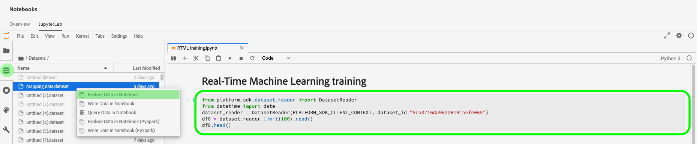

# Gestion des notebooks d’apprentissage automatique en temps réel (Alpha)

>[!IMPORTANT]
>
>L’apprentissage automatique en temps réel n’est pas encore disponible pour tous les utilisateurs. Cette fonctionnalité est en version alpha et est encore en cours de test. Ce document peut faire l’objet de modifications.

Le guide suivant décrit les étapes nécessaires à la création d’une application d’apprentissage automatique en temps réel. Utilisation de l’Adobe fourni **[!UICONTROL ML en temps réel]** Modèle de notebook Python, ce guide couvre la formation d’un modèle, la création d’un DSL, la publication de DSL sur Edge et la notation de la requête. Au fur et à mesure que vous passez à la mise en oeuvre de votre modèle d’apprentissage automatique en temps réel, vous devez modifier le modèle en fonction des besoins de votre jeu de données.

## Création d’un notebook d’apprentissage automatique en temps réel

Dans l’interface utilisateur de Adobe Experience Platform, sélectionnez **[!UICONTROL Notebooks]** de **Science des données**. Ensuite, sélectionnez **[!UICONTROL JupyterLab]** et laisser un certain temps à l’environnement pour le chargement.


Le [!DNL JupyterLab] le lanceur s’affiche. Faites défiler jusqu’à *Apprentissage automatique en temps réel* et sélectionnez la variable **[!UICONTROL ML en temps réel]** notebook. Un modèle s’ouvre, contenant des exemples de cellules de notebook avec un exemple de jeu de données.


## Importation et découverte de noeuds

Commencez par importer tous les packages requis pour votre modèle. Assurez-vous que tout module que vous prévoyez d’utiliser pour la création de noeuds est importé.

>[!NOTE]
>
>La liste des imports peut différer en fonction du modèle que vous souhaitez faire. Cette liste va changer à mesure que de nouveaux noeuds seront ajoutés au fil du temps. Reportez-vous à la section [guide de référence des noeuds](./node-reference.md) pour obtenir une liste complète des noeuds disponibles.

```python
from pprint import pprint
import pandas as pd
import numpy as np
import json
import uuid
from shutil import copyfile
from pathlib import Path
from datetime import date, datetime, timedelta
from platform_sdk.dataset_reader import DatasetReader

from rtml_nodelibs.nodes.standard.preprocessing.json_to_df import JsonToDataframe
from rtml_sdk.edge.utils import EdgeUtils
from rtml_sdk.graph.utils import GraphBuilder
from rtml_nodelibs.nodes.standard.ml.onnx import ONNXNode
from rtml_nodelibs.core.nodefactory import NodeFactory as nf
from rtml_nodelibs.nodes.standard.preprocessing.pandasnode import Pandas
from rtml_nodelibs.nodes.standard.preprocessing.one_hot_encoder import OneHotEncoder
from rtml_nodelibs.nodes.standard.ml.artifact_utils import ModelUpload
from rtml_nodelibs.core.nodefactory import NodeFactory as nf
from rtml_nodelibs.core.datamsg import DataMsg
```

La cellule de code suivante imprime une liste de noeuds disponibles.

```python
# Discover Nodes
pprint(nf.discover_nodes())
```


## Formation à un modèle d’apprentissage automatique en temps réel

En utilisant l’une des options suivantes, vous allez écrire [!DNL Python] code pour lire, prétraiter et analyser les données. Ensuite, vous devez entraîner votre propre modèle ML, le sérialiser au format ONNX, puis le charger dans la boutique de modèles d’apprentissage automatique en temps réel.

- [Formation de votre propre modèle dans les notebooks JupyterLab](#training-your-own-model)
- [Téléchargement de votre propre modèle ONNX préentraîné vers les notebooks JupyterLab](#pre-trained-model-upload)

### Formation de votre propre modèle {#training-your-own-model}

Commencez par charger vos données d’apprentissage.

>[!NOTE]
>
>Dans le **ML en temps réel** le modèle, [jeu de données CSV d’assurance automobile](https://github.com/adobe/experience-platform-dsw-reference/tree/master/datasets/insurance) est capturé à partir de [!DNL Github].


Si vous souhaitez utiliser un jeu de données dans Adobe Experience Platform, annulez la mise en commentaire de la cellule ci-dessous. Ensuite, vous devez remplacer `DATASET_ID` avec la valeur appropriée.


Pour accéder à un jeu de données dans votre [!DNL JupyterLab] notebook, sélectionnez **Données** dans le volet de navigation de gauche de [!DNL JupyterLab]. Le **[!UICONTROL Jeux de données]** et **[!UICONTROL Schémas]** les répertoires s’affichent. Sélectionner **[!UICONTROL Jeux de données]** puis cliquez avec le bouton droit de la souris, puis sélectionnez l’option **[!UICONTROL Exploration des données dans Notebook]** dans le menu déroulant du jeu de données que vous souhaitez utiliser. Une entrée de code exécutable s’affiche au bas du notebook. Cette cellule a votre `dataset_id`.



Une fois l’opération terminée, cliquez avec le bouton droit de la souris et supprimez la cellule que vous avez générée au bas du notebook.

### Propriétés de formation

À l’aide du modèle fourni, modifiez l’une des propriétés d’entraînement dans `config_properties`.

```python
config_properties = {
    "train_records_limit":1000000,
    "n_estimators": "80",
    "max_depth": "5",
    "ten_id": "_experienceplatform"  
}
```

### Préparation de votre modèle

En utilisant la variable **[!UICONTROL ML en temps réel]** modèle, vous devez analyser, prétraiter, former et évaluer votre modèle ML. Pour ce faire, appliquez des transformations de données et créez un pipeline de formation.

**Conversion des données**

Le **[!UICONTROL ML en temps réel]** templates **Transformations de données** doit être modifiée pour fonctionner avec votre propre jeu de données. Cela implique généralement de renommer les colonnes, le cumul des données et la préparation des données/conception des fonctionnalités.

>[!NOTE]
>
>L’exemple suivant a été condensé à des fins de lisibilité à l’aide de `[ ... ]`. Consultez et développez la *ML en temps réel* la section transformations des données de modèles pour la cellule de code complète.

```python
df1.rename(columns = {config_properties['ten_id']+'.identification.ecid': 'ecid',
                     [ ... ]}, inplace=True)
df1 = df1[['ecid', 'km', 'cartype', 'age', 'gender', 'carbrand', 'leasing', 'city', 
       'country', 'nationality', 'primaryuser', 'purchase', 'pricequote', 'timestamp']]
print("df1 shape 1", df1.shape)
#########################################
# Data Rollup
######################################### 
df1['timestamp'] = pd.to_datetime(df1.timestamp)
df1['hour'] = df1['timestamp'].dt.hour.astype(int)
df1['dayofweek'] = df1['timestamp'].dt.dayofweek

df1.loc[(df1['purchase'] == 'yes'), 'purchase'] = 1
df1.purchase.fillna(0, inplace=True)
df1['purchase'] = df1['purchase'].astype(int)

[ ... ]

print("df1 shape 2", df1.shape)

#########################################
# Data Preparation/Feature Engineering
#########################################      

df1['carbrand'] = df1['carbrand'].str.lower()
df1['country'] = df1['country'].str.lower()
df1.loc[(df1['carbrand'] == 'vw'), 'carbrand'] = 'volkswagen'

[ ... ]

df1['age'].fillna(df1['age'].median(), inplace=True)
df1['gender'].fillna('notgiven', inplace=True)

[ ... ]

df1['city'] = df1.groupby('country')['city'].transform(lambda x: x.fillna(x.mode()))
df1.dropna(subset = ['pricequote'], inplace=True)
print("df1 shape 3", df1.shape)
print(df1)

#grouping
grouping_cols = ['carbrand', 'cartype', 'city', 'country']

for col in grouping_cols:
    df_idx = pd.DataFrame(df1[col].value_counts().head(6))

    def grouping(x):
        if x in df_idx.index:
            return x
        else:
            return "Others"
    df1[col] = df1[col].apply(lambda x: grouping(x))

def age(x):
    if x < 20:
        return "u20"
    elif x > 19 and x < 29:
    [ ... ]
    else: 
        return "Others"

df1['age'] = df1['age'].astype(int)
df1['age_bucket'] = df1['age'].apply(lambda x: age(x))

df_final = df1[['hour', 'dayofweek','age_bucket', 'gender', 'city',  
   'country', 'carbrand', 'cartype', 'leasing', 'pricequote', 'purchase']]
print("df final", df_final.shape)

cat_cols = ['age_bucket', 'gender', 'city', 'dayofweek', 'country', 'carbrand', 'cartype', 'leasing']
df_final = pd.get_dummies(df_final, columns = cat_cols)
```

Exécutez la cellule fournie pour afficher un exemple de résultat. Le tableau de sortie renvoyé par la variable `carinsurancedataset.csv` dataset renvoie les modifications que vous avez définies.


**Pipeline de formation**

Vous devez ensuite créer le pipeline d’entraînement. Cela ressemblera à tout autre fichier de pipeline d’entraînement, sauf que vous devez convertir et générer un fichier ONNX.

Modifiez le modèle à l’aide des transformations de données définies dans votre cellule précédente. Le code ci-dessous est utilisé pour générer un fichier ONNX dans votre pipeline de fonctionnalités. Consultez la *ML en temps réel* modèle pour la cellule de code de pipeline complète.

```python
#for generating onnx
def generate_onnx_resources(self):        
    install_dir = os.path.expanduser('~/my-workspace')
    print("Generating Onnx")
        
    from skl2onnx import convert_sklearn
    from skl2onnx.common.data_types import FloatTensorType
        
    # ONNX-ification
    initial_type = [('float_input', FloatTensorType([None, self.feature_len]))]

    print("Converting Model to Onnx")
    onx = convert_sklearn(self.model, initial_types=initial_type)
             
    with open("model.onnx", "wb") as f:
        f.write(onx.SerializeToString())
            
    print("Model onnx created")
```

Une fois que vous avez terminé votre pipeline de formation et modifié vos données par le biais de transformations de données, utilisez la cellule suivante pour exécuter la formation.

```python
model = train(config_properties, df_final)
```

### Génération et chargement d’un modèle ONNX

Une fois que vous avez terminé une opération de formation réussie, vous devez générer un modèle ONNX et charger le modèle formé dans la boutique de modèles d’apprentissage automatique en temps réel. Après avoir exécuté les cellules suivantes, votre modèle ONNX apparaît dans le rail de gauche à côté de tous les autres notebooks.

```python
import os
import skl2onnx, subprocess

model.generate_onnx_resources()
```

>[!NOTE]
>
>Modifiez la variable `model_path` valeur de chaîne (`model.onnx`) pour modifier le nom de votre modèle.

```python
model_path = "model.onnx"
```

>[!NOTE]
>
>La cellule suivante n’est ni modifiable, ni modifiable. Elle est également nécessaire au fonctionnement de votre application d’apprentissage automatique en temps réel.

```python
model = ModelUpload(params={'model_path': model_path})
msg_model = model.process(None, 1)
model_id = msg_model.model['model_id']
 
print("Model ID: ", model_id)
```


### Téléchargement de votre propre modèle ONNX préentraîné {#pre-trained-model-upload}

Utilisation du bouton de téléchargement situé dans [!DNL JupyterLab] notebooks, chargez votre modèle ONNX préentraîné sur le [!DNL Data Science Workspace] environnement de notebooks.


Ensuite, modifiez la variable `model_path` valeur de chaîne dans la variable *ML en temps réel* notebook pour correspondre à votre nom de modèle ONNX. Une fois l’opération terminée, exécutez le *Définition du chemin du modèle* puis exécutez la fonction *Chargement de votre modèle dans le magasin de modèles RTML* cellule. L’emplacement de votre modèle et l’identifiant du modèle sont tous deux renvoyés dans la réponse en cas de réussite.


## Création d’un langage spécifique au domaine (DSL)

Cette section décrit la création d’un DSL. Vous allez créer les noeuds qui incluent tout prétraitement des données avec le noeud ONNX. Ensuite, un graphique DSL est créé à l’aide des noeuds et des bords. Contour des noeuds de connexion à l’aide du format basé sur un tuple (node_1, node_2). Le graphique ne doit pas comporter de cycles.

>[!IMPORTANT]
>
>L’utilisation du noeud ONNX est obligatoire. Sans le noeud ONNX, l’application échoue.

### Création de noeuds

>[!NOTE]
>
> Il est probable que vous ayez plusieurs noeuds en fonction du type de données utilisé. L’exemple suivant illustre un seul noeud dans la variable *ML en temps réel* modèle. Consultez la *ML en temps réel* templates *Création de noeuds* pour la cellule de code complète.

Le noeud Pandas ci-dessous utilise `"import": "map"` pour importer le nom de la méthode sous la forme d’une chaîne dans les paramètres, puis en saisissant les paramètres sous la forme d’une fonction map . L’exemple ci-dessous effectue cette opération en utilisant `{'arg': {'dataLayerNull': 'notgiven', 'no': 'no', 'yes': 'yes', 'notgiven': 'notgiven'}}`. Une fois la carte en place, vous avez la possibilité de définir `inplace` as `True` ou `False`. Définir `inplace` as `True` ou `False` selon que vous souhaitez appliquer ou non une transformation statique. Par défaut `"inplace": False` crée une colonne. La prise en charge d’un nouveau nom de colonne doit être ajoutée dans une version ultérieure. La dernière ligne `cols` peut être un nom de colonne unique ou une liste de colonnes. Indiquez les colonnes sur lesquelles vous souhaitez appliquer la transformation. Dans cet exemple `leasing` est spécifié. Pour plus d’informations sur les noeuds disponibles et sur leur utilisation, consultez la page [guide de référence des noeuds](./node-reference.md).

```python
# Renaming leasing column using Pandas Node
leasing_mapper_node = Pandas(params={'import': 'map',
                                'kwargs': {'arg': {
                                    'dataLayerNull': 'notgiven', 
                                    'no': 'no', 
                                    'yes': 'yes', 
                                    'notgiven': 'notgiven'}},
                                'inplace': True,
                                'cols': 'leasing'})
```

### Création du graphique DSL

Une fois les noeuds créés, l’étape suivante consiste à les associer pour créer un graphique.

Commencez par répertorier tous les noeuds qui font partie du graphique en créant un tableau.

```python
nodes = [json_df_node, 
        to_datetime_node,
        hour_node,
        dayofweek_node,
        age_fillna_node,
        carbrand_fillna_node,
        country_fillna_node,
        cartype_primary_nationality_km_fillna_node,
        carbrand_mapper_node,
        cartype_mapper_node,
        country_mapper_node,
        gender_mapper_node,
        leasing_mapper_node,
        age_to_int_node,
        age_bins_node,
        dummies_node, 
        onnx_node]
```

Ensuite, connectez les noeuds aux bords. Chaque tuple est une [!DNL Edge] connexion.

>[!TIP]
>
> Comme les noeuds dépendent les uns des autres (chaque noeud dépend de la sortie du noeud précédent), vous pouvez créer des liens à l’aide d’une simple compréhension de liste Python. Ajoutez vos propres connexions si un noeud dépend de plusieurs entrées.

```python
edges = [(nodes[i], nodes[i+1]) for i in range(len(nodes)-1)]
```

Une fois vos noeuds connectés, créez le graphique. La cellule ci-dessous est obligatoire et ne peut pas être modifiée ni supprimée.

```python
dsl = GraphBuilder.generate_dsl(nodes=nodes, edges=edges)
pprint(json.loads(dsl))
```

Une fois l’opération terminée, une `edge` est renvoyé, contenant chacun des noeuds et les paramètres qui leur ont été associés.


## Publication sur Edge (Hub)

>[!NOTE]
>
>L’apprentissage automatique en temps réel est temporairement déployé sur et géré par Adobe Experience Platform Hub. Pour plus d’informations, consultez la section de présentation sur [Architecture d’apprentissage automatique en temps réel](./home.md#architecture).

Maintenant que vous avez créé un graphique DSL, vous pouvez déployer votre graphique sur la [!DNL Edge].

>[!IMPORTANT]
>
>Ne pas publier sur [!DNL Edge] souvent, cela peut surcharger la variable [!DNL Edge] noeuds. Il n’est pas recommandé de publier le même modèle plusieurs fois.

```python
edge_utils = EdgeUtils()
(edge_location, service_id) = edge_utils.publish_to_edge(dsl=dsl)
print(f'Edge Location: {edge_location}')
print(f'Service ID: {service_id}')
```

### Mise à jour de votre DSL et republication sur Edge (facultatif)

Si vous n’avez pas besoin de mettre à jour votre DSL, vous pouvez passer à [notation](#scoring).

>[!NOTE]
>
>Les cellules suivantes ne sont nécessaires que si vous souhaitez mettre à jour un DSL existant qui a été publié sur Edge.

Vos modèles vont probablement continuer à se développer. Au lieu de créer un nouveau service, il est possible de mettre à jour un service existant avec votre nouveau modèle. Vous pouvez définir un noeud que vous souhaitez mettre à jour, lui attribuer un nouvel ID, puis charger à nouveau le nouveau DSL sur le [!DNL Edge].

Dans l’exemple ci-dessous, le noeud 0 est mis à jour avec un nouvel ID.

```python
# Update the id of Node 0 with a random uuid.

dsl_dict = json.loads(dsl)
print(f"ID of Node 0 in current DSL: {dsl_dict['edge']['applicationDsl']['nodes'][0]['id']}")

new_node_id = str(uuid.uuid4())
print(f'Updated Node ID: {new_node_id}')

dsl_dict['edge']['applicationDsl']['nodes'][0]['id'] = new_node_id
```


Après la mise à jour de l’ID de noeud, vous pouvez republier un DSL mis à jour sur Edge.

```python
# Republish the updated DSL to Edge
(edge_location_ret, service_id, updated_dsl) = edge_utils.update_deployment(dsl=json.dumps(dsl_dict), service_id=service_id)
print(f'Updated dsl: {updated_dsl}')
```

Vous recevez le DSL mis à jour.


## Notation {#scoring}

Après publication sur [!DNL Edge], la notation est effectuée par une requête de POST d’un client. En règle générale, cela peut être effectué à partir d’une application cliente qui a besoin de scores ML. Vous pouvez également le faire à partir de Postman. Le **[!UICONTROL ML en temps réel]** Le modèle utilise EdgeUtils pour démontrer ce processus.

>[!NOTE]
>
>Un petit temps de traitement est nécessaire avant le début de la notation.

```python
# Wait for the app to come up
import time
time.sleep(20)
```

En utilisant le même schéma que celui utilisé dans la formation, des exemples de données de notation sont générés. Ces données sont utilisées pour créer un cadre de données de notation, puis converties en dictionnaire de notation. Consultez la *ML en temps réel* modèle pour la cellule de code complète.


### Score par rapport au point d’entrée Edge

Utilisez la cellule suivante dans la fonction *ML en temps réel* modèle pour évaluer votre [!DNL Edge] service.


Une fois la notation terminée, la variable [!DNL Edge] URL, charge utile et sortie notée à partir de [!DNL Edge] sont renvoyées.

## Répertorier vos applications déployées à partir du [!DNL Edge]

Pour générer une liste de vos applications actuellement déployées sur le [!DNL Edge], exécutez la cellule de code suivante. Cette cellule ne peut pas être modifiée ni supprimée.

```python
services = edge_utils.list_deployed_services()
print(services)
```

La réponse renvoyée est un tableau de vos services déployés.

```json
[
    {
        "created": "2020-05-25T19:18:52.731Z",
        "deprecated": false,
        "id": "40eq76c0-1c6f-427a-8f8f-54y9cdf041b7",
        "type": "edge",
        "updated": "2020-05-25T19:18:52.731Z"
    }
]
```

## Suppression d’un ID d’application ou de service déployé dans la variable [!DNL Edge] (facultatif)

>[!CAUTION]
>
>Cette cellule est utilisée pour supprimer votre application Edge déployée. N’utilisez pas la cellule suivante, sauf si vous devez supprimer un déploiement [!DNL Edge] application.

```python
if edge_utils.delete_from_edge(service_id=service_id):
    print(f"Deleted service id {service_id} successfully")
else:
    print(f"Failed to delete service id {service_id}")
```

## Étapes suivantes

En suivant le tutoriel ci-dessus, vous avez correctement formé et téléchargé un modèle ONNX vers la boutique de modèles d’apprentissage automatique en temps réel. En outre, vous avez noté et déployé votre modèle d’apprentissage automatique en temps réel. Si vous souhaitez en savoir plus sur les noeuds disponibles pour la création de modèles, rendez-vous sur la page [guide de référence des noeuds](./node-reference.md).
