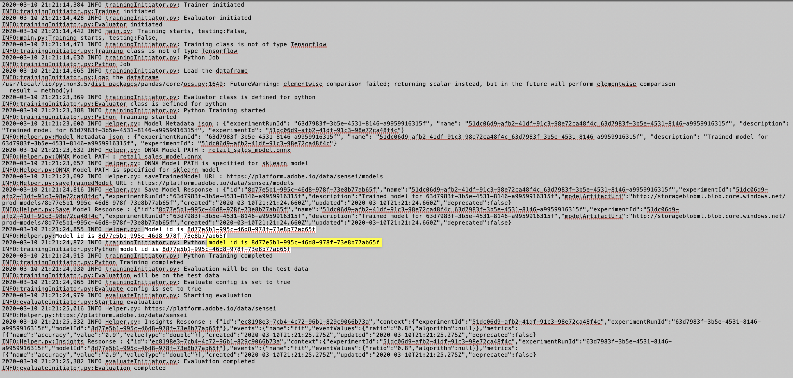

# Formation à un modèle d&#39;apprentissage automatique en temps réel

>[!IMPORTANT]
>L&#39;apprentissage automatique en temps réel n&#39;est pas encore disponible pour tous les utilisateurs. Cette fonction est en alpha et est encore en cours de test. Ce document est sujet à changement.

Ce document fournit un didacticiel pour télécharger un modèle ONNX dans la boutique de modèles d&#39;apprentissage automatique en temps réel.

En utilisant l&#39;une des options suivantes, vous allez écrire du code python pour lire, prétraiter et analyser des données. Ensuite, vous devez former votre propre modèle ML, le sérialiser au format ONNX et enfin le télécharger dans la boutique de modèles d&#39;apprentissage automatique en temps réel. En outre, à la fin du didacticiel, vous recevez un ID de modèle qui identifie le modèle formé à utiliser dans le didacticiel [de](./scoring-ml-model.md)notation.

* [Formation d&#39;un modèle à l&#39;aide d&#39;un bloc-notes Python](#training-model-python-notebook)
* [Formation d’un modèle à l’aide de votre propre modèle ONNX](#train-using-own-onnx-model)
* [Formation d&#39;un modèle à l&#39;aide du modèle de créateur de recettes](#train-using-recipe-builder)
* [Formation d&#39;un modèle à l&#39;aide du workflow de recette de données sur le milieu de travail](#recipe-workflow-train-model)


## Formation d&#39;un modèle à l&#39;aide d&#39;un bloc-notes Python {#training-model-python-notebook}

Dans l’interface utilisateur d’Adobe Experience Platform, sélectionnez **[!UICONTROL Ordinateurs portables]** dans *Data Science*. Ensuite, sélectionnez **[!UICONTROL JupyterLab]** et accordez un peu de temps pour que l&#39;environnement se charge.


Début en sélectionnant le bloc-notes **Python 3** vide dans le lanceur JupyterLab.


### Données d’accès {#access-data}

Ensuite, sélectionnez le jeu de données à utiliser. Pour accéder à un jeu de données dans votre bloc-notes JupyterLab, sélectionnez l&#39;onglet **Data** dans le volet de navigation de gauche de JupyterLab. Les répertoires *Datasets* et *Schémas* s’affichent. Sélectionnez **[!UICONTROL Datasets]** et cliquez avec le bouton droit de la souris, puis sélectionnez l&#39;option **[!UICONTROL Explorer les données dans le bloc-notes]** dans le menu déroulant du jeu de données que vous souhaitez utiliser. Une entrée de code exécutable s&#39;affiche dans votre bloc-notes.


### Préparation de votre modèle

Utilisez le modèle suivant pour analyser, prétraiter, former et évaluer votre modèle ML. Pour un exemple complet, utilisez les captures d’écran fournies sous ce modèle :

```python
from sklearn import svm, metrics
from sklearn.model_selection import train_test_split


data = df[input_columns]
target = df[target_column]
# Create a classifier: a support vector classifier
classifier = svm.SVC(gamma=0.001)

# Split data into train and test subsets
X_train, X_test, y_train, y_test = train_test_split(
    data, target, test_size=0.5, shuffle=False)

# We train the classifier
classifier.fit(X_train, y_train)

# Now do predictions
predicted = classifier.predict(X_test)


print("Classification report for classifier %s:\n%s\n"
      % (classifier, metrics.classification_report(y_test, predicted)))
disp = metrics.plot_confusion_matrix(classifier, X_test, y_test)
disp.figure_.suptitle("Confusion Matrix")
print("Confusion matrix:\n%s" % disp.confusion_matrix)
```

>[!NOTE]
>L’exemple ci-dessous utilise la bibliothèque scikit-learn au lieu de charger les données d’un jeu de données Adobe Experience Platform assimilé.


**Sortie**


### Télécharger votre modèle

Une fois l&#39;étape précédente terminée, vous devez sérialiser votre modèle au format ONNX et le télécharger dans le magasin d&#39;apprentissage automatique en temps réel. Cette opération renvoie la valeur `model_id` utilisée dans le didacticiel [](#next-steps)suivant.

Utilisez le modèle suivant pour effectuer une conversion sur ONNX et téléchargez votre jeu de données :

```python
from rtml_nodelibs.nodes.standard.ml.artifact_utils
import ModelUpload
from rtml_nodelibs.core.nodefactory
import NodeFactory as nf
from skl2onnx.common.data_types
import FloatTensorType
from skl2onnx
import convert_sklearn

########## Save sklearn model in ONNX format at model_path ##########
inputs = [('features', FloatTensorType([None, X_train.shape[1]]))]
model_onnx = convert_sklearn(classifier, 'ScikitLearnModel', inputs)

model_path = "model.onnx"
os.environ["ONNX_MODEL_PATH"] = model_path

with open(model_path, "wb") as f:
  f.write(model_onnx.SerializeToString())

  ########## Upload the model from model_path to RTML model store ##########
  model = ModelUpload(params = {
    'model_path': model_path
  })

msg_model = model.process(None, 1)

model_id = msg_model.model['model_id']

print("Model ID : ", model_id)
```

**Réponse**


Une fois que vous avez reçu votre `model_id`formulaire, copiez-le et passez aux étapes [](#next-steps)suivantes.


## Formation d’un modèle à l’aide de votre propre modèle ONNX {#train-using-own-onnx-model}

Dans l’interface utilisateur d’Adobe Experience Platform, sélectionnez **[!UICONTROL Ordinateurs portables]** dans *Data Science*. Ensuite, sélectionnez **[!UICONTROL JupyterLab]** et accordez un peu de temps pour que l&#39;environnement se charge.


A l&#39;aide du bouton de téléchargement situé dans les blocs-notes JupyterLab, téléchargez votre modèle ONNX sur l&#39;environnement des blocs-notes Data Science Workspace.


Ensuite, créez un nouveau bloc-notes vierge en sélectionnant l&#39;icône de bloc-notes vide sous Python 3 dans le lanceur JupyterLab.


Dans le bloc-notes vierge, copiez et collez les éléments suivants :

>[!NOTE]
> Veillez à fournir le modèle `model_path` ONNX que vous avez téléchargé.

```python
from rtml_nodelibs.nodes.standard.ml.artifact_utils import ModelUpload
from rtml_nodelibs.core.nodefactory import NodeFactory as nf
 
model_path = <path/to/onnx_model>
########## Upload the model from model_path to RTML model store ##########
model = ModelUpload(params={'model_path': model_path})
 
msg_model = model.process(None, 1)
 
model_id = msg_model.model['model_id']
 
print("Model ID : ", model_id)
```

Après avoir exécuté la cellule ci-dessus, une `model_id` est renvoyée. Copiez l’ID de modèle à utiliser dans le didacticiel [](#next-steps)suivant.

## Formation d&#39;un modèle à l&#39;aide d&#39;un modèle de recette préconstruit {#train-using-recipe-builder}

Dans l’interface utilisateur d’Adobe Experience Platform, sélectionnez **[!UICONTROL Ordinateurs portables]** dans *Data Science*. Ensuite, sélectionnez **[!UICONTROL JupyterLab]** et accordez un peu de temps pour que l&#39;environnement se charge.


Suivez ensuite le didacticiel [Création d&#39;une recette à l&#39;aide de cahiers](../jupyterlab/create-a-recipe.md) Jupyter. Une fois terminé, vous devez modifier le fichier pipeline.py pour que les référencements en temps réel fonctionnent.

>[!NOTE]
>Le modèle fourni par Data Science Workspace doit être modifié pour s’adapter à votre jeu de données.

Assurez-vous d&#39;enregistrer votre modèle au format ONNX et de définir la variable d&#39;environnement sur `ONNX_MODEL_PATH`. L&#39;exemple ci-dessous montre comment modifier le fichier de pipeline à l&#39;aide du modèle recipe-builder.

```python
def train(configProperties, data):

  print("Train Start")

########## Extract fields from configProperties ##########
learning_rate = float(configProperties['learning_rate'])
n_estimators = int(configProperties['n_estimators'])
max_depth = int(configProperties['max_depth'])

########## Fit model ##########
X_train = data.drop('weeklySalesAhead', axis = 1).values
y_train = data['weeklySalesAhead'].values

seed = 1234
model = GradientBoostingRegressor(learning_rate = learning_rate,
  n_estimators = n_estimators,
  max_depth = max_depth,
  random_state = seed)

model.fit(X_train, y_train)

########## Save sklearn model in ONNX format at model_path ##########
inputs = [('features', FloatTensorType([None, X_train.shape[1]]))]
model_onnx = convert_sklearn(model, 'ScikitLearnModel', inputs)

model_path = "retail_sales_model.onnx"
os.environ["ONNX_MODEL_PATH"] = model_path

with open(model_path, "wb") as f:
  f.write(model_onnx.SerializeToString())

print("Train Complete")

return model
```

Après avoir modifié le fichier pipeline.py, exécutez **[!UICONTROL Training]** et **[!UICONTROL Scoring]**. Une fois terminé, sélectionnez le bouton **[!UICONTROL Créer une recette]** .


Une boîte de dialogue de dénomination s’affiche. Entrez le nom de votre recette et sélectionnez **[!UICONTROL OK]**. Une nouvelle boîte de dialogue s&#39;affiche pour vous signaler que la création de la recette a commencé. Prévoyez un certain temps pour créer la recette.


Une fois une recette créée, elle peut être consultée en sélectionnant Recettes **[!UICONTROL de]** Vue dans la boîte de dialogue fournie ou en accédant à **[!UICONTROL Modèles]** , puis en sélectionnant **[!UICONTROL Recettes]** dans le volet de navigation supérieur gauche. Une liste de recettes triées par date de création s&#39;affiche. Vérifiez que votre nouvelle recette se trouve en haut de l&#39;écran.


Sélectionnez votre recette. La page d&#39;aperçu de la recette s&#39;affiche. Dans le volet de navigation supérieur droit, sélectionnez **[!UICONTROL Créer un modèle]**.


Ensuite, sélectionnez un jeu de données approprié. Cliquez ensuite sur **[!UICONTROL Suivant]** dans le volet de navigation supérieur droit.


La page de configuration s’ouvre. Attribuez un nom au modèle et passez en revue les configurations de modèle par défaut. Les configurations par défaut sont appliquées lors de la création de recettes. Vérifiez et modifiez les valeurs de configuration en cliquant sur les valeurs par doublon. Pour fournir un nouveau jeu de configurations, cliquez sur **[!UICONTROL Télécharger une nouvelle configuration]** et faites glisser un fichier JSON contenant des configurations de modèle dans la fenêtre du navigateur. Sélectionnez **[!UICONTROL Terminer]** pour créer le modèle.


Une fois votre modèle créé, vous devez attendre la fin de votre session de formation. Une fois qu&#39;une session de formation réussie est terminée, vous pouvez sélectionner la série de formation jusqu&#39;à la vue de ses détails.

Sélectionnez une session de formation. Une fois sélectionnée, une boîte de dialogue de propriétés s’affiche à droite. Dans cette boîte de dialogue, sélectionnez Journaux **[!UICONTROL des Activités]** de Vue.


La boîte de dialogue Journaux *des Activités de* Vue s&#39;affiche. Sélectionnez l’URL des journaux *stderr* pour télécharger les journaux et voir les détails de l’exécution.


Les journaux sont particulièrement utiles pour les échecs d’exécution afin de déterminer ce qui s’est mal passé. Mais, dans ce cas, vous cherchez le `model-id` correspondant au modèle ONNX que vous avez fait. Copiez l&#39;ID de modèle.

>[!NOTE]
>Vous n’avez pas à exécuter une tâche de notation. Le score de pointe de l&#39;apprentissage automatique en temps réel est traité à l&#39;étape [](#next-steps)suivante.



## Formation d&#39;un modèle à l&#39;aide du workflow de recette de données sur le milieu de travail {#recipe-workflow-train-model}

C&#39;est la meilleure méthode à utiliser si vous connaissez Docker, git et empaqueter du code Python. L&#39;utilisation du processus Data Science Workspace vous offre la plus grande flexibilité et la plus grande liberté pour créer vos recettes. Vous pouvez extraire une image de docker de base et créer votre propre environnement de docker, déboguer votre recette avec plus de facilité, cloner des recettes précompilées pour jouer avec n&#39;importe quel service Data Science Workspace, planifier les exécutions de recettes, etc.

### Création d’un schéma

La première étape nécessite un schéma de données pour votre jeu de données. Un schéma peut être créé via l’interface utilisateur d’Adobe Experience Platform ou les API de plateformes.

>[!NOTE]
>Si vous disposez déjà des données que vous souhaitez utiliser imbriquées dans Adobe Experience Platform, ignorez pour [créer une recette](#create-a-python-recipe)Python.

* [Création d’un schéma à l’aide du didacticiel sur l’interface utilisateur de l’éditeur de schémas](../../xdm/tutorials/create-schema-ui.md)
* [Création d’un schéma à l’aide du didacticiel sur l’API de l’éditeur de schémas](../../xdm/tutorials/create-schema-api.md)

### Invitation de vos données

Ensuite, vous devez importer des données à l’aide du schéma que vous venez de créer. Pour ce faire, vous pouvez utiliser l’interface utilisateur de l’API ou de la plate-forme.

>[!NOTE]
>Si vous disposez déjà des données que vous souhaitez utiliser imbriquées dans Adobe Experience Platform, ignorez pour [créer une recette](#create-a-python-recipe)Python.

* [Didacticiel sur l’interface utilisateur d’Adobe Experience Platform pour l’envoi de données](../../ingestion/tutorials/ingest-batch-data.md)
* [Didacticiel sur l’API Adobe Experience Platform pour l’envoi de données](../../ingestion/batch-ingestion/api-overview.md)

### Créer une recette Python {#create-a-python-recipe}

débuts de création de recette avec mise en package des fichiers source pour créer un fichier d&#39;archive. Les fichiers source définissent la logique d&#39;apprentissage automatique et les algorithmes utilisés pour résoudre un problème spécifique à l&#39;étude. Utilisez le tutoriel suivant pour créer une image Python Docker.

* [compresser les fichiers source dans une recette ;](../models-recipes/package-source-files-recipe.md)

Pour terminer l&#39;étape suivante, vous devez disposer d&#39;une image Docker dans un registre de Conteneurs Azure avec l&#39;URL d&#39;image correspondante. Sélectionnez l&#39;un des liens du didacticiel ci-dessous pour terminer la création d&#39;une recette Python :

* [Importer une recette mise en package dans l&#39;interface utilisateur](../models-recipes/import-packaged-recipe-ui.md)
* [Importer une recette assemblée à l&#39;aide de l&#39;API](../models-recipes/import-packaged-recipe-api.md)

### Créer une session de formation

Dans l’espace de travail Data Science d’Adobe Experience Platform, un modèle d’apprentissage automatique est créé en incorporant une recette existante adaptée à l’intention du modèle. Le modèle est ensuite formé et évalué afin d&#39;optimiser son efficacité et son efficacité d&#39;exploitation en affinant ses Hyperparamètres associés.

* [Formation et évaluation d’un modèle dans l’interface utilisateur](../models-recipes/train-evaluate-model-ui.md)
* [Formation et évaluation d’un modèle dans l’API](../models-recipes/train-evaluate-model-api.md)

>[!IMPORTANT]
>Dans le fichier pipeline.py correspondant à votre recette, enregistrez le modèle au format ONNX dans `model_path` et définissez la variable d&#39;environnement sur `ONNX_MODEL_PATH`. Le runtime recherche cette variable d&#39;environnement spécifique.

```python
def train(configProperties, data):
 
    print("Train Start")
 
    ########## Extract fields from configProperties ##########

    learning_rate = float(configProperties['learning_rate'])
    n_estimators = int(configProperties['n_estimators'])
    max_depth = int(configProperties['max_depth'])
 
 
    
    ########## Fit model ##########
    
    X_train = data.drop('weeklySalesAhead', axis=1).values
    y_train = data['weeklySalesAhead'].values
 
    seed = 1234
    model = GradientBoostingRegressor(learning_rate=learning_rate,
                                      n_estimators=n_estimators,
                                      max_depth=max_depth,
                                      random_state=seed)
 
    model.fit(X_train, y_train)
     
    ########## Save sklearn model in ONNX format at model_path ##########
    inputs = [('features', FloatTensorType([None, X_train.shape[1]]))]
    model_onnx = convert_sklearn(model, 'ScikitLearnModel', inputs)
 
    model_path = "retail_sales_model.onnx"
    os.environ["ONNX_MODEL_PATH"] = model_path
 
    with open(model_path, "wb") as f:
        f.write(model_onnx.SerializeToString())
 
    print("Train Complete")
 
    return model
```

Une fois votre modèle créé, vous devez attendre la fin de votre session de formation. Une fois qu&#39;une session de formation réussie est terminée, vous pouvez sélectionner la série de formations pour en vue les détails. Sélectionnez une session de formation. Une fois sélectionnée, une boîte de dialogue de propriétés s’affiche à droite, sélectionnez Journaux **[!UICONTROL d’Activité des]** Vues.


La boîte de dialogue Journaux *des Activités de* Vue s&#39;affiche. Sélectionnez l’URL des journaux *stderr* pour télécharger les journaux et voir les détails de l’exécution.


Les journaux sont particulièrement utiles pour les échecs d’exécution afin de déterminer ce qui s’est mal passé. Mais, dans ce cas, vous cherchez le `model-id` correspondant au modèle ONNX que vous avez fait. Copiez l&#39;ID de modèle.


Vous n&#39;avez pas à exécuter une tâche de notation dans la recette. Le score de pointe de l&#39;apprentissage automatique en temps réel est traité dans le didacticiel [](#next-steps)suivant.

## Étapes suivantes {#next-steps}

En suivant l&#39;un des didacticiels ci-dessus, vous avez réussi à former et à télécharger un modèle ONNX dans la boutique de modèles d&#39;apprentissage automatique en temps réel et vous disposez d&#39;un `model_id` outil qui identifie votre modèle. Passez au didacticiel suivant pour découvrir comment [évaluer votre modèle](./scoring-ml-model.md)d&#39;apprentissage automatique en temps réel.