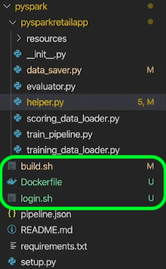
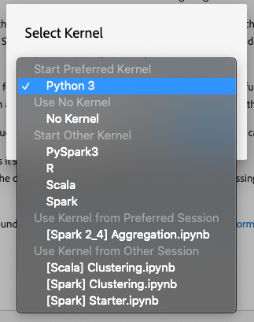

# Guides de migration des recettes et des blocs-notes

>[!NOTE]
>Les ordinateurs portables et les recettes utilisant Python/R restent inchangés. La migration s’applique uniquement aux recettes et aux cahiers PySpark/Spark existants.

Les guides suivants décrivent les étapes et les informations requises pour migrer des recettes et des cahiers existants.

- [Guides de migration de recette](#recipe-migration)
- [Guides de migration vers les ordinateurs portables](#notebook-migration)

## Guides de migration de recette {#recipe-migration}

Les modifications récentes apportées à Data Science Workspace nécessitent la mise à jour des recettes Spark et PySpark existantes. Utilisez le  suivant pour faciliter la transition de vos recettes.

- [Guide de migration Spark](#spark-migration-guide)
   - [Modifier la manière dont vous lisez et écrivez des jeux de données](#read-write-recipe-spark)
   - [Télécharger l&#39;exemple de recette](#download-sample-spark)
   - [Ajouter le fichier du dossier](#add-dockerfile-spark)
   - [Vérifier les dépendances](#change-dependencies-spark)
   - [Préparation des scripts du dossier](#prepare-docker-spark)
   - [créer la recette avec le docker](#create-recipe-spark)
- [Guide de migration PySpark](#pyspark-migration-guide)
   - [Modifier la manière dont vous lisez et écrivez des jeux de données](#pyspark-read-write)
   - [Télécharger l&#39;exemple de recette](#pyspark-download-sample)
   - [Ajouter le fichier du dossier](#pyspark-add-dockerfile)
   - [Préparation des scripts du dossier](#pyspark-prepare-docker)
   - [créer la recette avec le docker](#pyspark-create-recipe)

## Guide de migration Spark {#spark-migration-guide}

L’artefact de recette généré par les étapes de création est désormais une image Docker qui contient votre fichier binaire .jar. De plus, la syntaxe utilisée pour lire et écrire des jeux de données à l’aide du SDK de plateforme a changé et vous oblige à modifier votre code de recette.

La vidéo suivante est conçue pour vous aider à mieux comprendre les modifications requises pour les recettes Spark :

>[!VIDEO](https://video.tv.adobe.com/v/33243)

### Lecture et écriture de jeux de données (Spark) {#read-write-recipe-spark}

Avant de créer l’image Docker, consultez les exemples de lecture et d’écriture de jeux de données dans le SDK de la plate-forme, fournis dans les sections ci-dessous. Si vous convertissez des recettes existantes, votre code SDK de plateforme doit être mis à jour.

#### Lecture d’un jeu de données

Cette section décrit les modifications nécessaires à la lecture d’un jeu de données et utilise l’exemple [helper.scala](https://github.com/adobe/experience-platform-dsw-reference/blob/master/recipes/scala/src/main/scala/com/adobe/platform/ml/helper/Helper.scala) fourni par Adobe.

**Ancienne manière de lire un jeu de données**

```scala
 var df = sparkSession.read.format("com.adobe.platform.dataset")
    .option(DataSetOptions.orgId, orgId)
    .option(DataSetOptions.serviceToken, serviceToken)
    .option(DataSetOptions.userToken, userToken)
    .option(DataSetOptions.serviceApiKey, apiKey)
    .load(dataSetId)
```

**Nouvelle manière de lire un jeu de données**

Avec les mises à jour des recettes Spark, plusieurs valeurs doivent être ajoutées et modifiées. Tout d’abord, `DataSetOptions` n’est plus utilisé. Replace `DataSetOptions` with `QSOption`. De nouveaux `option` paramètres sont également requis. Les deux `QSOption.mode` et `QSOption.datasetId` sont nécessaires. Enfin, `orgId` et `serviceApiKey` doit être remplacé par `imsOrg` et `apiKey`. Consultez l’exemple suivant pour une comparaison sur la lecture des jeux de données :

```scala
import com.adobe.platform.query.QSOption
var df = sparkSession.read.format("com.adobe.platform.query")
  .option(QSOption.userToken", {userToken})
  .option(QSOption.serviceToken, {serviceToken})
  .option(QSOption.imsOrg, {orgId})
  .option(QSOption.apiKey, {apiKey})
  .option(QSOption.mode, "interactive")
  .option(QSOption.datasetId, {dataSetId})
  .load()
```

>[!TIP]
> Le mode interactif expire si les  de durent plus de 10 minutes. Si vous importez plus de quelques gigaoctets de données, il est recommandé de passer en mode &quot;batch&quot;. Le mode de traitement par lots prend plus de temps pour , mais il peut gérer des ensembles de données plus volumineux.

#### Ecriture dans un jeu de données

Cette section décrit les modifications nécessaires à la création d’un jeu de données à l’aide de l’exemple [ScoringDataSaver.scala](https://github.com/adobe/experience-platform-dsw-reference/blob/master/recipes/scala/src/main/scala/com/adobe/platform/ml/ScoringDataSaver.scala) fourni par Adobe.

**Ancienne méthode d&#39;écriture d&#39;un jeu de données**

```scala
df.write.format("com.adobe.platform.dataset")
    .option(DataSetOptions.orgId, orgId)
    .option(DataSetOptions.serviceToken, serviceToken)
    .option(DataSetOptions.userToken, userToken)
    .option(DataSetOptions.serviceApiKey, apiKey)
    .save(scoringResultsDataSetId)
```

**Nouvelle méthode d’écriture d’un jeu de données**

Avec les mises à jour des recettes Spark, plusieurs valeurs doivent être ajoutées et modifiées. Tout d’abord, `DataSetOptions` n’est plus utilisé. Replace `DataSetOptions` with `QSOption`. De nouveaux `option` paramètres sont également requis. `QSOption.datasetId` est nécessaire et remplace la nécessité de charger le `{dataSetId}` dans `.save()`. Enfin, `orgId` et `serviceApiKey` doit être remplacé par `imsOrg` et `apiKey`. Consultez l’exemple suivant pour obtenir une comparaison sur l’écriture de jeux de données :

```scala
import com.adobe.platform.query.QSOption
df.write.format("com.adobe.platform.query")
  .option(QSOption.userToken", {userToken})
  .option(QSOption.serviceToken, {serviceToken})
  .option(QSOption.imsOrg, {orgId})
  .option(QSOption.apiKey, {apiKey})
  .option(QSOption.datasetId, {dataSetId})
  .save()
```

### Fichiers source basés sur le dossier d’assemblage (Spark) {#package-docker-spark}

en accédant au répertoire où se trouve votre recette.

Les sections suivantes utilisent la nouvelle recette des ventes au détail de Scala qui se trouve dans le référentiel [public de Github de](https://github.com/adobe/experience-platform-dsw-reference)Data Science Workspace.

### Télécharger l’exemple de recette (Spark) {#download-sample-spark}

L&#39;exemple de recette contient des fichiers qui doivent être copiés dans votre recette existante. Pour cloner le Github public qui contient tous les exemples de recettes, saisissez ce qui suit dans le terminal :

```BASH
git clone https://github.com/adobe/experience-platform-dsw-reference.git
```

La recette Scala se trouve dans le répertoire suivant `experience-platform-dsw-reference/recipes/scala/retail`.

### Ajouter le fichier Dockerfile (Spark) {#add-dockerfile-spark}

Un nouveau fichier est nécessaire dans votre dossier de recette pour utiliser le flux de travail basé sur le dossier du dossier d’enregistrement. Copiez et collez le fichier Dockerfile du dossier des recettes situé dans `experience-platform-dsw-reference/recipes/scala/Dockerfile`. Vous pouvez également copier et coller le code ci-dessous dans un nouveau fichier appelé `Dockerfile`.

>[!IMPORTANT]
> L&#39;exemple de fichier jar illustré ci-dessous `ml-retail-sample-spark-*-jar-with-dependencies.jar` doit être remplacé par le nom du fichier jar de votre recette.

```scala
FROM adobe/acp-dsw-ml-runtime-spark:0.0.1

COPY target/ml-retail-sample-spark-*-jar-with-dependencies.jar /application.jar
```

### Modifier les dépendances (Spark) {#change-dependencies-spark}

Si vous utilisez une recette existante, des modifications sont requises dans le fichier pom.xml pour les dépendances. Remplacez la version de dépendance model-authoring-sdk par 1.0.0. Ensuite, mettez à jour la version Spark du fichier pom vers la version 2.4.3 et la version Scala vers la version 2.11.12.

```json
<groupId>com.adobe.platform.ml</groupId>
<artifactId>authoring-sdk_2.11</artifactId>
<version>1.0.0</version>
<classifier>jar-with-dependencies</classifier>
```

### Préparation de vos scripts Docker (Spark) {#prepare-docker-spark}

Les recettes Spark n’utilisent plus d’artefacts binaires et nécessitent à la place la création d’une image Docker. Si vous ne l&#39;avez pas fait, [téléchargez et installez Docker](https://www.docker.com/products/docker-desktop).

Dans l&#39;exemple de recette Scala fourni, vous pouvez trouver les scripts `login.sh` et `build.sh` situé à `experience-platform-dsw-reference/recipes/scala/` . Copiez et collez ces fichiers dans votre recette existante.

La structure de vos dossiers doit maintenant ressembler à l’exemple suivant (les fichiers récemment ajoutés sont mis en surbrillance) :


L’étape suivante consiste à suivre les fichiers source du [package dans un didacticiel de recette](./models-recipes/package-source-files-recipe.md) . Ce didacticiel comporte une section qui décrit la création d’une image de docker pour une recette Scala (Spark). Une fois l&#39;opération terminée, vous recevez l&#39;image du Docker dans un registre de Azure, ainsi que l&#39;URL de l&#39;image correspondante.

### Création d’une recette (Spark) {#create-recipe-spark}

Pour créer une recette, vous devez d’abord compléter le didacticiel sur les fichiers [source du](./models-recipes/package-source-files-recipe.md) package et disposer de l’URL de l’image du dossier. Vous pouvez créer une recette à l’aide de l’interface utilisateur ou de l’API.

Pour créer votre recette à l’aide de l’interface utilisateur, suivez le didacticiel [Importer une recette assemblée (IU)](./models-recipes/import-packaged-recipe-ui.md) pour Scala.

Pour créer votre recette à l’aide de l’API, suivez le didacticiel [Importer une recette (API)](./models-recipes/import-packaged-recipe-api.md) assemblée pour Scala.

## Guide de migration PySpark {#pyspark-migration-guide}

L’artefact de recette généré par les étapes de création est désormais une image Docker qui contient votre fichier binaire .oeuf. De plus, la syntaxe utilisée pour lire et écrire des jeux de données à l’aide du SDK de plateforme a changé et vous oblige à modifier votre code de recette.

La vidéo suivante est conçue pour vous aider à mieux comprendre les modifications requises pour les recettes PySpark :

>[!VIDEO](https://video.tv.adobe.com/v/33048?learn=on&quality=12)

### Lecture et écriture de jeux de données (PySpark) {#pyspark-read-write}

Avant de créer l’image Docker, consultez les exemples de lecture et d’écriture de jeux de données dans le SDK de la plate-forme, fournis dans les sections ci-dessous. Si vous convertissez des recettes existantes, votre code SDK de plateforme doit être mis à jour.

#### Lecture d’un jeu de données

Cette section décrit les modifications nécessaires à la lecture d’un jeu de données à l’aide de l’exemple [helper.py](https://github.com/adobe/experience-platform-dsw-reference/blob/master/recipes/pyspark/pysparkretailapp/helper.py) fourni par Adobe.

**Ancienne manière de lire un jeu de données**

```python
dataset_options = get_dataset_options(spark.sparkContext)
pd = spark.read.format("com.adobe.platform.dataset") 
  .option(dataset_options.serviceToken(), service_token) 
  .option(dataset_options.userToken(), user_token) 
  .option(dataset_options.orgId(), org_id) 
  .option(dataset_options.serviceApiKey(), api_key)
  .load(dataset_id)
```

**Nouvelle manière de lire un jeu de données**

Avec les mises à jour des recettes Spark, plusieurs valeurs doivent être ajoutées et modifiées. Tout d’abord, `DataSetOptions` n’est plus utilisé. Replace `DataSetOptions` with `qs_option`. De nouveaux `option` paramètres sont également requis. Les deux `qs_option.mode` et `qs_option.datasetId` sont nécessaires. Enfin, `orgId` et `serviceApiKey` doit être remplacé par `imsOrg` et `apiKey`. Consultez l’exemple suivant pour une comparaison sur la lecture des jeux de données :

```python
qs_option = spark_context._jvm.com.adobe.platform.query.QSOption
pd = sparkSession.read.format("com.adobe.platform.query") 
  .option(qs_option.userToken, {userToken}) 
  .option(qs_option.serviceToken, {serviceToken}) 
  .option(qs_option.imsOrg, {orgId}) 
  .option(qs_option.apiKey, {apiKey}) 
  .option(qs_option.mode, "interactive") 
  .option(qs_option.datasetId, {dataSetId}) 
  .load()
```

>[!TIP]
> Le mode interactif expire si les  de durent plus de 10 minutes. Si vous importez plus de quelques gigaoctets de données, il est recommandé de passer en mode &quot;batch&quot;. Le mode de traitement par lots prend plus de temps pour , mais il peut gérer des ensembles de données plus volumineux.

#### Ecriture dans un jeu de données

Cette section décrit les modifications nécessaires à la création d’un jeu de données à l’aide de l’exemple [data_saver.py](https://github.com/adobe/experience-platform-dsw-reference/blob/master/recipes/pyspark/pysparkretailapp/data_saver.py) fourni par Adobe.

**Ancienne méthode d&#39;écriture d&#39;un jeu de données**

```python
df.write.format("com.adobe.platform.dataset")
  .option(DataSetOptions.orgId, orgId)
  .option(DataSetOptions.serviceToken, serviceToken)
  .option(DataSetOptions.userToken, userToken)
  .option(DataSetOptions.serviceApiKey, apiKey)
  .save(scoringResultsDataSetId)
```

**Nouvelle méthode d’écriture d’un jeu de données**

Avec les mises à jour des recettes PySpark, un certain nombre de valeurs doivent être ajoutées et modifiées. Tout d’abord, `DataSetOptions` n’est plus utilisé. Replace `DataSetOptions` with `qs_option`. De nouveaux `option` paramètres sont également requis.  `qs_option.datasetId` est nécessaire et remplace la nécessité de charger le `{dataSetId}` dans `.save()` . Enfin, `orgId` et `serviceApiKey` doit être remplacé par `imsOrg` et `apiKey`. Consultez l’exemple suivant pour une comparaison sur la lecture des jeux de données :

```python
qs_option = spark_context._jvm.com.adobe.platform.query.QSOption
scored_df.write.format("com.adobe.platform.query") 
  .option(qs_option.userToken, {userToken}) 
  .option(qs_option.serviceToken, {serviceToken}) 
  .option(qs_option.imsOrg, {orgId}) 
  .option(qs_option.apiKey, {apiKey}) 
  .option(qs_option.datasetId, {dataSetId}) 
  .save()
```

### Fichiers source basés sur un dossier d’assemblage (PySpark) {#pyspark-package-docker}

en accédant au répertoire où se trouve votre recette.

Pour cet exemple, la nouvelle recette Ventes au détail de PySpark est utilisée et peut être trouvée dans le référentiel [Github public de](https://github.com/adobe/experience-platform-dsw-reference)Data Science Workspace.

### Télécharger l&#39;exemple de recette (PySpark) {#pyspark-download-sample}

L&#39;exemple de recette contient des fichiers qui doivent être copiés dans votre recette existante. Pour cloner le Github public qui contient tous les exemples de recettes, entrez ce qui suit dans le terminal.

```BASH
git clone https://github.com/adobe/experience-platform-dsw-reference.git
```

La recette PySpark se trouve dans le répertoire suivant `experience-platform-dsw-reference/recipes/pyspark`.

### Ajouter le fichier Dockerfile (PySpark) {#pyspark-add-dockerfile}

Un nouveau fichier est nécessaire dans votre dossier de recette pour utiliser le flux de travail basé sur le dossier du dossier d’enregistrement. Copiez et collez le fichier Dockerfile du dossier des recettes situé dans `experience-platform-dsw-reference/recipes/pyspark/Dockerfile`. Vous pouvez également copier et coller le code ci-dessous et créer un nouveau fichier appelé `Dockerfile`.

>[!IMPORTANT]
> L&#39;exemple de fichier d&#39;oeuf illustré ci-dessous `pysparkretailapp-*.egg` doit être remplacé par le nom du fichier d&#39;oeuf de votre recette.

```scala
FROM adobe/acp-dsw-ml-runtime-pyspark:0.0.1
RUN mkdir /recipe

COPY . /recipe

RUN cd /recipe && \
    ${PYTHON} setup.py clean install && \
    rm -rf /recipe

RUN cp /databricks/conda/envs/${DEFAULT_DATABRICKS_ROOT_CONDA_ENV}/lib/python3.6/site-packages/pysparkretailapp-*.egg /application.egg
```

### Préparation de vos scripts Docker (PySpark) {#pyspark-prepare-docker}

Les recettes PySpark n’utilisent plus d’artefacts binaires et nécessitent à la place la création d’une image Docker. Si vous ne l&#39;avez pas fait, téléchargez et installez [Docker](https://www.docker.com/products/docker-desktop).

Dans l&#39;exemple de recette fourni de PySpark, vous pouvez trouver les scripts `login.sh` et `build.sh` situé à `experience-platform-dsw-reference/recipes/pyspark` . Copiez et collez ces fichiers dans votre recette existante.

La structure de vos dossiers doit maintenant ressembler à l’exemple suivant (les fichiers récemment ajoutés sont mis en surbrillance) :



Votre recette est maintenant prête à être créée à l&#39;aide d&#39;une image Docker. L’étape suivante consiste à suivre les fichiers source du [package dans un didacticiel de recette](./models-recipes/package-source-files-recipe.md) . Ce didacticiel comporte une section qui décrit la création d’une image de docker pour une recette PySpark (Spark 2.4). Une fois l&#39;opération terminée, vous recevez l&#39;image du Docker dans un registre de Azure, ainsi que l&#39;URL de l&#39;image correspondante.

### Création d’une recette (PySpark) {#pyspark-create-recipe}

Pour créer une recette, vous devez d’abord compléter le didacticiel sur les fichiers [source du](./models-recipes/package-source-files-recipe.md) package et disposer de l’URL de l’image du dossier. Vous pouvez créer une recette à l’aide de l’interface utilisateur ou de l’API.

Pour créer votre recette à l’aide de l’interface utilisateur, suivez le didacticiel [Importer une recette assemblée (UI)](./models-recipes/import-packaged-recipe-ui.md) pour PySpark.

Pour créer votre recette à l&#39;aide de l&#39;API, suivez le didacticiel [Importer une recette (API)](./models-recipes/import-packaged-recipe-api.md) assemblée pour PySpark.

## Guides de migration vers les ordinateurs portables {#notebook-migration}

Les modifications récentes apportées aux blocs-notes JupyterLab nécessitent la mise à jour de vos blocs-notes PySpark et Spark 2.3 vers la version 2.4. Grâce à ce changement, JupyterLab Launcher a été mis à jour avec de nouveaux blocs-notes de démarrage. Pour obtenir un guide détaillé sur la conversion de vos blocs-notes, sélectionnez l’un des guides suivants :

- [Guide de migration de PySpark 2.3 à 2.4](#pyspark-notebook-migration)
- [Guide de migration Spark 2.3 vers Spark 2.4 (Scala)](#spark-notebook-migration)

La vidéo suivante est conçue pour vous aider à mieux comprendre les modifications requises pour les portables JupyterLab :

>[!VIDEO](https://video.tv.adobe.com/v/33444?quality=12&learn=on)

## Guide de migration des ordinateurs portables PySpark 2.3 à 2.4 {#pyspark-notebook-migration}

Avec l&#39;introduction de PySpark 2.4 sur les portables JupyterLab, les nouveaux portables Python avec PySpark 2.4 utilisent maintenant le noyau Python 3 au lieu du noyau PySpark 3. Cela signifie que le code existant s’exécutant sur PySpark 2.3 n’est pas pris en charge dans PySpark 2.4.

>[!IMPORTANT] PySpark 2.3 est obsolète et doit être supprimé dans une version ultérieure. Tous les exemples existants sont définis pour être remplacés par des exemples PySpark 2.4.

Pour convertir vos blocs-notes PySpark 3 (Spark 2.3) existants en Spark 2.4, suivez les exemples décrits ci-dessous :

### Noyau

Les ordinateurs portables PySpark 3 (Spark 2.4) utilisent le noyau Python 3 au lieu du noyau PySpark déconseillé utilisé dans les ordinateurs portables PySpark 3 (Spark 2.3 - désapprouvée).

Pour confirmer ou modifier le noyau dans l&#39;interface utilisateur de JupyterLab, sélectionnez le bouton du noyau situé dans la barre de navigation supérieure droite de votre ordinateur portable. Si vous utilisez l&#39;un des portables de lanceur prédéfinis, le noyau est présélectionné. L’exemple ci-dessous utilise le démarrage du bloc-notes *d’agrégation* PySpark 3 (Spark 2.4).


La sélection du menu déroulant ouvre un de noyaux disponibles.




Pour les blocs-notes PySpark 3 (Spark 2.4), sélectionnez le noyau Python 3 et confirmez en cliquant sur le bouton **Sélectionner** .


## Initialisation de sparkSession

Tous les ordinateurs portables Spark 2.4 nécessitent que vous initialisiez la session avec le nouveau code standard.

<table>
  <th>Ordinateur portable</th>
  <th>PySpark 3 (Spark 2.3 - désapprouvée)</th>
  <th>PySpark 3 (Spark 2.4)</th>
  <tr>
  <th>Noyau</th>
  <td align="center">PySpark 3</td>
  <td align="center">Python 3</td>
  </tr>
  <tr>
  <th>Code</th>
  <td>
  <pre class="JSON language-JSON hljs">
  étincelle
</pre>
  </td>
  <td>
  <pre class="JSON language-JSON hljs">
à partir de pyspark.sql, importez SparkSessionspark = SparkSession.builder.getOrCreate()
</pre>
  </td>
  </tr>
</table>

Les images suivantes mettent en évidence les différences de configuration pour PySpark 2.3 et PySpark 2.4. Cet exemple utilise les blocs-notes de démarrage *Aggregation* fournis dans JupyterLab Launcher.

**Exemple de configuration pour la version 2.3 (obsolète)**


**Exemple de configuration pour la version 2.4**


## Utilisation de la magie %dataset {#magic}

Avec l&#39;introduction de Spark 2.4, la magie `%dataset` personnalisée est fournie pour les nouveaux portables PySpark 3 (Spark 2.4) (noyau Python 3).

**Utilisation**

`%dataset {action} --datasetId {id} --dataFrame {df}`

**Description**

Commande magique Data Science Workspace personnalisée pour lire ou écrire un jeu de données à partir d&#39;un bloc-notes Python (noyau Python 3).

- **{action}**: Type d’action à exécuter sur le jeu de données. Deux actions sont disponibles &quot;read&quot; ou &quot;write&quot;.
- **—datasetId {id}**: Utilisé pour fournir l’ID du jeu de données à lire ou à écrire. C&#39;est un argument obligatoire.
- **—dataFrame {df}**: Le cadre de données des pandas. C&#39;est un argument obligatoire.
   - Lorsque l&#39;action est &quot;read&quot;, {df} est la variable dans laquelle les résultats de l&#39;opération de lecture du jeu de données sont disponibles.
   - Lorsque l&#39;action est &quot;write&quot;, ce dataframe {df} est écrit dans le jeu de données.
- **—mode (facultatif)**: Les paramètres autorisés sont &quot;batch&quot; et &quot;interactive&quot;. Par défaut, le mode est défini sur &quot;interactif&quot;. Il est recommandé d’utiliser le mode &quot;batch&quot; lors de la lecture de grandes quantités de données.

**Exemples**

- **Exemple** de lecture : `%dataset read --datasetId 5e68141134492718af974841 --dataFrame pd0`
- **Exemple** d’écriture : `%dataset write --datasetId 5e68141134492718af974842 --dataFrame pd0`

## Charger dans un cadre de données dans LocalContext

Avec l&#39;introduction de Spark 2.4, la magie [`%dataset`](#magic) personnalisée est fournie. L’exemple suivant illustre les principales différences de chargement des blocs de données dans les blocs de données PySpark (Spark 2.3) et PySpark (Spark 2.4) :

**Utilisation de PySpark 3 (Spark 2.3 - désapprouvée) - noyau PySpark 3**

```python
dataset_options = sc._jvm.com.adobe.platform.dataset.DataSetOptions
pd0 = spark.read.format("com.adobe.platform.dataset")
  .option(dataset_options.orgId(), "310C6D375BA5248F0A494212@AdobeOrg")
  .load("5e68141134492718af974844")
```

**Utilisation de PySpark 3 (Spark 2.4) - noyau Python 3**

```python
%dataset read --datasetId 5e68141134492718af974844 --dataFrame pd0
```

| Élément | Description |
| ------- | ----------- |
| pd0 | Nom de l’objet dataframe pandas à utiliser ou à créer. |
| [%dataset](#magic) | Magie personnalisée pour l&#39;accès aux données dans le noyau Python3. |

Les images suivantes mettent en évidence les principales différences de chargement des données pour PySpark 2.3 et PySpark 2.4. Cet exemple utilise les blocs-notes de démarrage *Aggregation* fournis dans JupyterLab Launcher.

**Chargement de données dans PySpark 2.3 (jeu de données Luma) - obsolète**


**Chargement des données dans PySpark 2.4 (jeu de données Luma)**

Avec PySpark 3 (Spark 2.4) `sc = spark.sparkContext` est défini lors du chargement.


**Chargement des données de la plateforme Experience Cloud dans PySpark 2.3 - obsolète**


**Chargement des données de la plateforme Experience Cloud dans PySpark 2.4**

Avec PySpark 3 (Spark 2.4), il n’est plus nécessaire de `org_id` définir et `dataset_id` plus nécessaire de le faire. De plus, `df = spark.read.format` a été remplacé par une magie personnalisée [`%dataset`](#magic) pour faciliter la lecture et l&#39;écriture des jeux de données.


| Élément | description |
| ------- | ----------- |
| [%dataset](#magic) | Magie personnalisée pour l&#39;accès aux données dans le noyau Python3. |

>[!TIP] —mode peut être défini sur `interactive` ou `batch`. La valeur par défaut de —mode est `interactive`. Il est recommandé d’utiliser le `batch` mode lors de la lecture de grandes quantités de données.

## Création d’un cadre de données local

Avec PySpark 3 (Spark 2.4), `%%` sparkmagic n’est plus pris en charge. Les opérations suivantes ne peuvent plus être utilisées :

- `%%help`
- `%%info`
- `%%cleanup`
- `%%delete`
- `%%configure`
- `%%local`

Le tableau suivant décrit les modifications requises pour convertir les  `%%sql` sparkmiracle :

<table>
  <th>Ordinateur portable</th>
  <th>PySpark 3 (Spark 2.3 - désapprouvée)</th>
  <th>PySpark 3 (Spark 2.4)</th>
  <tr>
  <th>Noyau</th>
  <td align="center">PySpark 3</td>
  <td align="center">Python 3</td>
  </tr>
  <tr>
  <th>Code</th>
      <td>
         <pre class="JSON language-JSON hljs">%%sql -o dfselect * from sparkdf
</pre>
         <pre class="JSON language-JSON hljs"> %%sql -o df -n limitselect * from sparkdf
</pre>
         <pre class="JSON language-JSON hljs">%%sql -o df -qselect * de sparkdf
</pre>
         <pre class="JSON language-JSON hljs"> %%sql -o df -r fractionselect * from sparkdf
</pre>
      </td>
      <td>
         <pre class="JSON language-JSON hljs">
df = spark.sql('''' SELECT * FROM sparkdf'''')
</pre>
         <pre class="JSON language-JSON hljs">
df = spark.sql('''' SELECT * FROM sparkdf LIMIT limit'')
</pre>
         <pre class="JSON language-JSON hljs">
df = spark.sql('''' SELECT * FROM sparkdf LIMIT limit'')
</pre>
         <pre class="JSON language-JSON hljs">
sample_df = df.sample(fraction)
</pre>
      </td>
   </tr>
</table>

>[!TIP] Vous pouvez également spécifier un échantillon de base facultatif, tel qu’un booléen avecRemplacement, une fraction de  ou une graine longue.

Les illustrations suivantes mettent en évidence les principales différences de création d’une base de données locale dans PySpark 2.3 et PySpark 2.4. Cet exemple utilise les blocs-notes de démarrage *Aggregation* fournis dans JupyterLab Launcher.

**Création d’une base de données locale PySpark 2.3 - obsolète**


**Création d’un cadre de données local PySpark 2.4**

Avec PySpark 3 (Spark 2.4) `%%sql` SparkMagic n’est plus pris en charge et a été remplacé par ce qui suit :


## Ecriture dans un jeu de données

Avec l&#39;introduction de Spark 2.4, la magie [`%dataset`](#magic) personnalisée est fournie, ce qui rend l&#39;écriture des jeux de données plus propre. Pour écrire dans un jeu de données, utilisez l’exemple Spark 2.4 suivant :

**Utilisation de PySpark 3 (Spark 2.3 - désapprouvée) - noyau PySpark 3**

```python
userToken = spark.sparkContext.getConf().get("spark.yarn.appMasterEnv.USER_TOKEN")
serviceToken = spark.sparkContext.getConf().get("spark.yarn.appMasterEnv.SERVICE_TOKEN")
serviceApiKey = spark.sparkContext.getConf().get("spark.yarn.appMasterEnv.SERVICE_API_KEY")

dataset_options = sc._jvm.com.adobe.platform.dataset.DataSetOptions

pd0.write.format("com.adobe.platform.dataset")
  .option(dataset_options.orgId(), "310C6D375BA5248F0A494212@AdobeOrg")
  .option(dataset_options.userToken(), userToken)
  .option(dataset_options.serviceToken(), serviceToken)
  .option(dataset_options.serviceApiKey(), serviceApiKey)
  .save("5e68141134492718af974844")
```

**Utilisation de PySpark 3 (Spark 2.4) - noyau Python 3**

```python
%dataset write --datasetId 5e68141134492718af974844 --dataFrame pd0
pd0.describe()
pd0.show(10, False)
```

| Élément | description |
| ------- | ----------- |
| pd0 | Nom de l’objet dataframe pandas à utiliser ou à créer. |
| [%dataset](#magic) | Magie personnalisée pour l&#39;accès aux données dans le noyau Python3. |

>[!TIP] —mode peut être défini sur `interactive` ou `batch`. La valeur par défaut de —mode est `interactive`. Il est recommandé d’utiliser le `batch` mode lors de la lecture de grandes quantités de données.

Les illustrations suivantes mettent en évidence les principales différences d’écriture des données sur la plateforme dans PySpark 2.3 et PySpark 2.4. Cet exemple utilise les blocs-notes de démarrage *Aggregation* fournis dans JupyterLab Launcher.

**Rédaction de données vers Platform PySpark 2.3 - obsolète**


**Rédaction de données vers Platform PySpark 2.4**

Avec PySpark 3 (Spark 2.4), la magie `%dataset` personnalisée élimine la nécessité de définir des valeurs telles que `userToken`, `serviceToken`, `serviceApiKey`et `.option`. En outre, il `orgId` n’est plus nécessaire de définir ce paramètre.


## Guide de migration des ordinateurs portables Spark 2.3 vers Spark 2.4 (Scala) {#spark-notebook-migration}

Avec l&#39;introduction de Spark 2.4 sur les portables JupyterLab, les portables Spark (Spark 2.3) existants utilisent maintenant le noyau Scala au lieu du noyau Spark. Cela signifie que le code existant s’exécutant sur Spark (Spark 2.3) n’est pas pris en charge dans Scala (Spark 2.4). De plus, tous les nouveaux portables Spark doivent utiliser Scala (Spark 2.4) dans le lanceur JupyterLab.

>[!IMPORTANT] Spark (Spark 2.3) est obsolète et doit être supprimé dans une version ultérieure. Tous les exemples existants sont définis pour être remplacés par des exemples Scala (Spark 2.4).

Pour convertir vos blocs-notes Spark (Spark 2.3) existants en Scala (Spark 2.4), suivez les exemples décrits ci-dessous :

## Noyau

Les ordinateurs portables Scala (Spark 2.4) utilisent le noyau Scala au lieu du noyau Spark obsolète utilisé dans les ordinateurs portables Spark (Spark 2.3 - désapprouvée).

Pour confirmer ou modifier le noyau dans l&#39;interface utilisateur de JupyterLab, sélectionnez le bouton du noyau situé dans la barre de navigation supérieure droite de votre ordinateur portable. La fenêtre *Sélectionner le noyau* s’affiche. Si vous utilisez l&#39;un des portables de lanceur prédéfinis, le noyau est présélectionné. L&#39;exemple ci-dessous utilise le bloc-notes Scala *Clustering* dans JupyterLab Launcher.


La sélection du menu déroulant ouvre un de noyaux disponibles.


Pour les blocs-notes Scala (Spark 2.4), sélectionnez le noyau Scala et confirmez en cliquant sur le bouton **Sélectionner** .


## Initialisation de SparkSession {#initialize-sparksession-scala}

Tous les ordinateurs portables Scala (Spark 2.4) nécessitent que vous initialisiez la session avec le code standard suivant :

<table>
  <th>Ordinateur portable</th>
  <th>Spark (Spark 2.3 - désapprouvée)</th>
  <th>Scala (Spark 2.4)</th>
  <tr>
  <th>Noyau</th>
  <td align="center">Spark</td>
  <td align="center">Scala</td>
  </tr>
  <tr>
  <th>code</th>
  <td align="center">
  aucun code requis
  </td>
  <td>
  <pre class="JSON language-JSON hljs">
import org.apache.spark.sql.{ SparkSession}val spark = SparkSession.builder() .master("local") .getOrCreate()
</pre>
  </td>
  </tr>
</table>

L&#39;image Scala (Spark 2.4) ci-dessous illustre la différence fondamentale dans l&#39;initialisation de sparkSession avec le noyau Spark 2.3 Spark et le noyau Spark 2.4 Scala. Cet exemple utilise les blocs-notes de démarrage de la *mise en grappe* fournis dans JupyterLab Launcher.

**Spark (Spark 2.3 - désapprouvée)**

Spark (Spark 2.3 - désapprouvée) utilise le noyau Spark et vous n’étiez donc pas tenu de définir Spark.

**Scala (Spark 2.4)**

L&#39;utilisation de Spark 2.4 avec le noyau Scala requiert que vous définissiez `val spark` et importiez `SparkSesson` pour lire ou écrire :


## Données 

Avec Scala (Spark 2.4), `%%` sparkmiracle n’est plus pris en charge. Les opérations suivantes ne peuvent plus être utilisées :

- `%%help`
- `%%info`
- `%%cleanup`
- `%%delete`
- `%%configure`
- `%%local`

Le tableau suivant décrit les modifications requises pour convertir les  `%%sql` sparkmiracle :

<table>
  <th>Ordinateur portable</th>
  <th>Spark (Spark 2.3 - désapprouvée)</th>
  <th>Scala (Spark 2.4)</th>
  <tr>
  <th>Noyau</th>
  <td align="center">Spark</td>
  <td align="center">Scala</td>
  </tr>
  <tr>
  <th>code</th>
    <td>
       <pre class="JSON language-JSON hljs">
%%sql -o dfselect * from sparkdf
</pre>
         <pre class="JSON language-JSON hljs">
%%sql -o df -n limitselect * from sparkdf
</pre>
         <pre class="JSON language-JSON hljs">
%%sql -o df -qselect * de sparkdf
</pre>
         <pre class="JSON language-JSON hljs">
%%sql -o df -r fractionselect * from sparkdf
</pre>
      </td>
      <td>
         <pre class="JSON language-JSON hljs">
val df = spark.sql('''' SELECT * FROM sparkdf'''')
</pre>
         <pre class="JSON language-JSON hljs">
val df = spark.sql('''' SELECT * FROM sparkdf LIMIT limit'')
</pre>
         <pre class="JSON language-JSON hljs">
val df = spark.sql('''' SELECT * FROM sparkdf LIMIT limit'')
</pre>
         <pre class="JSON language-JSON hljs">
val sample_df = df.sample(fraction) </pre>
      </td>
   </tr>
</table>

L&#39;image Scala (Spark 2.4) ci-dessous illustre les principales différences de création de avec le noyau Spark 2.3 Spark et le noyau Spark 2.4 Scala. Cet exemple utilise les blocs-notes de démarrage de la *mise en grappe* fournis dans JupyterLab Launcher.

**Spark (Spark 2.3 - désapprouvée)**

Le bloc-notes Spark (Spark 2.3 - désapprouvée) utilise le noyau Spark. Le noyau Spark supporte et utilise `%%sql` sparkmiracle.


**Scala (Spark 2.4)**

Le noyau Scala ne supporte plus `%%sql` sparkmiracle. Le code sparkMagic existant doit être converti.


## Lecture d’un jeu de données {#notebook-read-dataset-spark}

Dans Spark 2.3, vous deviez définir des variables pour `option` les valeurs utilisées pour lire les données ou utiliser les valeurs brutes dans la cellule de code. Dans Scala, vous pouvez utiliser `sys.env("PYDASDK_IMS_USER_TOKEN")` pour déclarer et renvoyer une valeur, ce qui évite de définir des variables telles que `var userToken`. Dans l’exemple Scala (Spark 2.4) ci-dessous, `sys.env` est utilisé pour définir et renvoyer toutes les valeurs requises pour lire un jeu de données.

**Utilisation de Spark (Spark 2.3 - désapprouvée) - Noyau Spark**

```scala
import com.adobe.platform.dataset.DataSetOptions
var df1 = spark.read.format("com.adobe.platform.dataset")
  .option(DataSetOptions.orgId, "310C6D375BA5248F0A494212@AdobeOrg")
  .option(DataSetOptions.batchId, "dbe154d3-197a-4e6c-80f8-9b7025eea2b9")
  .load("5e68141134492718af974844")
```

**Utilisation de Scala (Spark 2.4) - Noyau Scala**

```scala
import org.apache.spark.sql.{Dataset, SparkSession}
val spark = SparkSession.builder().master("local").getOrCreate()
val df1 = spark.read.format("com.adobe.platform.query")
  .option("user-token", sys.env("PYDASDK_IMS_USER_TOKEN"))
  .option("ims-org", sys.env("IMS_ORG_ID"))
  .option("api-key", sys.env("PYDASDK_IMS_CLIENT_ID"))
  .option("service-token", sys.env("PYDASDK_IMS_SERVICE_TOKEN"))
  .option("mode", "interactive")
  .option("dataset-id", "5e68141134492718af974844")
  .load()
```

| element   | description |
| ------- | ----------- |
| df1 | Variable qui représente la base de données Pandas utilisée pour lire et écrire des données. |
| user-token | Jeton utilisateur automatiquement récupéré à l’aide de `sys.env("PYDASDK_IMS_USER_TOKEN")`. |
| service-token | Votre jeton de service qui est automatiquement récupéré à l’aide de `sys.env("PYDASDK_IMS_SERVICE_TOKEN")`. |
| ims-org | Votre ID ims-org qui est automatiquement récupéré à l’aide de `sys.env("IMS_ORG_ID")`. |
| api-key | Votre clé api automatiquement récupérée à l’aide de `sys.env("PYDASDK_IMS_CLIENT_ID")`. |

Les images ci-dessous mettent en évidence les principales différences de chargement des données avec Spark 2.3 et Spark 2.4. Cet exemple utilise les blocs-notes de démarrage de la *mise en grappe* fournis dans JupyterLab Launcher.

**Spark (Spark 2.3 - désapprouvée)**

Le bloc-notes Spark (Spark 2.3 - désapprouvée) utilise le noyau Spark. Les deux cellules suivantes illustrent un exemple de chargement du jeu de données avec un ID de jeu de données spécifié dans la plage de dates de (2019-3-21, 2019-3-29).


**Scala (Spark 2.4)**

Le bloc-notes Scala (Spark 2.4) utilise le noyau Scala qui nécessite plus de valeurs lors de la configuration, comme indiqué dans la première cellule de code. En outre, `var mdata` nécessite le remplissage `option` de davantage de valeurs. Dans ce bloc-notes, le code mentionné précédemment pour [initialiser SparkSession](#initialize-sparksession-scala) est inclus dans la cellule de `var mdata` code.


>[!TIP] Dans Scala, vous pouvez utiliser `sys.env()` pour déclarer et renvoyer une valeur de l’intérieur `option`. Cela évite de définir des variables si vous savez qu’elles ne seront utilisées qu’une seule fois. L’exemple suivant illustre `val userToken` l’exemple ci-dessus et le déclare en ligne dans `option`:
> 
```scala
> .option("user-token", sys.env("PYDASDK_IMS_USER_TOKEN"))
> ```

## Ecriture dans un jeu de données

Tout comme pour [lire un jeu](#notebook-read-dataset-spark)de données, l’écriture dans un jeu de données nécessite des `option` valeurs supplémentaires décrites dans l’exemple ci-dessous. Dans Scala, vous pouvez utiliser `sys.env("PYDASDK_IMS_USER_TOKEN")` pour déclarer et renvoyer une valeur, ce qui évite de définir des variables telles que `var userToken`. Dans l’exemple Scala ci-dessous, `sys.env` est utilisé pour définir et renvoyer toutes les valeurs requises pour l’écriture dans un jeu de données.

**Utilisation de Spark (Spark 2.3 - désapprouvée) - Noyau Spark**

```scala
import com.adobe.platform.dataset.DataSetOptions

var userToken = spark.sparkContext.getConf.getOption("spark.yarn.appMasterEnv.USER_TOKEN").get
var serviceToken = spark.sparkContext.getConf.getOption("spark.yarn.appMasterEnv.SERVICE_TOKEN").get
var serviceApiKey = spark.sparkContext.getConf.getOption("spark.yarn.appMasterEnv.SERVICE_API_KEY").get

df1.write.format("com.adobe.platform.dataset")
  .option(DataSetOptions.orgId, "310C6D375BA5248F0A494212@AdobeOrg")
  .option(DataSetOptions.userToken, userToken)
  .option(DataSetOptions.serviceToken, serviceToken)
  .option(DataSetOptions.serviceApiKey, serviceApiKey)
  .save("5e68141134492718af974844")
```

**Utilisation de Scala (Spark 2.4) - Noyau Scala**

```scala
import org.apache.spark.sql.{Dataset, SparkSession}

val spark = SparkSession.builder().master("local").getOrCreate()

df1.write.format("com.adobe.platform.query")
  .option("user-token", sys.env("PYDASDK_IMS_USER_TOKEN"))
  .option("service-token", sys.env("PYDASDK_IMS_SERVICE_TOKEN"))
  .option("ims-org", sys.env("IMS_ORG_ID"))
  .option("api-key", sys.env("PYDASDK_IMS_CLIENT_ID"))
  .option("mode", "interactive")
  .option("dataset-id", "5e68141134492718af974844")
  .save()
```

| element   | description |
| ------- | ----------- |
| df1 | Variable qui représente la base de données Pandas utilisée pour lire et écrire des données. |
| user-token | Jeton utilisateur automatiquement récupéré à l’aide de `sys.env("PYDASDK_IMS_USER_TOKEN")`. |
| service-token | Votre jeton de service qui est automatiquement récupéré à l’aide de `sys.env("PYDASDK_IMS_SERVICE_TOKEN")`. |
| ims-org | Votre ID ims-org qui est automatiquement récupéré à l’aide de `sys.env("IMS_ORG_ID")`. |
| api-key | Votre clé api automatiquement récupérée à l’aide de `sys.env("PYDASDK_IMS_CLIENT_ID")`. |