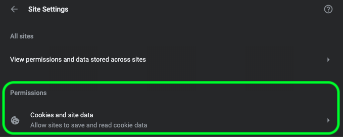

# Guide de dépannage de Data Science Workspace

Ce document fournit des réponses aux questions les plus fréquentes sur l’espace de travail Data Science d’Adobe Experience Platform. Pour toute question ou dépannage concernant les API de plateforme en général, consultez le guide [de dépannage de l’API](../landing/troubleshooting.md)Adobe Experience Platform.

## L&#39;environnement JupyterLab n&#39;est pas chargé dans Google Chrome

>[!IMPORTANT] Ce problème a été résolu, mais il peut toujours être présent dans le navigateur Google Chrome 80.x. Assurez-vous que votre navigateur Chrome est à jour.

Avec le navigateur Google Chrome version 80.x, tous les cookies tiers sont bloqués par défaut. Cette stratégie peut empêcher le chargement de JupyterLab dans Adobe Experience Platform.

Pour résoudre ce problème, procédez comme suit :

Dans votre navigateur Chrome, accédez à l’angle supérieur droit et sélectionnez **Paramètres** (vous pouvez également copier et coller &quot;chrome://settings/&quot; dans la barre d’adresse). Ensuite, faites défiler la page jusqu’au bas de la page et cliquez sur la liste déroulante **Avancé** .


La section *Confidentialité et sécurité* s&#39;affiche. Cliquez ensuite sur Paramètres **du** site, puis sur **Cookies et données** du site.




Enfin, basculez &quot;Bloquer les cookies tiers&quot; sur &quot;Désactivé&quot;.


>[!NOTE] Vous pouvez également désactiver les cookies tiers et la liste blanche [*.]ds.adobe.net

Accédez à &quot;chrome://flags/&quot; dans la barre d&#39;adresse. Recherchez et désactivez l’indicateur intitulé *&quot;Même site par défaut&quot;* en utilisant le menu déroulant à droite.


Après l’étape 2, vous êtes invité à relancer votre navigateur. Après votre redémarrage, Jupyterlab doit être accessible.

## Pourquoi est-ce que je ne peux pas accéder à JupyterLab dans Safari ?

Safari désactive les cookies tiers par défaut dans Safari &lt; 12. Comme votre instance d’ordinateur virtuel Jupyter réside sur un domaine différent de son cadre parent, Adobe Experience Platform exige actuellement l’activation des cookies tiers. Activez les cookies tiers ou passez à un autre navigateur tel que Google Chrome.

Pour Safari 12, vous devez changer votre User Agent en Chrome ou Firefox. Pour changer d&#39;agent utilisateur, début en ouvrant le menu *Safari* et en sélectionnant **Préférences**. La fenêtre Préférences s&#39;affiche.


Dans la fenêtre des préférences de Safari, sélectionnez **Avancé**. Cochez ensuite la case *Afficher le menu Développer dans la barre* de menus. Vous pouvez fermer la fenêtre des préférences une fois cette étape terminée.


Ensuite, dans la barre de navigation supérieure, sélectionnez le menu **Développer** . Dans la liste déroulante *Développer* , passez la souris sur Agent ** utilisateur. Vous pouvez sélectionner la chaîne **Chrome** ou **Firefox** User Agent que vous souhaitez utiliser.


## Pourquoi est-ce que je vois un message &quot;403 interdit&quot; quand je tente de télécharger ou de supprimer un fichier dans JupyterLab ?

Si votre navigateur est activé avec un logiciel de blocage des publicités tel que Ghostery ou AdBlock Plus, le domaine &quot;\*.adobe.net&quot; doit être placé sur la liste blanche dans chaque logiciel de blocage des publicités pour que JupyterLab fonctionne normalement. En effet, les machines virtuelles JupyterLab s’exécutent sur un domaine différent de celui de la plate-forme d’expérience.

## Pourquoi certaines parties de mon portable Jupyter semblent-elles brouillées ou ne s&#39;affichent pas sous forme de code ?

Cela peut se produire si la cellule en question est accidentellement passée de &quot;Code&quot; à &quot;Marquage&quot;. Lorsqu’une cellule de code est activée, appuyez sur la combinaison de touches **ESC+M** pour changer le type de cellule en Marquage. Le type d&#39;une cellule peut être modifié par l&#39;indicateur déroulant situé en haut du bloc-notes pour la ou les cellules sélectionnées. Pour modifier un type de cellule en code, début en sélectionnant la cellule à modifier. Cliquez ensuite sur la liste déroulante indiquant le type actuel de la cellule, puis sélectionnez &quot;Code&quot;.


## Comment installer des bibliothèques Python personnalisées ?

Le noyau Python est préinstallé avec de nombreuses bibliothèques d&#39;apprentissage automatique populaires. Cependant, vous pouvez installer d’autres bibliothèques personnalisées en exécutant la commande suivante dans une cellule de code :

```shell
!pip install {LIBRARY_NAME}
```

Pour une liste complète des bibliothèques Python préinstallées, consultez la section [Annexe du Guide](./jupyterlab/overview.md#supported-libraries)d&#39;utilisation de JupyterLab.

## Puis-je installer des bibliothèques PySpark personnalisées ?

Malheureusement, vous ne pouvez pas installer de bibliothèques supplémentaires pour le noyau PySpark. Toutefois, vous pouvez contacter votre représentant du service clientèle Adobe pour que les bibliothèques PySpark personnalisées soient installées pour vous.

Pour une liste des bibliothèques PySpark préinstallées, consultez la section [Annexe du Guide](./jupyterlab/overview.md#supported-libraries)d&#39;utilisation de JupyterLab.

## Est-il possible de configurer des ressources de cluster Spark pour le noyau JupyterLab Spark ou PySpark ?

Vous pouvez configurer des ressources en ajoutant le bloc suivant à la première cellule de votre bloc-notes :

```python
%%configure -f 
{
    "numExecutors": 10,
    "executorMemory": "8G",
    "executorCores":4,
    "driverMemory":"2G",
    "driverCores":2,
    "conf": {
        "spark.cores.max": "40"
    }
}
```

Pour plus d’informations sur la configuration des ressources de la grappe Spark, y compris la liste complète des propriétés configurables, consultez le Guide [d’utilisation de](./jupyterlab/overview.md#kernels)JupyterLab.